Outside Edmonton is our next national park, which brings our total for this trip up to 17.  This one is called Elk Island, and its a somewhat different park to what we're used to.  Basically all the other parks two date have fit into two categories - "Desert/Canyon" or "Mountains".  I would put Elk Island in a new category called "Forest/Lakes".

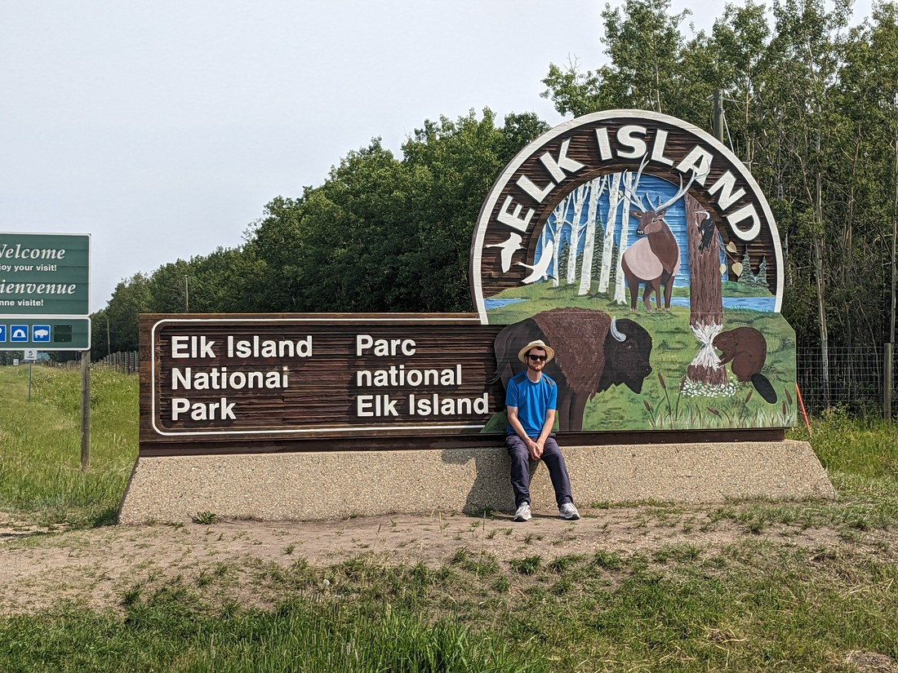

> Another sign!  After being disappointed at Waterton Lakes, Kootenay, and Yoho I had thought Canada was too cool for park entrance signs.

The whole park is completely flat.  I don't think any trail has more than a couple dozen metres of elevation gain.  Up until now we've enjoyed the mountains and canyons since these allow a visitor to see quite a lot while standing in one place.  We weren't sure what we were going to find in Elk Island, but we figured we'd give it a try.

The first walk we did was a large loop around a large lake.  But it wasn't often that the loop was within view of the lake.  So for much of the walk, the trail looked like this:

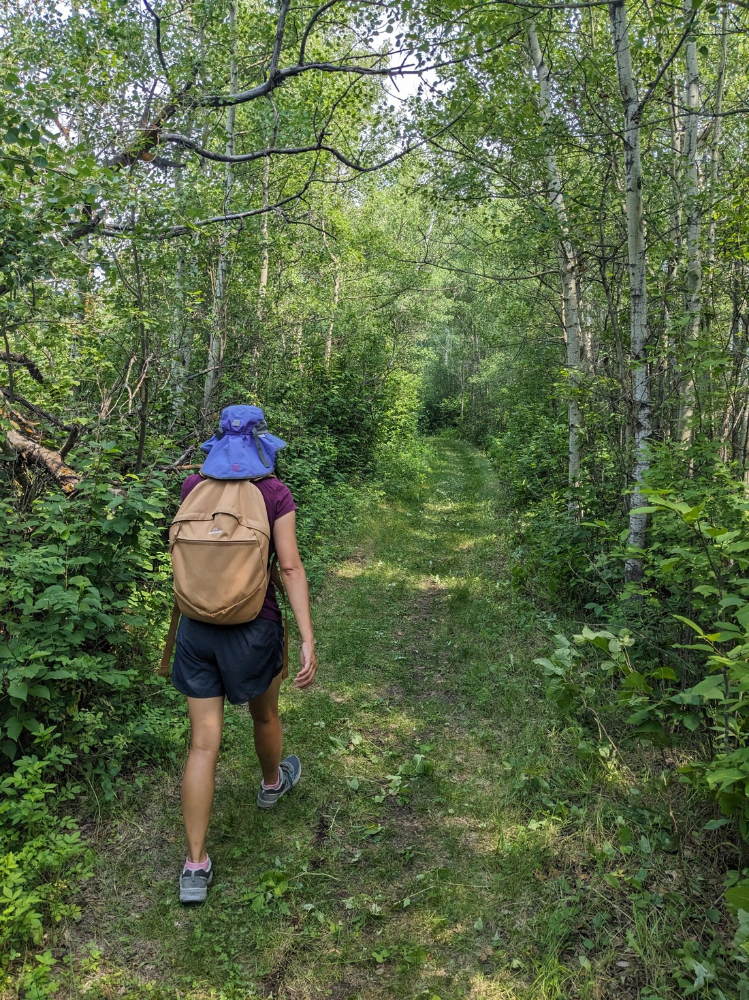

We were hoping to see animals in this park.  This trail wasn't the first thing we did.  Our first activity was a "bison loop" where you could drive through a part of the park where bison often frequent.  I had a suspicion that we'd see exactly zero bison on this drive, and I was right.

But something we did notice that in some of the lakes in Elk Island there were beaver lodges.

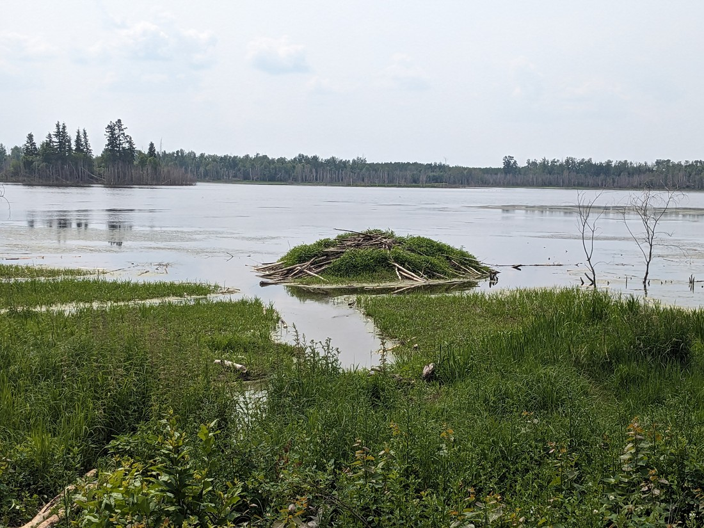

> Lumps of trees in a lake

It was pretty easy to spot beaver engineering - just look for the pile of logs in a lake.  And halfway round our first trail we observed another sign of beaver activity:

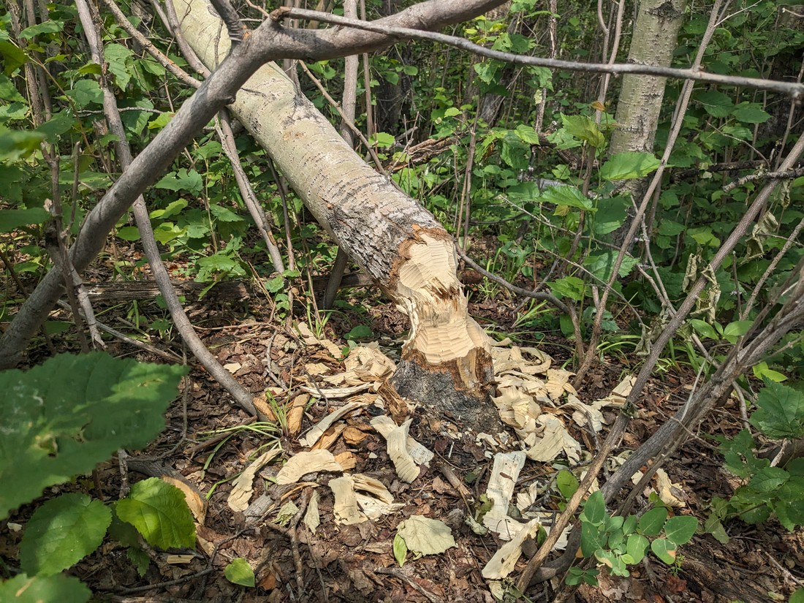

> This one is clearly still a work in progress

There were a patch of trees near the shore that were all either toppled or missing, with nothing remaining but pointed stumps.  I guess this is where those piles of logs are coming from.

But unfortunately we saw no beavers.  In fact, we saw very little animal life at all.  The most activity we found was a field with swarms of jumping insects that fled in waves as we walked through.

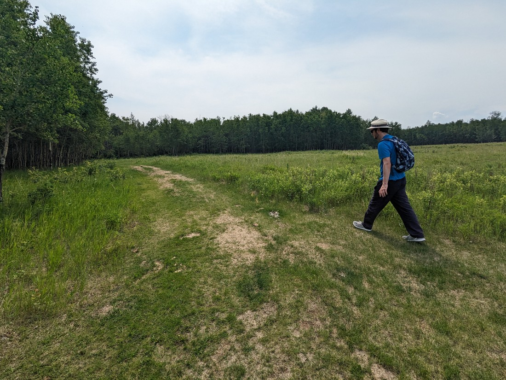

> Which are of course invisible on camera

This walk took a while and after we were ready for lunch.  But first we decided to set up camp.  Unlike in Dinosaur we were really fortunate to have a good site this time.  It wasn't near a bathroom, and no one was likely to walk by or drive by early in the morning.

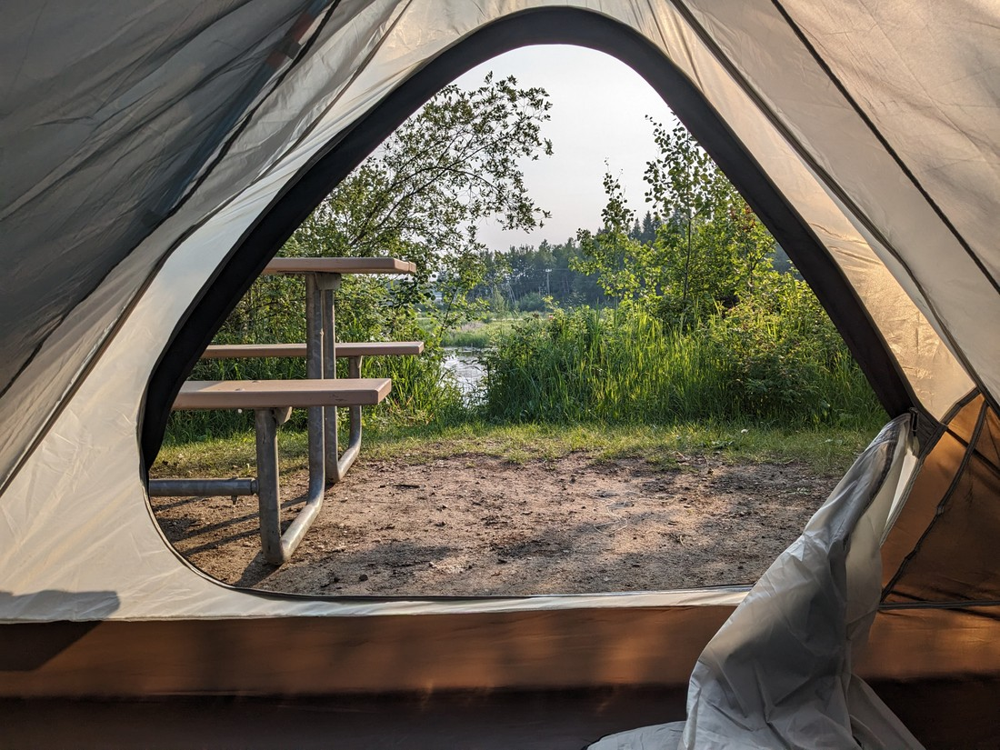

We're staying here in Elk Island for two nights - our first consecutive nights camping.  And it was a pretty basic campground.  Just a single toilet block with showers, and a sink for dishwashing.  How were we (modern humans) going to survive?  Well, it's pretty simple - we just drove back to Edmonton for lunch.

After lunch (which was a late lunch) it was on to the nearby library to sit and fill out job applications.  Definitely feels weird that I'm using my laptop more than usual on a day we're living in a tent.  But after submitting four applications (none of which I expect will lead to anything, but it was worth trying) it was back to our campground.

Since there were hours left in the day, we decided to do a bit of a walk along the main lake in the park.  It is there we finally observed some wildlife:

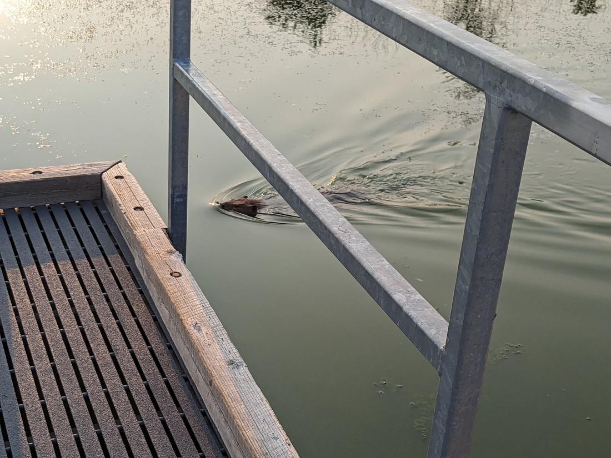

> Could it be...

As we walked along a boardwalk we happened to spot something swimming along that clearly wasn't a water bird.  Was this a beaver?  It looked like a beaver, but we've mistaken other animals for beavers before.  There was a sign nearby noting that muskrats can also be found nearby, and they look very similar.  Well, as the animal swum by it made a dive underwater and we saw it's large rounded tail.  That's a beaver alright.

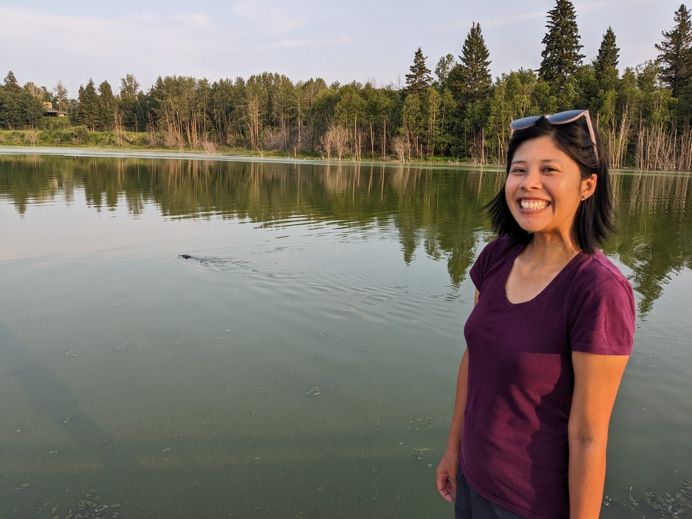

> \*Excited Betty noises\*

I guess the advice "animals are most active at dusk and dawn" is true.  We watched it swim around the boardwalk for a while, before it swam off.  Then I started wondering, "What was that sound coming from underneath the boardwalk?"  That sound turned out to be another beaver.  Sticking our faces to the ground we could peer between the boards and watch it eating something, only centimetres away.  But unfortunately that didn't last long.  It must have noticed our presence and it soon had swam off too.

But that was exciting.  We've finally seen some wild beavers.  And also, we've finally seen some awake beavers.  I had researched earlier where was the most likely park to see them, and Elk Island was recommended - although it was noted that sightings were not guaranteed.  So this made it a good first day.

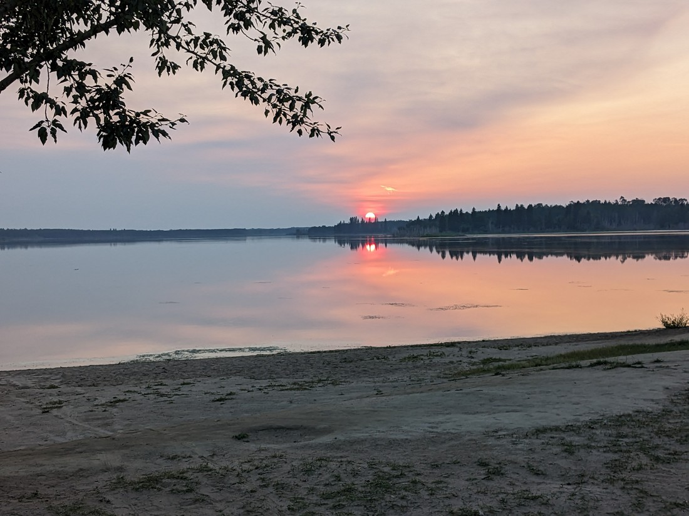

After breakfast the next morning it was time for another trail.  This one was called the "beaver loop" trail.  Naturally I was sceptical that we'd see any beavers.  And again, I was right.

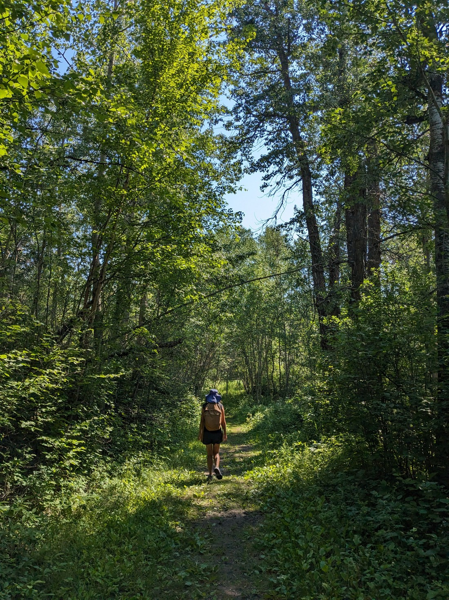

> It should be called "Mostly just trees loop"

Then afterwards we headed off to do another trail that was descried in the park guide as a possible place for more beaver sightings.  And again, no beavers.

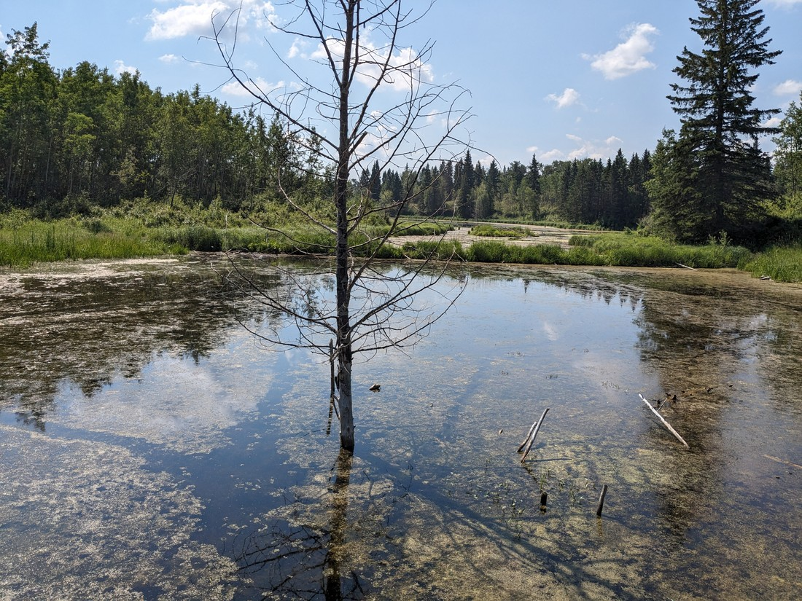

Well, now we're hungry and just as unprepared as yesterday so it was time to drive the 30 minutes back to Edmonton to eat.  I'm going to embarrass Betty here again and note that she once again chose Ikea as here eatery of choice.  Afterwards it was library time again, and more jobs were applied for.

Then we drove into central Edmonton to visit our fourth board game cafe in eight days.  Here we played a board-game-themed escape-room-themed puzzle game until our brains were literally hurting, which declared that it was time to return to the simple life of living in a tent.

As we drove back into the park, we spotted some bison on the side of the road.  Again, that advice from earlier holds true.  It was near dusk.  Where do animals go all day, and then pop out to eat grass?

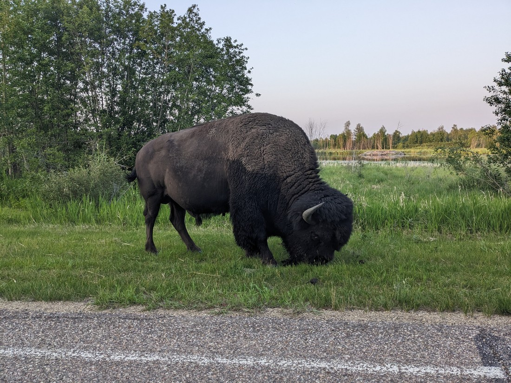

> Weirdly, most of the bison we spotted were from the main highway - outside the park

Which reminds me, we saw a bear on the way out of the park.  A young-ish black bear crossed the road while we were driving, before vanishing into the forest before we could pick up a camera phone.  Parks always warn about bears, but I was sceptical that they were actually in Elk Island.  Well, turns out I was wrong.

As it was quite late I insisted on returning to the main lake.  Yesterday I had tried to capture the perfect sunset photo, but was approximately one minute late.  Today I vowed to be early.  And with Betty joining me, we were early.  So we decided to check out that beaver boardwalk again.  And sure enough, after 10 minutes of waiting we had one swim by.

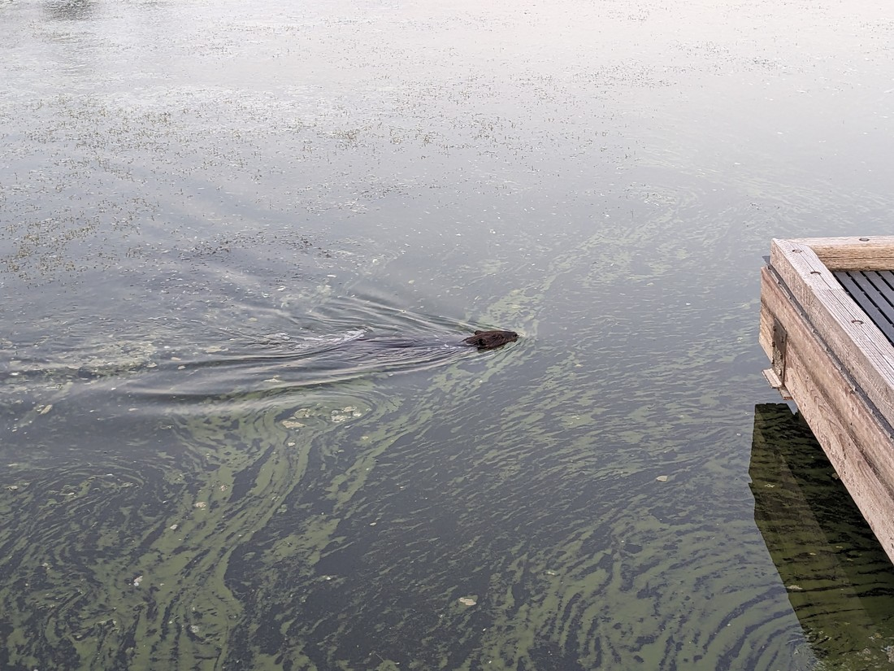

And this photo has reminded me of something - the lake wasn't exactly in good condition.  Along the shore was a lot of green gunky stuff.  I expected Canadians like these types of parks in summer because they are great places to swim - but this was not a place I would go swimming.  It also did not smell nice.  Perhaps this is all bird poop related.  Although we've seen a lot of signs around about the importance of cleaning, and drying watercraft.  I've lost count at the number of "watercraft inspection stations" we've passed by.  I guess gunky lakes are potentially what all these rules and inspections are trying to prevent.

But back to beavers...

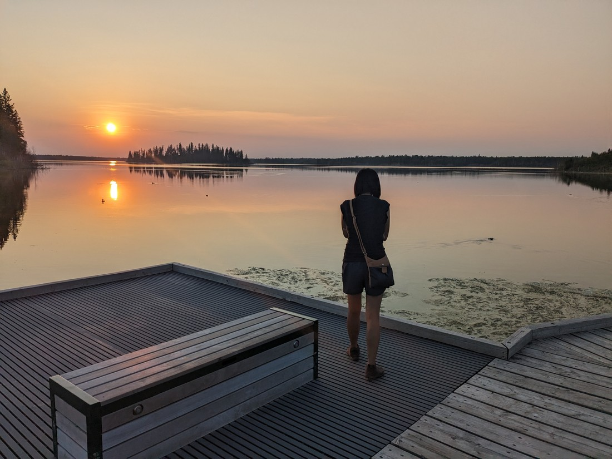

> "Why do they always swim away?"

We observed our new beaver friend depart, in the same direction it had swum last night.  When it didn't return after fifteen minutes we decided we'd photographed the sunset enough and so we went to leave.

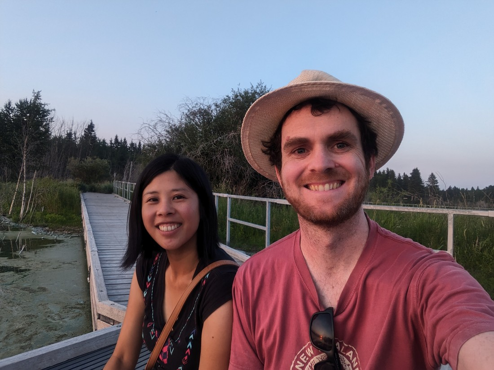

And as we walked back around the lake to get to the carpark we observed a group of people huddled together on the path ahead.  And then (from a distance) we watched as a beaver walked across carrying a branch, heading for the lake.  As we crept into those bushes, we finally found where the beavers were swimming to.

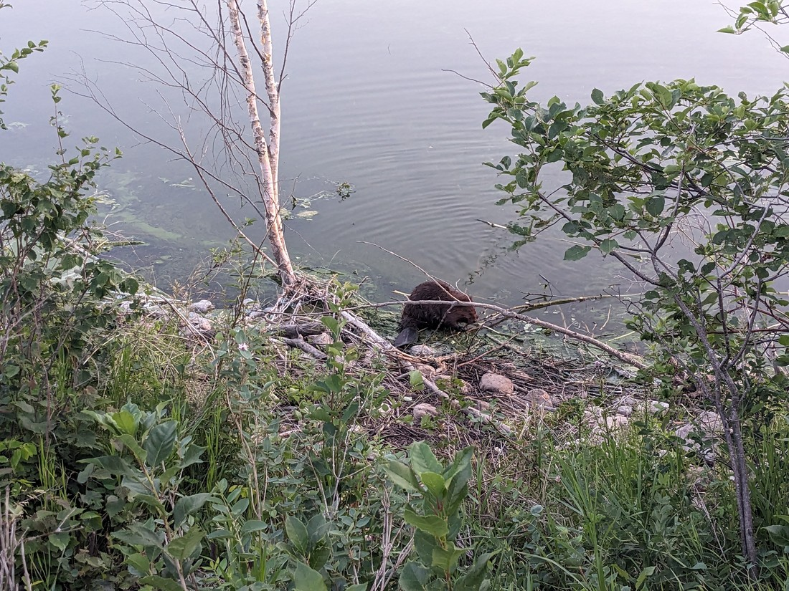

So it turns out this part of the lake must have really tasty trees.  While the one with the branch swum off, three other beavers sat on the shore munching on leaves.  We watched, from an appropriate distance (damn these appropriate distances - I want to see animals up close) for about twenty minutes.  And all they did was munch, munch, munch.

So the sun had set by now, so it was now time for sleep again.The next morning we woke, had breakfast, shoo-ed the squirrel away that tried to get into my cereal, and went on another walk.  

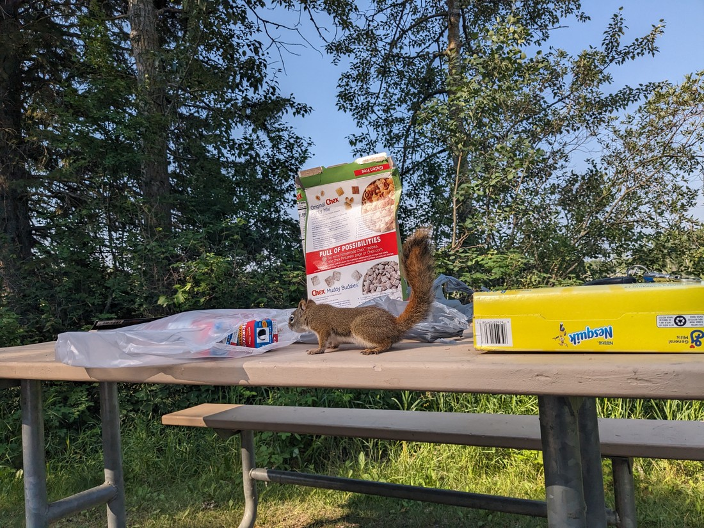

This trail was just as notable as the others.  Not really any sign of animal life.  Barely even any other hikers.  I told myself, "Just enjoy it for what it is - a relaxing walk in the forest."  But after the walk I asked Betty we wanted to do another, and the consensus was, "Nah, let's get out of here."

But overall we had a good time in Elk Island National Park.  It was certainly not one of our favourite parks - probably not even if the top half.  But it was a nice place to be for the time that we were there.  This was certainly helped by the fact that we did see some interesting wild animals - which was very lucky.

This stay officially marks the start of our "Luke and Betty - mostly serious campers" phase of our holiday.  For the next few weeks we will be alternating between several days of camping and individual days in motels to recharge (perhaps in more ways than one).  But unlike Elk Island, our future campsites aren't going to be on the doorstep of a major city.  So probably less board gaming will happen.

Still, we've again enjoyed our time camping.  Our Arches mishap seems like a distant memory now.  I'm confident that we will enjoy the next few places.
