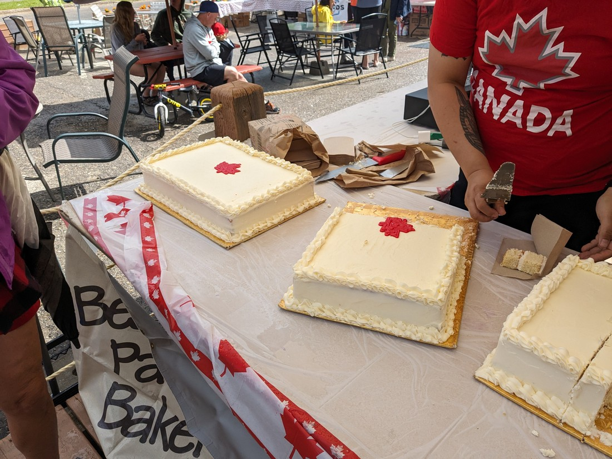
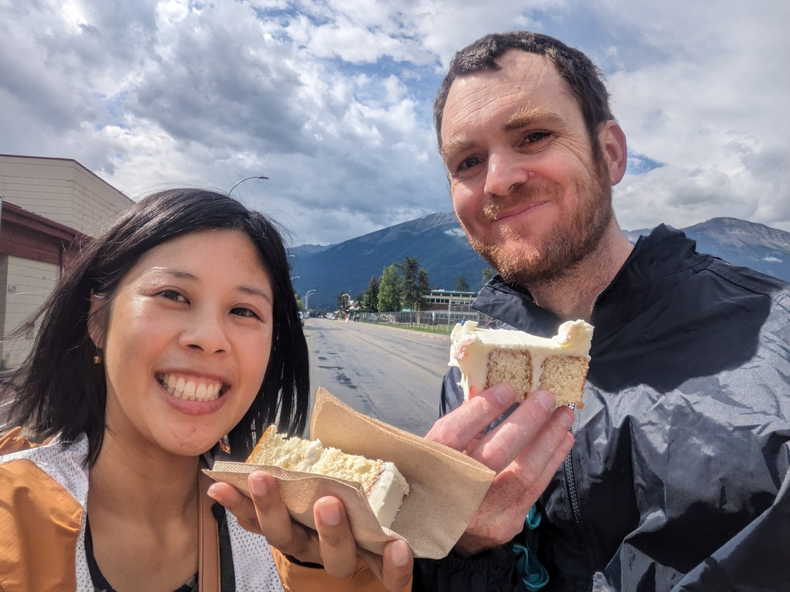
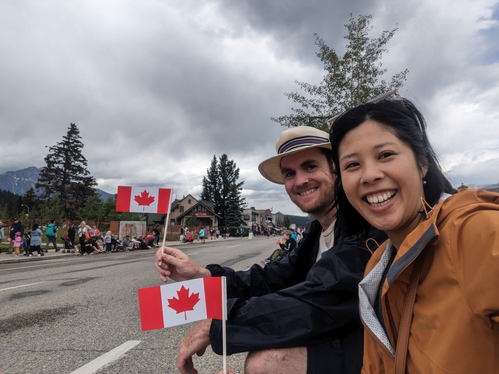
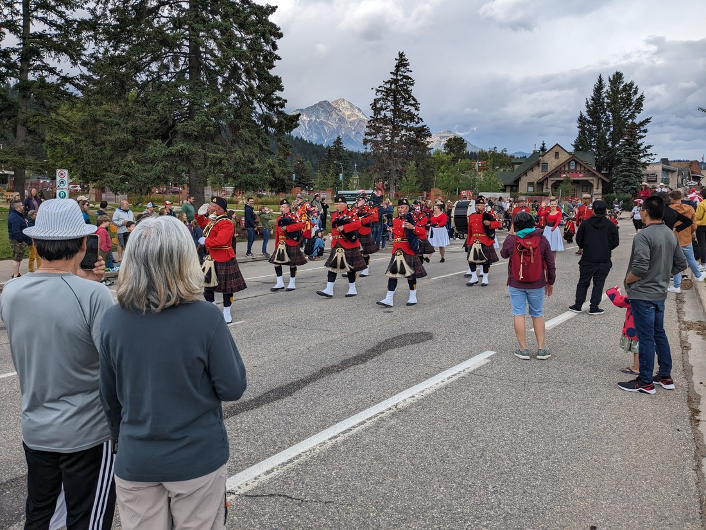
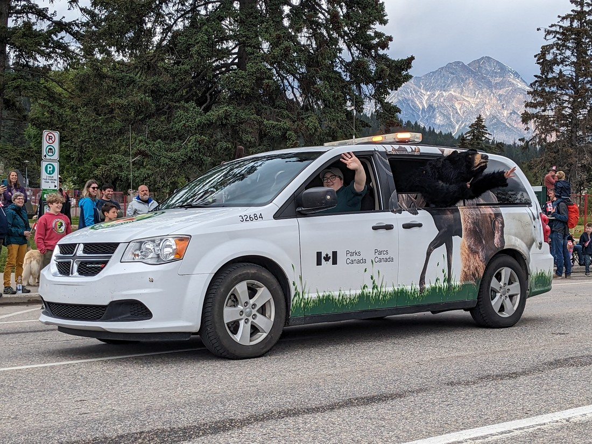
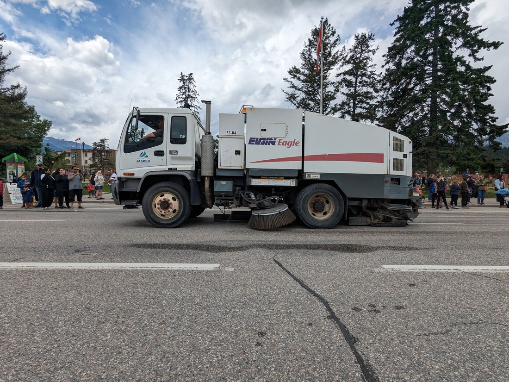
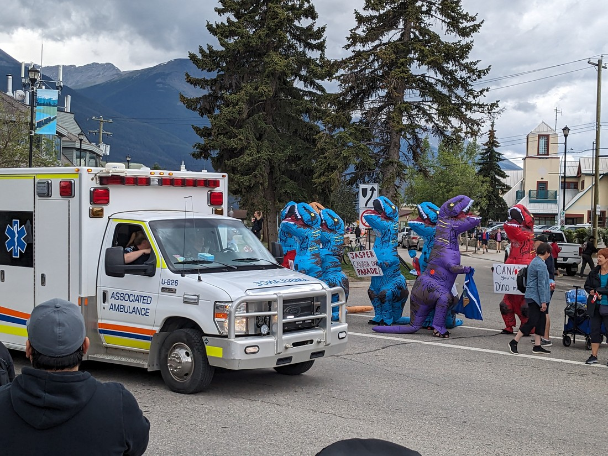
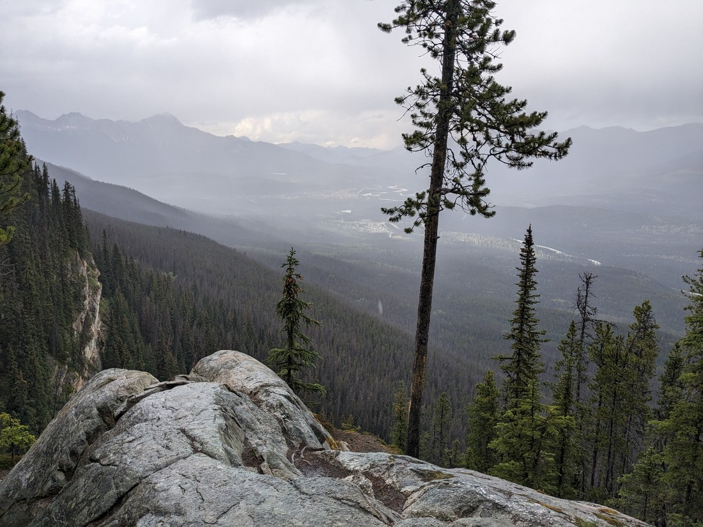
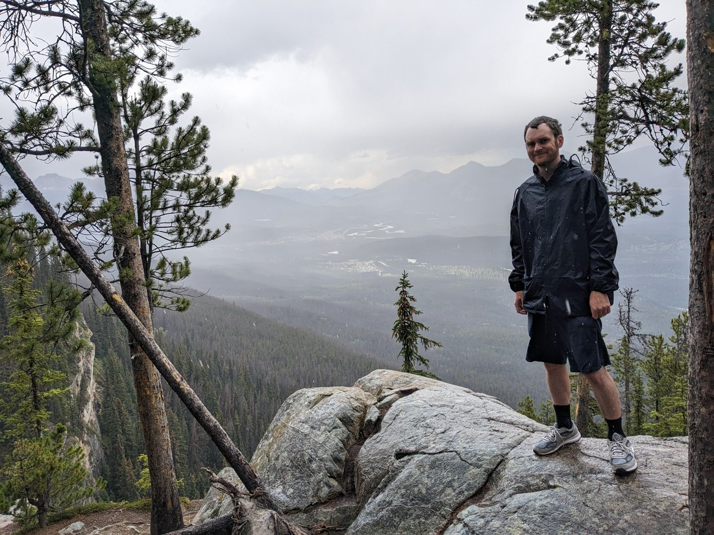

We woke to find that it had not rained.  Or maybe it had only a little?  What gives?  Hadn't the weather report reported downpours at 2am?  Well, I guess it still counts as a win for our tent's rain-proofing.  I definitely can't say the same thing about our tent's insulation - it was a cold morning.  We didn't get out of our sleeping bags until long, long after the sun had risen.

Upon arriving at the campground yesterday we got given a flyer about Canada Day festivities today.  Since it wasn't raining (yet) we could go do a walk, but we figured we ought to go experience some local culture.  So we drove to the nearby town of Jasper.

This morning there was a pancake breakfast provided for the low price of $5.  But we had already decided that our warm sleeping bags were preferable to getting up early for warm pancakes.  But we were just in time to be late for a flag-raising ceremony.  That means, we missed the part where they raised the flag and sung the national anthem, but we were in time for the part where everyone got to eat Canada cake.

> Fun fact, even Canadians have trouble drawing the maple leaf

We had debated what Canada cake would taste like.  Maple syrup?  Beavers?  It turned out to taste like what you'd get when you ask a catering company to provide several of the largest cakes they could provide.

> Crustier than you'd expect, but with plenty of frosting

Also while waiting in line we got chatting with a Montreal-based Canadian.  We asked him what Canada Day is all about, and he didn't know.  Apparently people in the French-speaking part of Canada don't celebrate Canada Day at all.  They just use the day-off as an opportunity to move house.

The next festivity was a parade, so we killed an hour and a half walking round the town.  We found a "giant used book sale" which ended up being one of the smallest used book sale we've ever seen.  We went to some souvenir shops and did our usual thing of eyeing up some of the gorgeous knick-knacks and t-shirts but inevitably deciding they were too expensive.  That was a bit unfortunate because it did mean we weren't exactly showing any Canada spirit.  But fortunately while waiting for the parade, some people drove past giving out tiny flags.

Before the parade started I asked Betty whether she thought there'd be a pipe band.  Because if this was New Zealand, there would be a 100% chance of a pipe band.

About 10 minute later we heard people shouting that the parade was starting.  Then immediately after the shouting we heard pipe band music...

> It was the first thing in the parade

I guess pipe bands are a very British thing, and Canada is a British colony.

Many of the "floats" seemed to be just an excuse to advertise a local business, or so you're local club could ride down the main street.  I think only one business actually had a proper float - which was the nearby gondola business who had put a gondola car on a trailer.  But they'd dressed it nicely, gave out sweets, and even had a bubble machine so they win the Luke prize for best float.

> Although I didn't get a good photo of it so here's one of the parks department

A bunch of the later vehicles were rather loud, including one which just appeared to be a bus filled with senior citizens.  Hilariously, the final vehicle in the parade was the local street sweeper:

> Was he part of the parade, or just really keen to get his job done for the day?

There was going to be a local market after the parade, so we headed over that way.  That's when we realised that the parade was just going along one street and back another - so we got to watch a lot of the parade for a second time.  Something I noted was that very little candy was still being given out.  I guess they didn't pace themselves with how much was being tossed out.

We also noticed some unusual parade watchers:

> I guess if you and your friends all buy dinosaur costumes then you may as well make use of them, regardless of whether the costumes are relevant or not.

After we decided the local market wasn't going to be very interesting, we headed to the local Tim Hortons for some food.  It was packed.  Say what you want about the quality of their food and drinks - Tim Hortons is sure loved by Canadians.  So instead we went to the convenience store next door and was delighted to find that they had self serve hotdogs.  Despite being some of the cheapest meals we ever ate in the USA, they were also some of the best.  (Lots of toppings!)

We decided to do a nearby walk, but on the way there it started pouring down terribly, including some hail.  Seems like the weather prediction was out by 12 hours.  So instead we went back to our tent - which had fortunately remained dry.

Then I did something I basically never do.  I slept.

I blame it on the budget brand Froot Loops (called "Fruity Whirls" or "Tourbillons Fruites" depending on which side of the box you're reading).  Something about them seems to be causing my digestive system problems.  If I had to pick, it'd probably be the huge amount of artificial colouring that is likely to be the problem.  Anyway, even though it was now getting sunny again my body needed some rest.

I woke later than I had expected.  The weather was turning bad again.  We raced to do one last short walk, but we were too late:

As we arrived at the walk it started raining.  We actually drove back and forth deciding whether to do it.  Eventually we figured that it was only short, and if we did it then we would definitely know if it was worth coming back to do when the weather was fine.

> The town and our campsite is down there somewhere

It's probably quite fortunate that we're camping over this weekend.  Being one of the few long weekends Canadians get (and probably the only in summer) I imagine regular accommodation would have been quite pricey.  I don't believe I even knew about Canada Day until we got the flyer yesterday.  Whoops.

Overall it was a good day, even if we did spent a lot of time just lying in our tent bed reading books while it is cold and rainy outside.  We're definitely getting our money's worth out of our sleeping bags.  However, it did get a bit cold last night so we're going to have to take more precautions tonight.

