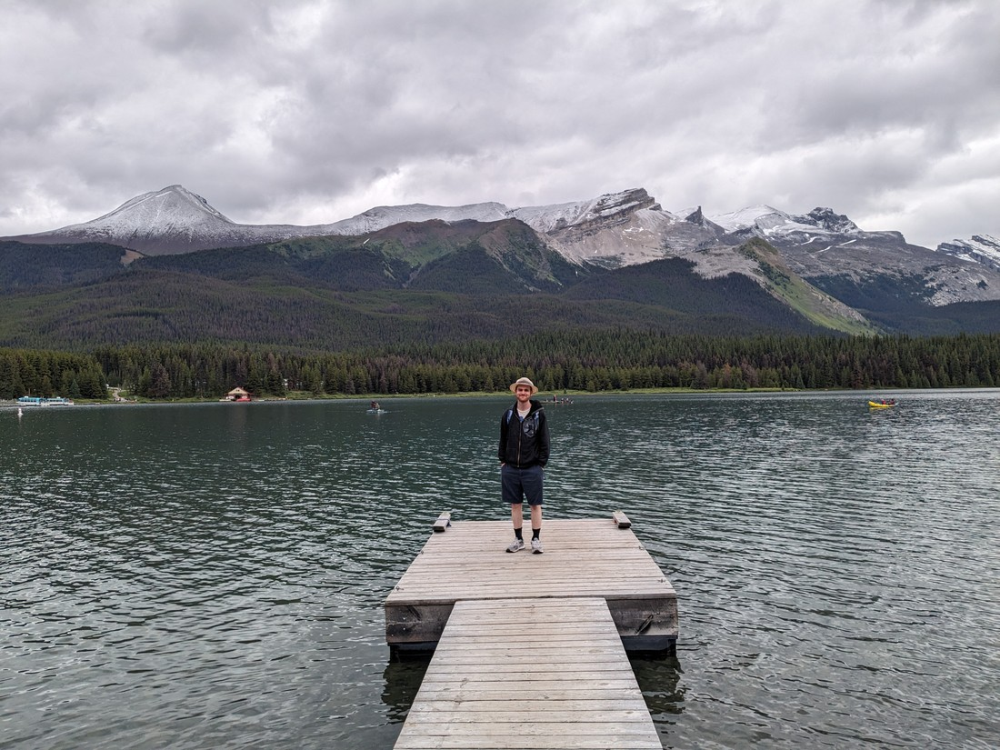
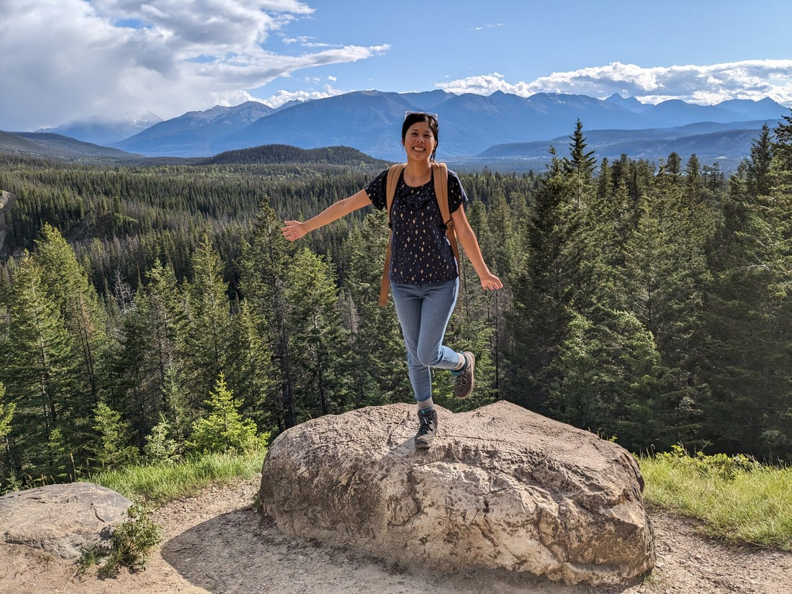

Today was going to be a fine day... apparently.  No rain was predicted, but that didn't mean it was going to be a nice day.  The morning was just as cold as yesterday - only this time we had pulled out all the stops before we went to bed.  Jumpers, trousers, socks, and beanies to sleep in, plus the comforter we hadn't bothered using the previous night.  So while it was certainly very cold again when we woke, we were warm enough.

We decided to visit the Maligne Lake area of Jasper National Park today.  It was a large lake, surrounded by mountains - many of which appeared to have a dusting of fresh snow at the top - almost certainly due to the recent cold snap.

> Not that you can tell from these photos

There didn't seem to be as much here as we were expecting.  It was certainly no Lake Louise area.  So we took some photos by the lake...

...and then started around one of the loop walks nearby.

The walk was nothing special once we lost sight of the lake.  It was just a nice walk through a forest.  The only problem was that it felt like winter.  Isn't it July now?  Isn't it summer?  I realised after we had finished the walk that I had been wearing my warmest sweater and hadn't taken it off at any point.

> Oh, you can see the sprinkled snow on the mountains in this photo!

But we had driven all the way here (almost an hour from our campsite) so we figured we should do more.  So we did another loop walk - this time on the opposite side of the lake.

And the results were much the same.

So what did we do?  Try one more walk - this time to a pair of lakes nearby.  And what did we find...?

Just more lakes, but worse than the one that we'd parked by.

In hindsight we probably should have tried one of the four hour hikes that had some elevation gain rather than playing it safe with the easy loops.  But that's only with the benefit of hindsight.  Given the amount of clouds overhead it could easily have rained on us.  And we weren't sure what we would find on those harder walks.  It might have just been forest walking with no viewpoints.

On the way back we did make a stop another scenic spot called Medicine Lake.

And for a lot of days, that would likely be it for us.  We'd done three walks.  The day wasn't that pleasant but we still got our odometer into the double digits.  But unfortunately what happened next is that the weather got better.  Sun was now peeking through the cloud cover... sometimes.  So we decided to revisit a place we went to on our last trip.

Maligne Canyon is the canyon I said Marble Canyon from Kootenay National Park ressembled (see blog post dated 15 June).  It is a narrow, tall canyon filled with rushing water.  It's so deep that getting good photos was proving difficult.

Looking through the photos we took today, I'm surprised that they really don't do the place justice.  Somehow our photos from last time are better, and those were taken just before twilight with a worse camera phone.  Perhaps the fact that the sun was now shining was the issue - maybe it just looks better at dusk.

Still, it was a good time.  Standing on the bridges and peering down at so much rushing water is quite the experience.  For nostalgia sake we ended up retracing the route we took last time - walking all the way down to the fifth bridge before climbing up the hill to walk back.

Despite the distance covered, we didn't end up spending that much time here.  I was \*encouraging\* us along for two reasons.

The first is that all the people around were making me grumpy for some reason.

> Sorry to tell you but Mr Grumpy on the right is faking his smile

The second is that because the weather was now rather nice I wanted to retry the walk from yesterday.  I was sure the view would look ten times nicer today.  Since we'd packed quite a lot into today, there wasn't too long left before the park would be in the shadows of the mountains.

Perhaps I should explain more about the walk.  It was called the Edge of the World trail on AllTrails (4.6 rating).  Notably, it wasn't a walk mentioned on any of the official park guides.

To get there we had to drive 15 minutes along a road toward a ski field which was closed for the season.  We then had to stop at an unmarked gravel patch alongside the road.  Then finally, the trail didn't even start from that parking spot - it was 100 metres up the road hidden behind a corner.

The trail was little more than half a kilometre long and followed a 10 metre wide gap in the trees to the viewpoint.  I am guessing it was either a fire break, or was required for construction.  Whatever the reason, it was now getting quite overgrown.  I had also seen a comment that a mother grizzly bear with a cub had been spotted on this trail two days ago.  This sounds exciting, but this time we were weary.  Any bear encounters were dangerous but grizzly bear encounters were worse, never mind that a mother might act differently if she felt her baby was being threatened.  I made a conscious effort to sing nonsense songs while we walked, since we lacked the jingle bells that is often recommended.

Anyway, no bears were spotted on the walk.  We made it to the view point, much drier than yesterday.

> The big patch in the centre was the campground, and our campsite was amongst the trees to the left of it

Its weird but despite being an excellent view considering the almost zero effort we had to put in, this is actually a bad thing.  Sure the pictures are nice, but I don't think this walk is going to be very memorable to us - despite doing it twice.  There just isn't that sense or reward you get from putting in a decent chunk of effort.

> "Hooray, no effort!"

So that was the fifth walk we did today.  But it turns out the day isn't over yet.  On the drive back we noticed some cars pulled over on the far side of the road.  And the reason they were pulled over was because of this:

> "Munch, munch, munch"

A grizzly bear was foraging in the grass beside of the road.  This was exciting for us - this was our first wild grizzly bear we'd seen.  Sure black bears are great (and arguably cuter) but the status of the grizzly bear is much bigger.  Plus they have cute round ears.

As we drove past we noticed a park ranger arriving with its sirens on.  Having nothing else to do, we decided we wanted to see what the ranger would do.  So out of sight we did a U-turn and headed back, but disappointingly by this time the ranger had dispersed both the cars and the bear.

So what happened today?  How did we convince ourselves to do so much walking?  I guess it was because we didn't do that much yesterday (the two hours we spent walking round town somehow doesn't count).  I guess it was also because we had seen how bad the weather could get and so we felt we ought to make the most of it while we were pretty sure it wasn't going to rain.  Regardless, it wasn't the most memorable day.  Probably all it needed to be a memorable one was for it to be a little sunnier.

Well, tomorrow is another day...

Except tomorrow sounds like it might be worse, weather-wise...

But we at least have something to look forward to.  Tomorrow it is motel day again.  A proper bed and a proper shower might go a long way.