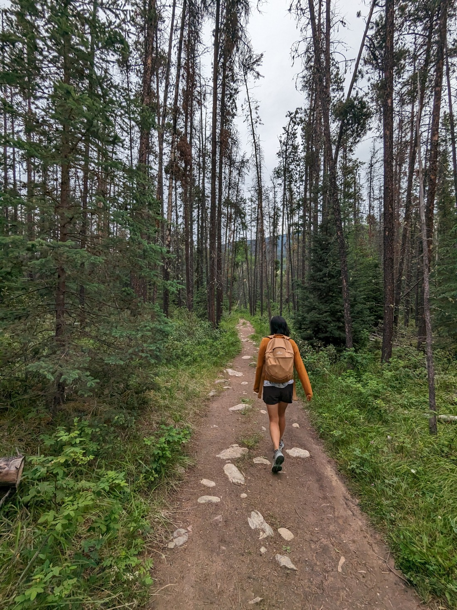

This is going to be a short one.  Today is the day we're packing up our tent and leaving Jasper National Park.  Yah, no more cold mornings in a tent.  But instead of going forward, we're actually going backwards.  Tomorrow our travels will take us south along the 300 kilometre Icefields Parkway from Jasper to Banff.  But there's very little services along that road, and exactly zero towns.  So today, we're going to travel an hour east, back the way we came in order to stay a night in a motel and resupply.

But first, it's not raining (despite being really overcast) so we ought to do a walk.

In the last couple of days, as we'd driven along the highway we had noticed a hill near Jasper township.  Like many hills, someone at some point must have thought, "I'd like to walk up that hill" because there was indeed a trail up it.  In fact it was a loop.

It did rain while we walked.  This wasn't totally unexpected, and fortunately it didn't last long.  We also almost got lost.  The trail wasn't as obvious as we had thought it was going to be.  This trail was literally number one in the Jasper hiking guide so we had figured it would be well marked.  As we found out later, the issue might have been that we were doing the loop in the opposite direction that was intended.

It wasn't until the end of the walk that we crested the hill and got a nice view over Jasper.

Then we got lost again.  We followed the hill rather than returning to the trail and following that.  But clearly dozens of other people had also done the same thing as there was a pseudo trail that wound around until it eventually reunited itself with the main trail.

Then to our surprise we came out onto another hill.

This walk was called "Old Fort Point" and we had thought it odd that we had found no signs of a fort on the first hill.  This hill on the other hand was rather square and rather flat - not natural shapes for a hill.  Thought it still made me question, "Why did someone build a fort here?"

> To defend from bears?

The trail back down to the parking lot from here ended up being only five minutes.  So probably most people don't even do the loop - they just climb the steps for five minutes, take their pictures and then go home.  But for us, we'd been walking for an hour or so, which made this a nice reward for the walking we had done to get here.

We had more planned, but the clouds burst on the way out of the park - so we just left.  We then spent the next few hours trying to figure out how best to do laundry.

The town was a decent size, but the only coin laundromat was... odd.  Instead we found out that a nearby hotel had public laundry facilities - but we had to buy a card.  In the end we just bought the useless card ($10) just so we could get it done and be able to stop worrying about being forced to wear stinky clothes.

And that's about it.  The rest of the day was filled with the usual charging devices, reading the news, writing blogs, and checking for job listings (which there weren't any, because it had been a long weekend).  We'll be in much wilder places for the next two days so fingers crossed we'll get good weather.
