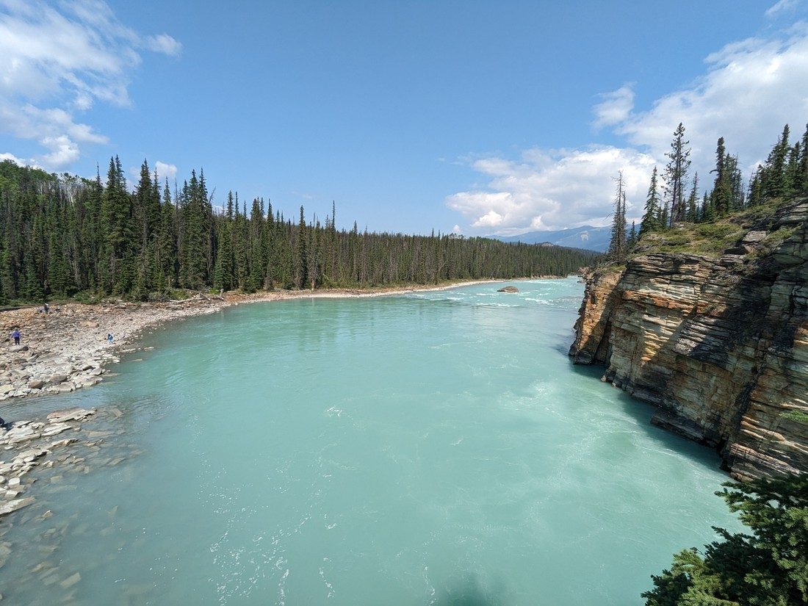

Banff and Jasper are linked by a road called the Icefields Parkway.  Back in 2019 we visited both Banff and Jasper and on the day we needed to drive the parkway we first decided to do a walk to a lake called Boom Lake.  This walk took several hours, wasn't all that interesting, and the lake at the end wasn't any nicer than the ones by the roadside.  As a result we were somewhat tired and time poor afterwards so we couldn't do much sightseeing as we drove the 300 kilometre stretch of road.  Betty slept for a good chunk of it.

Regardless, I deemed the road to be perhaps the most scenic drive I've ever undertaken for the following reasons:

* It's beautiful.  Mountains on one side and mountains on the other side for the entire 300 kilometres.
* Many of these mountains have glaciers that can be seen from the roadside.
* The rivers and lakes are all from glacier or snow runoff, which makes them a brilliant turquoise colour or else perfectly clear.
* The forest is thick, meaning you're surrounded by greenery all the time
* There are frequent view points and places to stop and admire everything I have mentioned above
* The road itself is very well made - no potholes and remarkably few bumps for such a long and remote stretch of tarmac
* Everyone sticks to the 90 kph speed limit.  There is no "through traffic" - everyone is sightseeing and everyone is happy to keep a consistent speed, which means it doesn't matter that there is only a single lane in either direction.

So naturally, this time around we planned to spend extra time in this area.

However, we still took our time to leave for the morning.  Before we left civilisation we stopped to pick up a Subway sandwich which would serve as our dinner.  The person serving was nice enough to wrap it up in two parcels, since it was obvious we were going to split it.  Then Betty accidentally selected no tip when paying.  Whoops.

Our first stop was a place called Athabasca Falls. The Athabasca river flows alongside the parkway near Jasper.  It is one of those brilliant turquoise coloured waterways.

Given the amount of water flowing over the falls, it certainly was quite the sight to see.  Which is why I imagine everyone else was there as well.

Upon arriving we ended up parking on the road rather than in the large carpark, because it seemed easier than having to deal with the queue of cars trying to get in.  Then despite having four or five different places to view the falls from, we constantly felt like we were jostling for position.  It meant we often had to get shots like this that conveniently cropped out the crowd:

> Well, almost cropped out

There also seemed to be an issue where the people who had built all the viewpoints may have gone too out of their way to make them as close to the falls as possible.  This will explain why some of our photos aren't really of the falls.

> Can't get the falls in the photo without the perspective getting too weird

But it was still a good stop.  Had there been even more people then it likely would have been too many.

As I said before, the parkway frequently had parking lots next to a viewpoint.

> A bit of haze around

And plenty of opportunities for selfies together.

> Betty was not ready for this selfie

The next stop was for another waterfall, this time called Sunwapta Falls.  This one was a bit more challenging to capture without the photo being peppered with other tourists.

> Or we have that "too close" issue again

While walking around we noticed a walk to a "Lower Sunwapta Falls" - so we decided to do that.

This trail was a lot less crowded.  Does a 1.1 kilometre long trail really scare most people?  The lower falls weren't as significant as the upper falls:

But they weren't bad either:

Then it was time to drive on again.

It occurred to me while driving that the parkway happens to be so scenic because of the blue skies.  We're actually quite lucky that today is the day we're driving this road - it certainly wouldn't have been as nice on any of the last three days that we've had.

> Well, it wasn't quite blue all the time

We had three more trails on our list for today.  The next stop was another short walk, this time to see a glacier.  But rather than leave the two hardest to last, we skipped it for now.

That's probably about enough for one blog post.  There will be "part two" blog post coming for the rest of our day's activities.

