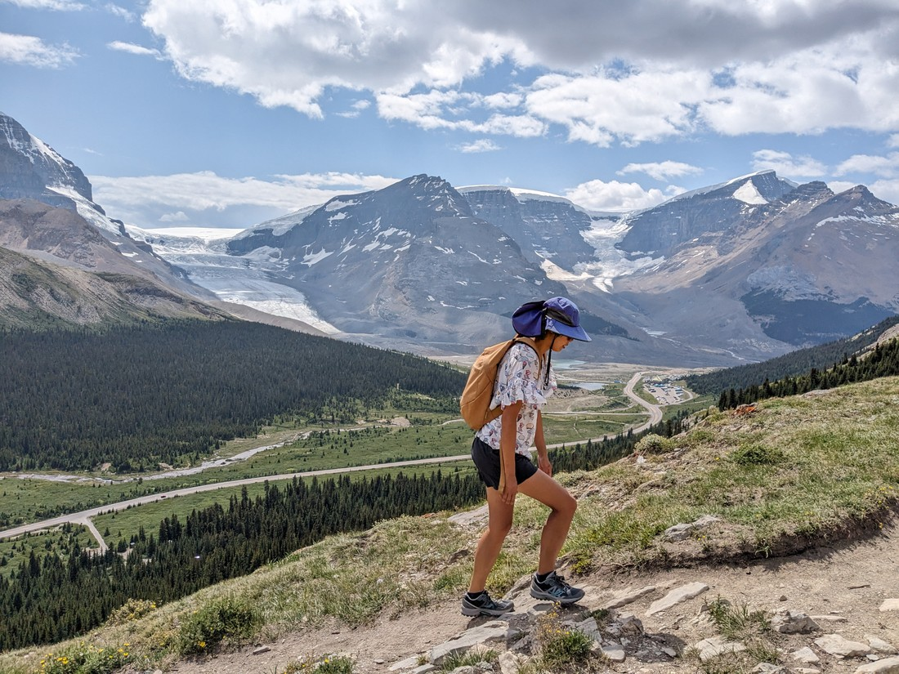

To summarise, it was now just after 3pm and it was time for a proper walk.  Sure, there had been a bit of walking at Sunwapta falls but this one was going to be a bit more significant.  It was called the Wilcox Viewpoint.  I hadn't written down what this walk was going to entail but fortunately there was a sign at the start of the trail, explaining that it was 8km and would take 2-3 hours return.

The starting point of the walk was roughly 2,000 metres above sea level (according to what I can see online) and it was only going to get higher from there.  It's always nice when a walk starts high - because that means we spend less time and energy getting to the good stuff.

The first bit was through a forest, but it didn't take long for us to come out and get a view of the mountains.  I don't specifically remember there being a lot of bugs around at this point but the following photo suggests otherwise:

To the west we were getting a good view of the Athabasca Glacier, which is \*the\* glacier that people thing of when they think of the Icefields Parkway.  Not only is it quite near to the road (or given the elevation, the road is near to it) but there is a lot of commercial activity here allowing people to walk on it.

And speaking of commercial activity, that reminds me that to get here we'd passed a tourist attraction called the Skywalk.  This was a glass walkway suspended over a sheer drop.  We drove past it and noticed that it was absolutely packed with people.  Betty and I both turned to each other and asked, "Why would you pay to do that?"  It'd be really hard to enjoy such an activity with so many people around.  But I guess you'd force yourself to enjoy it since you paid money to do so.

Well, Betty and I both knew we'd enjoy ourselves much more on this trail.  Sure, there were people around.  In fact, the carpark was essentially full.  But when everyone is spread out over several kilometres of open terrain, it often feels like there's nobody else about.

The above picture might be a bit misleading.  This looks like a viewpoint - there's even chairs there to enjoy it.  In fact, I really couldn't fault anyone if they decided to turn around here.  But we'd barely been walking for half an hour.  There was still a lot more trail to cover to get to the actual viewpoint.

We'd now left all the trees behind and the landscape was basically just rocks now.  Ordinarily that sounds bad for a walk in the summer afternoon sun, but at this altitude the temperature was perfect.  Also, no trees means nothing obstructing the views.

It ended up taking us a while to get to the viewpoint.  The sign might have said "four kilometres one way" but it sure felt like a long four kilometres.  Eventually we topped a rise and got a view down over the valley.

After admiring it for a while it was time to take some photos.

> \*Pose\*

> "No Betty.  Look over here.  What's got you distracted?"

> "Oh.  I see now what's got you distracted."

As there so often is, there were a number of chipmunks running around at the viewpoint.    They clearly know where the tastiest food comes from - humans.  I guess they're probably cleverer than we give them credit.  Probably a lot cleverer than the ground squirrels we'd seen along the trail that just stand up on a mound and honk for minutes at a time.

As well as the chipmunks there was also only one other couple at the viewpoint.  They were kind enough to take our picture.

> So much sky...

Have I complained about this yet?  Whenever people take our photo, they often love to take it in portrait mode.  This vexes me so much.  What are you trying to take a picture of?  The landscape is always going to fit much better sideways - that's why it's called "landscape mode".  Sure, if you think you're just taking a picture of a couple of people the portrait makes sense.  But if you're trying to do that, why are you standing so far away?

So we did resort to taking a few selfies as well.

But it was now time to head back.

On the way up we'd seemingly passed quite a few other hikes, but on the way down there was basically no one.  Perhaps those thick clouds a couple of hours ago had tricked people into thinking it was about to rain.  Perhaps it was just getting a bit late, and no one else wants to do a two to three hour hike when they would have to drive several hours back to Jasper or Banff afterwards.

Speaking of which, we'd seriously started to wonder about the time range for this trail.  Two to three hours?  It had taken us 1.5 hours just to get to the viewpoint.  After spending a while there (admittedly, quite a while) we weren't going to make it back to our car in under three hours.

Sure we're not the fastest hikers - but we're usually pretty good at getting a trail hiked within the "normal" time range.  We were seriously starting to doubt both the distance and expected time for this trail.

Random side note - there are a lot of trees about along the parkway.  If you don't look too closely, many trees are going brown at the top - even though its still early summer.  When we did look closely we found that the "brown" was actually masses of pinecones.  Clearly it was the start of pinecone growing season and for some reason trees start by growing a whole lot of them, but only at the very top of tree.

We ended up finishing in 3 hours, 15 minutes.  I later looked up the length of the trail online and the sign was indeed wrong.  AllTrails puts the average time as 3.5 hours and the length at 9.3 kilometres (with 522 metres of elevation gain).

Since it had taken us longer than we had planned, we wouldn't be able to attempt the other notable walk that we had planned for today.  But we could still fit it a visit to the Athabasca Glacier.

> Assuming those scary looking clouds don't get us

The walk was short and a bit underwhelming.  The viewpoint isn't that close to the glacier - perhaps because the glacier retreats from it further and further each year.  I think I mentioned it last time we were here but it's a bit sad to see how far the glaciers have retreated in our lifetime.

> Looks a lot different down here, compared to up on the Wilcox Pass

Something that was less depressing to see was a couple taking their cat along for the walk.

> And clearly not happy that I was taking a sneaky photo

And that was it for today.  From Athabasca glacier we drove 20 minutes south to the only campground along the Icefields Parkway that allows reservations (better to have booked than chance one of the many first come, first served campgrounds).  The downside is that there was going to be no showers and no flush toilets.  In fact, there was barely any running water.

Still, hopefully it would be worth it since it would allow us to spend more time in this part of the parks without having to drive many extra hours.
