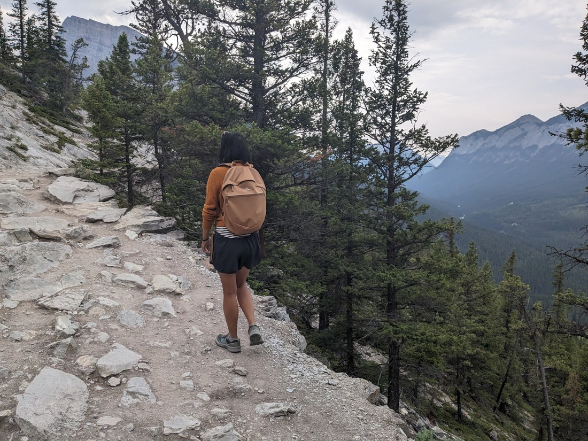
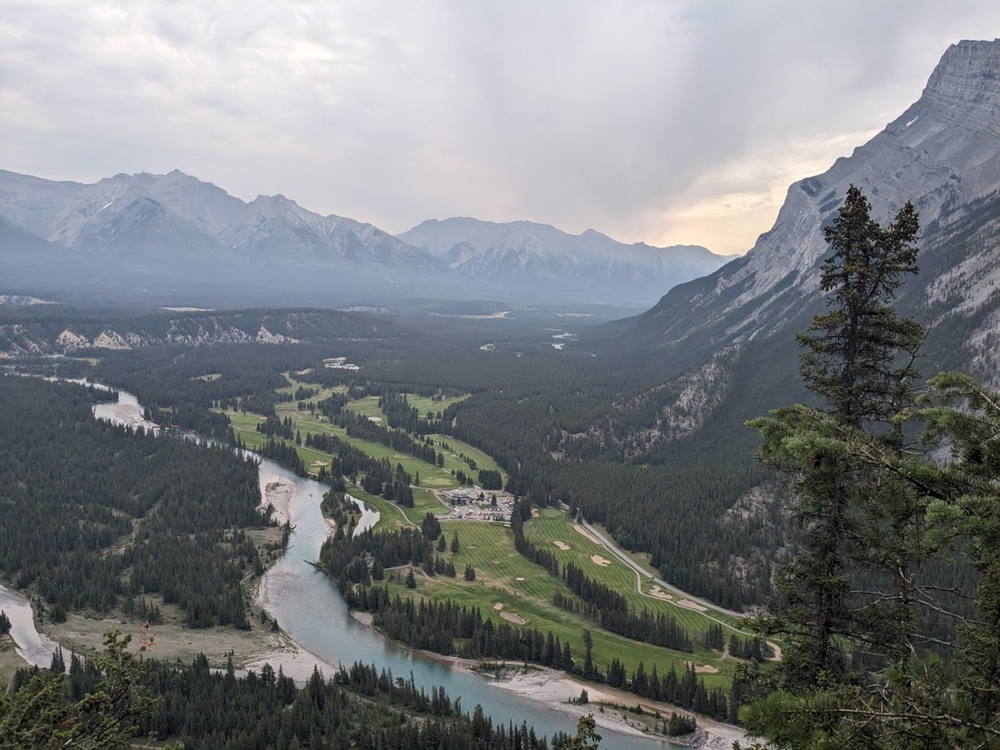
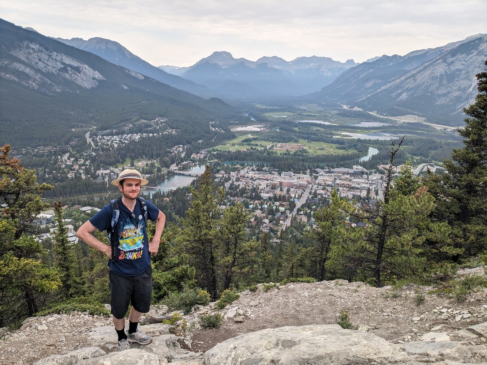
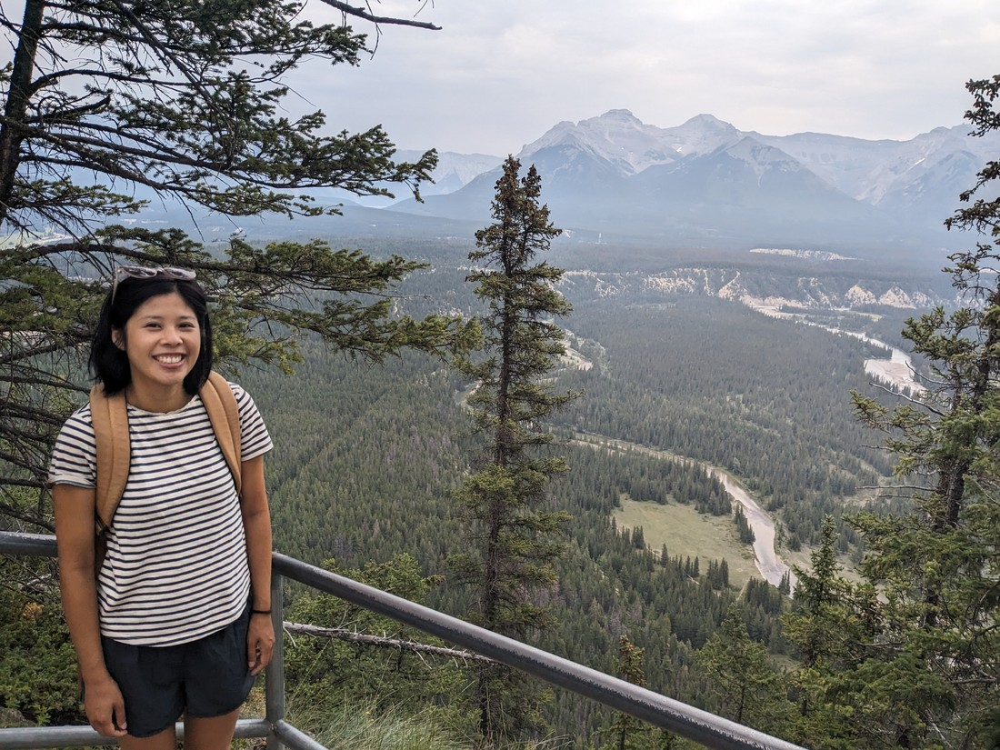
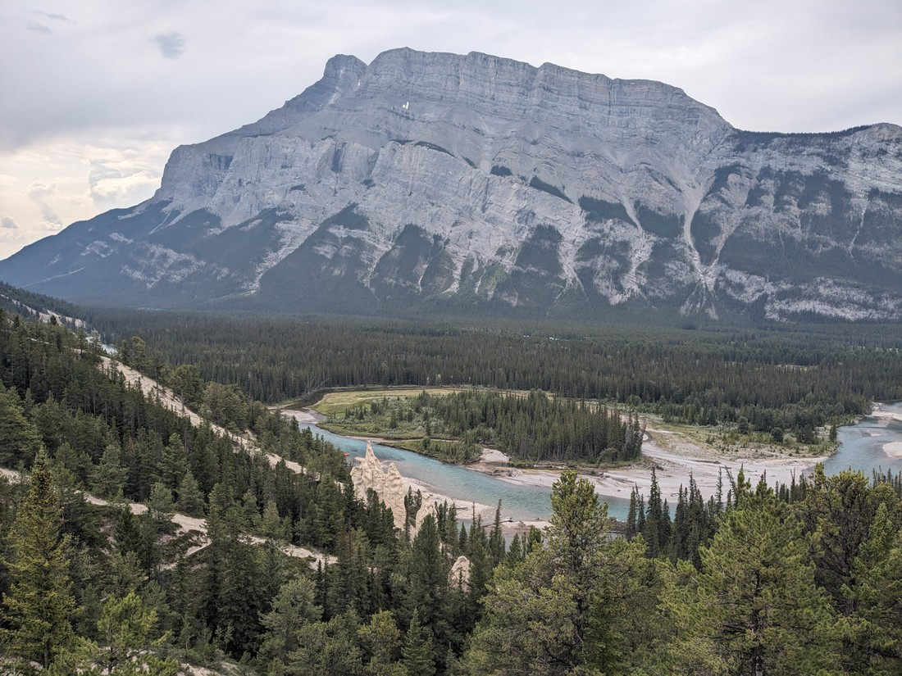
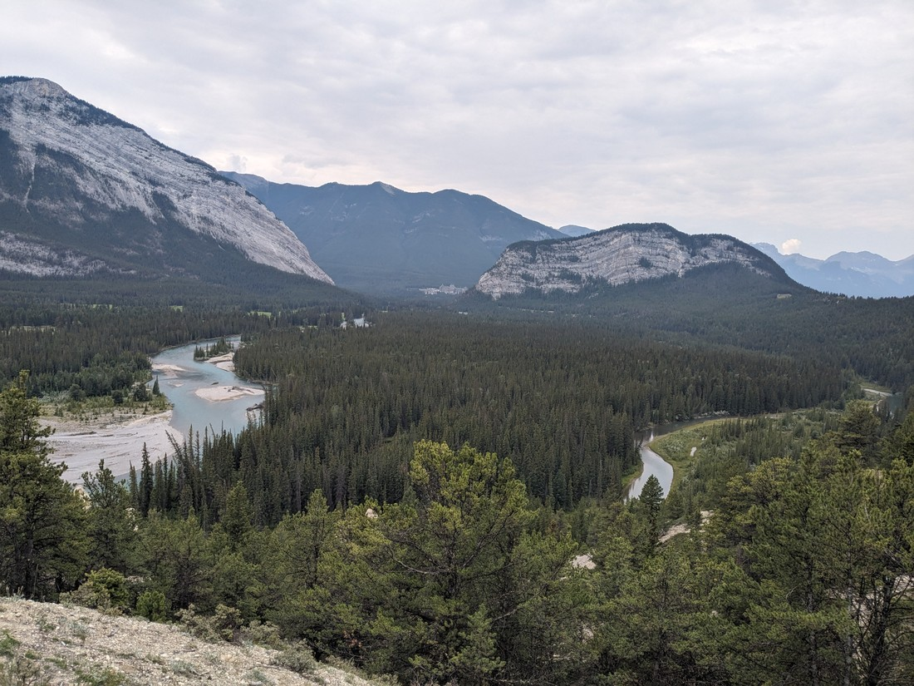
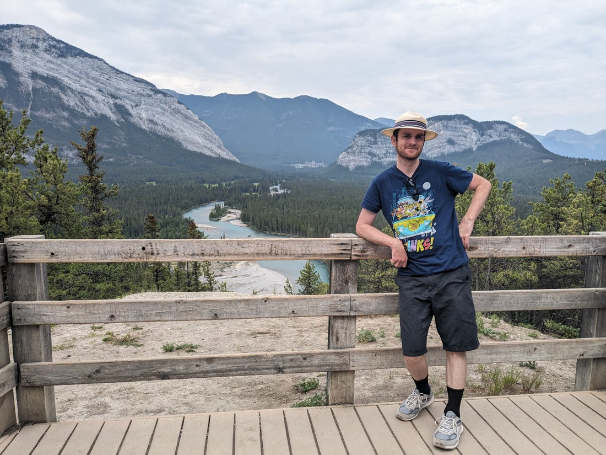
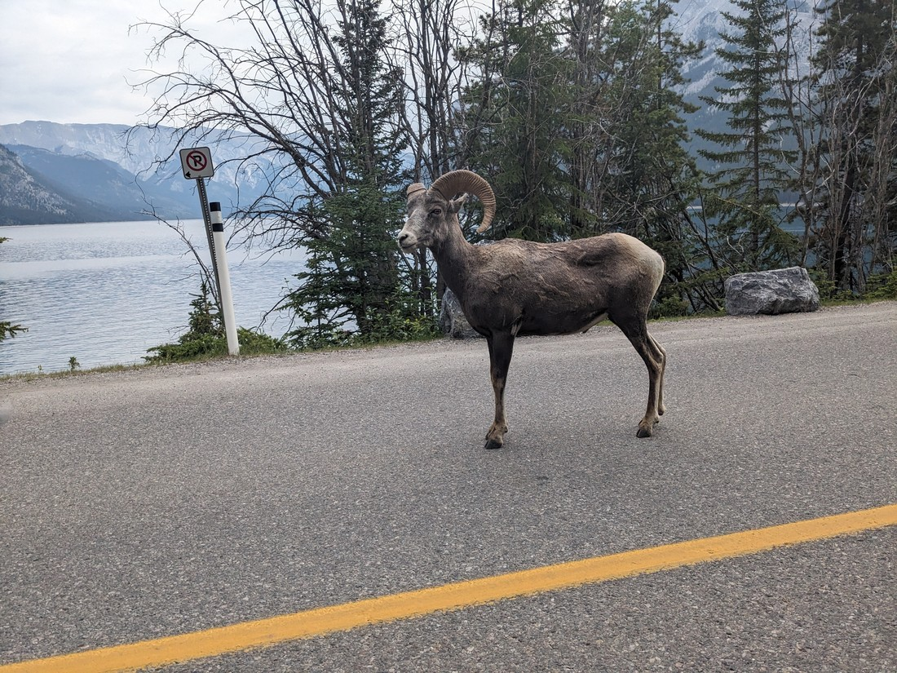

Today it was going to rain.  I checked the forecast (when the internet would work anyway - the campground was on the edge of cell phone reception) and the percentage likelihood of precipitation increased every hour until at some point it would be guaranteed to start pouring.

After breakfast we decided to hit the Tunnel Mountain trail.  This was a trail that started in Banff township and then wound its way up the nearby mountain.  It was a popular hike for Banff exercise lovers.  Fortunately we didn't have to go back into the township as we were lucky enough to score a parking spot a small way up the mountain.

> Still a lot of climbing to do

The trail was clearly a source of exercise for people living in the township.  There was also a lot of tourists around.  So busy - but it's still a steep walk so not super busy.

As you can see it was a very grey day - but no rain.  Yet.

> Banff township, visibly less busy at this hour

This is definitely a walk I can recommend.  It doesn't take too long.  It's relatively central (don't have to drive to a corner of the park).  And even though it is steep, the top has views worth viewing.

That really didn't take too long so what else can we fit in?  Well, there was a point on Google Maps near our campground called the Hoodoo Trail.  That sounds interesting.

Time for a game.  It's called, "Count the number of hoodoos in the following photograph."

To be fair, there were actually hoodoos.  At least three.  Maybe as many as five.  But that's still roughly forty or so short of impressing us.

At least there was some nice views.  Here is one back towards Tunnel Mountain.

> Fun fact - the mountain's name came about because the railway thought they were going to have to tunnel through it.  Which is ridiculous, because clearly there's easy ways around either side!  Also, why name a mountain after something you didn't do?

The only other notable thing I can say about this trail is that the viewpoints were numbered #1, #2, #3, and #5.  No idea what happened to the mystery fourth viewpoint.

The hoodoo trail was short and still no rain so again we figured we ought to do something else.  We tried to get to a walk near a popular lake, but the car park was just too packed.  Sometimes we'd drive around for a bit, but this time we decided it likely wasn't worth it.

So we drove on - but not before spotting this guy causing traffic chaos by standing in the middle of the road.

> Zero movement, zero expression.  Some just want to watch the world burn.

We decided it was time to go to the library.  We could hang out there quite nicely while it rained, as well as using the internet and charging devices.  I don't think we even considered trying to go to Banff Public Library - instead we drove 10 - 15 minutes south to Canmore.  There we sat for like four hours.

And it didn't rain!  Hour after hour went by.  Where was the promised rain?  Okay, eventually it did turn up close to 4pm.  Then it was gone.

Afterwards I felt like today had been a bit of a waste.  We didn't really come camping just to hang out in a library for most of the day.  However, it was nice - surrounded by books and people peer pressured into speaking quietly.  We also did need our devices charged so it's not like we didn't achieve anything.  I suppose just because we're on holiday it doesn't mean we can't also have a quiet day occasionally.