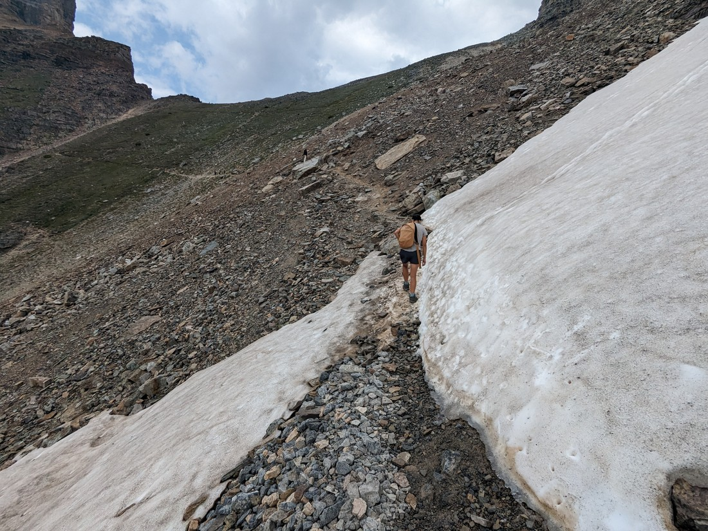
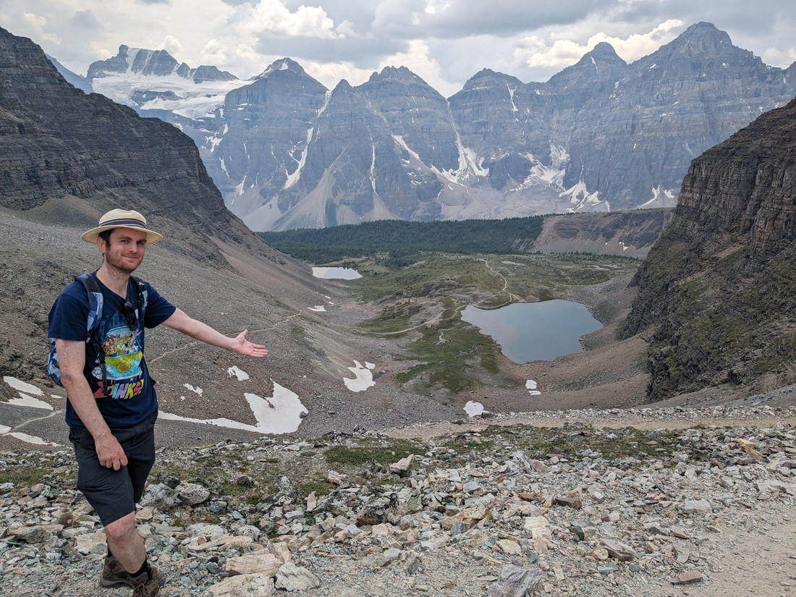

When I was booking campgrounds back in March I noticed that we could also book shuttles to Lake Louise. Figuring that might be a worthwhile thing to reserve I awoke at 3am to be among the first to book those too (can't be too careful - better to reserve early rather than potentially miss out). One of the shuttles I booked was for today.

Well as we all know, we managed to make it to Lake Louise back in June on a day that had perfect weather. Today's weather wasn't going to be perfect. It was going to be cloudy, and then it was going to be a bit rainy at some point. Weather forecast said possibly 1pm again - but it had said that yesterday and that was somewhat wrong.

There was also an issue of the time. I had booked this shuttle somewhat early. Not too early, but given that the shuttle departure location was a full hour's drive away (maybe more if the traffic jam was bad) it was a bit earlier than we might have liked. This might end up being a good thing since the earlier we are, the more chance we'd get things done before the rain.

(Note - the reason I booked it early is because at the time I made the booking I had assumed by now we'd be sleeping and waking with the sun, something not uncommon for people who live in tents. But as I've detailed before, I failed to account that dusk to dawn would not be a long enough rest and that we'd inevitably lie in until we felt that we had rested enough.)

Even though the weather might be questionable we figured we ought to still catch the shuttle. The main reason is that it gave us an reason to get out of bed and go do stuff. But how was I going to to entice Betty to get up early? It's easy - with a cooked breakfast, kindly provided (in exchange for money) by A&W this time.

But despite the name of the shuttle, we wouldn't be going to Lake Louise this time. Instead we'd be taking a sister shuttle to a different lake called Lake Moraine.

People seem to think Lake Moraine is prettier than Lake Louise, but I don't see it. It's a nice bright blue colour as well and perhaps the water is a bit clearer. However it lacks the glacier at the end of the valley that Lake Louise has.

Like Lake Louise, the pathways were quite busy so we didn't stick around the shore for long, setting off for our walk for the day. The walk that we wanted to do was to Sentinel Pass, but realistically we might not go all the way depending on the weather, and how we end up feeling. This was because the walk was (as always) going to involve a fair bit of ascending.

> Serves us right for calling all the flat walks at Elk Island "boring"

This walk didn't give us very good views of Lake Moraine which was kind of annoying. Sure, we could see it through the trees but it would have been nice if there was an exposed spot where we could see down unobstructed.

> Well, we can't not not see it

Eventually the trail did level out.

I think this area was called the Larch Valley. It's called this because of all the Larches.

> Which is a tree apparently

It wasn't really much of a destination so we continued on to the lakes, which weren't really that far. Now it was just a choice between stopping, or going all the way. Unfortunately, the last part of this walk was up to a place called Sentinel Pass. From where we stood, the hill looked almost vertical.

Fortunately looks were deceiving. Sure it was steep, but the path just cut along the hillside at a reasonable slope.

The terrain was now very different. We were definitely getting pretty high in elevation. We hadn't actually seen a tree in quite a while. There was barely even any foliage. The hill was basically all rocks.

> Well, not all rocks

At the top of the pass we got a surprise. The weather was actually... fine? At the bottom of the hill it had started raining and so we were expecting to have used up all of the nice weather that we were going to get today. But no - the rain had long ceased and there were patches of blue sky about.

Walking past many of the other people gathered at the top, we found a scenic rock to sit on and we sat and admired everything.

> What better place for a deserved rest?

Up until now this walk was just "okay". It wasn't terrible but the sights we'd been seeing weren't amazing. Well, up here at Sentinel Pass it was different.

It sure is nice to get to the top of a ridge and be greeted with a whole new view. Sure it's not a 360 degree view like at a peak but I'm now starting to think that it is nicer that we don't get to see the other side until we make it to the very top.

Unfortunately we didn't get to enjoy our nice sitting spot for very long. You see, the spot was \*too\* good of a sitting spot. Other people wanted to join us to take photos.

> Well, I suppose we can share the good triumphant photo spots

There apparently was a trail that continued over the ridge. It headed to either Lake Louise or just looped back round to the road. I hadn't taken a photo of the map at the start of the trail, but I tried to figure out how long those trails might be. It would be nice not to have to just head back down the way we came. Ultimately the answer was "too long - perhaps even days" so we had to turn around, but not before Betty gave the path one last all-too-considering look.

> No Betty! Our feet will die!

The weather was actually rather good on the way back down. I had thought once it started raining then it wouldn't stop, but I was wrong.

> A shame it is a bit hazy though

I suppose deep in the mountains it can be difficult to predict when and where the rain would fall. It meant we could get some better photos than the ones we had take on the way up.

> Here's the final hill we had to climb to get to the ridge

> Here is a stream we had to wade across - so deep.

> And here is a nicer view of the surrounding mountains

We made it back to the first junction and there we took a bit of a break. Well, we weren't intending to take a break but you see a bird flew in front of Betty's face.

"Huh, that was odd," I thought to myself. Betty probably thought she was being attacked, but from my view it just looked like the bird was trying to find a place to land. "I wonder if..."

> Shouldn't have used the zoom but I didn't have much time

Yep, sure enough it recognised what I was doing and flew over and landed on my hand. Betty was super jealous and so we took a break trying to replicate the feat. We came close, but then the birds got spooked and left. Clearly they are quite familiar with humans and since this was a junction with a bench I guess humans like to stop here a lot. And where there is humans there is often tasty sugary food.

At the bottom we walked along the lake for a bit.

People love to canoe this lake, so we walked past the rental place. Approximately $140 CAD per hour to rent a canoe! For that price we could buy a Tim Hortons hot chocolate every minute for an hour. We had previously seen canoe rental in Jasper for $80 and thought that was bad.

So we didn't take to the water. In fact, all we ended up doing was making our way back to Banff, which involved a not-so-short bus trip, then over an hour of driving. Betty fell asleep in the passenger seat, and I can't blame her. We didn't dare go near Banff township, instead again travelling the extra distance to Canmore to get dinner.

And with that I think we're done with the Lake Louise area. Sure, there's a few more bits we could do but we've done the main hikes. We've also been really fortunate to get such good weather - even though we weren't expecting much from today. We were certainly glad we encouraged ourselves to get out and hike.

Tonight is going to be our last night camping in Banff. Despite having not explored too much outside Lake Louise, we're honestly quite happy about that because the toilet block at our camp is awful. Ordinarily it would be okay, but there's just too many people using it. We're looking forward to an actual bed tomorrow.
