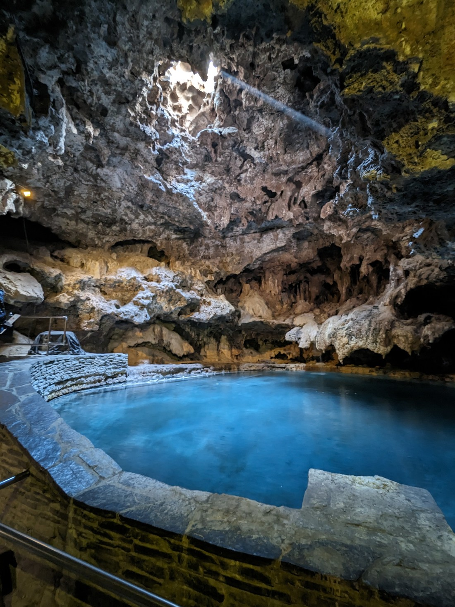
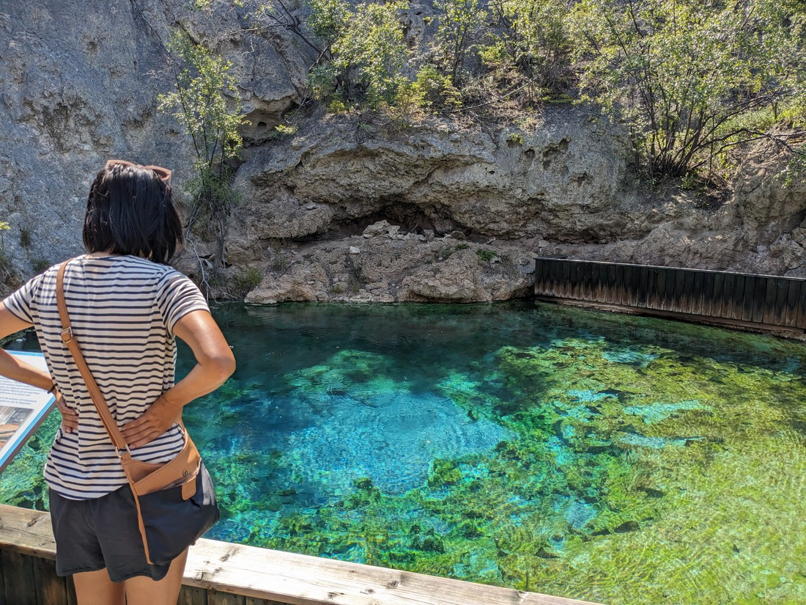
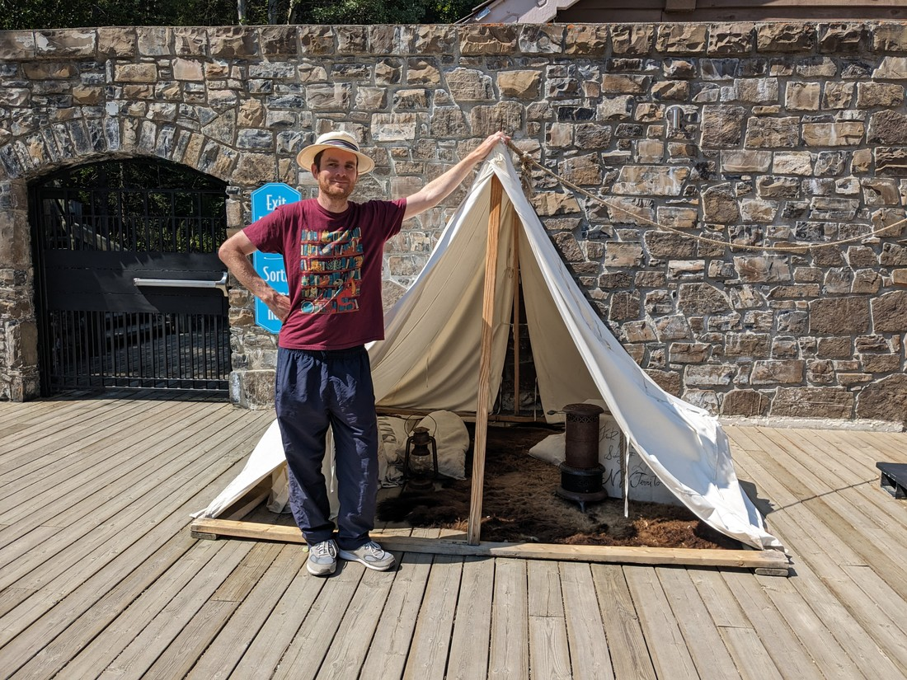
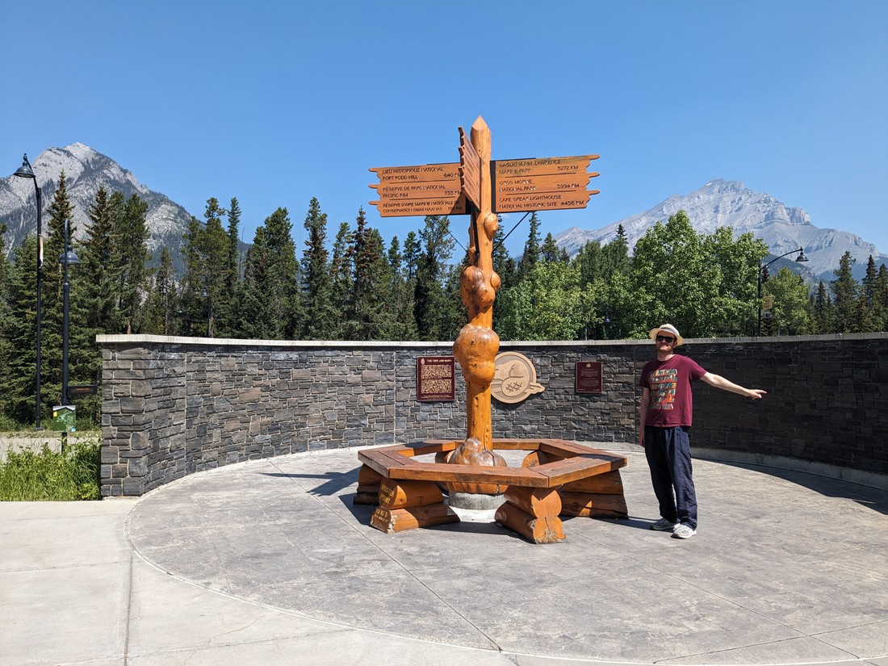
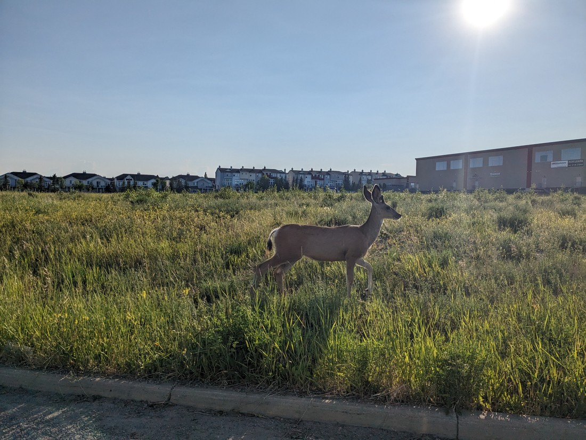

Today it was time to leave. Today was one of our happy motel nights. Sure, four nights in a row doesn't feel like that much camping but we figured occasional motel nights would be helpful to ensure we could keep our devices charged and to keep abreast of all the things happening on the internet.

But we're on a budget here. In 2019 we wanted to stay in Banff but it was pricey. We decided to just pay the pricey amount and that was probably a good decision as we did have three good days and nights. We considered going back to the same place on this trip but we found that the motel had put up their prices - it was now $500 NZD a night.

All the motels around Banff had that same story. There was no "cheap and dirty" accommodation, just "only slightly less expensive and dirty" accommodation. So instead we decided we wouldn't stay in the park. Instead we're going to be driving out of the parks toward Calgary to find a cheaper place to stay.

But first, let's do something.

There's a place inside Banff called "Cave and Basin". We walked past it in 2019 and didn't bother to go in because... well, it cost money. Fortunately this time round our parks pass gives us entry to this place. So we figured, why not?

Cave and Basin isn't exactly an interesting place. There's thermal activity here, with a pool inside a cave and a pool outside - these are the cave and basin. And that's about it.

They're not pools you can enter. In fact, visitors aren't even allowed to touch the water. It's not too hot - in fact the temperature is lower than many hot pools. I guess it's restricted because this is a historic place.

Explorers found this cave (and basin) in the 1800s. They then went and told all their friends about it. I guess in a frigid Canada before the invention of electricity, a giant warm bath probably is quite exciting. In fact, the explorers were worried that it would attract too many people.

To cut a long story short, this was the birth of Banff National Park (though it was called something different back then). In a way, every national park in Canada has these two pools to thank for establishing the parks system.

> "They're not even \*that\* hot"

There was a nine-minute-long video presentation that turned out to basically be just seemed to be a big self congratulations with zero informational content. There were a few props scattered around too.

> Why is this nicer than our tent?

Overall our trip to Cave and Basin was worth the money we paid (which was zero money). It's historic, but history has varying degree of interesting-ness.

So visiting bookstores in Calgary today ended up being more interesting - Calgary had a few notable second hand book stores. Entering the city was almost a bit of a shock as the temperature was noticeably higher than it had been in the mountains. We also seemed to be arriving during stampede week. The Calgary Stampede is perhaps the biggest annual event in the city. Many people were walking round in cowboy hats and boots that didn't seem like they were ordinarily worn.

But all we were here for was to buy a book (Betty has been going through them faster now that there is more camping), dine at IKEA, and then drive south.

We had booked accommodation in the town of Okotoks, because like Strathmore and Olds it was cheaper than Calgary. We did have some trouble paying the bill though. One of our credit cards had just expired, another didn't work in Calgary, and the third was a debit card which couldn't be used for a damage deposit. In the end we had to a complicated transfer onto the debit card, then withdraw it in cash. Then that cash got given straight back to us when we checked out. What was the point of the deposit if they weren't even going to check for damage before we left?

Anyway, I think that's enough rambling. Last point of interest - we saw a deer on the way to pick up our dinner:

And then we stayed up far too late. There was a Mission Impossible movie marathon going on and we ended up watching most of movie four and all of movie five. It was likely 1am before we were ready to sleep. I guess this is what happens when we only have one day in four to enjoy such niceties - we lose sleep trying to make the most of them.
