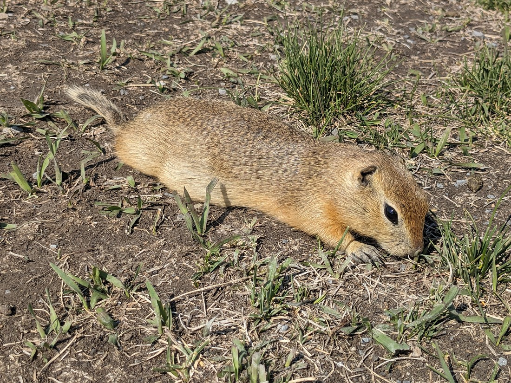
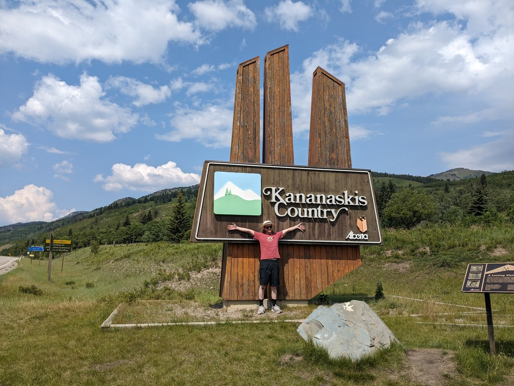

After a short Walmart trip it was time to leave Okotoks. Betty piped up that there was a rock nearby that was a local tourist attraction. So we went to see it

> "Aw, it's broken"

The "interesting" thing about this rock is that it does not belong here. It is believed that it originated in Jasper National Park and has travelled all they way here by glacier. Presumably very slowly. And a very long time ago.

Good news though - this stop wasn't just a geology lesson. There were also critters:

> This little guy let me get a bit too close

There were lots of prairie dogs and prairie dog mounds around. Coyotes are certainly going to have a banquet if they ever discover this place.

Today we were travelling to a part of the Canadian Rockies known as Kananaskis Country. It is a national park sized section of mountains nestled alongside the other national parks in the area. And yet, it has no such status. Which of course is really annoying because it means access wasn't covered by our national parks pass.

> But it does have an excellent sign!

We drove along until we came to a walk that we had flagged. This was one of the \*easier\* walks in the Kananaskis. That meant that we only had to walk up a single big hill.

Seriously, basically every walk in the Kananaskis that sounded interesting had 700 metres to 1.5 kilometres of elevation to ascend. I told this to Betty, and I could definitely see her rethinking her choice of travelling partner.

This trail was called the Ptarmigan Cirque Interpretive Trail. I think it's called "interpretive" because you get information as you walk around. Only, for this walk you had to bring the information yourself. Maybe there was some sort of brochure or something. Instead, all we got was to occasionally read a number on a post.

At the top of this trail was where a glacier... used to be.

> We were a few thousand years too late

So it wasn't a super special place to visit, but we had gained in elevation and there were some nice views of the surrounding mountains.

Honestly, I was expecting more snow. I suppose it is approaching the middle of summer so it might all finally be gone. Sure rocky mountains are still nice, but despite seeing a lot of snowy peaks over the last few months we have yet to tire of them.

Not much to do on the way down but get a bit silly...

> Signs have to be obeyed

...and perhaps consume some gummy snacks.

> Sorry Betty - you got caught.

I'm going to omit the next part of today's activities for reasons I'll explain in the next blog post. Anyway, two hours later we were driving along to the campground which is where we would pitch our tent for the next four nights. But along the way we spotted some cars stopped on the side of the road.

> A bear!

It's gotten to the point that whenever we see a car on the side of the road we're always like, "Why are they stopped? Is it a bear? Is it a moose? Is it a bear riding a moose?" Of course usually the answer is that they're broken down or someone is peeing - but not this time.

If you can't tell from the previous two photos, this bear was on the move. Sure he'd stop sometimes to forage but he was clearly a bear on a journey. As he was going the other direction, we made a sneaky u-turn and drove up ahead of him. Then we just waited for him to walk alongside us.

> Interestingly it had an ear tag as well as some sort of collar - clearly a bear being monitored

Then once he passed, we'd drive further up and repeat the process. There were about four or five cars doing this - playing leapfrog in order to get good watching spots.

> Sometimes it dared to cross the road

I won't admit how much time we spent following this bear but it was a long while.

Eventually a park ranger pulled up behind us and we took that as a cue to get going. "Time to camp" we decided. Except shortly afterwards the rain started pouring down.

That kind of felt like karma. We wasted far too much time following the bear and potentially risking causing traffic collisions. We actually spotted a temporary sign on the roadside the next day warning about bears by the roadside and instructing "Do not stop". The bear probably taddled on us.

Since we couldn't pitch our tent in the rain we drove along to a gas station. There I overheard some bikers discussing the same bear we had seen. The cashier noted that there is a bear around that is weighty enough that it can rock your car if it wants too. Hmm, we probably would have thought twice if we had known they might try do damage to Bluey (our car).

As I said we'll be here for four nights. This is an are of the Rockies that we never explored in 2019 so it's all new to us. However there is a countdown going on. We don't have \*that\* many days left of planned vacation left. At some point we're going to have to get things sorted for afterwards.

But not tonight. Tonight we need sleep.
