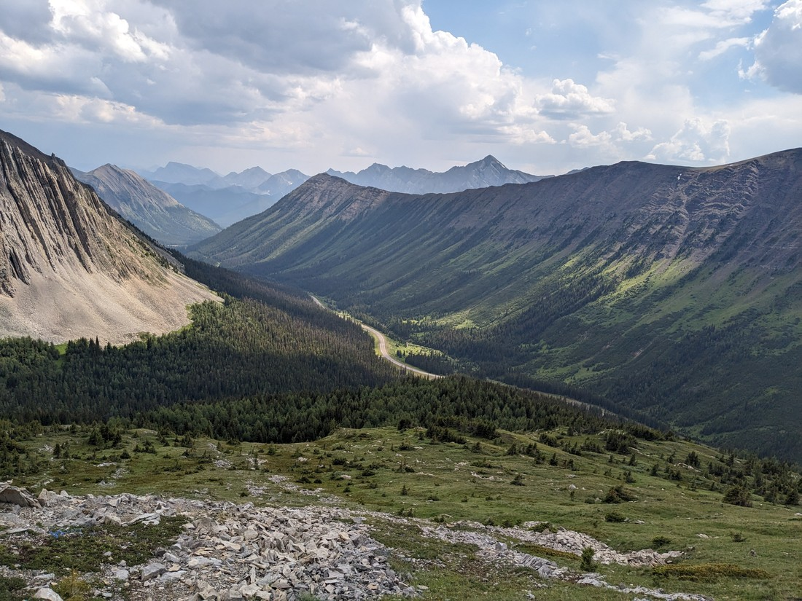

This story is about a trail called the Arethusa Cirque is going to be a bit different. Sure, it's still going to be pictures and paragraphs - perhaps even some captions. The difference is that Betty has no idea what I'm going to write here. That's because I went on this walk without her.

Sure, she was invited but she decided she'd rather read her book in the car than come along. In her defence, we'd only just done another walk (see previous blog post). Don't forget that she was up past midnight watching Tom Cruise movies so I guess a little tiredness is understandable. It was the only thing nearby. It seemed a waste to drive somewhere else and then have to drive back later.

We came to Canada to try new things. Well, considering how long we've been travelling - not doing the same activity is actually a "new" thing. If we both got bored without each others' company then we know not to do it again.

So I set off, and immediately found a reason why hiking this trail alone might be a bad idea:

Also, apparently this trail wasn't a maintained trail. There wasn't even a sign to confirm that I was hiking the trail I thought I was hiking. So I asked someone. I also asked if the trail was easy to follow. They acknowledged that it wasn't. It was supposed to be a loop trail, but he wasn't able to follow it the whole way.

Fortunately I had a map. Well, not quite. On AllTrails there is a small map showing roughly what the trail looks like from a bird's eye view. Well, I didn't have that. All I had was a screenshot of that map. It was a good thing I thought to do even that because there was no cell phone coverage out here. This small map would have to do.

I successfully made it to where the loop began.

> Confident face!

This junction actually had paths going left, right, and straight ahead - but I could only see two paths. I decided to walk anticlockwise because I was sure about that particular path.

That is, until I almost immediately took a wrong turn and walked up a pile of rocks for no reason.

> This definitely doesn't look like a path

In my defence I did that because if I was wrong (which I was) then at least I would have an aerial view which would better allow me to spot the proper path (which is exactly what happened).

I hurried up a hill and found myself in one of the corners of the loop (it was a very triangular loop). I stopped to admire some of the rock formations of the mountains.

> Like a wave!

From this corner I made my way along another pile of rocks - but this time there was a clear route, the result of many people trampling them into a sort of flat path.

I should have mentioned by now that I'd been hearing thunder in the distance. Not much I could do about that. Then it started to hail.

> And nowhere to hide

It turns out hail isn't too bad when hiking. Well, when they're pea-sized anyway. Hail is basically a raindrop that bounces off you rather than soaking you. I still put on my coat but I think I got more wet from the sweat being contained inside my coat than I would have from the frozen sky water.

I had complained about there being less snow in the Kananaskis than what I had expected. Well, I suppose this is a type of snow:

Around this point I met another couple. I had spotted them about twenty minutes ago, which had given me confidence that I was walking in the right direction. They commented that I was probably walking the loop in the best way because of the slope that I would soon come to.

Well, I came to the hill but to my surprise it went up rather than down. It wasn't what I was expecting but the couple didn't specify whether they'd gone up or down the slope. So I climbed, hoping that it would just be temporary.

> I did get some good views

I came across some cairns so I knew I wasn't getting myself lost. Even if I was going the wrong way, I was at least still on \*a\* trail.

After a while I came to the conclusion that I was going the wrong way. The reason I figured this out is that I noticed that I was now closer to the carpark from our earlier walk than the one where I had left Betty.

> Why did I think this was the way back to the car?

I referred to that small screenshot of a map and it showed a separate trail running in the direction I thought I was heading. I must have missed a junction somewhere.

> "Whoops!"

It wasn't hard to spot where I went wrong. The trail wasn't the best (after all it wasn't maintained) and I thought I had cut a corner at one point. It turned out that had been a junction not a wide corner.

> But at least I know the way down now

Even after getting lost for 15 minutes, the walk didn't take me that long - I was back well under two hours. The carpark had since emptied almost completely - with only one other car still present. Good thing I didn't get truly lost because there wasn't likely going to be anyone who would find me. Betty couldn't even have called for help since I had both phones (one for photos and one for the map screenshot).

Overall it was an adventure I was glad to have taken and one that Betty was glad to have avoided - especially since I had something bigger planned for tomorrow.
