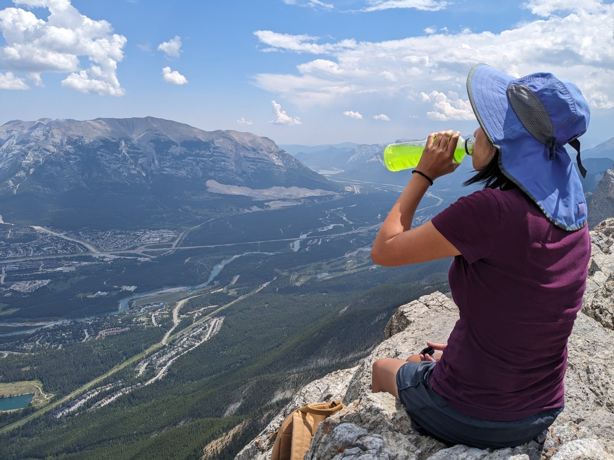
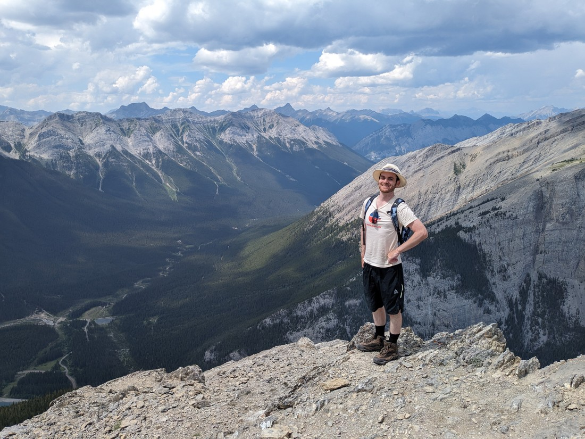

Today I made an agreement with Betty. She agreed that we'd get up earlier than usual and do a steeper than usual walk today. I agreed that we could stop at Tim Hortons so she could get her favourite breakfast wrap on the way.

Note to self: this blog seems to be evolving into one big advertisement for Tim Hortons.

> Get out of the way goat! Breakfast wraps are only served until 4pm.

I had checked the weather in advance and I knew today was going to be sunny, so I'd picked out the highest rated walk on AllTrails in the Kananaskis for us to do. This was Ha Ling Peak, near Canmore. It wasn't a long walk, a mere 7.4 kilometres return but the elevation gain was going to be almost 800 metres.

> Three crows. That's probably a good sign, right?

The first part of the trail was quite steep...

...and that pretty much was the story for the rest of the trail too.

More than halfway up we passed a viewpoint and got a glimpse of why we're doing this.

> A bit more than a "glimpse" - the view is better than most

There was another lady who had stopped at this viewpoint. She offered to take a photo of both of us and I said "Okay" while Betty simultaneously said "No thanks". As we stood there smiling, the kind lady did that thing that makes me groan that I've mentioned before - she took the picture in portrait mode.

For once the picture didn't turn out too bad. I guess she was close enough that it looks alright - no excess sky and ground. I like to ask myself when I take a photo, "What am I taking a photo of?" In this situation my answer would have been "the panorama" but perhaps other people focus more on the people.

Anyway, we continued up - very literally.

> This was basically a bridge, but on an angle

This was quite a popular a hike. We were regularly passing or being passed by people going in either direction. However something we noticed is that not everyone was making it to the top. Some people that we passed on the way up we never saw again. Also, some of the people going down were in pretty bad shape. I guess the popularity of this walk and its closeness to Canmore means people are attempting it who perhaps shouldn't.

Fortunately, Betty and I have been on a hiking holiday for several months now. Sure this wasn't an easy walk for us but since it was mostly shady - this one wasn't causing us any major problems.

> Though still some problems - it was very steep

Eventually we made it to a bit of a ridge. I scampered up the rock face to take a peek. My face must have given away my thoughts regarding the view because Betty soon joined me.

On the east side of the ridge the mountain just fell away - giving excellent views over the valley. The town of Canmore (where we have made much use of their library and Tim Hortons) was laid out below. It felt a lot like a bird's eye view of the town.

But we weren't at the end of the trail - there was still one last climb, up a rather rocky hill.

At the top the mountain seemed to fall away even more vertically than at the ridgeline. The view was amazing. We would end up spending roughly 45 minutes up here.

Part of that was because our legs and bodies were so tired from the hike up. I found myself in an unusual situation - I couldn't make myself go near the edge of the cliff. Sure, I never do anything risky but this time I found that I had lost all confidence in my legs' stability. Even a metre away I felt like I might somehow topple over. Betty was a bit more relaxed - or perhaps she was just too transfixed by the view.

> Definitely need those electrolytes today

It was also nice that the summit was quite wide. It meant we could sit around and not have anyone else walking round us.

And I suppose I should talk about the weather - it was amazing. A bit hazy perhaps but otherwise it was clear blue skies. Often that would be bad for such a strenuous walk but most of the trail was through rather thick forest. Eventually when we came out of the tree cover we were now high enough that the summer sun was much more manageable.

I can certainly see why this walk is popular. It is generally a well made track, it is close to civilization, it is shady, it has good parking, it doesn't take too many hours, and there's a jaw dropping panorama at the top.

> Betty trying to lie down and enjoy the view

Once we had sat for a while, we decided to walk along to see if we could get a better view down the north side of the mountain. You see, there was a walk we did in 2019 called Grassi Lakes that ought to be nearby.

Of course, "nearby" in terms of horizontal distance - certainly not vertical distance. We were able to spot it, and hopefully this next photo helps to better show how amazingly steep the cliff was that we were standing on.

But let's not forget that there's two sides to a ridge. Here was the view the other way:

> Somewhat similar - more trees, less Canmore

While it had been a beautiful blue sky, the clouds were slowly gathering. When we made it to the peak it seemed like there were more clouds around than clear sky. The weather was slowly getting worse.

After the hike we spent some time in Canmore using their library and Wendy's (which was also a Tim Hortons). While we were eating the heavens opened. The carpark was flooding and people were dashing to and from their car, a fruitless effort because any amount of time outside would soak a person.

> You wouldn't have thought the weather could go bad based on what we got while hiking.

We ate then waited a while but we still had an hour to drive back to our campsite - so we did have to make a dash. On the way back I was a bit worried about our tent. We had incurred a slight leak once while camping in Jasper. Could it survive such a downpour? It might even wash away if the puddles got large enough.

Back at the campground we found no evidence of any considerable rain.

> "Hooray"

Forecasting the weather is a bit difficult in the Kananaskis because the weather can differ greatly between areas. I'd taken to looking at several different nearby forecasts to get a sense of what might happen. Anyway, it was probably better for us that we got rained upon in Canmore than here. That is, until it started raining here too.

> But I have no photos of that so here's another one of us hiking

Despite the afternoon showers it was a really good day. It felt like we'd got a lot done. We completed a sizeable hike to a memorable peak, and we still got to hang out at the library, probably sweatier than most other patrons. Overall, it was a good day.

And managed to get through this whole blog only mentioning Tim Hortons five times!
