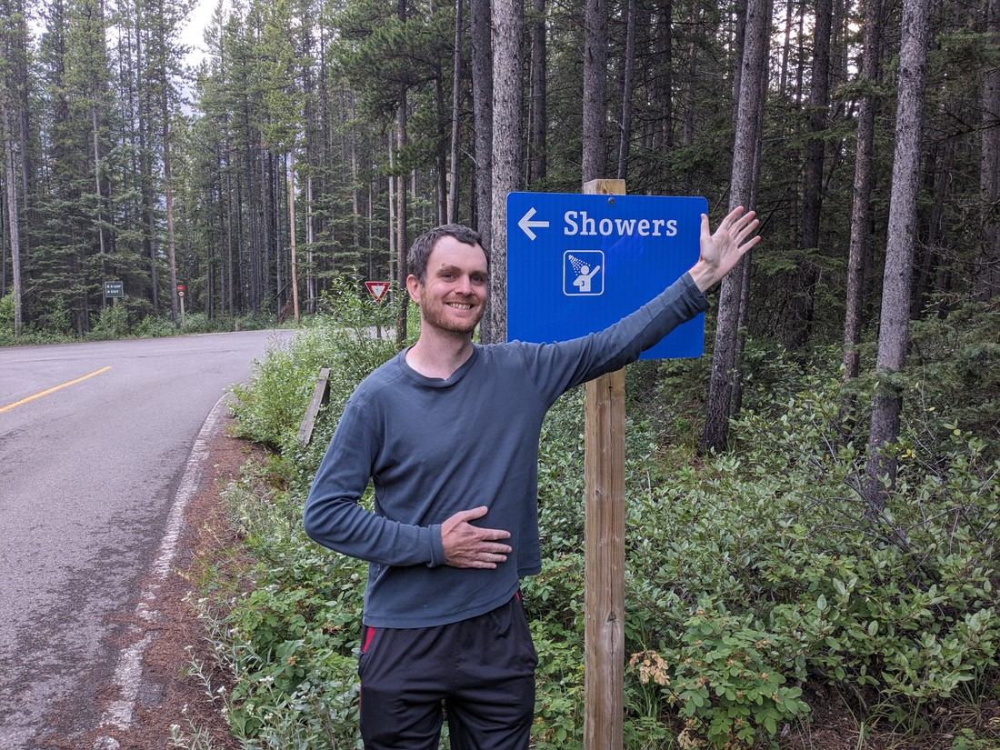
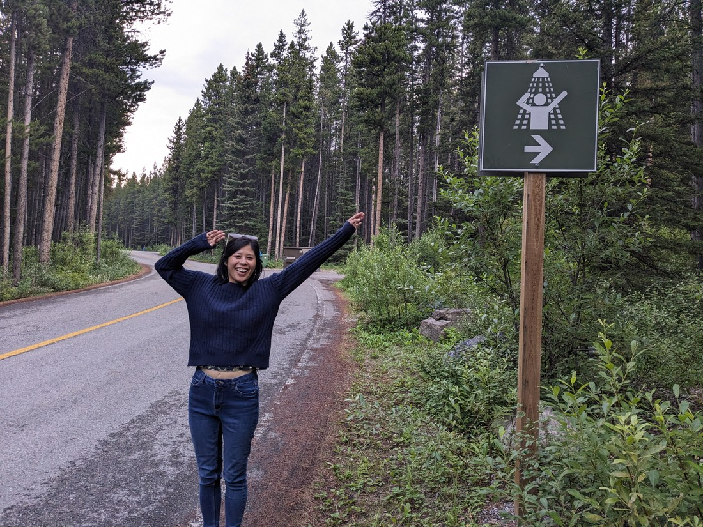
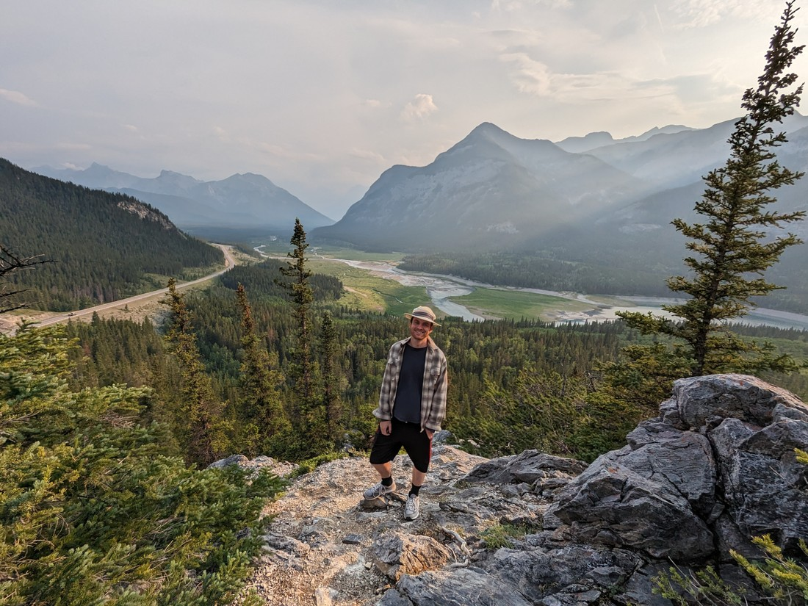
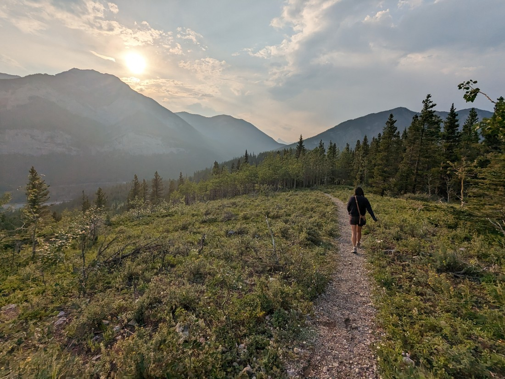
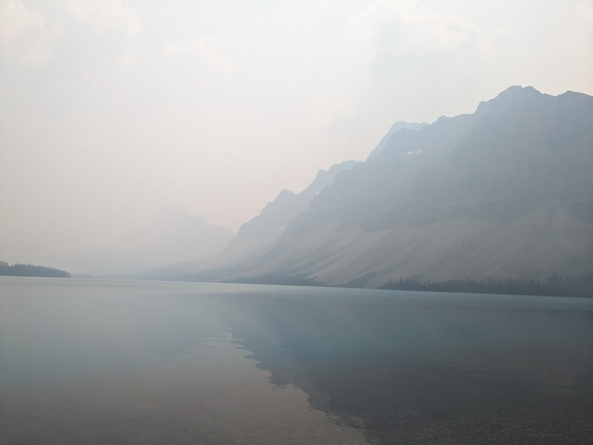
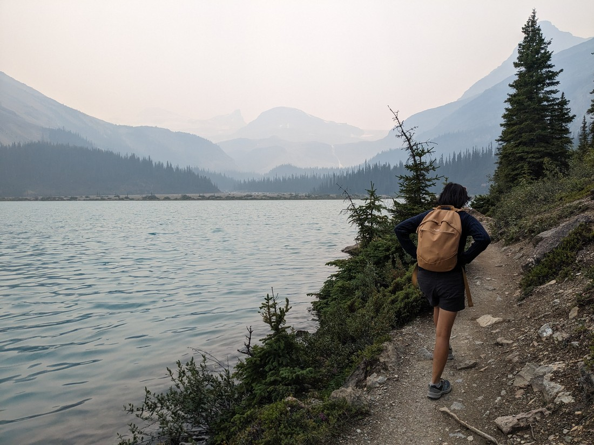
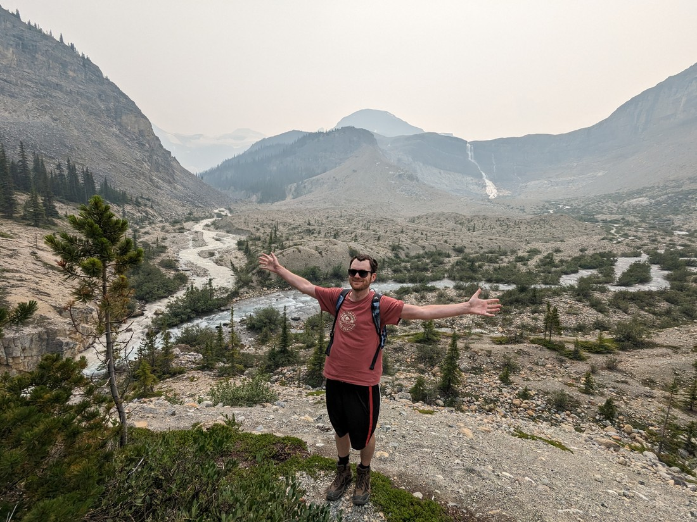

---

Tuesday 11 July 2023

Today it rained in the morning. For once we felt that this was a good thing. You see the new Mission Impossible movie had just been released and we needed an excuse to go see it and "poor weather" was a perfect excuse. There weren't many cinemas in the Kananaskis (or much of anything else) so we drove back to Calgary for the day.

But our first stop was to a local library (recharge + WIFI). Only there was a problem - to use the WIFI we needed to be a library member. Like, what? Sure it makes some sense - libraries are funded by locals' tax paid so any benefit ought to be for them. But still - no other library has done this. Every other library in Calgary would likely be the same so we instead went to the nearby Tim Hortons (yes okay, we go there a lot!) and stayed there for two hours.

Now it was time to go to the mall. With a bit of time beforehand we wandered around. We found these adorable SpongeBob-themed soaps:

Mission Impossible 7 is the longest film in the series so far, but the time in the cinema flew by. Walking out Betty and I asked each other whether we had liked it. The answer was a unanimous "no". The sixth instalment was the best in the series and just an excellent action film overall. This one was lacking in many ways. The love interest character was replaced for no apparent reason. The action wasn't as fluid. In general, much about the movie just made no sense. I'll throw the filmmakers a bone and assume that producing a film during the COVID era messed up many things that would otherwise have been better.

So today hadn't been the best. A shame - especially since we're still invested enough that we'll still go see the number 8.

---

Wednesday 12 July 2023

Today there were going to be showers again.

> Both kinds of showers

Like yesterday we decided to drive out of the Kananaskis, this time to Canmore - an hour long drive. Today was another day of hanging out in a library to catch up on things like blog writing, reading, and submitting job applications. Except for the long commute, this isn't a bad way to live. Camping has a simplicity (and cheapness) to it. Perhaps after our scheduled travelling ends we should just spend our days at the library and our nights camping until we land jobs.

But perhaps we won't camp here again. It's a bit far from townships and there's not much to do at the campground.

> Other than re-enact road signs

But this is our scheduled holiday time so on the way back I insisted we do a bit more with today. We stopped for a short walk to a viewpoint.

This would be our last night in the Kananaskis. Even though we hadn't done more than a couple of the hikes, it was still a nice place to visit. On the road through the area we had seen a grizzly bear each day for the first three days we stayed here. Each time we were able to get a good look without being in danger. However after the first encounter we decided to be good citizens and so we didn't do anything more than slow down as we drove by.

---

Thursday 13 July 2023

Today we would be heading north and then west, returning to Golden. Since we would be passing nearby I decided that we should return to the Icefields Parkway to hike one or both of the last two trails that we didn't get round to hiking. It wasn't likely to rain today so it should be a good day for hiking, right?

> Well...

I've mentioned before that Canada had been having some problems with wildfires this year. Well, it seems the smoke from those wildfires has finally found us. We were back in the Icefields Parkway, a place that I myself have praised for its scenery. Well, is it really still worth visiting if we can't see most of it and the bits we can see are through a thick fog?

We'd driven for something like 2.5 hours but when we got out of the car I asked myself was it even worth going for a walk. I also noted that the air smelled like hotdogs - I wasn't expecting wildfire smoke to smell like food. (Later I found out that someone was having a barbeque nearby so that was probably what I was smelling).

Upon getting out of the car I also discovered that I had lost my hat. I must have left it when we stopped for breakfast in Canmore, which was now 1.5 hours south of us. I was torn. I had bought a number of those hats over the years, but this had been the last one. The others had all gotten lost, or became dirty enough that I threw them away. Betty can attest that I was really sad to now be without one.

> Look at that poor sad boy

But it probably wasn't worth driving an extra two hours just to get my tatty hat back. At some point I was always going to have to replace it. Yet my mood was noticeably affected on this walk. I have had a lot of good times in those hats. They came with me and Betty on our first international holidays in 2017. They've been a part of me since I had melanoma removed in 2018. I honestly felt different to all of a sudden be without them.

But there will be other hats. I just need to find ones with a suitably large brim that fit my awkwardly large head. At least the haze took away some of the sun's menace today.

---

So that's three days of activities in one blog post. As you can see we didn't do a whole lot of activities. Part of it was due to the weather, but part of it was also because we're now approaching the final week of our planned travels. In preparation we've been scouring job listings looking for places we can settle. This meant we didn't pack our days with as much fun stuff as we might otherwise have.

Also, we have been holidaying for a while. Perhaps it is about time we slowed down.
