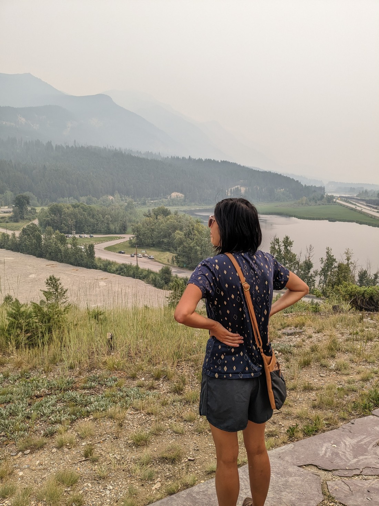
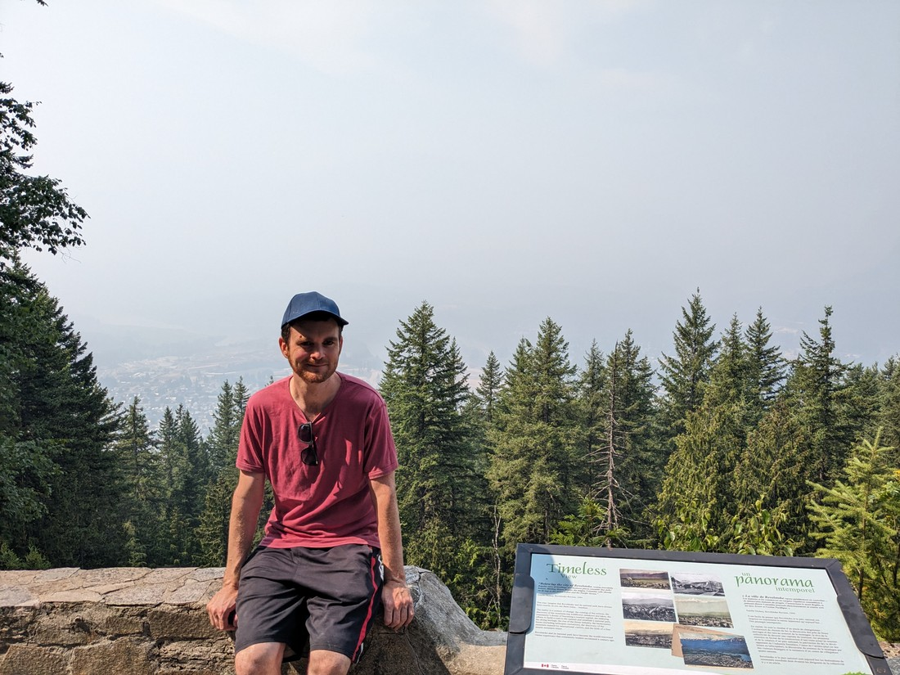
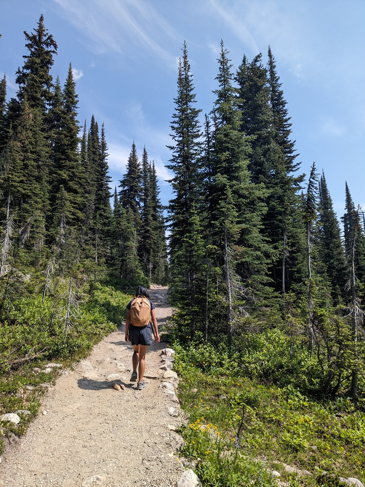
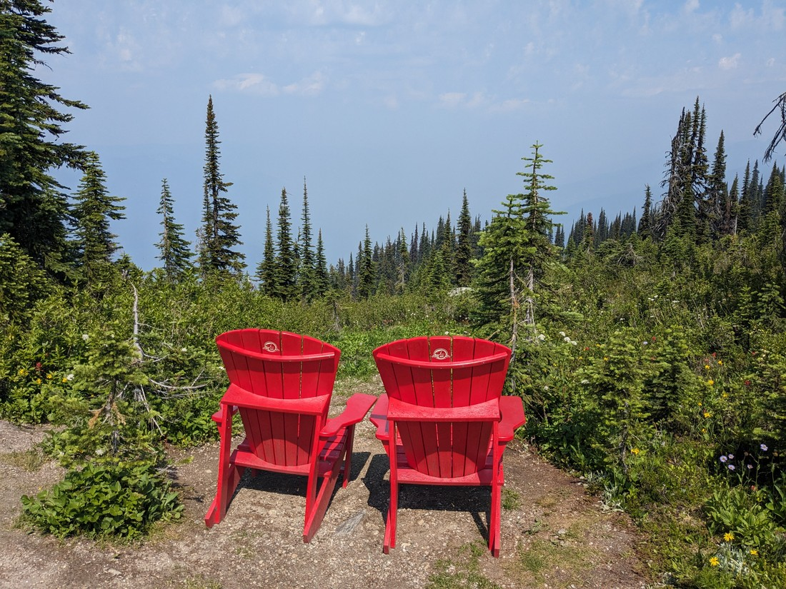
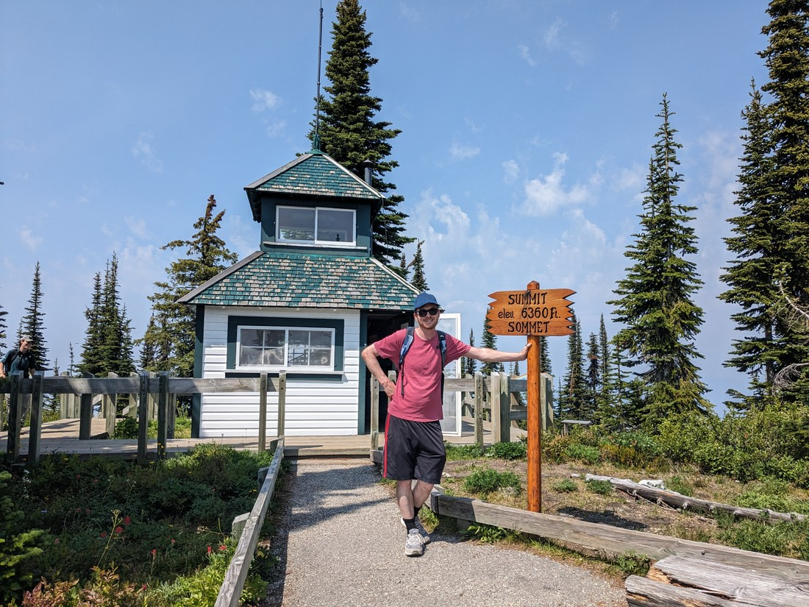
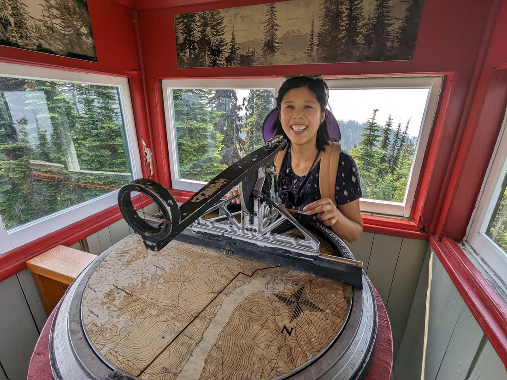
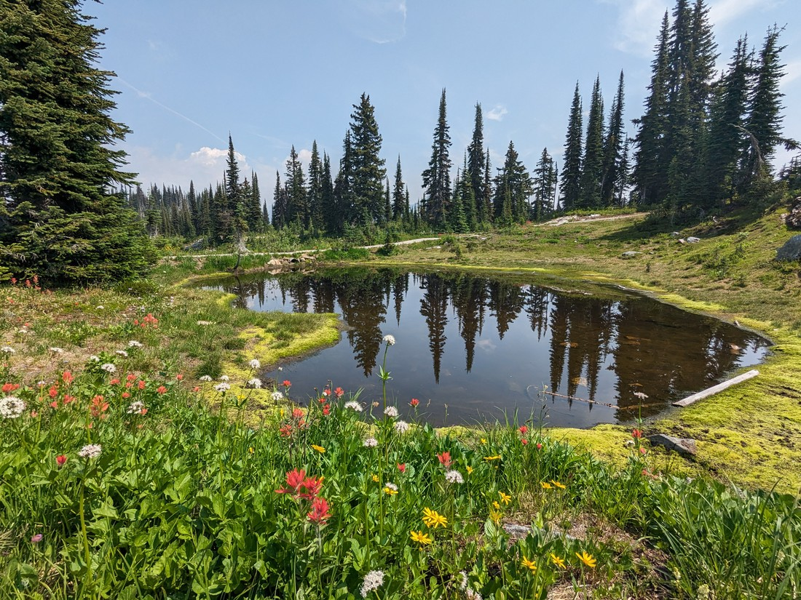
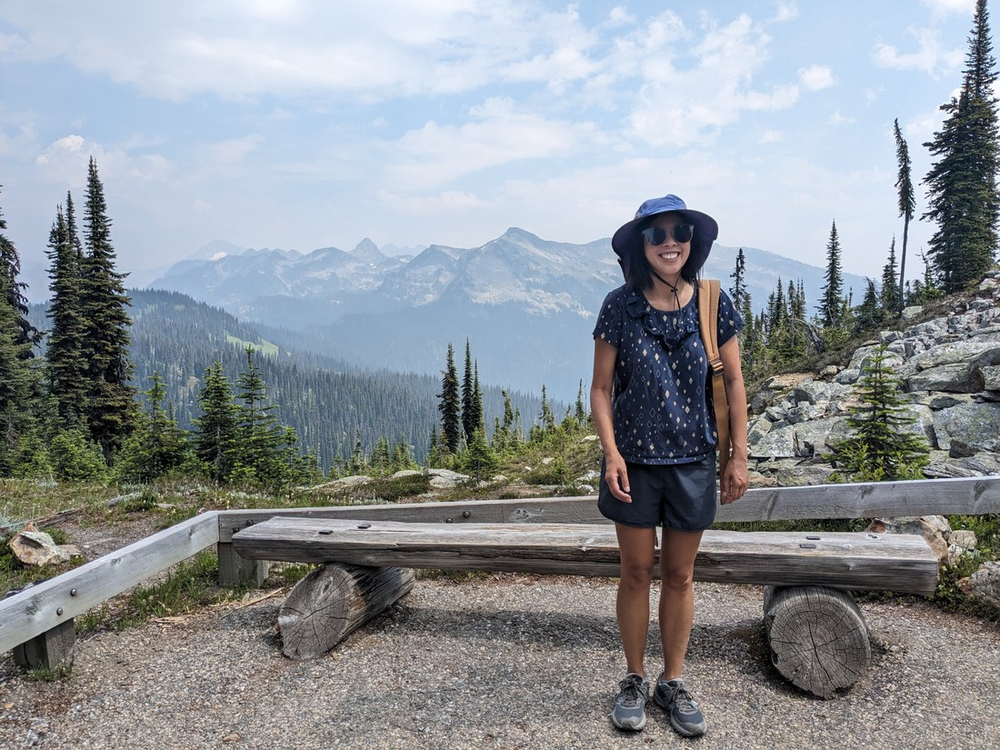
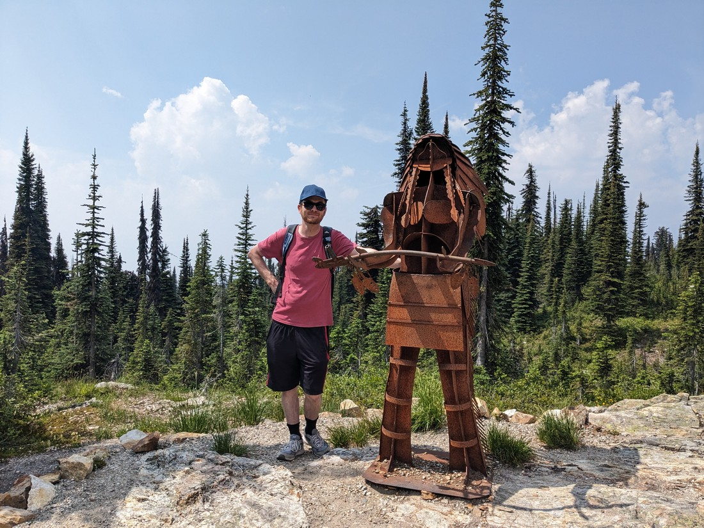

So we were now back in the town of Golden - gateway to the National Park that makes Betty hum the pirate song. It was fortunate that we had returned because we had a new credit card posted to Golden and it hadn't arrived when we first came through. This time it was waiting for us when we tried to check in. This was extra fortunate because my VISA card declined (which it likes to do in Canada for no reason) when the hostel tried to process it.

So we now had to try and figure out how to use the new credit card. This was not as straightforward as we had hoped. Apparently all we needed to do to activate it was to use it for a transaction and enter in the PIN number. But it turns out in Canada (or maybe just BC) they don't bother asking for the PIN most of the time. How were we going to activate it? We only had a limited amount of days left to do so. Eventually it just seemed like the card had been activated. We hadn't entered the PIN but we seemed able to use it for most types of transactions. So "phew".

We didn't do much in Golden. The smoke from yesterday was still hanging around. We did go for a walk round town but that was about it. The temperature was surprisingly hot given the cloud of smoke we seemed to be inside. Despite the heat we denied ourselves ice cream because... not sure.

> "Why wouldn't we get ice cream? - it makes no sense"

The next day we were driving on to a town called Revelstoke, which is outside a National Park with the same name. On the way we could have stopped at Glacier National Park, but like the last two days we thought, "What's the point in hiking in smoke?" The drive was not a long one so upon arriving we figured we may as well check out what will be our last national park (of this journey anyway).

Most of the park is found on a single road that runs from the city up the mountain. There were some viewpoints on the way up which was nice - or ought to have been nice.

> A "timeless panorama"

On the drive today we debated something - would the smoke be worse or better at higher altitudes? Well, here's the answer:

> Have skies always been that blue?

Okay, it wasn't perfect. Sure we no longer seemed to have a layer of smoke obstructing the sun, but we weren't getting much of a view when we gazed horizontally.

> Those might be mountains in the haze. Or maybe just clouds. Or maybe just more haze.

From the car park it was a short walk to the summit of Mount Revelstoke. It was also a short time before we started getting attacked by mosquitos.

At the summit was a small fire watch tower.

> Here I am with my "make do" hat that I picked up in Golden which will make do until I find something better

Unlike most of these towers we've seen, we could actually go inside this one.

> Again, this was a \*small\* fire watch tower

There were a few other short trails at the top of the mountain, so we just walked around a bit more, enjoying the break in the smoke.

> Lots of wildflowers up here

> The mountains this way were a bit more visible, because they were closer

> Can't remember what this was made out of exactly, but it was pretty neat

Later, after lunch, we visited the Revelstoke library. When we came out at closing time the sky did seem noticeably clearer. From what we understand the wildfires aren't nearby - the smoke is brought here by the winds and fortunately the winds won't blow in this direction all the time. But it does mean the smoke might return.

But the good news is that we now know of a smoke forecast website and it seems like there will be less haze around tomorrow. The bad news is that it'll mean we're probably going to have sore feet tomorrow night.

---

Footnote: the title of this blog post was stolen from the name of a cannabis supply store in Revelstoke. While the blog title was only intended to refer to the wildfire smoke, perhaps it's about time to talk about cannabis in Canada.

When we came in 2019 the drug had only just been legalised. In Montreal we observed a bunch of people queuing to get into a mostly unmarked store. We later figured out that it was a Cannabis dispensary. Well, in 2023 things are a lot different. The stores are a lot more visible, and they are everywhere. We've driven through small towns that barely have a convenience store, but do have a speciality cannabis store.

Perhaps this is just a phase - like in the early 2010s when frozen yoghurt stores were everywhere in New Zealand. Perhaps the number of stores will drop off as the country realises that it doesn't need all of them.

Betty and I are in Canada to try new things, but cannabis isn't likely to be one of them. We already have something we're hooked on (Tim Hortons) and we don't need another vice. The smell helps - it's not as offensive as cigarette smoke, but it doesn't make us want to join the club. We also might want to cross into the USA again sometime and it may help our chances of a smooth border crossing if we've had nothing to do with that stuff.
