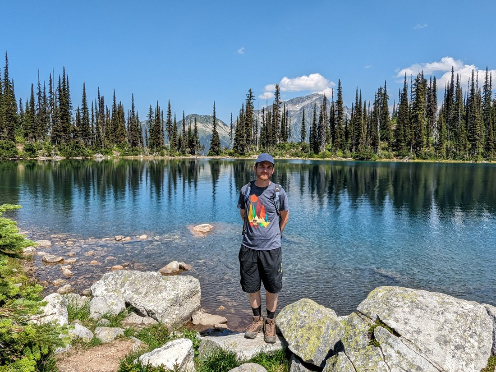

I mentioned in yesterday's blog post that all indications were that the smoky haze was clearing. The forecast had predicted that it would, plus that was confirmed by our own observations. Today we basically woke up and discovered hills and mountains surrounding Revelstoke that we hadn't seen yesterday.

Well, let's go make the most of the good weather then. What better place to go than back up Revelstoke mountain to do a long(ish) hike?

> Huh - I'd forgotten how blue the skies can get

Today we were setting off to reach Miller and/or Eva Lake. The length of the hike would depend on how far we wanted to go. Fortunately the trail was rather nice to walk on. While there were plenty of trees about, often we found ourselves walking through grassy fields rich with wildflowers.

Like yesterday the mosquitos starting biting soon after we had left the car but strangely, after we got a kilometre or so along the trail they all but disappeared. It's like they know where humans mostly congregate - within 100 metres of their car.

Overall it was a very nice walk because it wasn't just a hike through a forest. Throughout the walk we received glimpses of the surrounding peaks. Fortunately even when we were out of the tree cover it never really got too hot, a benefit of hiking in the mountains.

Almost two hours into the hike we found one of our favourite furry friends to find.

> The hoary marmot

In some places marmots seemed to be everywhere (or else, they were prairie dogs or something else similar) but it's now been a while since we've seen many of them. This one tried to make a run for it as we walked past so we froze, waiting, and watching. After five minutes or so it decided it was safe to resume its activity of digging in the dirt bank for tasty treats.

> It's their adorable shaggy coat that makes them so exciting for us to spot

Eventually some other hikers walked past who were not so obsessed with marmots and their presence scared Mr Marmot away - so we continued on. Soon after we came to a junction. Three different lakes were signposted so we figured we'd start with the closest.

> It's like the English and French sections of the sign had a disagreement

Miller lake was nice.

The water was clear and there was almost no other people around.

I think it would have been nicer except there were other non-people around. Tiny flying non-people that sometimes do a big red splat when you squish them. I guess they like the lake too.

It was now time to decide whether we wanted to hike to another lake. This was a bit of a no-brainer. It would only add an extra 1.6 kilometres.

> Of course we have been hiking for a while so time to re-sunscreen

The trail itself to Eva Lake was worth the effort - giving some more excellent mountain views.

Eva Lake was a lot like Miller Lake, except "more". It was larger, the hills behind it were larger and more forested, and the water was clearer.

We hadn't known this when we set out but this was the popular lake. This was the lake must be the destination for most hikers. There were a small number of camp sites here. There were also two separate groups of young people swimming. I never touched the water but I know for a fact that it was chilly. I know this because no swimmers lasted more than a few minutes in that lake.

> Not all that disappointed that I didn't bring my swimwear

There appeared to be a bit of a path going round the lake and so we decided to follow it - mostly just to get away from the people. A few hundred metres along we found another excellent view of the hills.

Then came the question - we've now been to two of three lakes mentioned on the junction sign. Miller Lake add an extra 800 metres round trip. Eva Lake had been 1.6 kilometres round trip. Do we set out for Jade Lake? It would add almost 8 kilometres to today's hike. This walk had been rather nice and it was an excellent day - we were seriously considering it.

In the end we decided not to set out for Jade Lake. The deciding factor was that the toilet at Eva Lake was missing paper - and we hadn't brought any with us. We decided to be nice to our bladders and head back to the toilets at the car park.

Later it became clear that this was the right call. Not only was my toes hurting awful fierce by the end of the hike, I learned that the trail from the junction to Jade Lake was much more difficult. Hiking 8 kilometres along that trail would have felt like a lot more.

But before we left Mount Revelstoke we decided to check out Panorama Point. We hadn't bothered to hike the short trail yesterday because of smoke-related reasons. Well, it was certainly nice to check out today.

Again, it is interesting. This was a short trail to an excellent viewpoint but I don't know if it will remain in my memory. Today will be remembered for the enjoyable hike to lakes Miller and Eva.

A day like today certainly makes me reflect on our travels. We might have had a few days of smoke but it didn't last. My understanding is that other parts of the country had weeks of smoke. Even if things don't always go perfectly, I still think we've been very lucky on this trip. Mostly.
