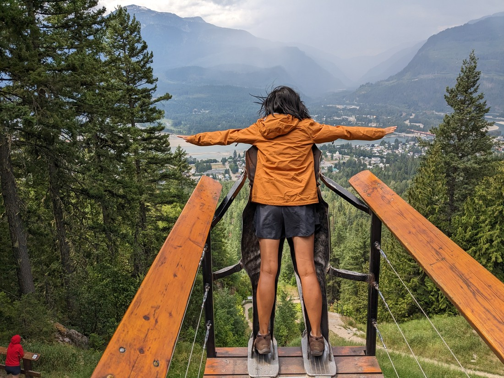
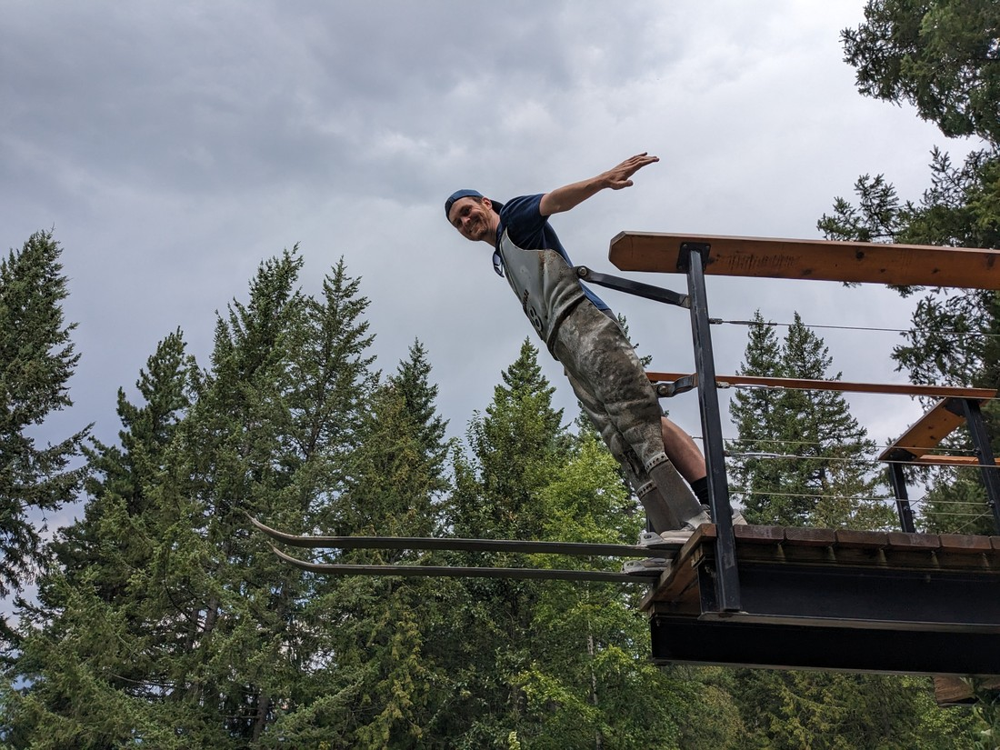
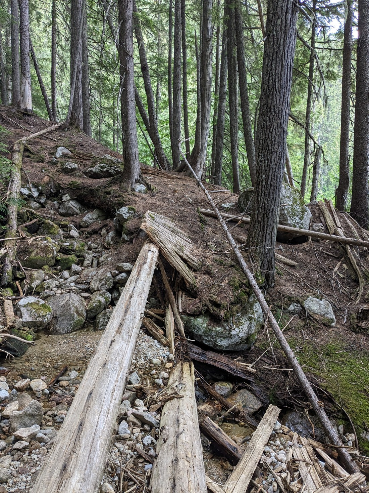
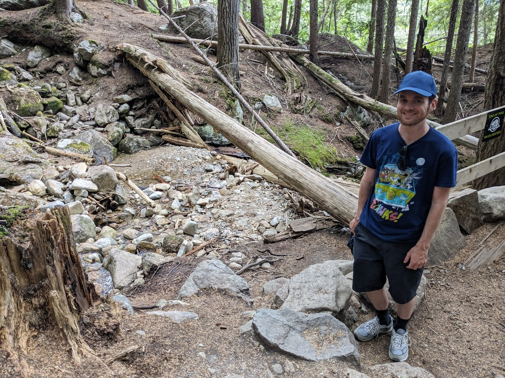
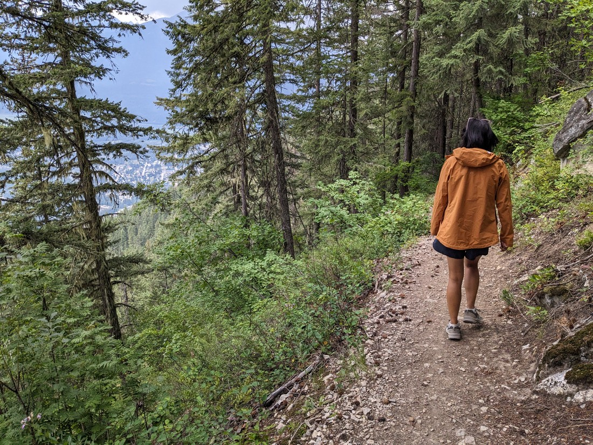

In total we are camping near the town of Revelstoke for three days, and we still had one more to go. The smoke from earlier in the week had cleared but the issue with today's weather wasn't going to be the haze. There was some good, old-fashioned rain on the way.

So we got up and breakfasted at a popular chain eatery named after a Canadian hockey player. Then we drove back to the Revelstoke mountain road. Today the plan was to check out some of the smaller hikes and attractions - nothing that would take too long in case we had to dash back to our car.

The first was an abandoned ski jump site from 1933. Apparently it was a pretty big deal - world records had been set here. There were a bunch of other info boards but we didn't read too much, because we were getting a sprinkling of rain.

Anyway, as well as history there was also a bit of a photo opportunity here.

> Is it a viewpoint?

It was basically a statue of the front of an overalls on some skis. But combined with a living human and another holding a camera it becomes an action scene.

> "Look Ma - I'm a 30s era ski jumper!"

It also might be the site of a future injury as it does feel quite precarious leaning forward out over a drop with only some fossilised clothing to keep you from falling.

The next stop was for a trail called "Broken Bridge". The trail certainly lived up to its name, even if it did not live up to the amount of intrigue its name suggests.

> Here is the broken bridge

I imagine this was some random trail where someone built a bridge and then that bridge broke. Instead of either fixing the bridge or shutting the trail down, they now market it as "come see the bridge - it's really photogenic". Well, it's not.

> Can you spot what is bridge and what is just random tree debris?

But the guide notes there are also views along the trail. Here is one of those views:

> Meh

Oh well, it was worth a shot.

We returned to town and walked round a bit. Today would have been an excellent day to visit the library but annoyingly it is closed in the weekend.

We retired back to our tent relatively early in the afternoon, and then around 5pm the weather truly hit us. Lots of thunder and lightning, and enough water to make giant puddles all over the campground. We sat watching the nearby puddles, praying that the site we'd picked was not at the bottom of a shallow ditch, or at the bottom of a hill.

Fortunately our tent escaped, unflooded - but there were still issues. The site we'd chosen was a bit of a walk and the packed dirt roadways did not absorb water as well as the grassy areas. Also, we had to walk a gravel path up a hill and half the gravel had been washed away.

Well, at least we're only here for one more night.

I guess overall it was a successful day. All our stuff (including ourselves) remain relatively dry. However this will be our last night of camping - for now anyway. I don't think I have detailed much about our future plans but for now we only have seven more nights of accommodation booked. During that time we will decide what's next for Luke and Betty.
