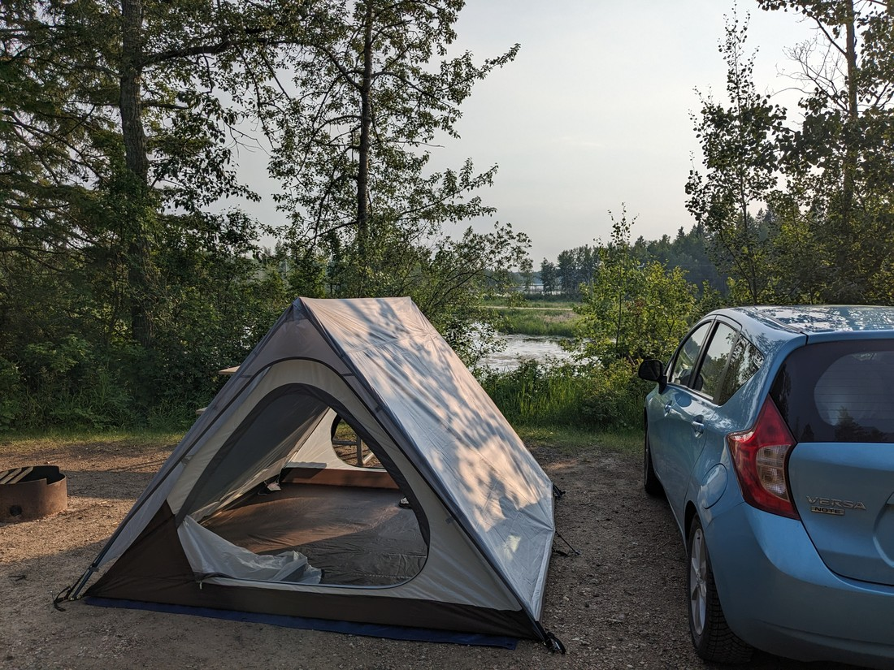
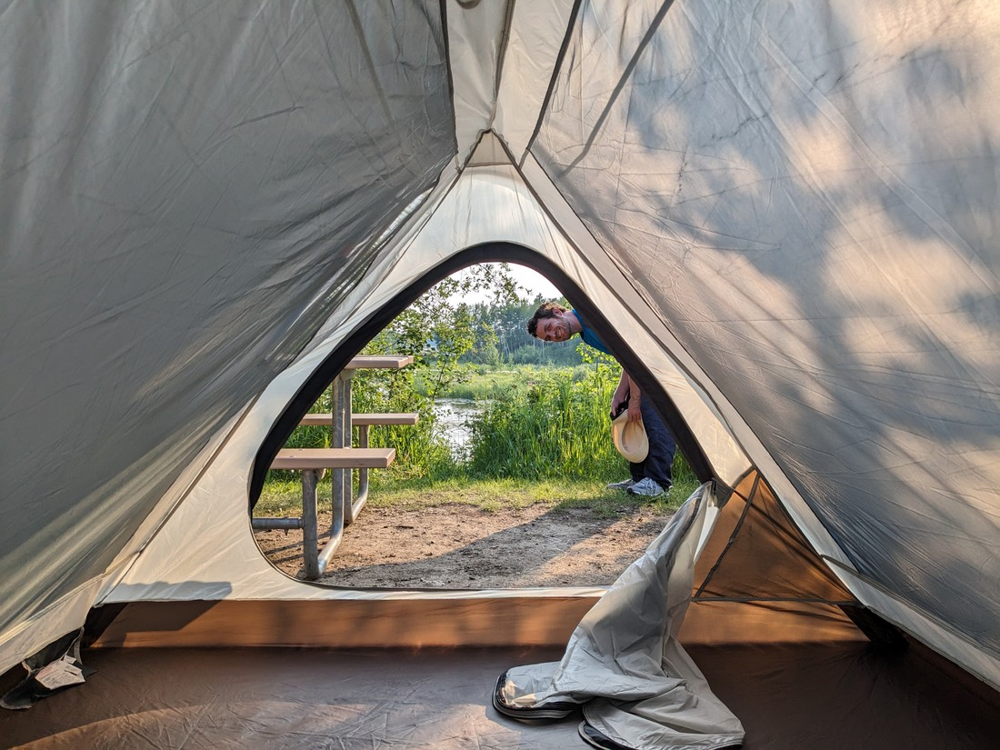
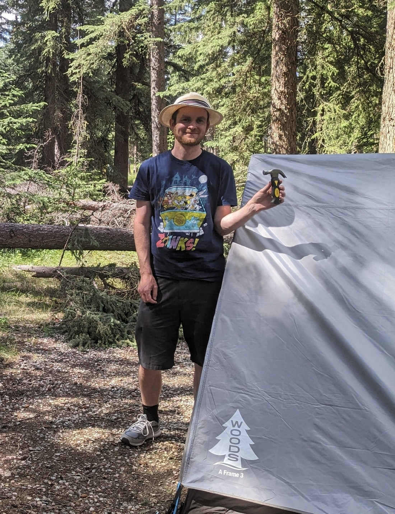
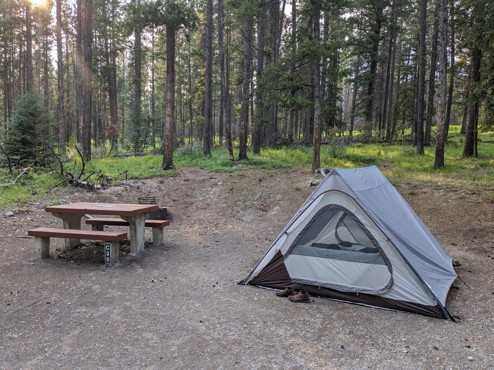
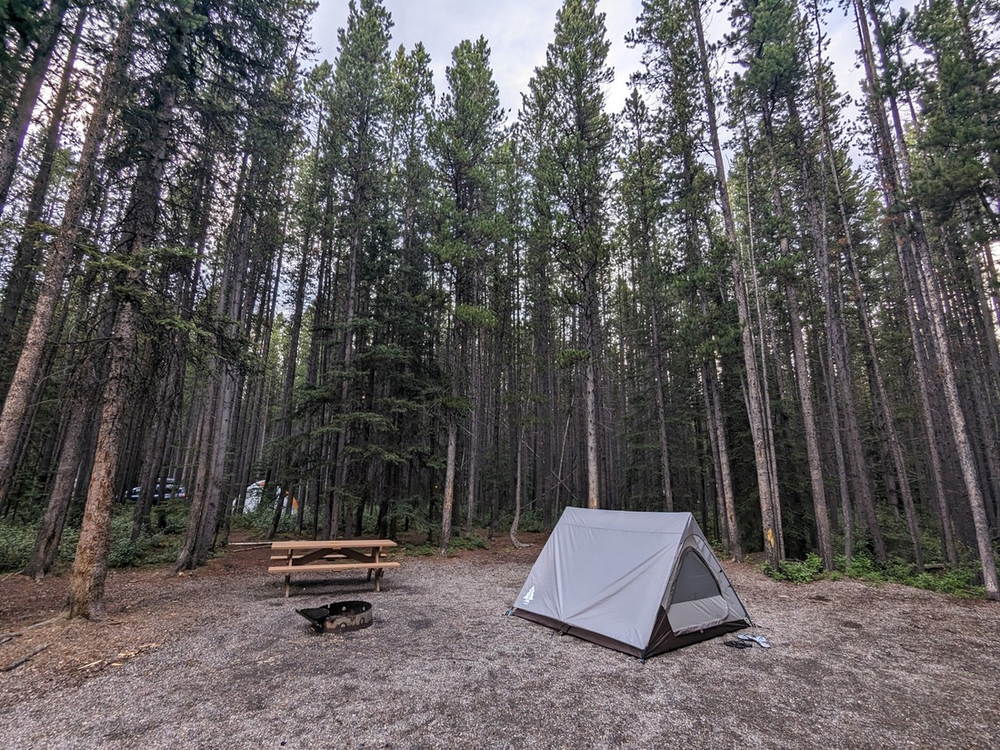

Well, it's that time again - time to reflect on our camping adventures and misadventures, but this time in Canada.

We had originally planned to camp for five days in the USA, but managed only three - a 60% success rate. For Canada we had planned 21 nights of camping and ultimately we tented for 17 of those - 81%. So that's an improvement. Again, the main reason we abandoned some of our camping plans was because I was partially ignorant of the weather conditions when I made the bookings. Not because we chickened out!

Moral of the story - even at the warmest time of the year, the mountains still get pretty cold overnight.

I think I've already detailed what happened in the campground in Dinosaur Provincial Park - I had booked a site next to a portaloo with a loud slammy door, and some loud, laughy neighbours.

Elk Island was nicer. Our site was in a line of three, separated from the rest of the sites. And for the first night one of those other sites was empty which was a welcome change.

One problem we did have in Elk Island was that the sites were on gravel, which made pushing the pegs into the ground very, very difficult. Well, one way or another we're definitely not going to have a repeat of Arches. So, I walked around the campground until I found someone with a successfully pegged-down tent - and I asked to borrow their hammer.

"Hmm, there's a good chance we'll be staying in more places with hard ground" I thought to myself. Either we'll have to invest in a hammer of our own, or alternatively we could just keep asking other people. Well on the way to Jasper we stopped by a Walmart and found that hammers weren't all that pricey. So we got the smallest one we could find - because why not get the tiny hammer?

> Harder to accidentally hit your fingers with a short handle

Our experience at the Jasper National Park campground was quite an eye-opener in many ways. The campground itself was huge, divided up into 58 loops which by themselves held enough sites to be mini-campground. In total the Whistlers campground held 781 sites, and they were mostly spread out. Surrounding our site was forest (see above picture) although neighbouring sites were certainly visible. Overall it felt like we were surrounded by lots of people (lots of campers make a lot of noise), but also very few.

We were also keeping an eye on the weather forecast in Jasper. Whether it rained or not wasn't as important to us - what we cared most about was the overnight temperature. The second night we were there the temperature was predicted to drop to 3 degrees Celsius. We'd decided not to camp at Rocky Mountain and Lake Louise due to the temperatures at the time dropping to 1 and -1 respectively. 3 degrees wasn't far off, but we'd decided that we'd just have to make the most if it. After all we wanted to spend time in Jasper and there was no other option within our budget.

It was quite an impressive campground (the toilet/shower blocks were rather nice) so had it been just a bit warmer then this one might have been one of our favourites.

The next place we stayed was Rampart Creek campground, along the Icefields Parkway, for just a single night. In many ways this one was the opposite of Jasper. It was quite small, with no showers or flush toilets. In fact, it barely had running water. It was also extremely remote - the nearest Tim Hortons being back at Jasper, two hours drive back the way we came.

However we enjoyed our stay here. It was so peaceful. This wasn't a recreational campground - this was a campground for weary travellers who just want a place to lie down. And even though the campground was small, not all the sites were occupied. I think we both slept until 9am because of how tranquil it was.

Then came Banff Tunnel Mountain campground, where we'd be staying for three nights. I deliberately picked the campground closest to the township, which we now know was a bit pointless since it wasn't a nice place to visit. The campground ought to have been quite nice. The site we had was quite private, backing onto a forested hill, and only a short walk to the toilets.

However what we will remember Tunnel Mountain campground for will be the toilet/shower block. It seemed fine at first glance, but somehow there were just too many people relying on it. Not only did we often have to wait for showers, we sometimes had to wait to use the toilets as well. And the problems with the showers didn't stop there. They were cramped, and had only a couple of shower curtains for privacy. However the main issue was that the hot water wouldn't stay hot. It seemed like whenever someone used a basin the hot water would be diverted to them and the shower would go cold - usually when I had shampoo in my eyes.

If we did it again, we'd still probably stay in Banff National Park - but we'd pick one of the campgrounds further away from the town and hope the utilities would be better, or at least shared by fewer people.

Then there came Elkwood campgorund in the Kananaskis. I haven't mentioned it before but when selecting sites I prioritised being surrounded by trees. After all, we're here to experience the country's natural beauty. Trees are also very shady, which is nice on a summer's day. However we discovered that the downside of having a lot of trees around is that they are very shady, which is not so nice on a cold or wet summer's day.

Elkwood campground was interesting. It was in a thick forest of very tall trees. This made our campground quite private, but also quite dark.

> Photo was taken when it wasn't so dark, but hopefully you can see how thick and tall the trees were

It was also quite a distance to the shower block - a five minute walk. I know that doesn't sound like a lot but it is when you're talking about going to the bathroom. Sure there were drop toilets closer by but it's nice to use running water if that's an option. Plus the drop toilets didn't smell the best after rainfall.

Everything was just spread out more at Elkwood. As I've detailed before, the campground itself was also spread a full hour away from the nearest town. Overall it was a very serene place to be, if you value that sort of thing over other comforts.

And lastly there was Revelstoke. This one was a bit different. We had originally booked three nights in the campground inside the national park. However a few weeks ago I received an email informing us that our booking had been cancelled. You see, a black bear was getting a bit too familiar with humans and for the safety of everyone all "soft-sided" bookings had been cancelled.

That sent me into a small frenzy. The campground wasn't large, but that would mean a few dozen other people also just had their bookings cancelled and would be looking for new accommodation already during peak season. Like Jasper, motels were out of the question (due to peak season prices) but we managed to get a tent site at a "resort" campground. However I needn't have been so frenzied - when we stayed there were still a number of other tent sites un-booked.

This type of campground was new to us. Until now we'd focused on always staying close to the parks, trading conveniences for location. Well, the resort park had more conveniences than we needed. It had a shop, a sauna (that was closed because summer), WiFi - it even held a movie night for the kids twice in the three nights we were there. There was supposed to be a pool but as it was under development we instead were allowed free swimming at the local rec centre. Of course we didn't really make use of much of this since we like to keep to ourselves. But it was nice that it was there.

In yesterday's blog post I mentioned that the rain washed half of the gravel path away that we needed to get to the toilets. Well, even when it wasn't washed away the path was hard to navigate in the darkness. But like all the campgrounds, you just have to take the bad with the good. We just need to relax, and not worry so much.

The last thing I have to note is that we got quite lucky with the weather when setting up and pulling down our tent. Only the last two campgrounds did we have to put away a wet tent.

So to sum up, it was an incredibly successful series of camping stays. Betty has long protested that she wouldn't like camping but now after spending the equivalent of three weeks in a tent she has certainly come around. Well, she still has her limits. I asked her what she remembered about the Jasper campground and I witnessed an immediate frown followed by the word "cold".

I wish I'd taken more pictures of our camp sites. It's kind of nice being able to look back on all of them. The ones we liked most were the ones where it was quiet - and the toilet was neither too close nor too far away.

Like I said in the previous blog post, we don't know what the future will hold. We could choose to head north, east, south, or west. Or maybe we will just stay put. Where will we live? Don't know yet. But right now we have a tent and gear and no reason not to put them to more use.
