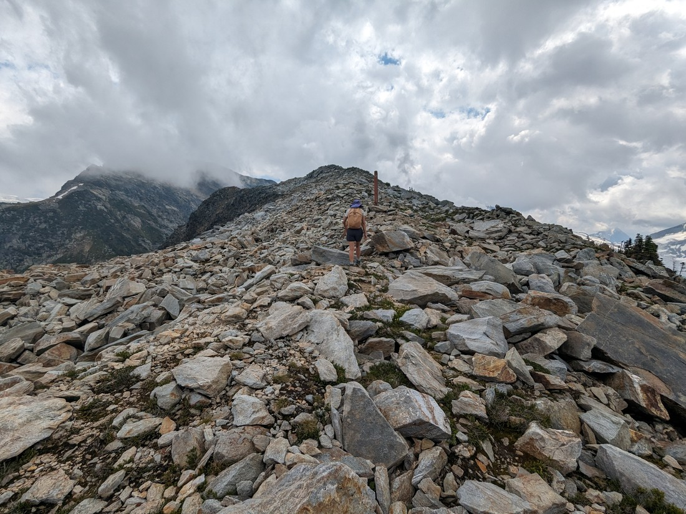

Well, this is it. This is our last day of (planned) travelling. Today we're heading for our final destination in Kelowna where we will decide what to do in our near future. But before that, there's still the near, near future. What to do today?

I was itching to get back to Glacier National Park. Sure it was a 45 minute drive in the wrong direction, but it felt like we hadn't truly explored the place when we visited back in June. We didn't even see any glaciers. Well, perhaps it is time to fix that.

> Assuming the clouds don't get in the way

But this is the park that is known for it's steep hikes. Betty took some convincing that this is how we should spend our day. So this time I tried a new trick - I didn't tell her exactly how bad it was going to be.

> "What was that?"

Well, that's a bit misleading. We didn't know how bad it was going to be. We actually started the walk without having decided where we were going. But we had narrowed it down to one of two options.

My original plan had been to hike the Asulkan Valley. This would be a walk up a valley, with a steep part at the end to get to the foot of a glacier. This was a "moderate" hike that would take about six hours. But while applying sunscreen at the start of the trail I read the sign and noticed that most of the "hard" hikes also take six hours. "Glacier Crest sounds pretty good too," I thought to myself. That trail would instead take us up the side of the valley to a ridge. This trail would be shorter but steeper.

Ultimately we decided to do the latter because it sounded like we'd spend more time above the treeline, and therefore be able to see more without pesky trees getting in the way. Also, being a ridge we should get views into two valleys rather than one - that's 100% more valleys than the Asulkan trail.

> There was also this sign advising to watch out for cannon fire

Back in Revelstoke it had been quite warm when the sun was out. Too warm perhaps - well, it is mid-summer after all. I suppose Glacier National Park is the place to be on such days. It must be at a higher elevation because the temperature is significantly cooler here than in Revelstoke. It's probably a good thing we didn't camp here because the overnight lows are very low indeed.

Of course, it still felt too warm when we turned onto the Glacier Crest trail and began making steep zig-zags up the side of the valley.

And this was our life for the next hour or so. This is what we get for wanting to be up where the views are nice. I looked up the distance while writing this blog and unless we turn back prematurely, we will have walked only 12.7 kilometres but will have climbed... 1,109 metres of elevation!

Okay, that was more than I thought.

It turns out I might not have just been lying to Betty on the day. I knew the climb would be long but I didn't realise it was higher than Grand Canyon. Also, it was not a gentle climb. The first few kilometres were basically flat so at some point it was going to get very steep.

You can probably tell from the pictures that the weather forecast was not perfect for today. The prediction was cloudy, but clearing as the day wore on. We deliberately hadn't set off too early so that hopefully there would be more blue skies when we reached the apex of our hike. Compared to when we set out (see first picture) there did seem to be less wisps of cloud below the mountain peaks, but there was still a lot around.

> Some peaks are still hiding

Eventually we passed the treeline and were walking over rocky terrain with views of the Asulkan Valley. Along the far ridge was a glacier of some kind. We could see the meltwater flowing down the cliffs.

> How much water can a glacier lose before it is gone forever?

It is really nice being back amongst white peaked mountains again. Sure, Banff and the Kananaskis were scenic but at this time of the year the hills were just too grey. I also still aren't sure if I can tell what is snow and what is glacier ice. Perhaps both are up here?

This wasn't the shortest walk - it was projected to take six hours after all. Eventually we were climbing a particularly steep section when we spotted a post ahead, sticking out of the rocks.

> I assure you there is a trail here somewhere

Well we got to the post and found that it said "END OF TRAIL".

What? This is where the trail ends - in a bunch of rocks seemingly still half way up the hillside? What is it with trails in this park just randomly ending? Like the Great Glacier trail we hiked in June we did have some views, but they were mostly just what we were seeing since leaving the treeline.

On the way up we had been overtaken by another couple with a dog. We hadn't seen them again so presumably they were up here somewhere too. Well, we spotted them sitting on some rocks to the east.

You know what we found? The Great Glacier. You know, that glacier we couldn't see in June - well it turns out it wasn't where we thought it was. We had been looking up to the peaks in the east, but it was actually south of us all along. And sure it wasn't the most eye catching piece of ice we've ever seen but it did feel really special to be up here staring down at it.

And I have mentioned, this was a ridge - which means we also got views of the Asulkan Valley too. We think we can see where the valley trail led to, near the base on the glacier and we agreed that we definitely made the right call. I'm sure there is some niceness about being close to a glacier but it wouldn't have compared to the panorama up here.

It was also nice that we basically had this ridge all to ourselves. Of course, even if there was 100 people up here the ridge was large enough that it wouldn't have felt crowded. There wasn't any obvious place to sit or take photos from - just pick a rock and stand or sit on it.

> There's a tiny pika on top of the rocks in this photo. Or maybe it was a chipmunk - it's been a while and neither the photo or my memory is clear.

The clouds also hadn't cleared as much as I had hoped. They still seemed to be clearing but even if we stayed until the evening we weren't going to get clear skies. However had it been sunnier then it would likely have been hotter to climb. Perhaps this is ideal hiking weather - mostly cloudy but with patches of blue to remind us that the sun in up there somewhere.

I still wonder why the trail stopped here. The ridge kept climbing for as far as we could see. Perhaps the very top would be too much for day-trippers. Perhaps it gets overly technical or dangerous. We were a bit curious, but not serious about it. Six hours of hiking (probably more) would be more than enough for us today.

> My aching toes say this is high enough

I like to think that we save the best for last on our trips. Four years ago we (by chance) discovered an epic trail on Whistler mountain on our last afternoon. 17 months ago we spent our penultimate day on the Routeburn Trail, a hike which is still our longest hike to date.

Okay, perhaps Glacier Crest doesn't quite deserve to be spoken in the same breath as those memories but it still represents a culmination of ambition and ability that grows while we travel. I was trying to pick a favourite hike from the last three months. I haven't decided which, but it won't be Glacier Crest. However, that is only because we have had quite a number of excellent and memorable hikes since arriving in Vancouver back in April. We might not have left the best to last this time but it certainly was a good one.

On the way to Kelowna I found out that I would be getting my first interview for a developer role. I'm not expecting to land the first job I interview for but I have to start somewhere. Hopefully there will be more that follows this one and that I'll find somewhere I like.

I plan to write at least one more blog in this series of blog posts. Sure, there will be more eventually but what they are and when they are written will depend on what we get up to after Kelowna. Until now we've been travelling according to a plan that has been a year in the making. In a week we'll be without a plan, effectively on our own - and I'm not sure how I feel about that yet.

