On June 18 we arrived in Kelowna. It has been 86 days and 82 blog posts since we set out from New Zealand. Its been a confusing time these last few years. This trip is supposed to be a "working holiday" but what we needed first was the "holiday". After our 2019 trip we knew what we liked, and what we wanted to do. So we did that. I don't think anyone can deny that we've achieved what we wanted.

We successfully acquired the necessary gear and car in Vancouver. We visited basically all the canyon parks of southern Utah and northern Arizona - even the ones we'd been to before. We explored the state of Colorado. We visited Mount Rushmore, plus three more US national parks. Then we visited, hiked, and camped no fewer than eight Canadian national parks in or near the Canadian Rockies. We've seen wild animals aplenty, including seven wild bears. We even had time to fit in a couple of movies.

So what's next? We now had seven days in Kelowna to figure that out.

What we really would like is jobs, but that's a bit hard to organise in seven days. Sure, we'd been sending out some applications over the last few weeks but most hadn't led to anything. Perhaps our hearts just hadn't been in it yet. But that was then. Recently I've noted in a couple of blog posts that perhaps we have now exhausted our lust for hiking and adventure - for a time anyway. There's only so many trees a person can see before they say, "I think I'd like to go home now."

But first, let me tell you about Kelowna.

We'd booked through Airbnb a room above a garage up in the hills of West Kelowna. To get back to town it would be a ten minute drive - longer to get to regular Kelowna. I picked the accommodation because it was relatively cheap and likely to be quiet and peaceful - like some of our favourite camping sites. There we stayed for most of the seven days, relaxing and unwinding after so much travel.

We took the opportunity to actually cook ourselves meals. Of course, it was mostly pasta and stir fried meat and vegies on rice because we only had a limited kitchenette. But it was a welcome opportunity for a little normality.

Also it was quite hot outside. Temperatures reached 35 degrees Celsius in the city one day.

One thing we liked about the place we stayed at was that it came with a cat. The only problem was that it was a skittish cat. I told myself, "But I'm good with cats. I can make cats love me." So the afternoon of our second day, after Don (our host) had gone out, I put my plan into action.

By just standing there.

The plan was to just stand around talking regularly, every so often taking a few steps closer. Eventually he would see that I was no threat. This plan took 15 to 20 minutes to implement. It took so long that Betty got bored and left and I had to continue the plan alone, talking softly to no one but myself. Well, the plan ended up being a success.

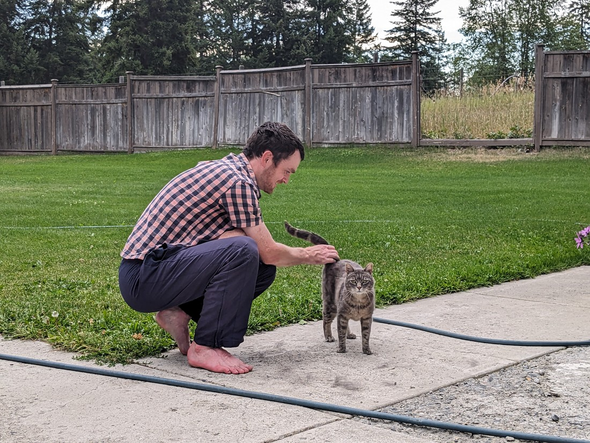

Once I got within five metres, the cat came to me. It turns out it actually likes a good petting. And boy did he need one. Every stroke I made resulted in big globs of fur coming loose. As I sat there I collected it all up:

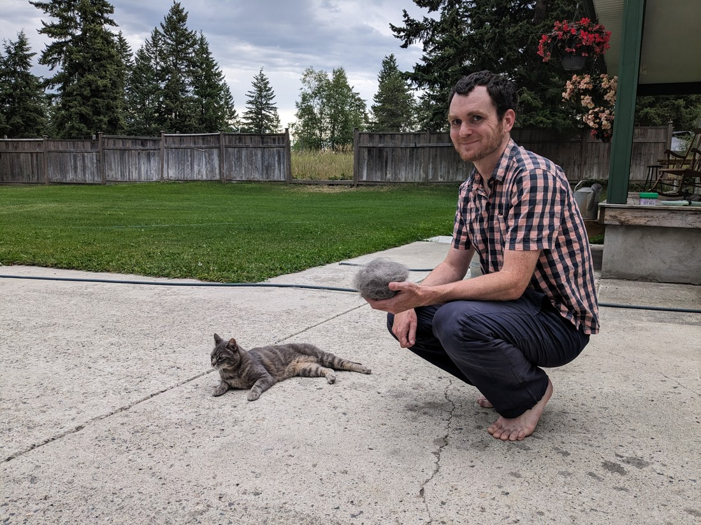

I sat there for quite a while. Cats usually get tired of petting at some point but this one just kept wanting more. I got a bit bored. So I decided to make a cat hat.

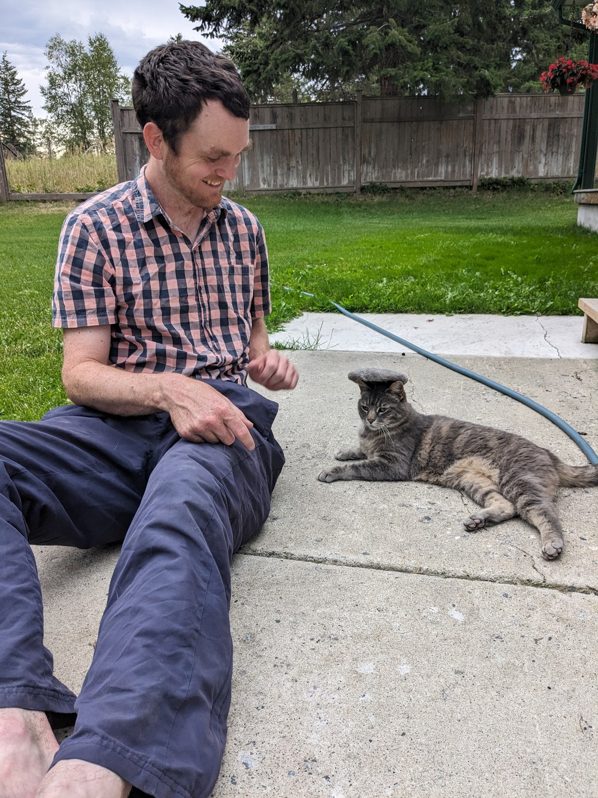

> That's a hat, made out of cat, on a cat

And I continued petting. This guy had really needed a good brushing, although there was a lot less fur coming loose now. Also, I kinda wanted some credit for my good work. I wanted to be able to show his owner what I had done

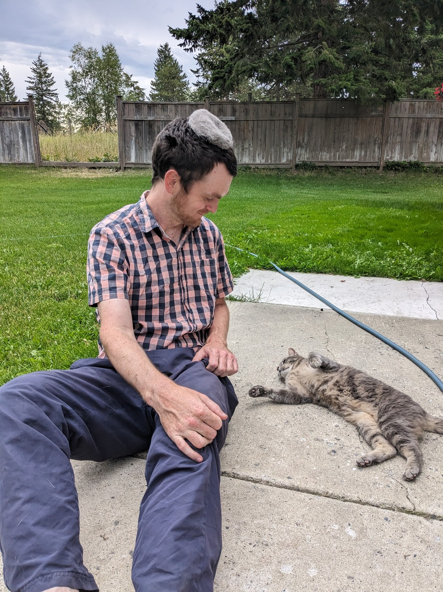

> Not such a good hat for a human

Well soon Don did come home. He introduced LT to us, revealing the cat to be much older than I had predicted. He also commented several times over the next few days that LT now looked so much smaller after the attention I'd given him. Well, yeah - he's lost a lot of hair in one afternoon.

The next day I made sure to give LT some more attention.

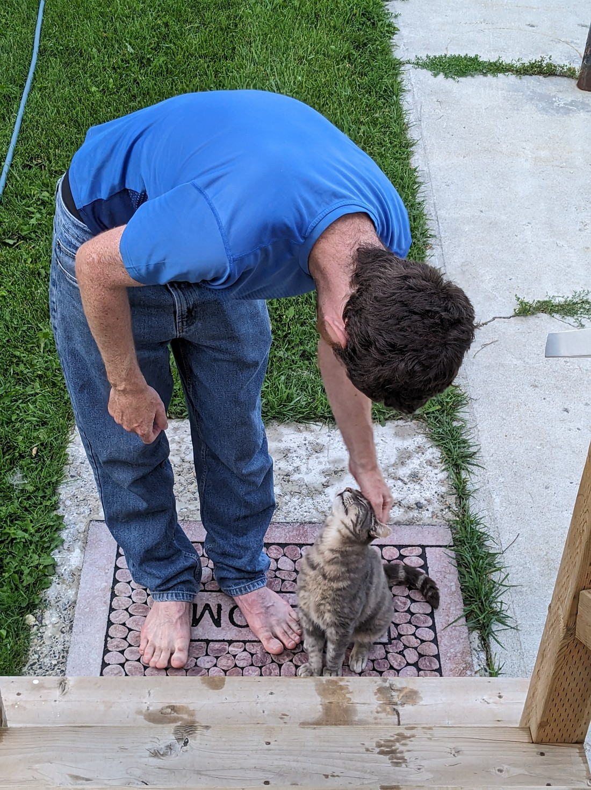

Like yesterday, he was pretty insatiable. Here he is petting me when I seemed more interested in my phone:

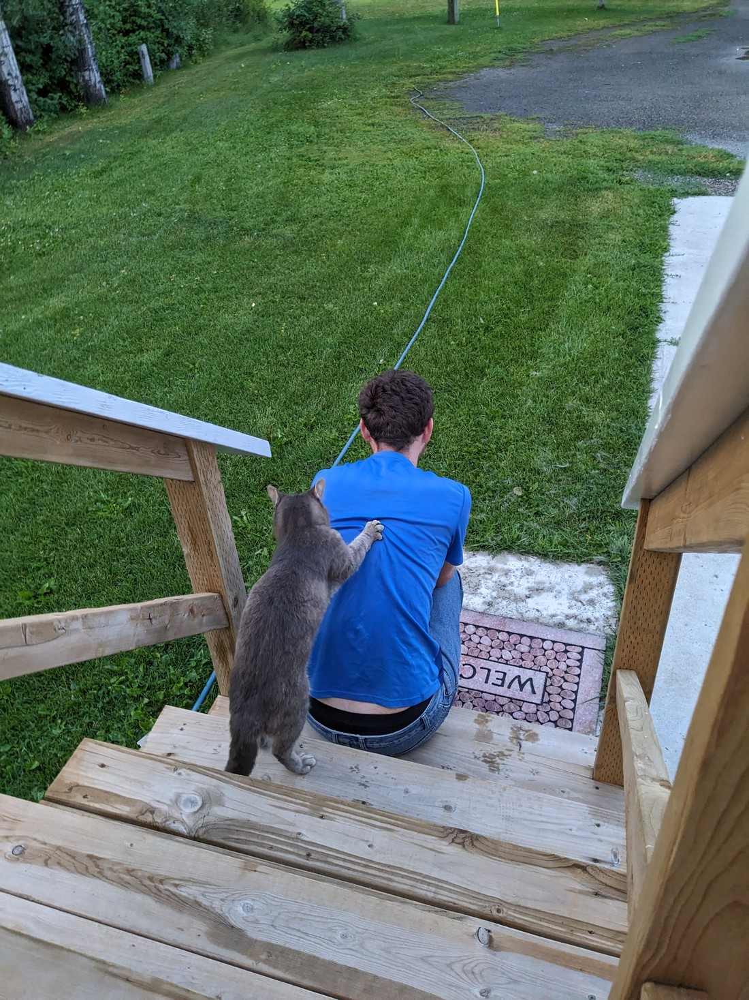

As I've noted before, it's so nice to be around cats again. We've never considered getting a cat, with Betty and I both having various degrees of allergies. I can confirm this still to be true as every night I seemed to be sneezing and nose dripping. It was nice when our parents had cats, but those are now all gone too. Perhaps this is how we ensure we still have cats in our lives - by travelling round staying with cat owners.

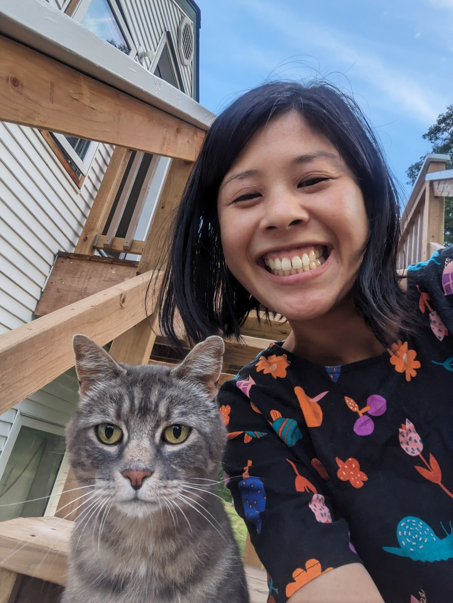

> Ignore that worried look LT is giving - somehow he just always looks like that in photos

One of the places we visited while in Kelowna was a local market. Part of the reason we went was because apparently they had a "chick holding station". Unfortunately it was overrun with kids when we arrived - so we walked around. We then realised that we don't actually care for local markets because there was nothing else that caught our attention.

Fortunately all the kids were gone when we returned.

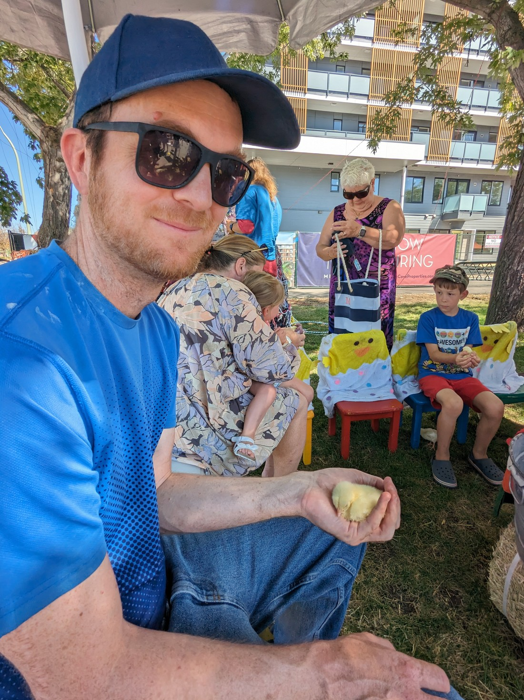

The person running the stall had a bit of a spiel. "If it falls asleep, that means it is comfortable."

> Boy did they love to fall asleep

Also, "If it pecks you then that means it likes you" - which sounds dubious. Is that just a way to make kids less afraid if they get pecked?

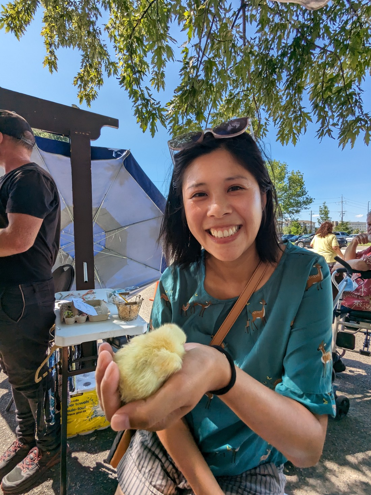

> Fortunately there was no pecking

But it wasn't all petting and holding furry animals. We did do some hiking.

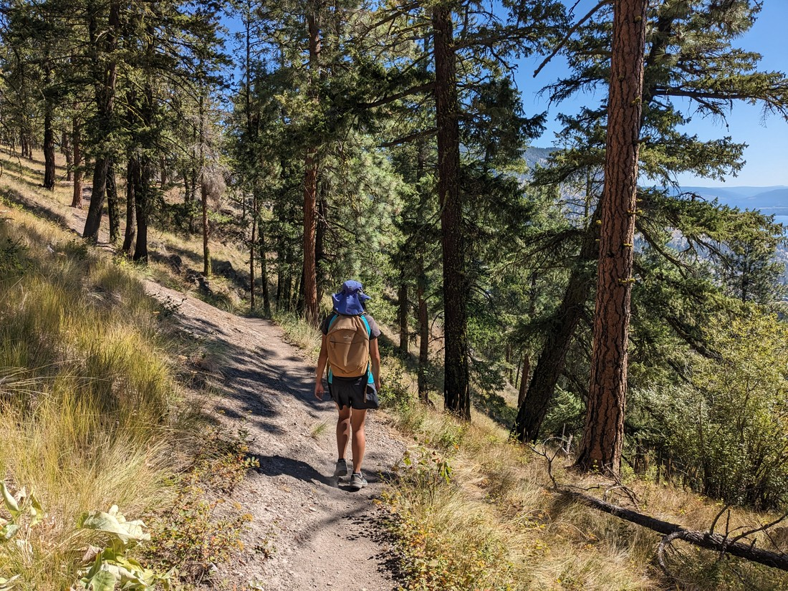

Don recommended a trail called Pincushion Hill, named because the hill resembled a pin cushion. That sounded more interesting than your average hill. But as we hiked we didn't get the feeling that it looked like a pincushion. But then we realised that we had no idea what a pincushion actually looked like.

At the top of the hill was a rather scenic view out over lake Okanagan.

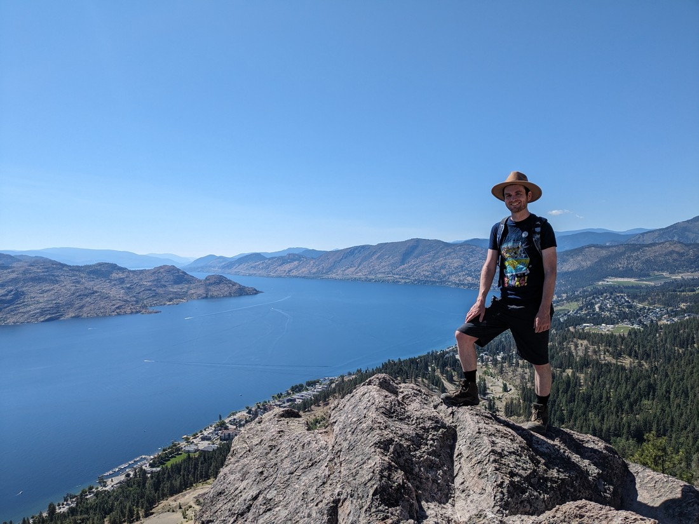

Okay, enough chit-chatting. So what does Luke and Betty want to do now?

Do we want to do more holidaying? We don't have to settle down just yet. It's the middle of summer - we could keep travelling and hiking for quite a while.

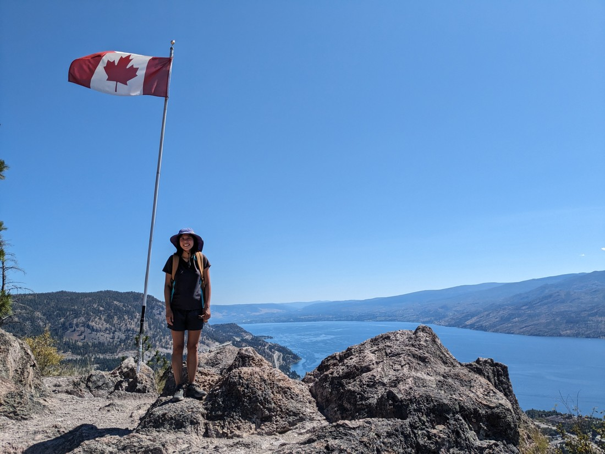

Ideally we would start jobs but that's harder to do than just deciding we want to do it. It's still early days in the job search. It may take time and there's no guarantee we can control how long it might take.

Unfortunately at the moment we don't really have any definitive direction. Do we stay in Kelowna? It's a nice enough city (although hot right now). But it's also not a cheap place to live nor a place where we could easily find jobs.

So what do we do?

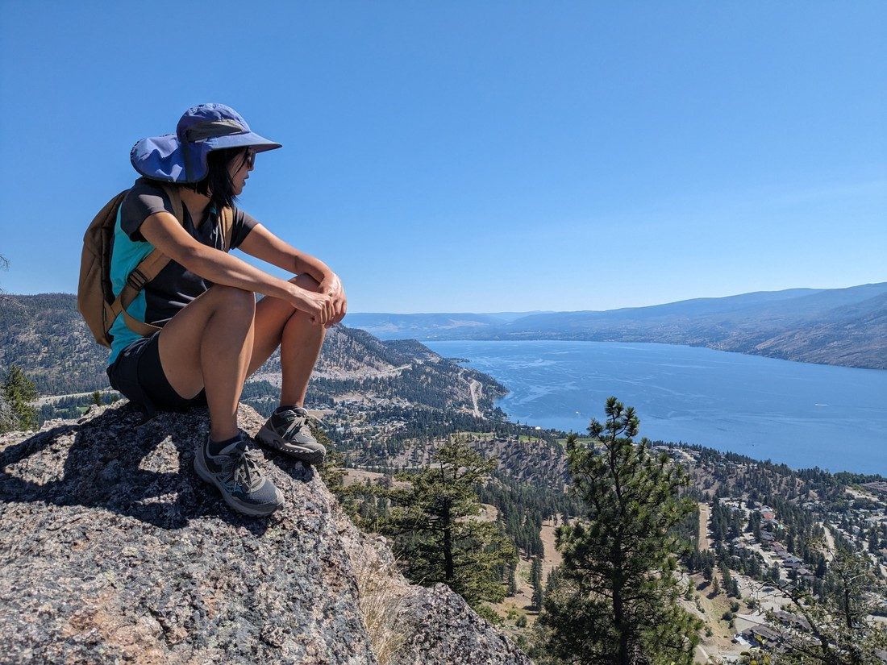

Thanks to this uncertainty this was not the most fun end to our holiday travel. Early on it had been fun but now that reality is crashing back down, it has put a bit of a dampener on our fun.

What has this trip all been about? Well, we know we've enjoyed basically all of it. Why does it seem like that enjoyment is being tainted by the uncertainty about what comes next?

I guess right now we don't know how to feel about our time in Kelowna. If we go on to land jobs and have an enjoyable time in Canada then our feelings right now will have been not for nothing. But right now we just don't know.

So what comes next? Well, there's no point staying still. There were a few things on my "Canada bucket list" and travelling coast to coast was one of them.

So we're hitting the road - but things are going to be different. Since arriving in Canada I've blogged about basically everything we've been up to - even if it has taken me weeks to get round to typing it all up. Well, I'm not going to do that from now on. The next few days/weeks/months aren't likely to live up to the pre-planned holidaying we've been up to recently. We also don't want to feel obligated to do fun things so they can be blogged about. From now on we're job searching, but at least we'll get to travel while we do so.

So that basically sums up our trip until this point. To finish I have one last story, and it's about LT.

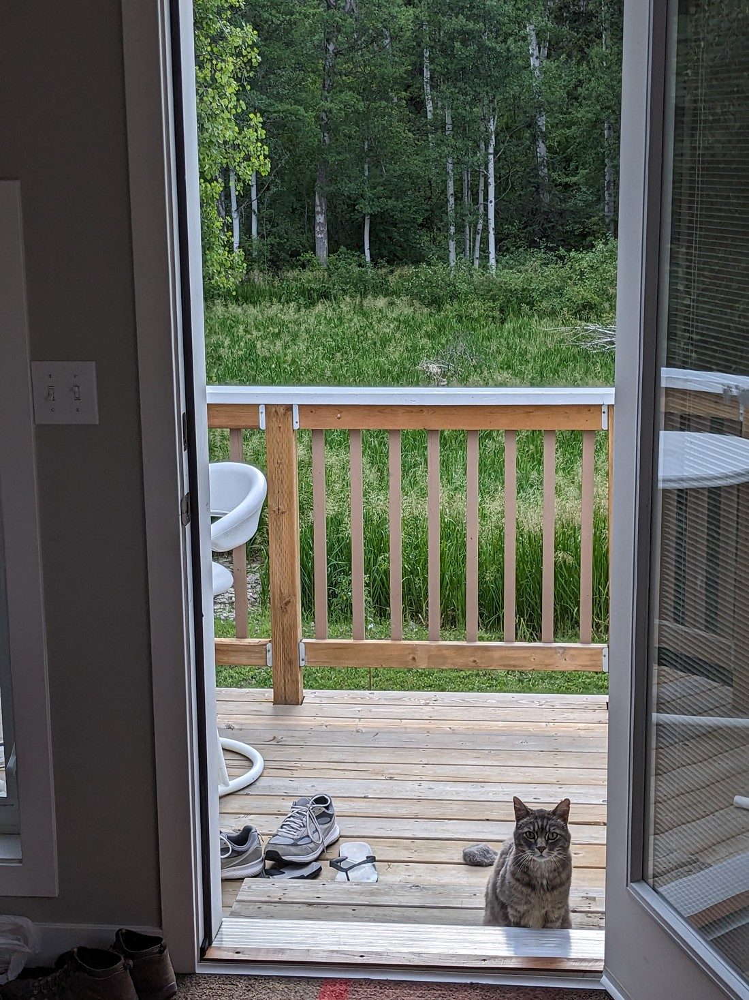

Don told us something confusing about LT - apparently he's an outdoor cat. Huh? Then where does he go during the day? Well, Don explained that he doesn't even like going inside. Okay, what does he do in winter? Cats don't exactly love snow. Well Don explained that LT lives in a chicken coop and Don runs a cable out there to give LT some heating.

I guess this gives two reasons why LT is moulting so much. I suppose it makes some sense that cats can grow extra fur in the winter based on need. Poor LT - he must grow all the extra fur he can. And because LT doesn't come inside then he probably doesn't get the attention from Don that he deserves.

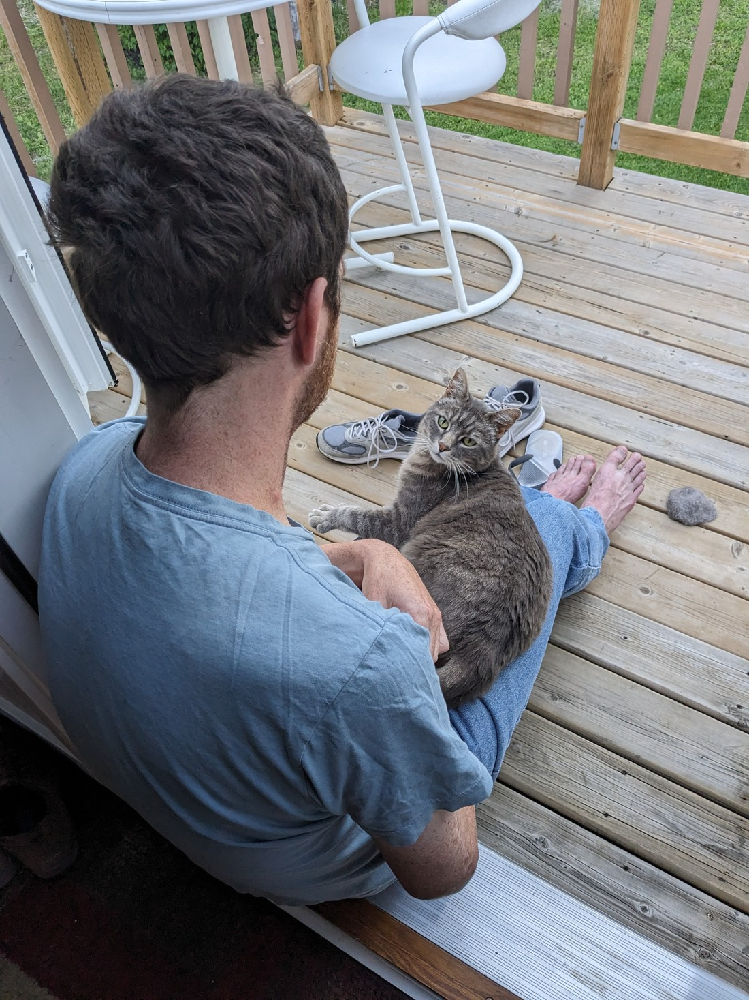

That is until a couple of cat loving travellers came along and won him over. No longer did LT spend his days sitting at his master's doorstep. Instead he would climb the wooden stairs to the doorstep above the garage. Those travellers might not have given him all the attention he ever wanted, but they gave him a lot. And when they showed apparent indifference as to whether he came in or not, LT was allowed to make his own decision about whether he was an outdoor cat or an indoor cat.

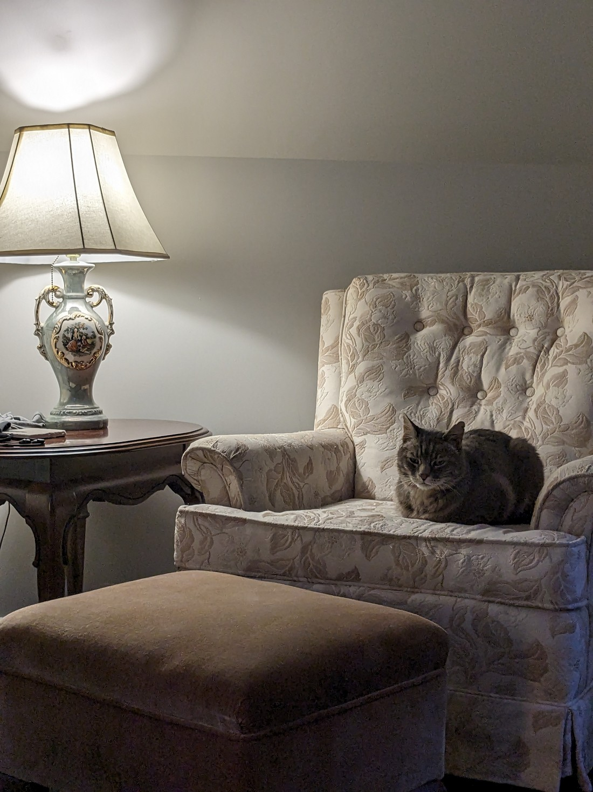

But unfortunately the travellers had to move on and LT had to stay. He had a job to do, keeping the section free of mice. And the travellers had to find themselves jobs to do.

Perhaps one day their lives will cross again.
