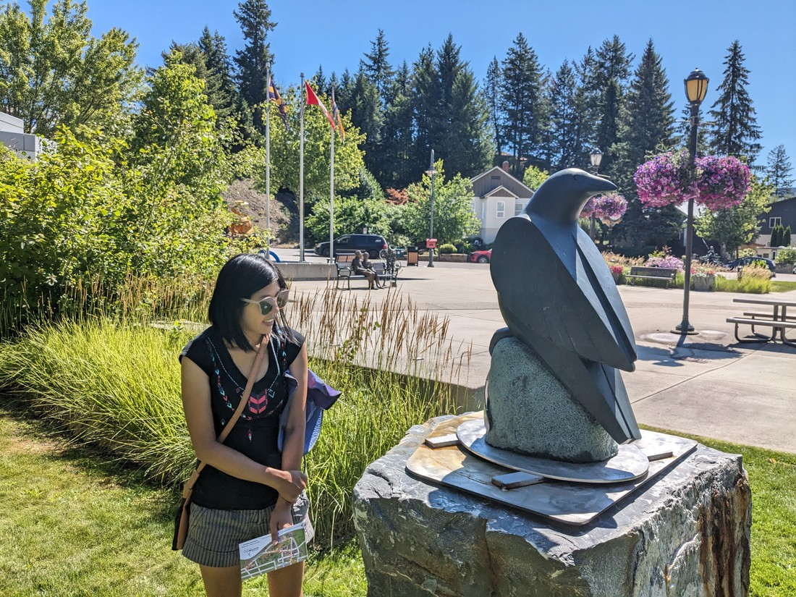

Welcome to a new series of blog posts. It picks off where the previous series finished, but things aren't likely to be the same as before. Instead of detailing our daily activities from now on I'm just going to pick out bits that seem interesting, or will warrant remembering.

To summarise, we've decided to start driving across Canada toward the Atlantic Ocean. This is mostly to give us something to do while we figure out how and where to obtain work. It wasn't the best plan because if we end up getting work in Vancouver then every day we drive is a day we'll have to drive back. But there's something (usually) relaxing about open road driving that would handily keep our minds off why potential employers aren't getting back to us.

We took Highway 3 through southern British Columbia instead of doubling back along Trans Canada 1. Here's a list of notable things we encountered:

- Our campground for the first night was a park alongside a soccer field, complete with a local team that came to practice in the evening.

- The road climbed through and over a lot of hills. They weren't mountains, just hills - but steep and big enough that our poor car struggled a bit. This road must get pretty icy in the colder months.

- Our check oil light came on the next day and we made a stop to "The Great Canadian Oil Change" - which is a drive-in business that specialises in such things. There's a lot of these types of business about here, but none back in New Zealand - and I'm not sure why.

- We passed through Cranbrook again - weirdly it looked a lot different because we were entering from the opposite direction.

- Our second night was in a provincial park

- On our third day we stopped at Lundbreck Falls again, because it was a good place for a rest

We drove quite a lot each day to get through British Columbia. I figured we'd be more interested in spending our time in new provinces rather than familiar ones. Of course this was potentially silly as it sounds like the mountains of British Columbia are perhaps the most geographically interesting part of the country.

There was one place where we did stop - the town of Castlegar. I had googled "things to do" and a place called Zuckerberg Island came up, but we couldn't go there as it was closed for reasons unknown. By chance I read about a sort of sculpture walk in the town, but details were a bit scant. We decided to check it out anyway.

The gist of it was that this region likes to host a sculpture contest every year. The winner is decided by public vote and their prize is for their sculpture to be bought by the city and put on permanent display around town.

We spotted some sculptures so we pulled over. Nearby we found a box with a guide, map, and voting papers. So we went for a walk round town, judging the work of local (and some not so local) artists.

This was one of the first sculptures we saw:

> "A collaboration between the sculptor and his teenage son (aged 13), Rufous is a study in capturing weightlessness and movement through the medium of steel."

The beak must have been quite strong because it held the rest of the bird in mid-air. I don't know how sturdy the whole thing was but it was certainly a clever design. I think Betty and I both thought, "Well almost certainly this one will be our favourite."

Well the joke was on us - generally the other sculptures were extremely good too.

> "The whimsical Toy Bear evokes childhood toys which filled our hearts and imaginations with joy and wonder. Growing older is mandatory, growing up is optional! Run, laugh and play and remember the joy of just being."

> "A statement on the fragility and resilience of nature, Crude Accommodations depicts a hermit crab making a home from a discarded oil drum."

> "Reminiscing, which beautifully portrays a relationship rooted in history and depth, fulfils the sculptor’s love of sculpting people and catching them in the moment."

> "A beautiful pairing of chlorite and bronze, The Raven’s Message depicts the magical and mysterious creature, a cleanser of both land and mind. The feather the raven has dropped is a message to humanity to take heed and to look for the answers that the raven has given clues to."

> "Egghead comfortably sits with his eyes on the book while projecting a pensive expression. Egghead is a tribute to all people who are excited by a good book."

I often complain about that modern art doesn't often resemble the thing it supposed to resemble. Well, not these sculptures.

There prices ranged from $3,000 Canadian to $50,000 - not too bad but still well outside our price range. But we could still participate in the voting process for how much of the city's money would get spent. Very quickly we realised we were going to have different favourites so Betty and I filled out separate forms. Unfortunately I didn't take the best photos of the sculptures that we ended up voting for.

Betty's favourite was called Willie Ketchit - a scene more than a sculpture, with some dad-like puns for the names on the letterboxes.

> "Crafted from steel, fibreglass, rock and epoxy, Willie Ketchit skilfully portrays a Great Horned Owl with immense wings and huge, curved talons as it attacks a defenceless bunny which relies only on speed and agility. Will he catch it? Nature is beautiful but for most, it’s simply survival."

Luke's favourite was one called Lost Adrift, because of it's sheer size and ancient diving suit inspired design - and hopefully not because it was a very "womanly" figure.

> "Lost Adrift is meant to challenge the viewer with ideas around resource extraction, environmental degradation, and the sometimes, bleak vision of mankind’s complacent march into a future of uncertainness."

But despite the excellence of the sculpture designs, there was one piece of art in the town which Betty would have voted for if she could:

The bins here had foot pedals to open and close them - a fun way to keep your hands clean and encourage people to dispose of their waste.

It took only two nights to cross through British Columbia. I think it is recommended to take at least two weeks when crossing the country. We haven't booked much more than a week ahead of us so at this stage we don't know how far or fast we'll go.
