After a couple of days of driving through British Columbia we emerged from the mountains into the wide open plains of Saskatchewan and Manitoba. I looked it up later and apparently it is called the "Great Plains" and this is an accurate name. We spent five days driving through these two provinces and I don't think we saw a single hill.

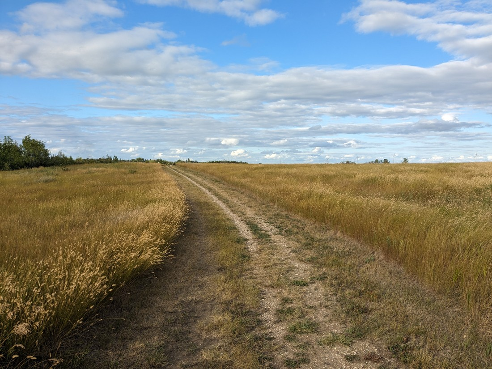

> To be clear, this is not the road we were driving on

I will note that there is a third province which shares the Great Plains - Alberta, but somehow we basically skipped it, crossing it in less than a day. While Alberta is a big province, the part near the USA border isn't as wide.

For a road trip, the plains are really easy to drive through. The roads are straight and flat and the highways have a higher speed limit than elsewhere. We also took a fair number of back roads to get to specific places, which were thinner and at times had so many bugs hitting our windscreen that you would have thought they were raindrops. Often I might have called this type of driving "boring", with no variation in the road or scenery, but I don't know if I felt that way this time.

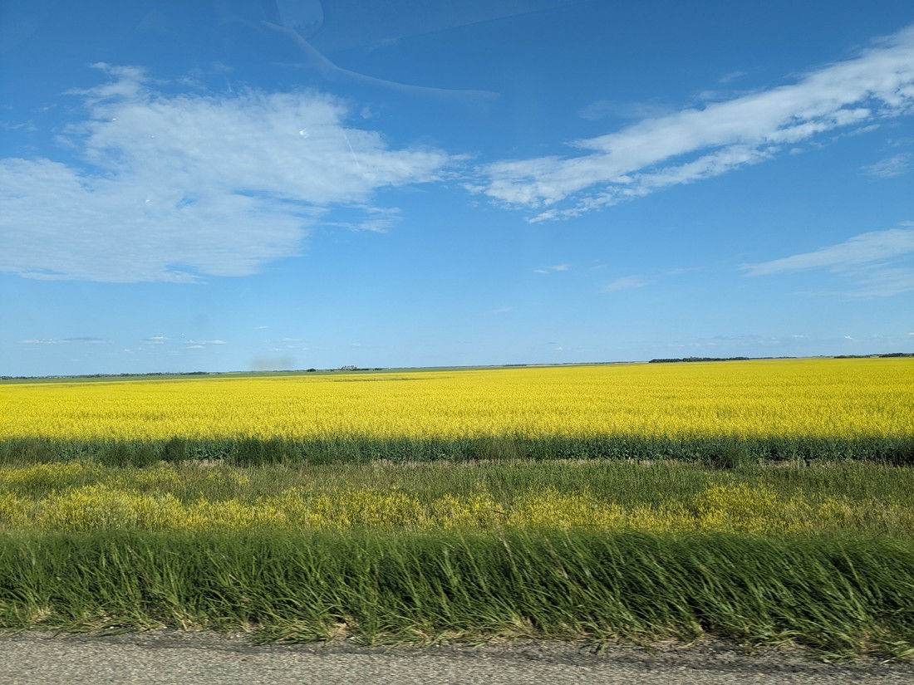

Instead they were relaxing. While driving we chatted, and listened to audio books.

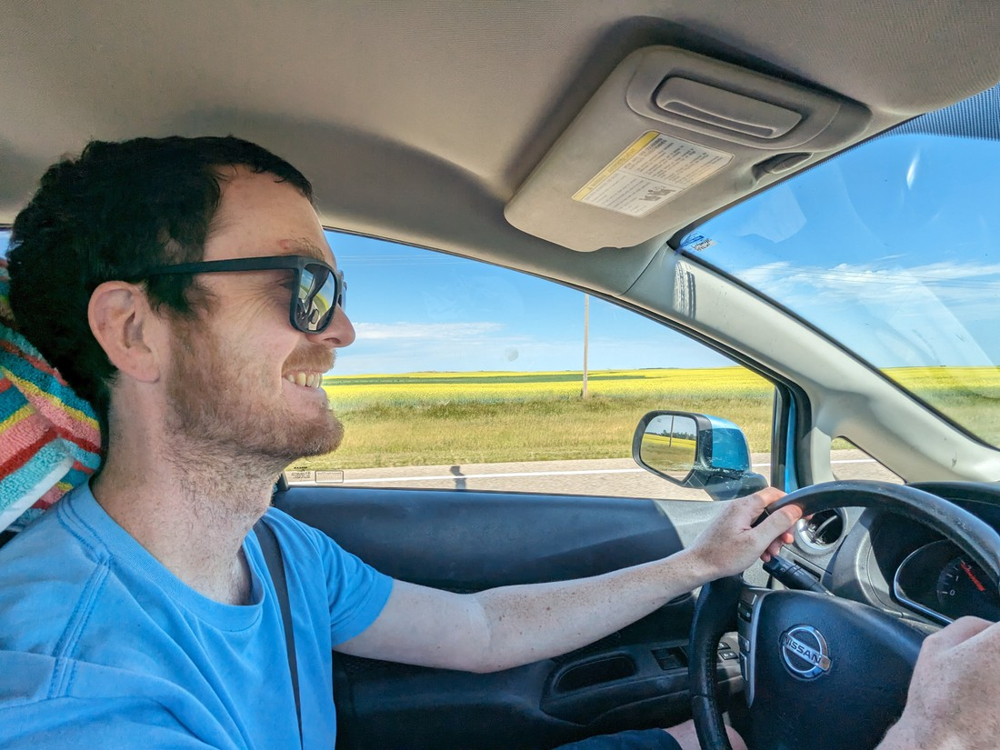

And here are some notes about some of the things we did see:

- We arrived early in Moose Jaw so we walked round the city, staring at their old buildings. Having extra time to kill we checked out their library - which was also an old building.

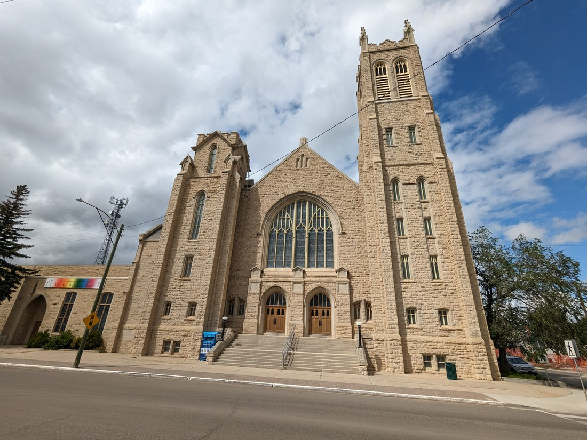

> To be clear, this is not the library - just a fancy building I decided to photograph

- Moose Jaw is known for their murals, although they weren't nearly as inspired as the artistic sculptures we'd seen in Castlegar a few days ago.

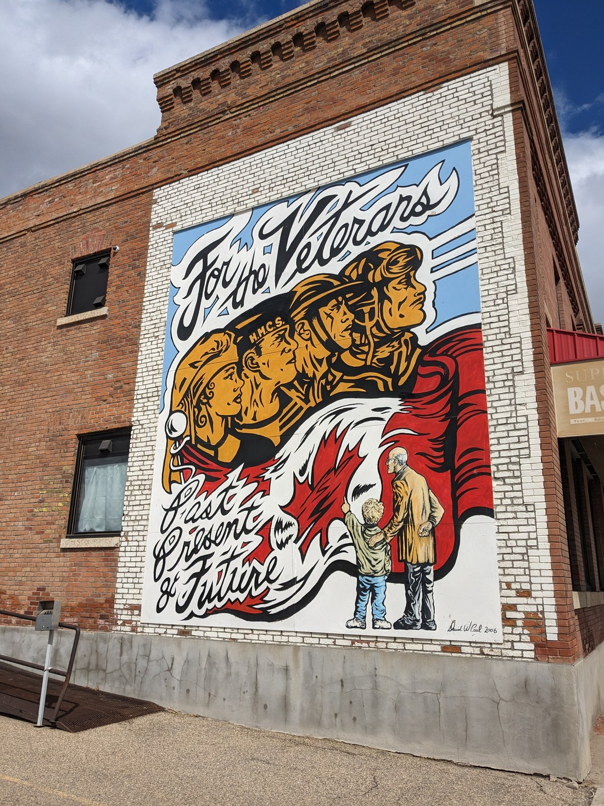

- Our campground was situated along what is known as the "Trans Canada Trail". This is a 24,000 kilometre system of paths crossing Canada, and we can now say that we've walked (part of) it.

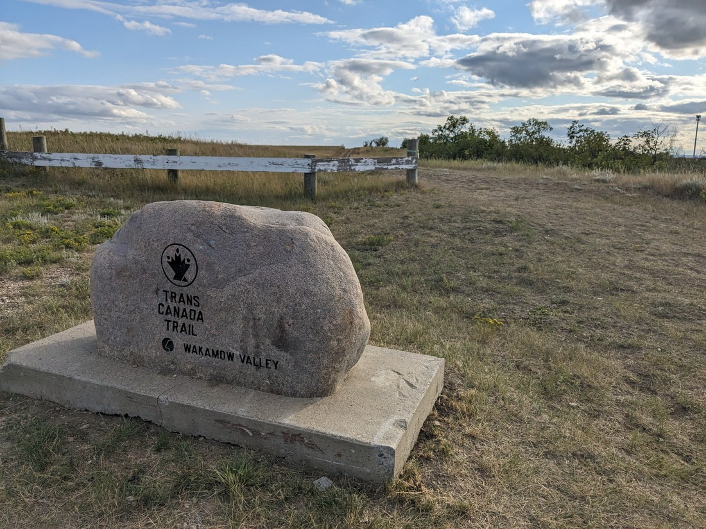

- The sunset time keeps changing as we head east. Each day the sun sets 20 minutes earlier and every three days or so our clocks get adjusted as we change timezones.

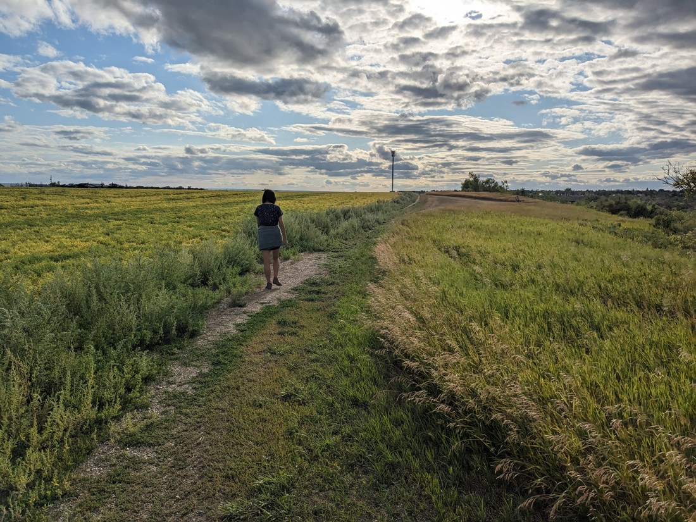

- We stopped in Winnipeg for a few hours to visit their IKEA (for eating) and also Assiniboine Park. There was also some info here about Winnie the Pooh, who was named after Winnipeg.

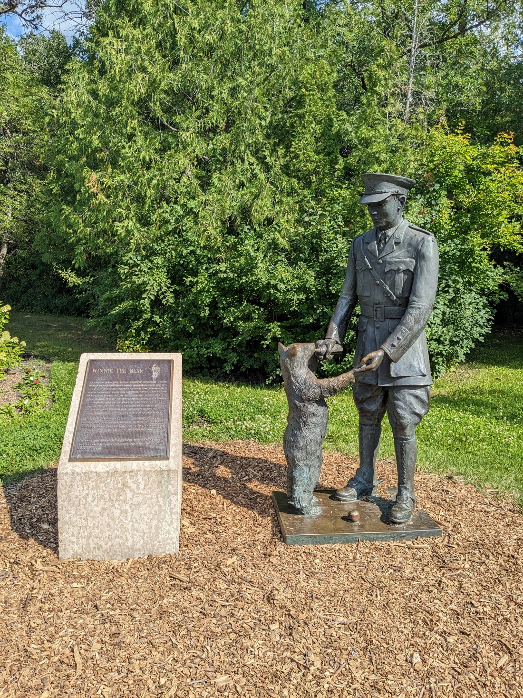

- During a visit to the library in Steinbach during poor weather we found two more Wheel of Time books in their used book sale for a dollar each - quite a lucky find. This means we now have seven of the books in the series.

- We accidentally missed the "Centre of Canada" sign just outside Winnipeg. Since it was busy and we were tired we just continued on. It's not even the true centre anyway - just the longitudinal centre.

But it wasn't all driving and reading/listening to fantasy novels. There were a couple of parks that we visited.

The first was Douglas Provincial Park, near Moose Jaw. It is known for its sand dunes.

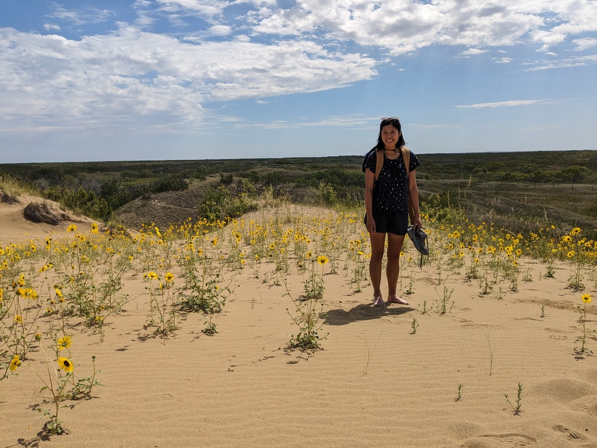

While I'm sure much of the area is sandy, the uncovered dunes aren't that widespread. We basically walked from one side to the other in about 15 minutes. It was surprising to find so many yellow flowers growing out of the sand. They certainly made it a bit more scenic than being surrounded solely by sand.

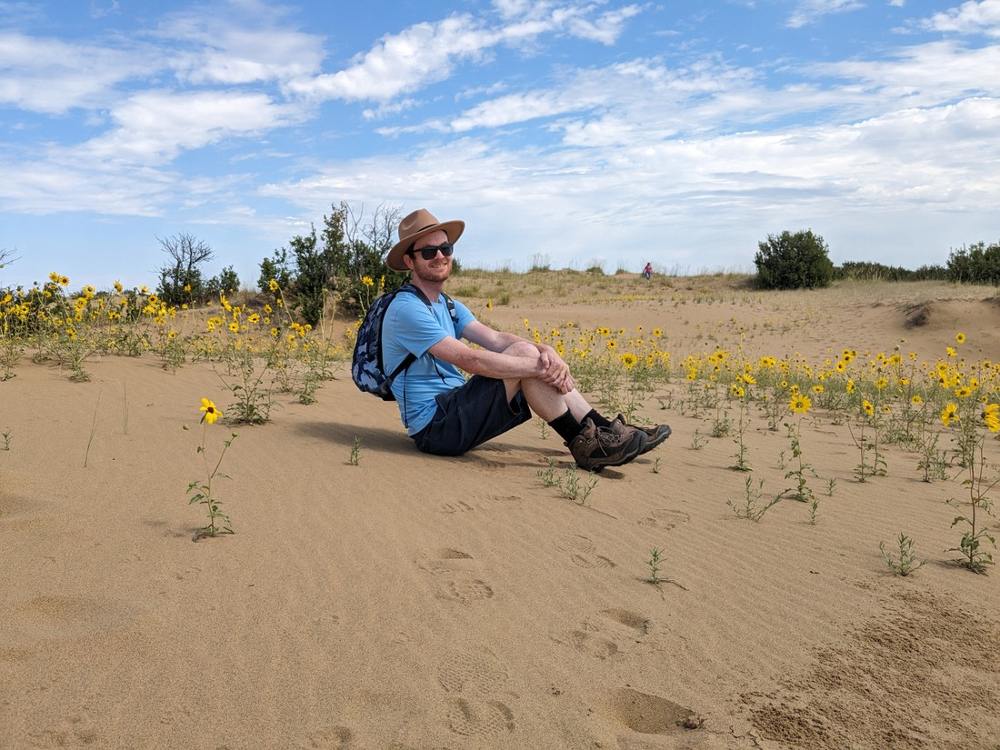

The other park we visited was Riding Mountain National Park. This is another park similar to Elk Island - a "Lake/Forest" type park. Apparently there is a "mountain" of some kind here, but you wouldn't think it. The land seems flat and lake-y in every direction.

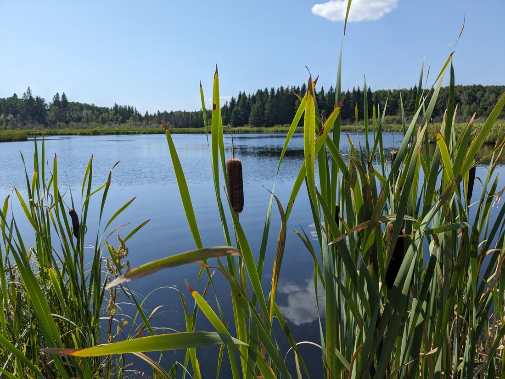

It was also quite hot with lots of bugs around - we didn't end up doing too much for those reasons. Though we did try one trail because we were specifically warned about bears in the area, but we saw no sign of them.

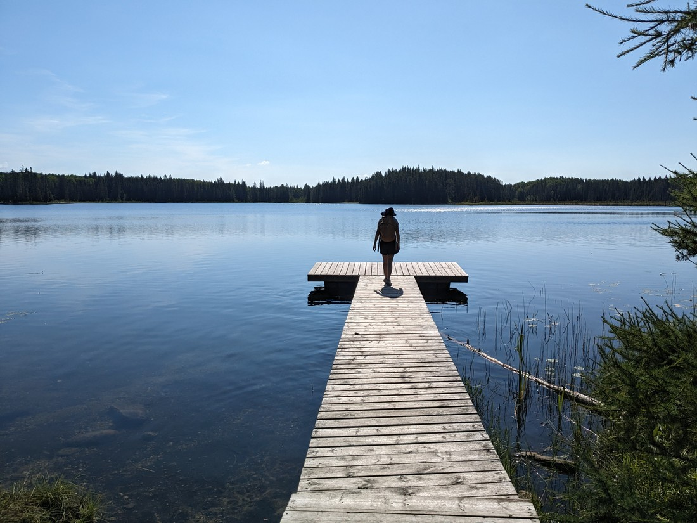

In summary, Douglas Provincial Park was a nice place to spend a few hours while Riding Mountain was more of a playground for those with cottages and motor boats.

After five nights we left the Great Plains. Throughout I'd been sending out job applications and I got my second interview for a role as we crossed into Ontario. The first one hadn't panned out so hopefully I will have better luck this time.
