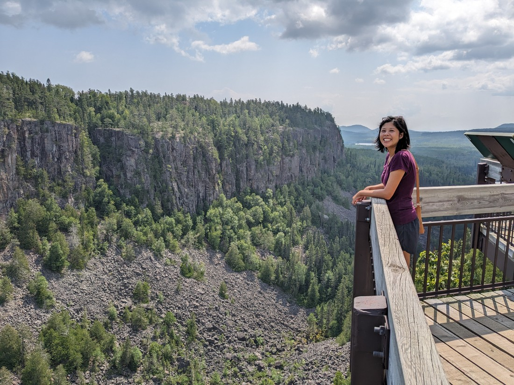

It was certainly obvious when we crossed from Manitoba to Ontario. Sure, there was a literal sign but the really noticeable thing was that the landscape changed. Since entering Alberta there hadn't been any forests alongside the road (except for when we detoured into Riding Mountain) but now that's all we were seeing. The road was also smaller with less traffic about.

The first thing I want to mention is that Ontario is huge, but also huger than it seems. We'd set off from Kelowna a week ago and crossed four provinces. We're now going to be travelling through just Ontario for the next week, and that wasn't going to quite bring us to the populated part of Ontario. This is why the roads are smaller now - there are very few towns in western Ontario.

There are two reasons for this lengthy period in one province. The first is that the speed limit for the highway is only 90 kilometres per hour. The second is that there are a lot of parks, so we plan to travel less and explore more.

As I mentioned the landscape was different. In addition to the forests along the roadside, there were frequently lakes too. Sometimes we would be driving alongside a lake on one side, then it would disappear and another lake would appear on the other side. There were also a lot of houses along the lake edges with private docks. I guess this is where richer Winnipegians come to get away.

Here's some notes from the first few days we spent in Ontario:

- Our first night was spent in Sioux Narrows Provincial Park. It wasn't all that noteworthy but it did give us that fuzzy feeling of camping amongst nature.

> There was a lake lookout trail that didn't have a lookout

> This little fella liked our tent too much and had to be moved, lest we stepped on him

- The next day Luke had a job interview with only a few hours notice so we drove to International Falls, a town on the border with USA. The local library had a handy room where he could do the interview.

- Betty discovered that the library also had a puzzle that was half-finished. When Luke came to get her after his interview, she was genuinely shocked to learn that three hours had passed.

- That night we camped out at Quetico Provincial Park. This park didn't seem all that popular, probably because it's in the middle of nowhere. Fortunately for us it meant we scored a campsite right by the lake.

> It makes a nice view, at least while the sun is still up

> After seeing so many lake parks I decided it was about time I went in one

- Speaking of "middle of nowhere", this was not the fastest route through Ontario. International Falls isn't on the main highway. Even though I booked it only a week ago, I cannot remember whether this was an intentional decision or not to take the long way. However we got to see some nice towns and camping places so it felt like a good decision.

- The next day we came to the city of Thunder Bay. Not too much notable happened there other than we visited two more libraries - that's now four in three days that we've been to.

- Outside Thunder Bay was Kakabeka Falls. Overall it was a pretty spectacular falls, although maybe it would have been more raging a month or two earlier. It also had a bit of an unfortunate brown tinge to the water, but that didn't detract from the sight.

> Kind of a curtain of water

> Lots of nice viewing platforms

- At Kakabeka Falls we walked around a bit (after all way had paid for two hours of parking). We found this arguably just as scenic waterfall

> I didn't say it was a good argument

- We camped again that night, this time in Sleeping Giant Provincial Park. This was quite a popular area, probably because it is on the shore of Lake Superior - our first of the Great Lakes. Unfortunately the skies were rather hazy this day.

- We tried to do some hiking in Sleeping Giant Provincial Park. The first walk was to a rather unremarkable point on the shore. At the trailhead for the second we found an empty carpark and soon after we discovered why, when we were swarmed with insects after walking mere metres on the trail. The trail looked nice (very lush and green) but we turned back within minutes because it otherwise would have been a very itchy experience.

- After Sleeping Giant we stopped at Ouimet Canyon. It was mentioned in the Sleeping Giant visitor guide and looked interesting. And it was.

> A better bridge than most bridges we find on most trails

> Interestingly this canyon's origins aren't exactly certain but it involved magma and an ice age

- We were supposed to deposit $5 in a box to enter Ouimet Canyon, but we didn't have any currency lower than a $20. So we went in without paying. Except the walk and views were quite enjoyable so as we came out we gave them a full $20 anyway.

> It was certainly worth it

And that's a summary of four days worth of activities. I think we struck the right balance here of sightseeing and job hunting, doing both on most days despite also camping each night. The next section of our journey would have been similar except it's a weekend. Weekends mean libraries are closed, but it also means that there's very few new job listings. This is nice because we can instead devote our whole days to enjoyable things.

Although, the libraries have come in handy in order to recharge our devices after we have been camping.
