I wasn't expecting much from Pukaskwa National Park. When booking campsites along our route I had noticed that while Pukaskwa had a campground, the sites were all first-come first-served (no bookings). That suggested to me that the park lacked facilities and therefore we weren't going to find much here - possibly because it was relatively remote, many hours from any major city. But after all it was still a national park that happened to be almost directly on our route so we decided to stop by today.

The day started as days often start in Canada - with a visit to Tim Hortons. Back in July we had discovered the Tim Hortons app, and that we could make our order through it. This meant that we could browse the menu at our leisure without having to stand in line. We also discovered that there were a myriad of different ways a bagel could be customised, other than just cream cheese. My favourite was adding tomato.

Well today the app couldn't be used to place an order, so we had to actually go over to the counter. It was also today that I found out how strange Canadians find our pronunciation of the word "tomato". Because of their closer ties to Britain I had thought that Canada would have adopted many British ways of speaking, but it seems they more follow the Americans in that regard.

Anyway, Pukaskwa is on the shore of Lake Superior. At the entry booth a ranger recommended us a couple of trails so we set off to try them. Upon arriving at the shore we were greeted with the sight of some gorgeous water.

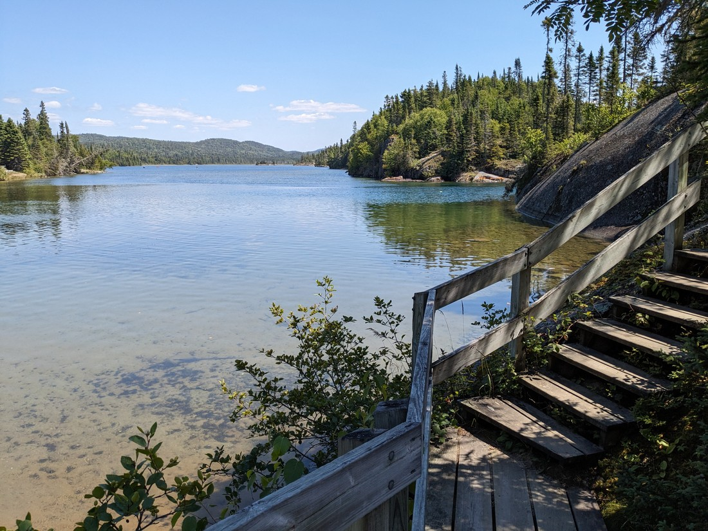

We also noticed that the smoky haze had definitely lessened. Yesterday we had seen the shore of Lake Superior, but today was much better.

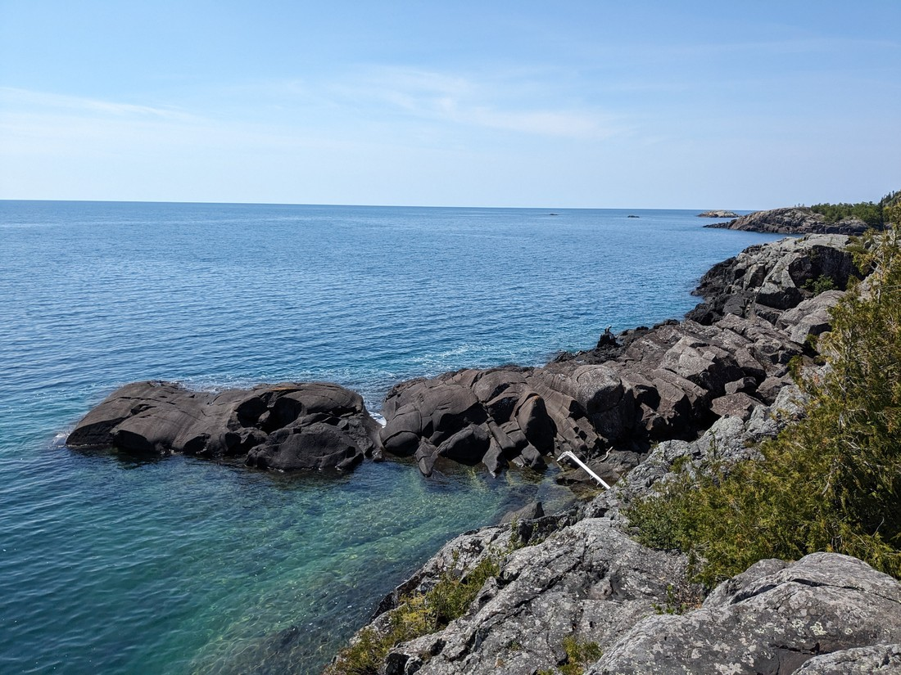

> You can actually see the horizon today!

And this is why Pukaskwa National Park is getting its own blog post. Sure, nothing all that special happened while we were there, but it just felt special.

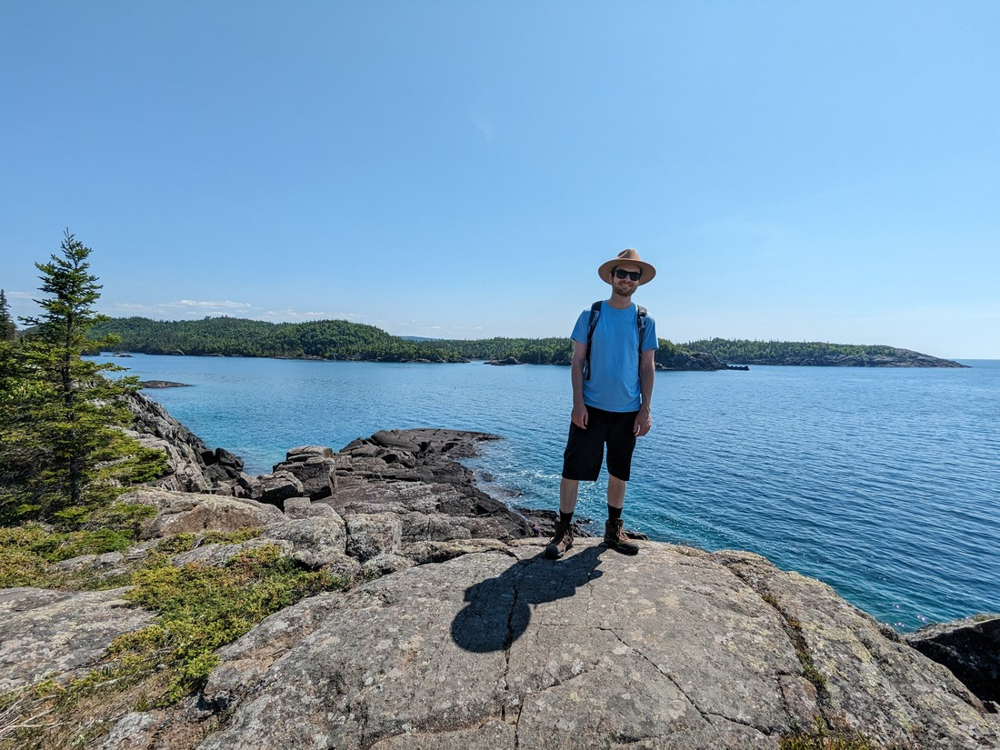

It also made us a bit goofy

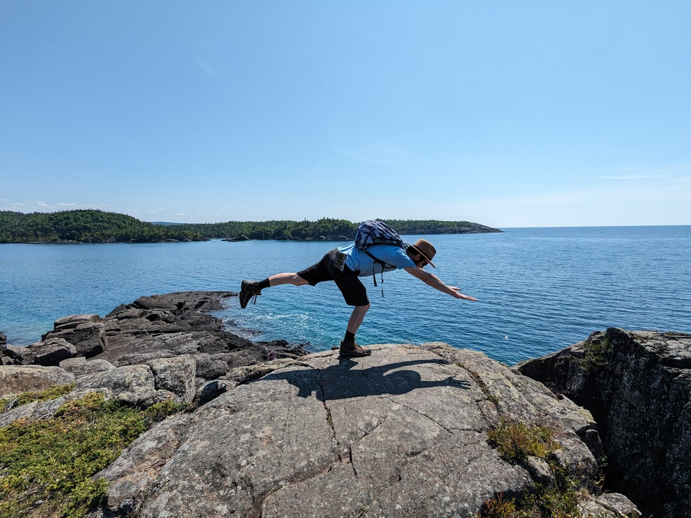

> Here is Betty's patented superhero pose

So we walked around a bit. We touched some of the water

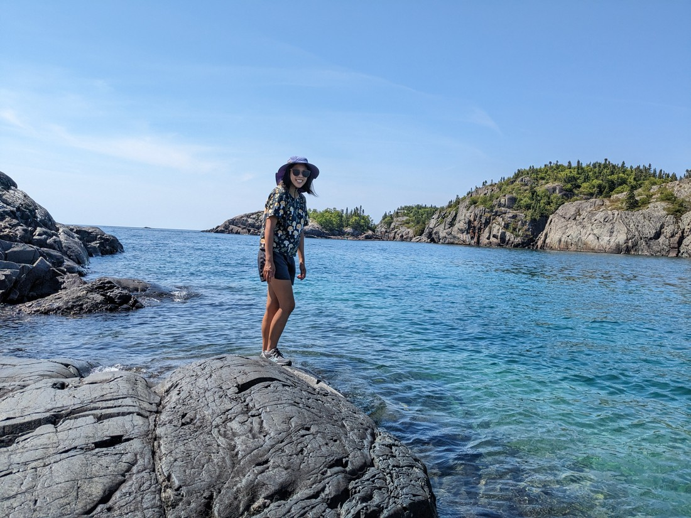

> Semi-cold

And we came to a sandy beach.

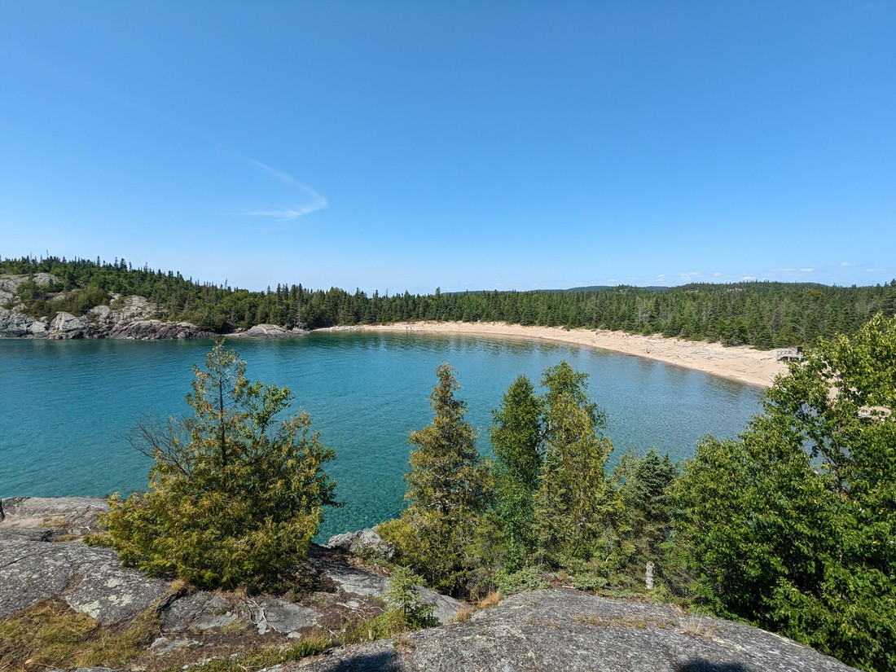

Neither of us came here considering a dip in the water but the combination of sun, sand, and clear water sure tempted us.

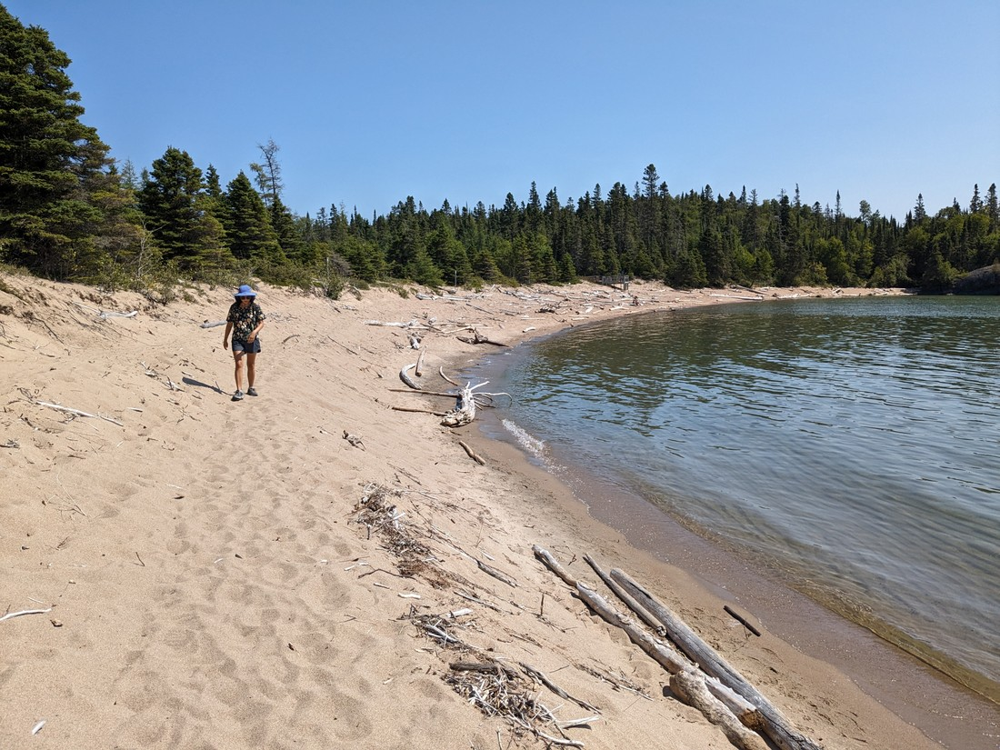

> The shape of the beach certainly suggests the tides here are different to sea tides

But our swimwear was back in the car so instead we just walked on.

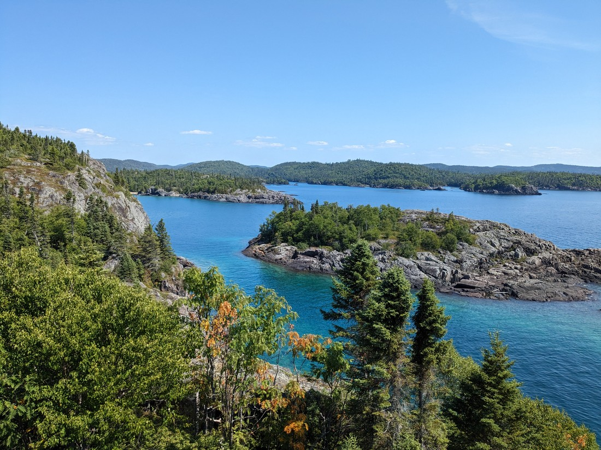

> And up another hill

There's quite a few photos I wanted to include here but I'm having trouble justifying them all. In summary this park was just a place we came to, enjoyed, and then left. There was no adventure. Nothing of interest happened. No story - just some memories of pleasing scenery.

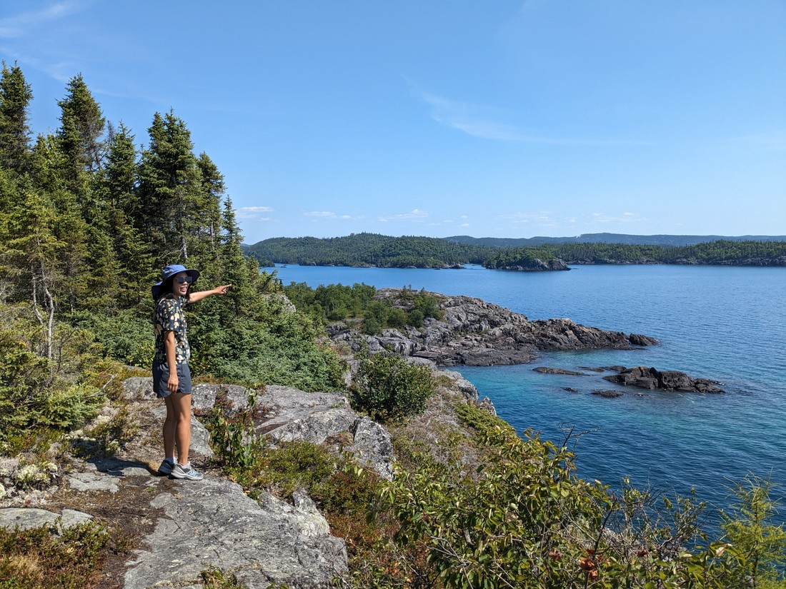

We did seriously consider checking into the campground. We were going to be staying at a different campground slightly more than an hour along the road. Staying here would mean that we'd have a longer day tomorrow but it would mean we could relax here for the rest of the day.

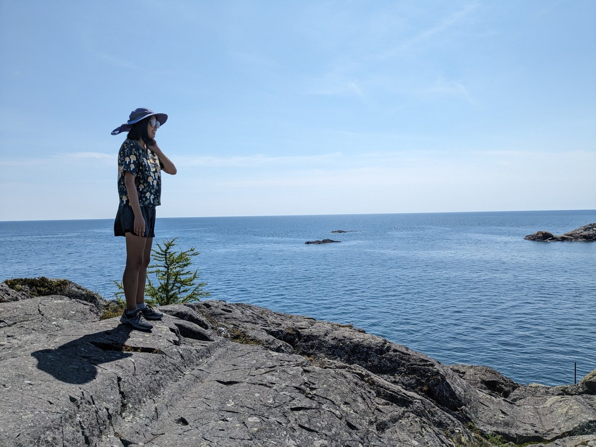

But likely it was never an option. When we did walk through some of the campground we didn't see any free spaces. Clearly this was a popular place to be.

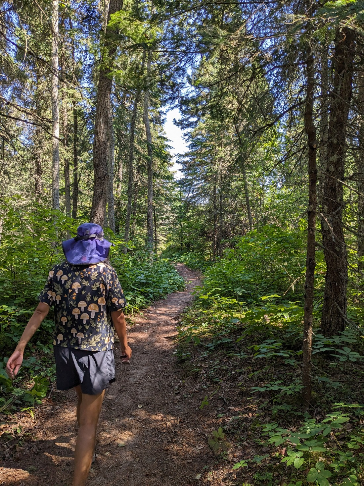

So that was our trip to Pukaskwa. Even though we've seen other parks, it felt like it's been a while since we've been somewhere so nice - which is odd considering this is the same lake we camped somewhat nearby two nights ago. Perhaps on a colder or hazier day it wouldn't have seemed quite so scenic.

I did wish I had gotten in the water. Lake Superior is the largest freshwater lake in the world after all. Fortunately we will still be driving around it for one more day so I might get the opportunity tomorrow.

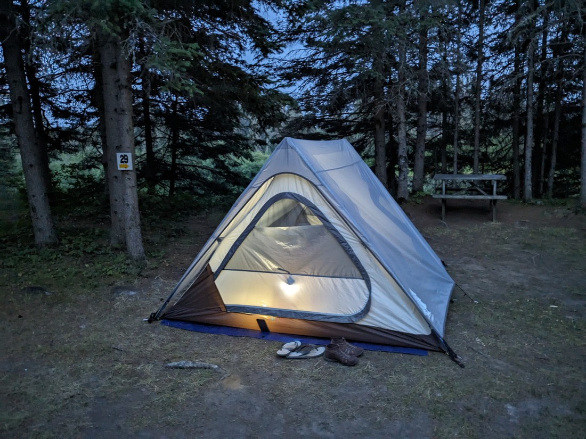
