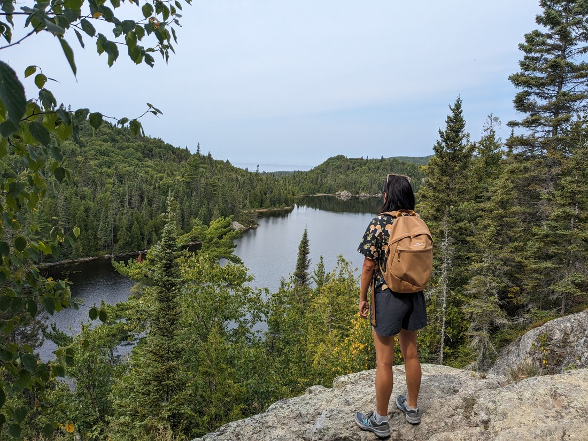

The day after Pukaskwa was a Sunday, so no job hunting today. Also, we're camping and the few towns around big enough to have a library don't have them open on Sundays so it's not like we even have a choice. Reluctantly we decided to go out and have fun.

> This waterfall seemed quite impressive until we learned that it was man-made

Today's road led through Lake Superior Provincial Park. The name seems a bit strange since the park only covers a small section of Lake Superior's coastline...

...that's not right.

What's the equivalent word for "coastline" but for a lake? Lakeside I guess? But that doesn't sound right when the lake is this big. After all we've been driving round it for four days now. Apparently it holds 10% of the world's freshwater.

We decided to do a walk in the park. On arrival at the parking lot we found that there was a parking fee. We couldn't pay in cash and had no internet to pay online. Ordinarily we would drive on but since we'd paid four times the fee at Ouimet Canyon we felt like morally we'd paid for this park too - even if the parking officers might disagree. Fortunately upon returning to our car we found no ticket.

The walk was fine. Notably the foliage resembled New Zealand trees and shrubs. Sure there were still squirrels and stuff but it was a nice place to walk through.

> It was nice to get a small feeling of home

This trail was to a lake called "Orphan Lake". It's a bit odd to call it that because it's only a few hundred metres from Lake Superior - which again proves my point. We need a word in English to describe something that is larger than a lake but smaller than a sea or ocean.

> Something to ponder on while we walk

Part of the trail did run along the rocky shore of Lake Superior. Unlike yesterday this time I came prepared to swim. Unfortunately the day was not as scenic as yesterday. Everything was kind of grey. The haze had returned and the water was no longer the bright clear blue that it was yesterday at Pukaskwa.

But I went in anyway.

In my defence, I look particularly pale in the above photo because I have a lot of sunscreen on. I always intended to put a lot on, but then my new tube exploded in my hands. Since it was otherwise useless I basically just painted myself with it.

Interestingly, I felt a noticeable temperature difference between the top 20 centimetres and the deeper water. If I swam on the surface everything was warm-ish but if I stood to my neck then my legs were notably colder than my shoulders. I imagine there's a science-y reason as to why this is, but I do not know it.

The next day we were in Sault Ste Marie - which is a place that I still do not know how to pronounce correctly. Soo Saint Marie? Not sure. This was a small-ish city between Lake Superior and Lake Huron - the next great lake going eastward.

Something notable here is a historic canal with a lock - which is essentially an elevator for a boat. Lake Superior is a few metres higher than Lake Huron so in order for a canal to link them, a lock is required to raise or lower the boats (depending on which direction they are sailing). But unfortunately it is "historic" and therefore not commercially operating. I'd read that sometimes they do operate the lock for tourism purposes but there was no schedule or anything to indicate when that might be.

But we had some time on our hands so we decided to check it out anyway. As we parked we noticed there was a boat sailing into the lock.

So we frantically ran up to the top to get a good look at it. We needn't have bothered, because it turns out locks do not operate very quickly. The whole process might have taken 20 minutes. Fortunately it was a relatively engaging 20 minutes, even if nothing happened very fast.

Although I should admit that initially we couldn't tell if the water level was changing. We had to stare at a ladder along the wall for half a minute to determine whether the water level was rising. We also massively underestimated how high the water would get. Of course, I suppose we could have just looked at the canal level beyond the far gates but we did not.

...man, we sound dumb. But can you blame us when we haven't seen anything like this before? What's the point in travelling if we're not seeking out places like this?

After the boat had sailed off towards Lake Superior we decided to explore the rest of the park. Unfortunately the place the sounded the most interesting (where all the birds were) was closed. But we went for a walk anyway.

> Beaver dam!

Here we further found out how dumb I was being today. At the lock I was surprised to learn that the water to make the ship rise or fall just comes from Lake Superior and then is released into Lake Huron. "But wouldn't this change the waterline of both lakes," I wondered. Maybe - but the literal river flowing between the lakes probably has more of an impact.

We also found there was a border bridge crossing the river at this point.

> Much more notable than the otherwise unremarkable checkpoints we've been through

On the way out of Sault Ste Marie we made one stop to see the giant Loonie

> Which is what they call their dollar coin. Fun fact: the two dollar coin is called a Toonie, which of course it is!

We had an idea to drive through Canada stopping at all the overly large stuff, whether they be a moose or a coin. However upon closer inspection there weren't that many of these things. More often then not they weren't on the main highway.

We spent the night after Sault Ste Marie in a city called Sudbury. I had booked some accommodation that sounded a bit different. It turns out it was in dorms at a tertiary institution. Also, it was a French-speaking tertiary institution. Fortunately the person at reception spoke just enough English to check us in.

So it wasn't the most luxurious place we've stayed at. But on the flip-side, it was the most luxurious student dorms I've ever been in. But there was no time for me to enjoy the cold concrete block walls or linoleum floor - I found out today that my interview in International Falls had been successful and I was through to the next round. So I had just two days notice to prep for my first technical interview...
