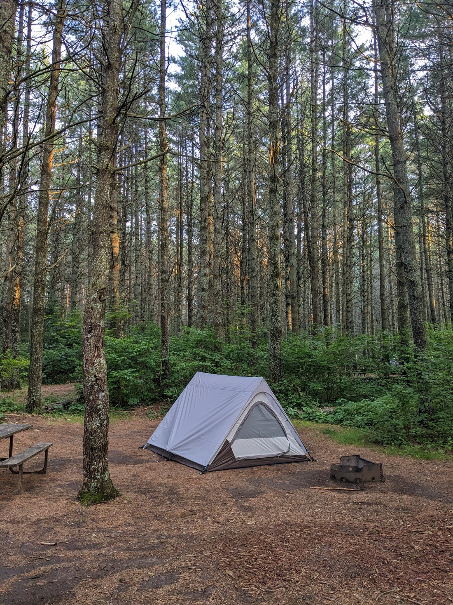
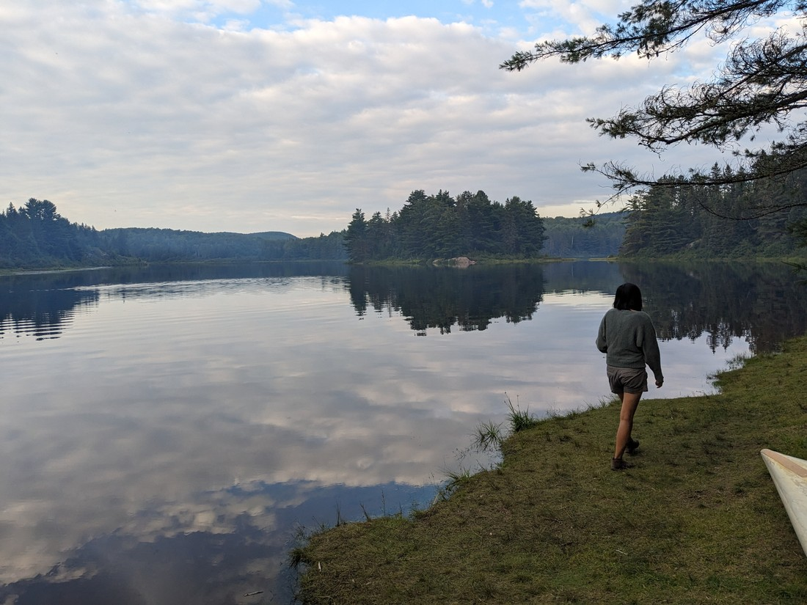
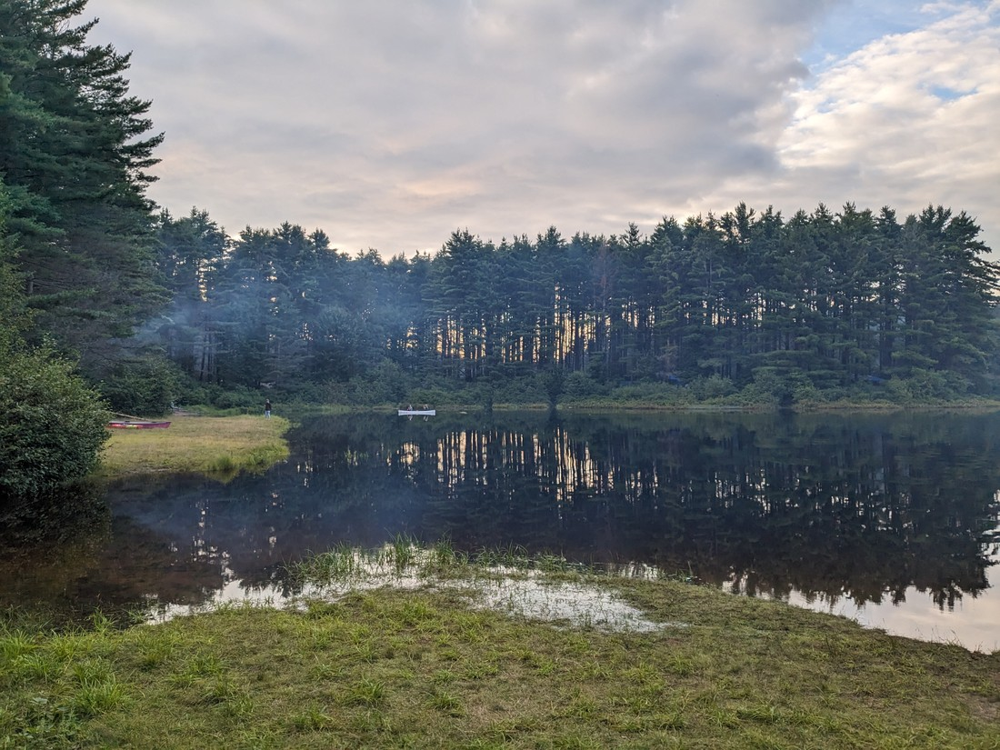
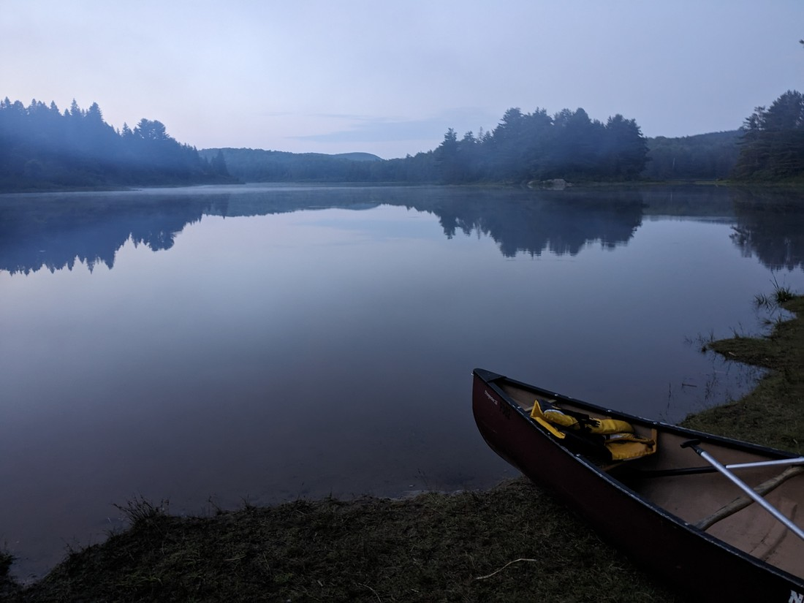
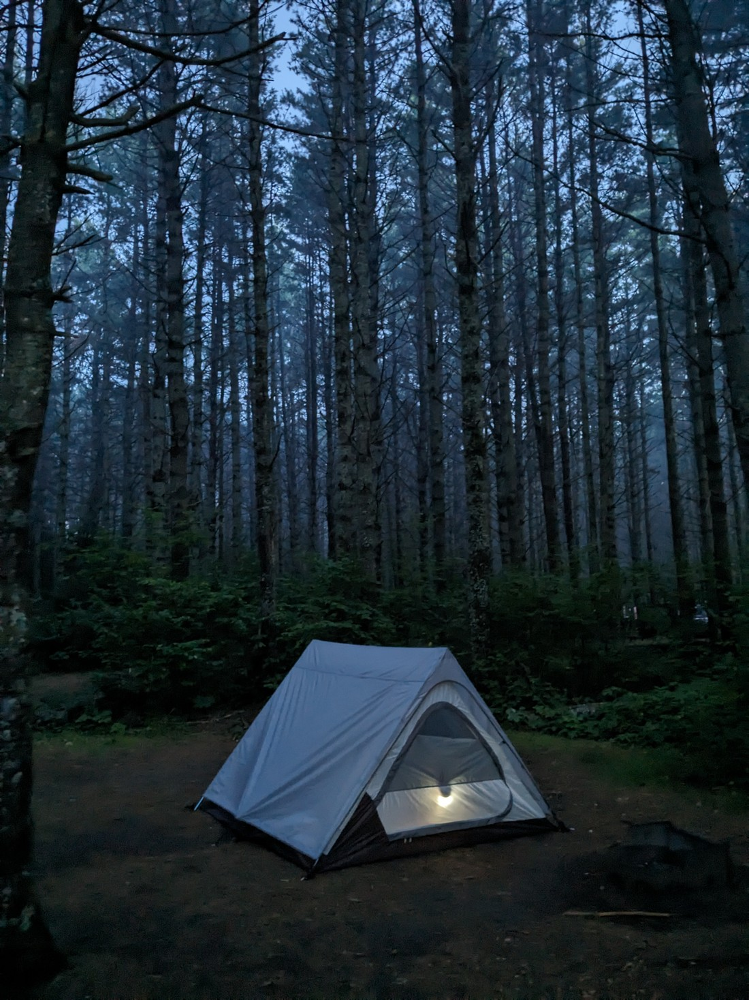
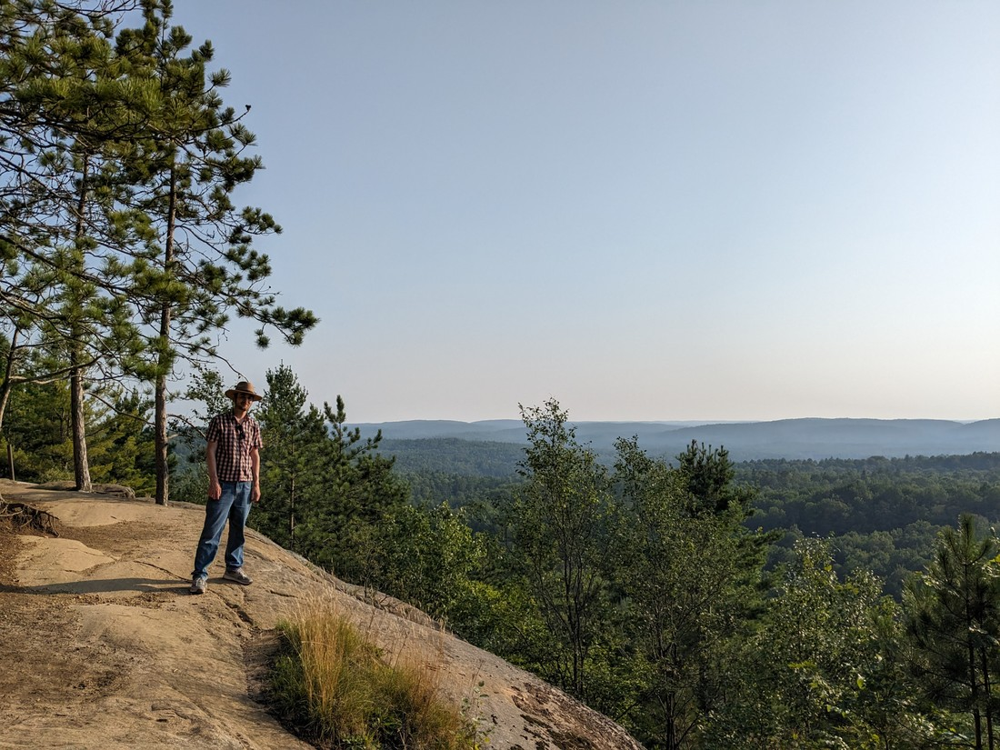

Let me sum up where we are right now. I have a technical interview to prep for and then execute. That's nothing I can't handle. There's only one problem - here's where we are staying for the next couple of nights:

While researching parks in Canada I had spotted this park in Ontario called Algonquin Provincial Park. On the map it was quite huge and it looked like it had a large number of trails that we might want to walk - so I figured we'd want to stay a couple of nights and what better place to stay than the middle of the park?

Overall it was not a very good place to be when you absolutely do need the internet.

Well, we don't have to experience every park in full. We'll just have to drive back out of the park tomorrow to do the interview. While driving to the park we stopped at several small town libraries looking for one that would be suitable to return to tomorrow.

The first was in a town called Parry Sound. It was a small library but it had a pair of sound-proof booths which were ideal. I left Betty to test their suitability and when I came back she was sitting at a table half-way through a jigsaw puzzle. I guess she was disappointed she didn't finish the one in International Falls because she refused to drive on without finishing this one.

The next library was in a town called Bracebridge. This was in an older building and while it looked really nice, it didn't have many modern innovations that other libraries seem to have. This one would not be suitable.

The last one that we would be checking today was in the town of Huntsville. This library was quite open plan but I spotted a large study room that was bookable. Yep, this was definitely the one - although no puzzles for Betty to do while I interview.

Now, onto the park - although by this point there weren't many hours left in the day. We made camp in what felt like a very damp portion of the forest. It must have rained a lot recently. It was also very cold. After setting up the tent we made use of the remaining light to walk to the nearby lake.

I'm not sure I've ever experienced such a still lake. Everything just felt so quiet and peaceful. The lake wasn't even empty - there was a canoeist out on the water, but they rowed so as to make no ripples. There was however a fair bit of campfire smoke about - not suprising given the cold damp evening.

It's a weird life we're living. Here I am trying to get a job in the technology sector and yet this is where we've chosen to be right now.

The interview came and went the next day. I thought it went quite well though it wasn't without hiccups. I had been told that the library WIFI wasn't great so I had opted to hotspot my laptop off my phone. Well, my laptop managed to use up my whole data allocation in mere minutes meaning the webcams started freezing and glitching.

I really hope that this one works out as the workplace sounds great and interesting - although it still seems optimistic that I'll get the second role I interview for.

Afterwards it was back to camping...

And that almost summarises our time in Algonquin Provincial Park. Since leaving Kelowna this was the first time we'd stayed in one place for more than one night and yet we did basically nothing here. But that's just how the cookie crumbles. This road trip we're on is just something to do while we land work somewhere.

But that isn't to say we didn't do any walks. We did fit one in as the sun set on the second day. It was nice and quiet. The viewpoints did gaze directly into the setting sun, but if anything that just magnified the forest's beauty.

Next we'll be heading to Bruce Peninsula, which I've heard is a very popular place for tourists to visit. Hopefully that too will be ruined because I am overwhelmed with last-minute interviews I need to prepare for.
