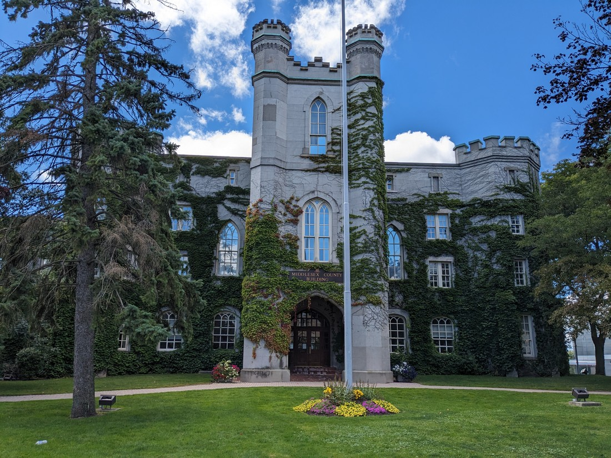

It's time for another National Park!

This one had been on my radar for a while. Back when I was making reservations for campsites I noticed that Bruce Peninsula National Park requires reservations for parking spots. What does that mean? Well, probably that the park is rather popular. Sounds like it might be worth checking out, right?

...but what about the parking reservations?

Oh yeah, that. We didn't book one five months ago like most people would have. We're also visiting during the weekend so of course there's none available now.

Fortunately we're not out of luck altogether. Friday afternoon from 4pm has some parking spots available. Since it was either "then" or "never" we decided to go with "then" - which was in many ways a good thing because we would be needing to spend the morning driving several hours to get there.

We were a bit early so we went to the visitor centre first. Upon arriving we noticed signs around the parking lot suggesting the parking here was paid too. Our reservation was for an area called "The Grotto", not here. But there weren't machines about and while other cars had dockets on their dashboards it wasn't clear what the process was.

So we just ignored the signs. We visited the visitor's centre, and then climbed an observation tower to get a good look at some trees and water.

> And a lot of cloud

And when we returned to our car - no parking infringement. Success!

I didn't know much about The Grotto before we arrived but I learned a whole lot upon arriving. This was because at the parking lot there were a lot of people were walking around with towels and swimwear. I guess this is a beach? Whereas here we were dressed in hiking boots and sunscreen.

We took the scenic route to The Grotto, first coming out onto a rocky beach.

There was an interesting system used for trail markers at this park. They painted lines on the trees and the position and colour of those lines described the trail. For example, the marking in the following photo show that this is a main trail (because the paint is white) and that the path is about to turn right (because the right marker is higher than the left).

Before we got to The Grotto we first came to Indian Head Cove. It was essentially a shallow part of the lake next to rocks. However the clear blue water looked seriously enticing. And clearly everyone else thought so too because it was packed full of swimmers and sunbathers. I didn't end up taking any photos here because it just felt weird taking photos of so many people in their trunks and bikinis.

The Grotto itself was essentially a large but short cave, a short swim away from Indian Head Cove. It wasn't all that special to look down upon, though the cliffs were a nice vantage point to see out over the lake... and the people.

Like on the way here we took the long way back and yah - there's more photos.

And to be clear, this looks nothing like the place where all the swimmers were. Why is the water not so clear here when its the same lake? Where did all the cliffs go? There'll be no answers to those questions here.

We were spending the weekend at a campground on what seems like an Indian Reservation. It shouldn't have been a shock, but for some reason it was a surprise that these aren't just found in USA. Of course it makes sense - Native Americans were likely spread over the whole continent but it just never occurred to me that there are also Native Canadians. Again, clearly its a good thing we're doing this travel thing because it turns out I'm rather thick.

When reserving this site, I picked one that looked somewhat apart to the others, while also being an easy walk to amenities. This time however, I erred in my selection. While the distance to the bathrooms was not that long, there was a thick wall of trees in the way that hadn't been marked on the map. For once, there were also no shortcuts through the trees. And because the trees were tall, it was rather dark and wet.

> A perfect place for those who like things dank

On the way here we'd noticed that there were a bunch of available sites out in the sun right by the bathrooms. Sure they didn't have privacy trees but there wasn't many other people camping there anyway. So for the first time we moved our tent - not a hard decision since it is so quick to set up and take down.

However this story isn't a complete happy ending. It turns out people really like driving their loud cars from their campsites to the bathroom at half past midnight. They also really like talking to other people they meet outside the bathroom at half past midnight.

> At least the campground was lake adjacent

Okay, Saturday - now what? Well there's another famous park nearby with a place very similar to The Grotto. Wait, it also needs online reservations for parking. Do we want to spend $25? Okay, perhaps another lesser known park. Hmm, also costs money to park...

It turns out everything here has a parking or entrance fee of some kind. This puzzles me slightly. There doesn't seem to be much here on Bruce Peninsula other than farms and parks. There's only a single town with little more than a Tim Hortons, a Subway, and a library (those are the things we care about anyway) - and it's all the way back near the bottom of the peninsula. Is this really such a great tourist destination? It's not even \*that\* close to Toronto.

We ended up just spending some time in a park in a town called Owen Sound. They had a salmon ladder, but it was still a bit early in the year for the salmon to start using it. We also spent some time just walking round admiring the fancy old residential buildings. We've seen several towns with suburbs like these - full of well maintained, century-old brick buildings. It always feels wrong to take photos of people's residential homes though.

So that was basically an end to our time on the Bruce Peninsula. We didn't achieve too much but it would certainly have been wrong to avoid this part of Ontario.

The last thing I thought I'd mention in this blog post is that some of the town and city names here are really... familiar. We drove through Dublin which was so small I didn't even notice we'd driven through it. We passed near Paris and Cambridge, the latter of which is a small town near the larger city of Hamilton. But it wasn't until we got to the city of London that things really just seemed too weird.

As you know, the river Thames runs through the city of London. Here I am on a bridge over the river Thames:

> Exactly as I had imagined it

Here is the St Pauls Cathedral in London:

> Charles and Diana got married here?

And here is Buckingham Palace (probably):

> Don't zoom in

Why Ontario? Why did you do this? This London better not have an international airport otherwise you're going to be confusing a lot of American tourists when they end up here rather than "better" London.

I mock this city but this is somewhere we might eventually want to live. It's near a lot of places (like Toronto, Niagara Falls, and Detroit) but it's not on Canada's list of most expensive cities to live in. It also has more than enough Taco Bell restaurants - that's not our highest priority when looking for places to reside but it helps.

But London was only a two night stop. From here we continue east toward the natural wonder that has top of our "must see before we leave" list. If you like pictures of waterfalls then make sure you don't miss the next blog post.
