It would be factually incorrect to say that \*everyone\* knows Niagara Falls - but at the same time it wouldn't be \*that\* incorrect. It must be the most famous waterfall in the world. It drains from four great lakes into the the fifth and final great lake. It's huge, loud, and very American.

Or is it? The border between USA and Canada runs down the middle of the Niagara River - a rather convenient place to put a border given how wide and hard to cross the river is. But this means Niagara Falls doesn't belong to just one country - it is shared by both.

Or is it? Tourists do flock to both sides to view the falls, but one side is definitely more popular than the other. It turns out the Yanks don't get much of a view of the falls from their side so everyone comes to the Canadian side to do their touristing. Which is fortunate for us because we're already on the Canadian side and not that keen to cross the border again.

Canadian Niagara Falls is a tourist trap. We arrived at the main carpark near the falls and found that parking cost more than triple what we were expecting. However this time I will probably just blame myself for not doing sufficient research rather than greedy parking attendants. Next to the carpark was this:

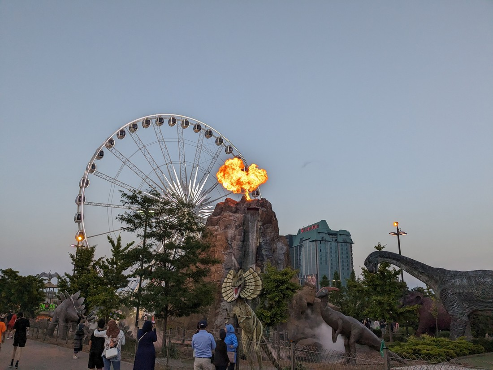

> We could feel the heat!

That's a dinosaur-themed mini-golf with a giant fake volcano that spouts fire every minute or so. It also wasn't the only attraction like this.

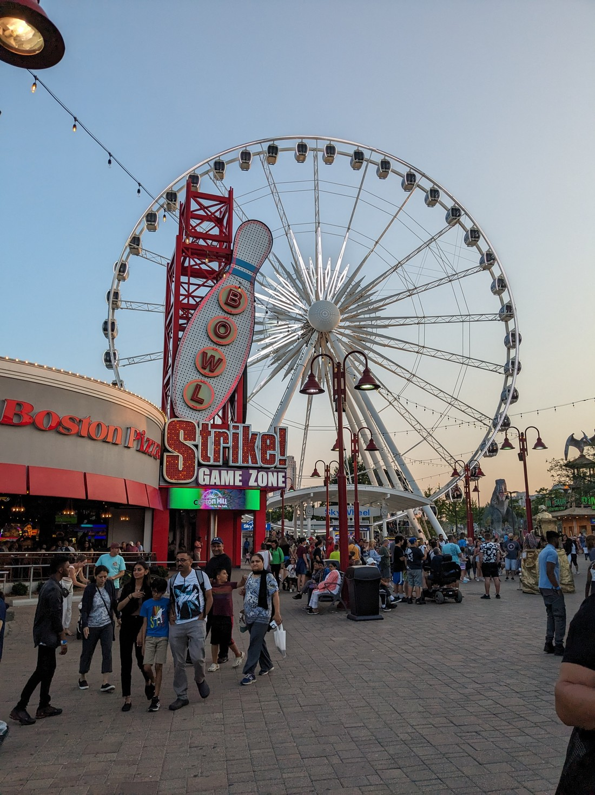

Nearby was a road filled with family friendly attractions. Go-karts, wax museums, arcades, a mirror maze, Ripley's, upside down house, a Ferris wheel, virtual reality, various things with lasers, several haunted houses including one with a rollercoaster. There were also street performers including several costumed characters, a living statue, and people with those seemingly-possible-but-actually-impossible strength challenges.

With all the lights and music, it felt like we were in Las Vegas. But a family friendly Las Vegas I guess? Perhaps that's just a carnival - although there were casinos and lots of hotels around.

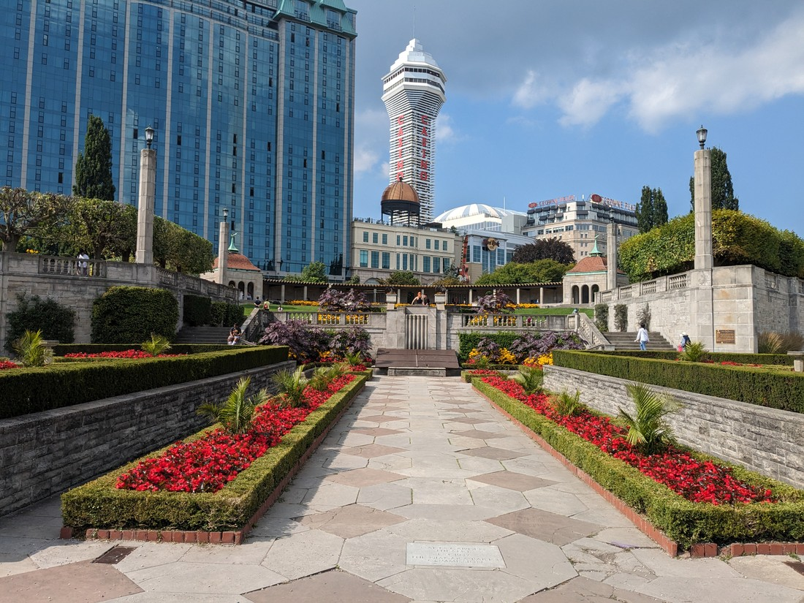

I knew Niagara Falls was going to be touristy but I wasn't expecting it to be this kind of touristy. I was expecting gift shops, caricature artists, get a fake photo of your face amongst Mount Rushmore - that sort of thing. And to be clear, there were plenty of these things too - even a "get your name written on a grain of rice" booth.

But we're not here for any of that. We're here for the free activity of staring at water. After walking down the hill we arrived at barrier with a most excellent view.

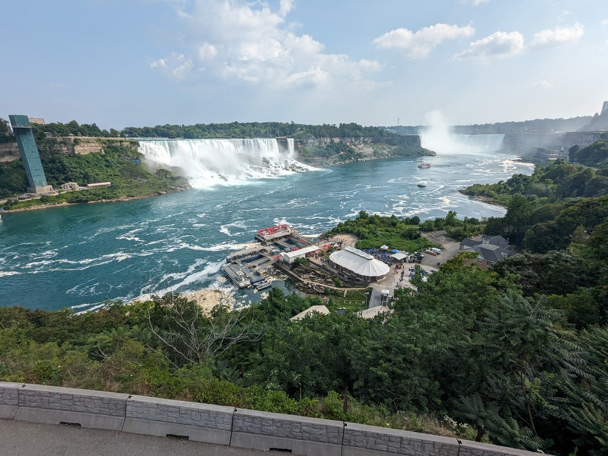

> "Ooooohhh"

I've complained about underwhelming waterfalls in the past but there is absolutely nothing to complain about here.

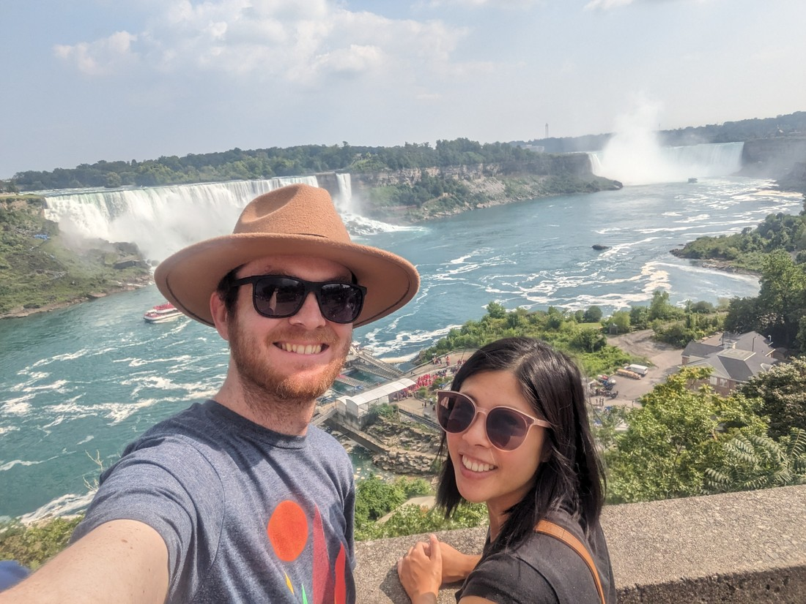

> Only smiles

Well, except for the crowds - although there was a solution to that. We just need to walk further along the path.

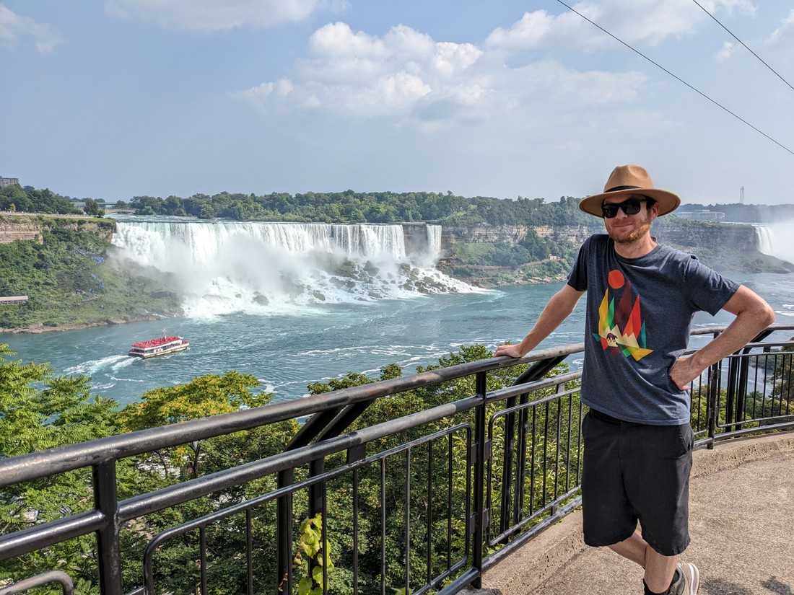

Niagara Falls can be viewed from a path several kilometres long. Naturally there is a crowd at the point closest to the parking and sideshows. But when we started walking \*toward\* the falls this crowd thinned out.

Even here we weren't free from attempts to further get our money. We passed businesses that offered ziplines (you can see the cables in the above photo), special viewing platforms, and of course boat rides.

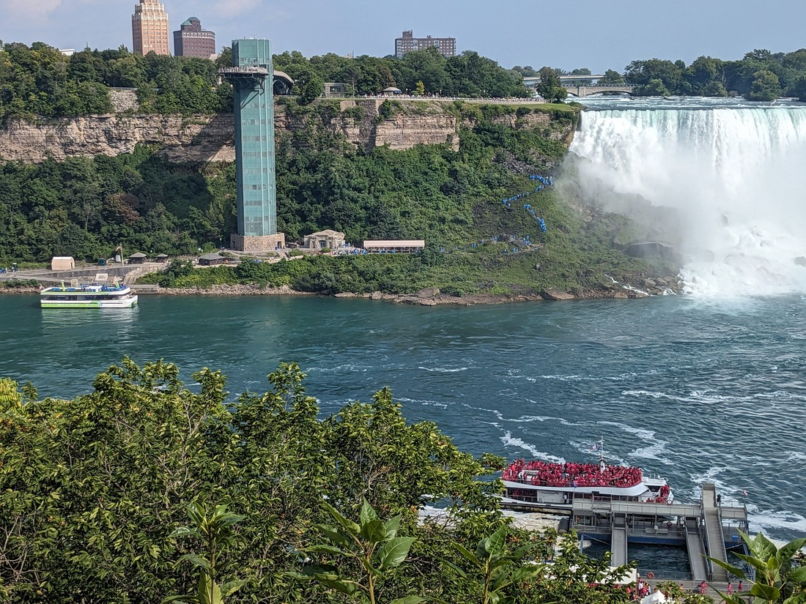

> The building in the photo is on the American side and was clearly built to allow those who don't want to cross the border a better angle to see their self-named falls

Two duelling companies provided trips up close to the falls - each with two boats taking turns to shuttle hundreds of raincoat-wearing tourists along the river. Each boat was clearly identified by the colour of coats everyone was wearing - Canadian tourists in red and American tourists in Blue.

It's also about time that I point out something I don't think I was aware of before we visited. Niagara Falls isn't just one waterfall. Horseshoe Falls (because it is in the shape of horseshoe) is the one I knew from the pictures and that one episode of The Office, but there is a second called American Falls (despite not being in the shape of an American). On the American side of the river there is an island splitting the river in two - producing two separate waterfalls.

From where we currently walked, we couldn't yet get a good look at the Horseshoe Falls but we could see the American Falls well. It was a wall that the river poured over before crashing onto the rocks below. That last part potentially made it more interesting as the water cascaded through these rocks before re-joining the river.

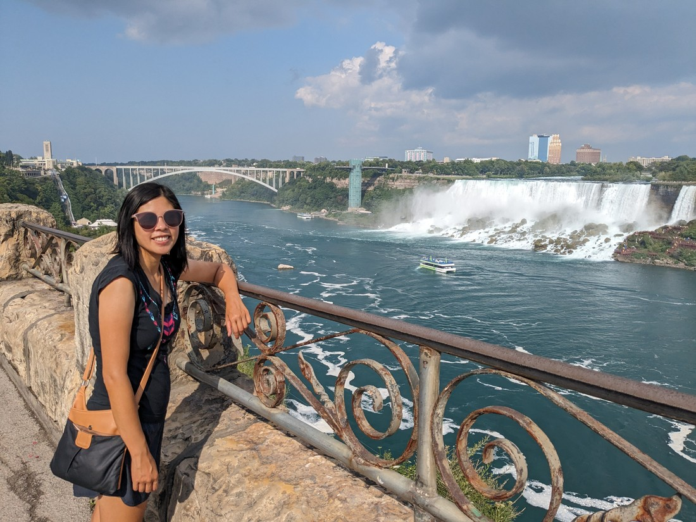

Horseshoe Falls, while lacking in interesting rocks, certainly made up for it in sheer water volume.

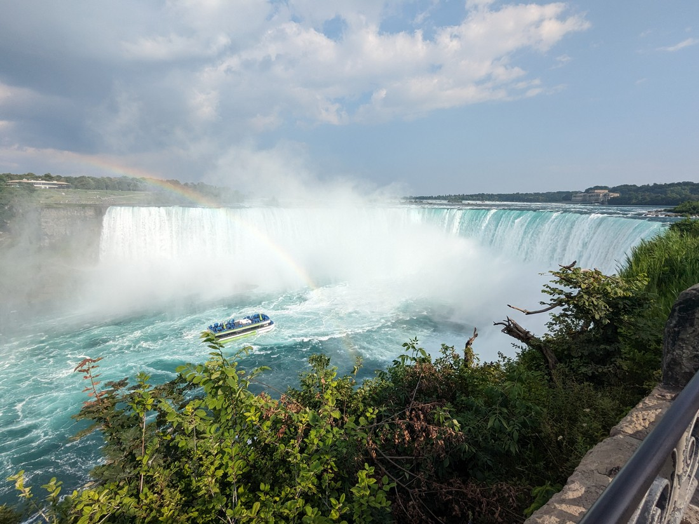

Perhaps there is such a thing as too much water. All of it has to fall down but not all of it would stay down. The force of the water and the wind sent a lot of spray up into the air and unfortunately it sent it our way. There was a few hundred metres of path which felt like we were in a light rain. Of course, this was nothing compared to what the people on the boats must have experienced.

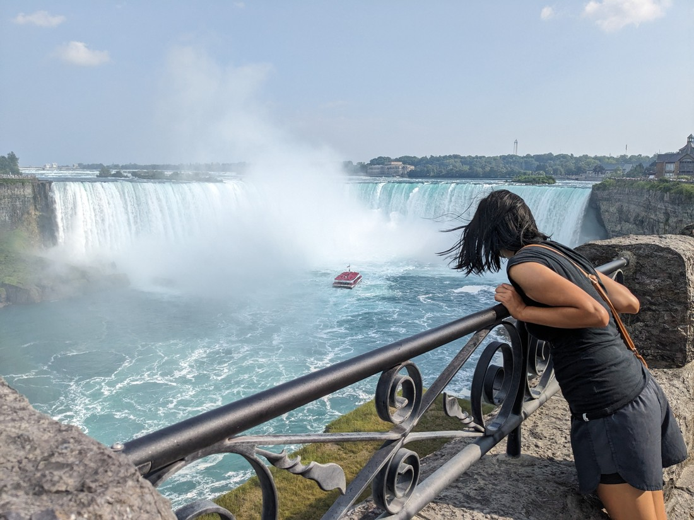

From our perspective the boats disappeared into that spray. The raincoats weren't just a comfort for the passengers - they were a necessity. The tourists had essentially chosen to pay tens of dollars to basically go have a scenic shower.

We were having a good time so even as we passed the falls we kept walking. We may not be able to see the falls as well but this was still a path along a scenic river.

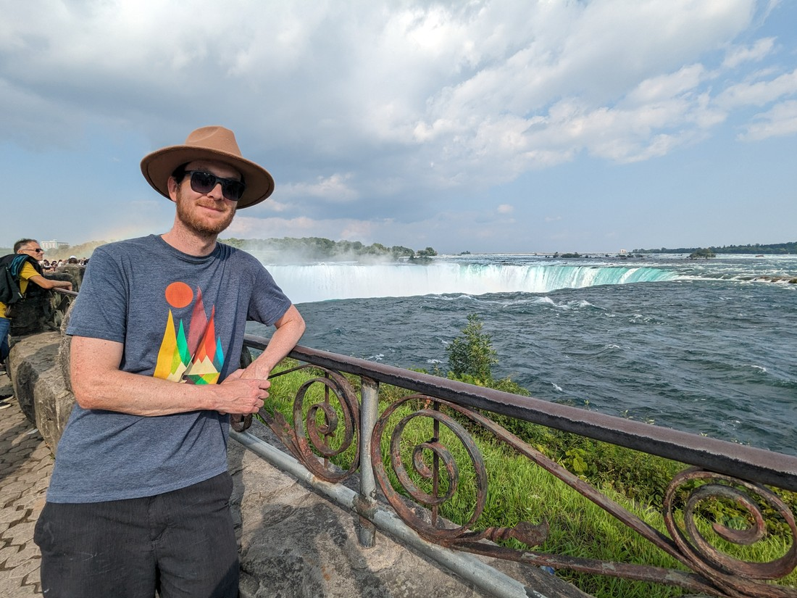

> Hmm, should I magically erase the guy in the yellow shirt?

Here we are getting further away:

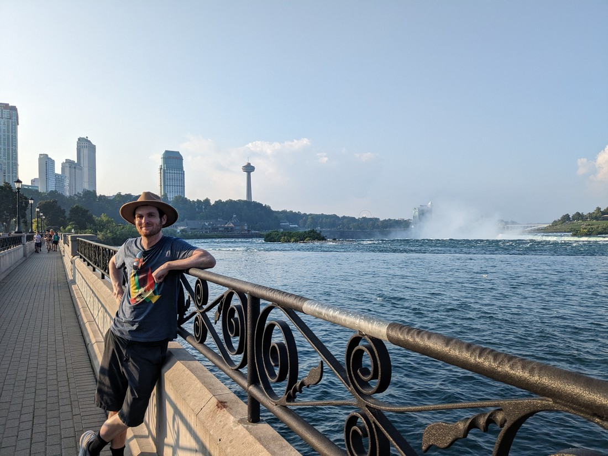

> Or maybe I should erase the guy in the navy shirt that keeps being in all the photos

And here we are getting goofy:

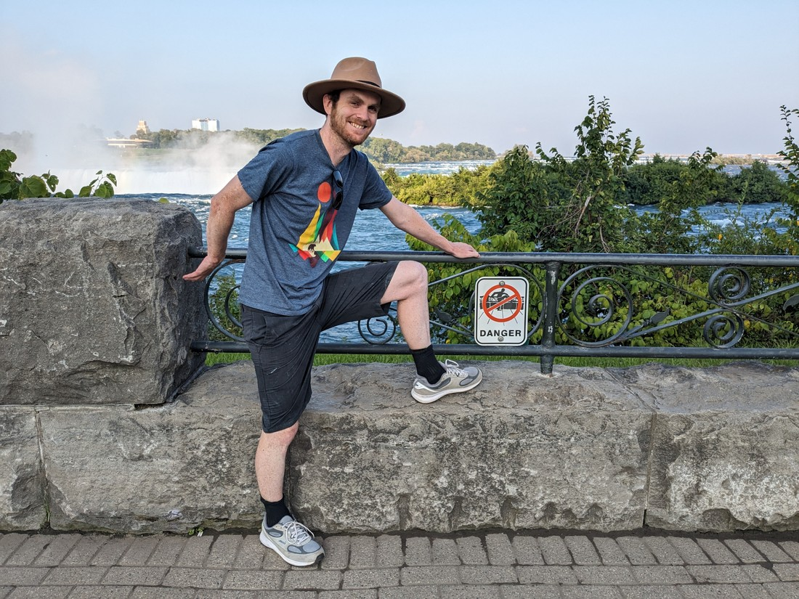

> Here he is again!

So what else is there to say about Niagara Falls? That probably covers about it. One last thing I thought I might point out is that the attraction and sideshow prices were not as unreasonable as I had expected. For example, I think the mini-golf was about $12 per person. Honestly, that probably is cheaper than any other mini-golf we'd find in Ontario. Of course, the bill would certainly add up if you had multiple kiddies who expected to be able to do multiple things but overall it seems like an unexpectedly fair price.

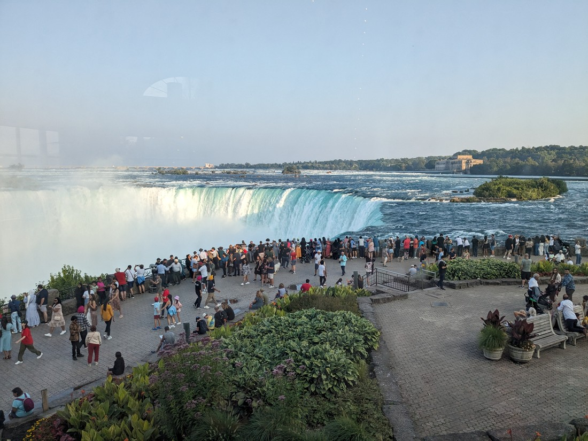

> Although it still can't beat "looking at the falls for free" in terms of value for money

Unfortunately we had to stick around and the food places were a bit more unreasonable with their prices. You see, we didn't come here straight away this morning. Sure, we could have but instead we sought out a library in the city of St Catharines and just wasted a good chunk of the day. The reason was that we didn't want to arrive until late afternoon. You see, the Niagara Falls viewing experience \*changes\* as the sun sets.

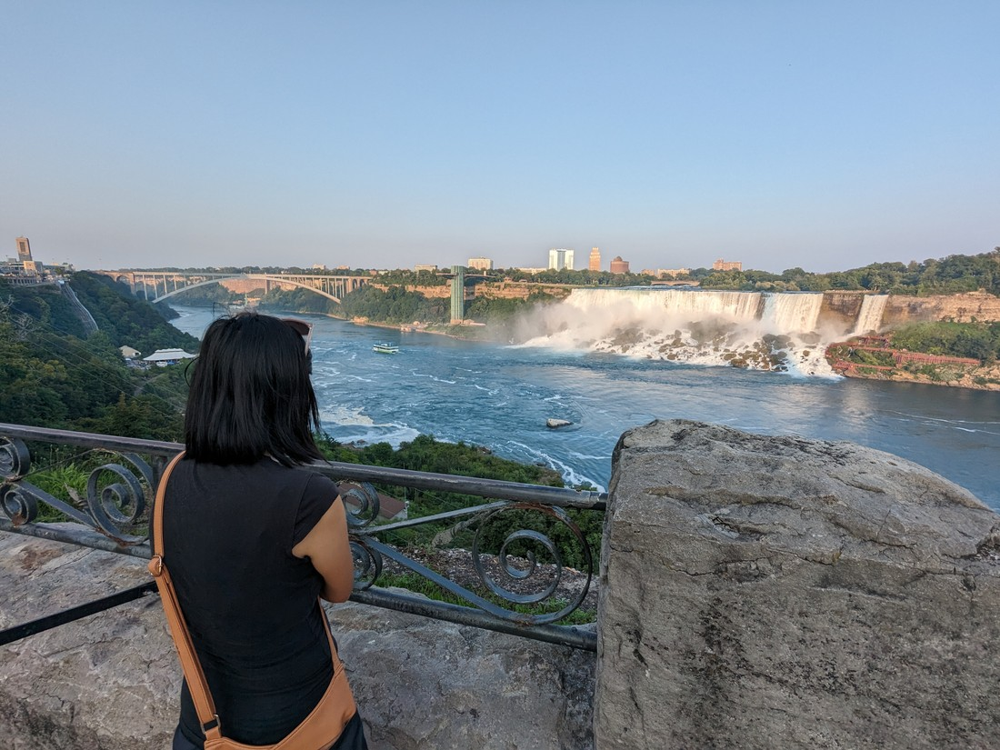

After dusk the falls get lit up by coloured lights so we had to wait around for it to get dark - which was quite a while given the time of year and latitude. But it was worth sticking around for.

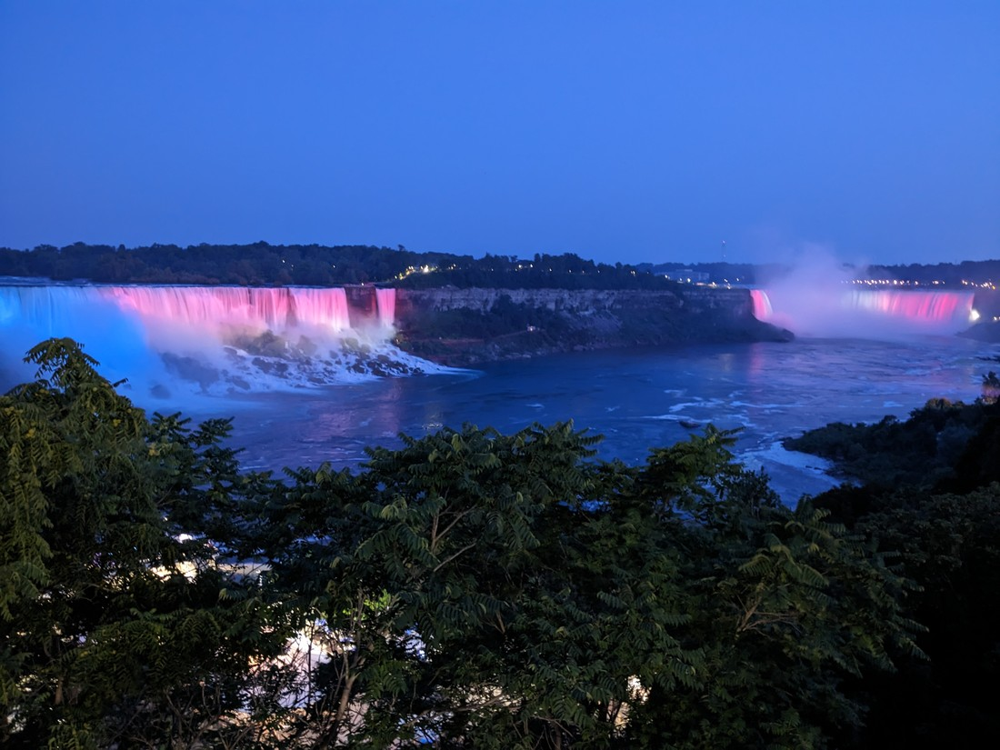

The lights also didn't stay one colour. Sometimes it would be a rotating rainbow of colours. Other times it would be colours representing the American flag. Betty and I both had our favourite combinations - with myself preferring the simple white or blue which made the water stand out more.

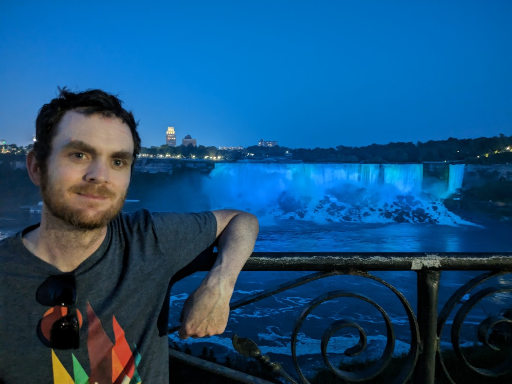

So what did we decide to do? Well, we just repeated the same walk we'd done earlier in the day - seeing both falls from all the various angles. This did mean getting caught up in the shower of spray again, which was now invisible in the dark and also somehow rainier than earlier (wind must have changed).

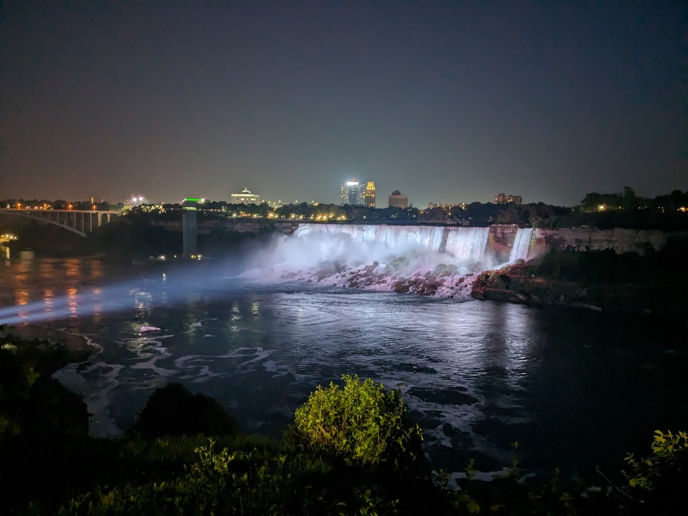

And yet we still had time to kill - Niagara Falls had one last spectacle to give. Throughout summer there were daily fireworks at 10pm. It's been a while since we have seen a fireworks display so we fought our yawns and stuck around. We also didn't know where the fireworks show was going to take place. We assumed it would be over Horseshoe Falls, but decided to walk away from it anyway - only to find a huge gathering of people further down. "I guess this is the best viewing spot then," we thought.

No pictures of that of course. It was hard enough getting the pictures of the falls at night. The camera app on Betty's phone was clever enough to have a "night sight" which did a long exposure in order to take a photo in dim light. However since the falls changed colour every second it was often a mystery what colour the falls would be in the photo.

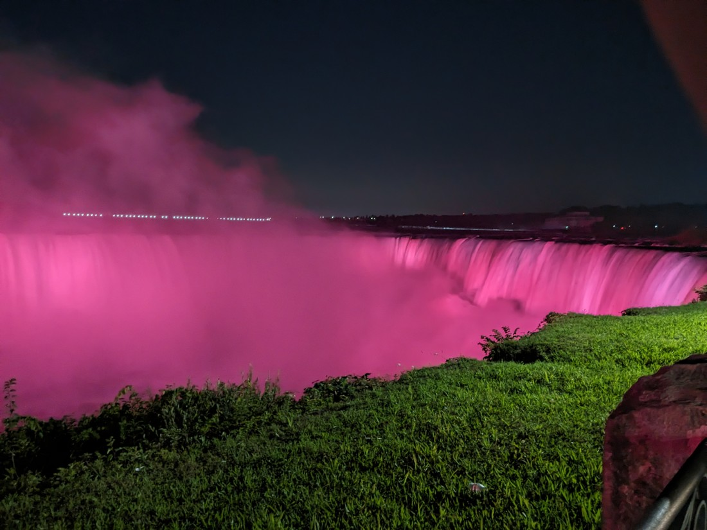

> Fun fact: the falls were never pink. Clearly the exposure has merged the red and white together.

The fireworks were excellent. I don't know how long they took but they didn't leave us unsatisfied. Then came joining the procession of people walking back to their car and then driving out. We just took our time.

Niagara Falls was essentially everything I anticipated, both good and bad. It probably is the oldest tourist attraction in North America. It was certainly a sight to see and it did feel like it justified our long drive to get here. It was also nice to be in a full tourist mindset for a while. No worrying about jobs today (well, in the afternoon) - just a time to have fun and get caught up in the spectacle.
