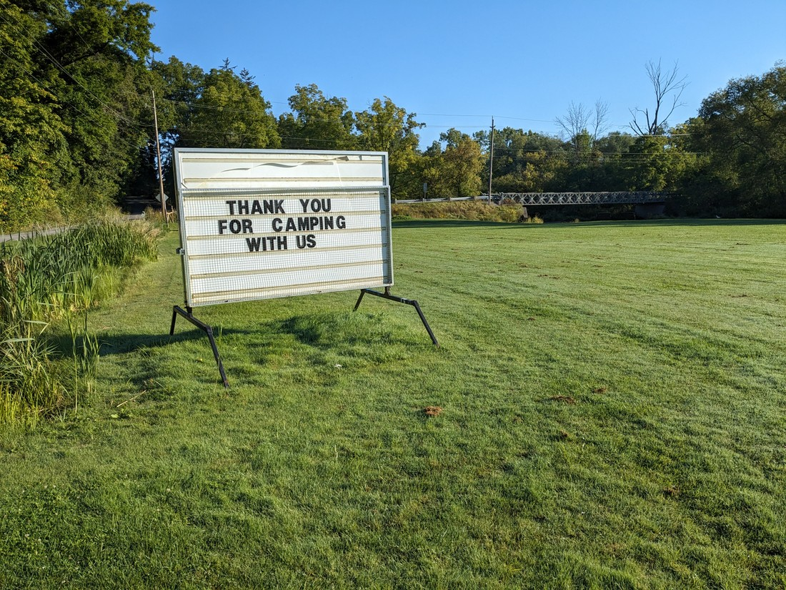

As I mentioned in my last post we had been staying in a campground in a place called Jordan Valley, which was not that far from Niagara Falls.

> This was our view from our tent

On the way here we had been making bookings for up to a week ahead of us but for the first time since we left Kelowna we arrived without any further accommodation reservations.

What was our destination for this road trip across Canada? Was it the Atlantic Ocean? Or was it just Niagara Falls? For some reason I didn't have an answer for that question. I guess we'd been hoping that it would get decided for us - in the form of a job offer. Anyway, we figured we may as well continue east. But slowly.

The next place we stayed at was just outside the Greater Toronto Area, which meant we had to face the Toronto area freeways.

> So many lanes and cars! We certainly have not missed being in cities.

This accommodation was pretty bad. The room itself was fine, but walls did little to dampen the sounds of the road and other guests. Also the WIFI just flat out didn't work half the time. So even though we weren't camping we were forced to seek out other places where we could use the internet - mostly just the library in the nearby town of Orangeville.

It was at this library that we found more jigsaw puzzles like the ones Betty had enjoyed at previous libraries. The puzzles were of pictures of artwork by Charles Wysocki, usually of villages from the horse-and-buggy era. The art was very pleasing to do as a puzzle - full of clear lines and differences between colours and patterns. Together we managed to finish a thousand piece puzzle in a single sitting. Then we came back the next day and did a different puzzle. Soon the librarians had taken notice of us. Apparently people don't usually take their puzzles off the shelf, do them in one sitting, then put them back. Not wanting to attract too much attention we decided to move on.

Our next stop was a campground in Presqu'ile Provincial Park - another name I still don't know how to pronounce. Our GPS inexplicably pronounced it differently depending on whether we were arriving or leaving the park. The campground was a lot like at Algonquin and other parks we've stayed at. It seems Ontario has similar facilities at each park.

> It also had a lighthouse which was surprisingly difficult to photograph - except from this one spot

I also needed to have another interview so inevitably we were forced to seek out libraries with booths or rooms that I could use. We eventually found one in the town of Quinte West. This library also had puzzles, as well as a corner of the library that was usually quiet.

Unfortunately we were forced to listen to several hours of librarian chat while they tried to figure out a 3D printer. Why are some librarians very loud?

> Not like the serene quiet of walking at trail with no one else around

A week since leaving the Niagara Falls area we were again asking, "Now what?" Do we continue east? From here we'd start crossing through French-speaking Quebec. Will they have libraries there like in English-speaking provinces? Not sure. It was also now the end of summer.

How far would we get before it got too cold to continue travelling like this before the weather makes camping unsuitable?

After searching for accommodation options in Ottawa and being unhappy with what what we could find, we decided to return to somewhere that we were happy - Jordan Valley. A good 80% of the jobs I'd been applying for were in Ontario so it kind of made sense to remain in the province. Also, this part of our trip was not supposed to be about the travelling - it was supposed to be about job hunting.

> Though there will still be the occasional walk

So another trip through Toronto's freeways and we were back here:

What was it about Jordan Valley Campground that we liked?

- Firstly it was quiet. The site we were using was one of many along the far edge of a field. Even when there were other campers along this edge, they were often far away so it felt rather private despite the lack of sight barriers.

- Next, the campground had WIFI. This isn't too surprising I suppose. Private campgrounds outside of provincial parks probably all have WIFI. Jordan Valley's WIFI wasn't the best, however we could \*just\* reach it from our tent site on the other side of the field. Sometimes it required waving our phones around a bit to try and get the signal but it was otherwise reliable

> This looks like I'm taking a selfie, but really I'm waving my phone around trying to get it to connect to the WIFI

- The bathrooms were rather clean. This probably is a result of the campground not being very populated. They also had rain-head showers which was nice, even if we had to push the button every 20 seconds to maintain a stream of water.

- The campground itself was nestled amongst many vineyards and orchards. As we drove to and from the campground we'd be passing rows of trees, bushes, and vines. Ontario is the most populated province in Canada so its nice to feel like we're still amongst nature

- There were a lot of small town libraries around. We'd checked some of the libraries in the bigger towns of Hamilton and Burlington and when these libraries did have puzzles, they were usually all checked out with multiple holds. So it means we didn't have to read - one person could puzzle while the other was using the laptop to job hunt.

- It had a pool (which we didn't use) and other activities. One evening we gave volleyball (which is hard with just two people) and tetherball a go, but we quickly had to quit when our hands got too sore.

Of course there were some things we didn't like

- The field, which was nice to look at, was annoying to have to cross each time we wanted to use the bathroom. Mornings tended to be rather dewy and so masses of grass would get stuck to our shoes, especially after it had been mowed.

> But if had been closer to the path we would have been closer to the noisy cars

- We had no cooking facilities or food storage facilities. So no microwave meals or ice cream. Also, we couldn't keep chocolate biscuits cold enough to stop them from melting. Certain foods became our favourites and Tim Hortons was a regular (sometimes daily visit). There were also a number of different supermarkets around with a range of options. Something nice we found was a flavoured tea drink which came in a massive 710 mL can for a dollar. It was refreshing, and came in a variety of tasty flavours.

- Sometimes we had nothing to do. The libraries all closed on Sundays and there was one particular weekend where they were closed on Monday too for Labour Day holiday. We didn't feel like going anywhere so we just hung around the campground reading. It got really hot this day - hotter than you'd expect for early Autumn so eventually we had to leave to go hang out at an air conditioned Wendy's restaurant.

- Speaking of reading, we both started ploughing through the Wheel of Time novels we'd accrued. Betty was finally approaching the end books of the series, which Luke proclaimed to be the best ones. Luke also got the opportunity to re-read them. It takes a lot of time to read and so it was nice to have the time for once.

- Like in Quinte West the librarians were not as quiet as we would have expected. There was one particular lady called Kelly who could be heard from anywhere in the library. She was very nice, but we were essentially listening to her all day. We never talked with her and yet we knew all about her likes (fall), her family (daughter also studying library science), and her hobbies (camping). We would hop around different libraries to avoid her, but she worked for multiple branches and somehow she'd always seem to pop up at the same library we were at.

- Despite the one heatwave, temperatures were slowly dropping. Supposedly it wasn't getting that cold but it did feel like we were consigned to our sleeping bags for warmth from dusk to dawn. Perhaps temperatures were a bit lower here than in the nearby towns due to the valley the campground was situated in. Another camper noted that camping was generally possible until Halloween, though we weren't sure if we could trust him on that.

- One Sunday (with all the libraries closed) aligned with something called National Cinema Day. On this day every cinema put their prices down to $4. This was an opportunity for Luke to take part in an event called Barbenheimer. This was a double feature of two films, Barbie and Oppenheimer, which had released on the same day. Before they were released the internet had bickered about which one people should see, until someone came up up with the idea of a double feature. It is a ridiculous idea as the films are massively different in terms of genre and tone. However it is exactly that ridiculousness which made the event popular.

This is getting to be quite a long blog post so lets take a break for me to critically review both films.

> Speaking of delving into fiction, here is a picture of our campsite drawn by one of our site neighbours

The first I saw was Barbie. This is a film based on the popular line of toy dolls for girls. Films based on a toy seem like they will be inevitably bad. After all, who really cares that much about Barbie any more - the doll is seven decades old. Do modern children care about Barbie? Do modern adults have any nostalgia towards Barbie? Who is this movie for? It turns out the answer is "everyone". Barbie is an amazing movie that never takes itself seriously, but also never disrespects its property too much. It acknowledges issues in the toy's past such as a doll which had adjustable boob size, the creator's prosecution for tax evasion, and the criticism that the dolls represented an unhealthy, impossible-to-achieve body image. However through the main character the movie portrayed a sincerity that Barbie just wants to show young girls that they can do anything. And since the movie was frequently quite funny, adults can also find enjoyment in this film. It made over a billion dollars and will likely be nominated for the Academy Award for Best Picture. It is a great film.

The next film was Oppenheimer. It was not like Barbie in any way. The film was a true story drama about the man in charge of developing the atomic bomb that would go on to be dropped on Japan during World War II. It was long (3 hours), R-Rated (with a surprisingly high amount of nudity), artsy (sometimes in black and white), almost humourless, and took itself very, very seriously. Despite the subject matter, the film itself was really about the events that went down when Oppenheimer needed to renew his security clearance. It was essentially a boring courtroom drama that managed to sound interesting because the story contained explosions (actually only one explosion). However this trick does appear to have worked. Even though I didn't like it, critical consensus is that the movie was very good. It will also likely be nominated for the Academy Award for Best Picture and there is even a chance it might win.

That was fun. Back to reality

We originally made a five day reservation at the campground. Then we extended it by eight more days. Then again by six more days. And when those six days were almost up, we extended it again. We would alternate which library we would go to but each day it was job hunting while we puzzled...

...and puzzled...

...and puzzled...

...and Tim Hortons-ed...

...and puzzled.

We still enjoyed the simple pleasures of camping amongst nature, eating out, and puzzling the day away - but these things no longer had the same shine that they once did. In fact, some of these activities started to become representations of all the things we don't have. Puzzles were previously a fun way to spend the day, but now they were a reminder that we had nothing better to do.

I was applying for about five jobs a day (Monday to Friday anyway). That number could have been higher but I was only targeting software developer roles that I could show I was qualified and experienced in doing, rather than any random developer role. For each application I would make small tweaks to my resume, focusing on the particular skills and knowledge that the role requires - over time making subtle improvements. I was also playing around with new technology that might come in handy.

More often then not the employers were not getting back to me. Sometimes I'd get an automated rejection email, but most of the time I just wouldn't hear from them again. But I could understand. Usually after applying I could see the total number of applicants for the role. On rare occasions it was below 100. Most of the time it was 200 to 500. Sometimes it was more. How do I stand out among hundreds, if not thousands?

When we started planning this trip last year tech workers were in high demand. The lockdowns of prior years prevented us from going outside, so everyone turned to cyberspace, and so employers were snapping up all the tech workers they could find. Well, with COVID's grip on civilization now lessened it seems like life is going back to how it was four years ago and a lot of companies found themselves overstaffed. Those that weren't laying off staff were simply not hiring.

Something else COVID also seems to have disrupted was immigration. Global movement of workers basically stopped for 2020 and 2021. I suspect even after countries re-opened their borders, most people were still unwilling to travel. As I said, in 2022 things are going back to normal and there is now a flood of people looking offshore for opportunities. Of particular note is a widely reported statistic that the number of international students currently in Canada than in 2019. We'd see headlines like "10,000 USA tech workers apply to work in Canada in 48 hours" and "40,000 new jobs added to the economy but also 100,000 new migrants".

So that's what we're up against. We're not the only ones that have come to Canada in search of jobs. There's actually a lot of us - fighting each other for the few roles that employers are willing to offer.

But Betty and I are fighters. We didn't come to Canada because it was going to be easy. This is just taking a bit longer than expected. Eventually we'll get a job so right now we just need to focus on our other needs while still applying.

I had been hoping that one particular application would pan out for three reasons. I had already done two interviews with them, plus a coding test, and I knew they were hiring multiple candidates. If I got this then it will instantly answer a lot of questions about our future - the biggest being whereabouts we will live.

But I didn't get it.

On the bright side I was going to be interviewed for two other vacancies, but the hiring process for those ones had only just started. Even if I was accepted for either of these positions I will likely not know it for several more weeks. It is now the middle of September and the nights and mornings are getting a bit cold. We're not going to want to camp for much longer. We're just going to have to pick somewhere to rent.

I had been told Facebook was the best place to find rooms for rent so one morning in the library I opened it up. There were a lot of rooms listed as available but while scrolling through them I couldn't help but read between the lines. The wording and phrases on the listings were the same types of wording that I'd been seeing on job listings. It confirmed what we'd been hearing on the news:

There is too much demand (this time for housing) and not enough supply.

We had spent the summer camping, ignoring the problems we might face when trying to find a place to rent. "One problem at a time," we told ourselves. Well now we don't have the luxury of telling ourselves that. Now we must attempt to solve both problems simultaneously. From now on it's not just job applications we're sending out - it's also rental applications. And like in the job market, it was going to be really difficult to stand out.

During this ordeal I have shed tears of frustration. I'm not ashamed to admit that. On these occasions I had hoped and wanted something (such as a job I had interviewed for) and then was crushed when it would lead to nothing. My tears were not a sign of weakness, just that I had genuine disappointment. Had I not felt disappointment then I clearly didn't want the role and wouldn't have deserved to get it anyway. After each rejection I would pick myself up and continue on - which I think makes me strong.

But why are we doing this? Why are we putting ourselves out there so much, only to be rejected? I wanted the opportunity to experience living in another country - it felt like an important life experience and I knew we would have a lot of fun in Canada.

Well, maybe that's not correct. I knew we "could" have a lot of fun in Canada. Just because we want something, does not mean we're always going to make it happen.

Sometimes life just says "No".

It was at this point that I remembered something. Even though we've had failure after failure (at finding jobs) for months now, we're still lucky. "Why?" you might ask. Well, we're lucky because we're not being forced into this life. We only chose to come here. It hasn't been forced upon us.

We can still go home.

...maybe it was about time that we do.

We came to Canada with a dream. Our dream was to have a fun overseas experience. We didn't come here to make money, or to put down roots - we just came here for fun. Looking at the challenges ahead of us I knew we wouldn't be having fun - this side of Christmas anyway. Perhaps it was just time to call it quits and head back to New Zealand. We'd have more fun spending summer amongst friends and family.

We walked out of the library around noon and walked around the block - discussing our options. Then we walked round the block again. I suppose you can never be certain about any decision but this choice did seem right.

When explaining this to people, I happily admit that we're coming back to New Zealand as "failures". We failed to find jobs and establish ourselves in Canada. We can blame the high immigration and low supply of housing but perhaps we just didn't try hard enough. We have instead chosen to "give up" and return home. But that doesn't mean it was all for nothing.

We have had a lot of fun. This is the 93rd blog I've written since we left New Zealand - that's a lot of adventure we've packed into the last five months. The fact that we never found work abroad does not invalidate the enjoyment we've gained from holidaying. Obviously coming here was not a good financial decision but as I said before, we didn't come here for financial gain. We came here to have fun. And we've had fun. Not all the time of course but certainly a lot. I don't regret coming here but I know I would have regretted it had we not taken this opportunity.

On the 16th of September we found ourselves packing up our tent in the morning sun. Our tent hadn't moved in over three weeks. The grass around it had grown long and the grass underneath was long gone.

Three days ago we had made the decision to leave. It had felt right at the time and it still felt like the right decision. We set off and we felt something we hadn't felt in a while - enthusiasm. We were excited about what our future might hold. One chapter of our lives had ended, but that just meant a new chapter was starting.

> And this new chapter began with one last visit to Tim Hortons

Where will the story of Luke and Betty go from here? Well, away from Canada, and towards New Zealand. But other than that we don't know.

But we do know it will be more fun than being stuck in one place, freezing in a tent.
