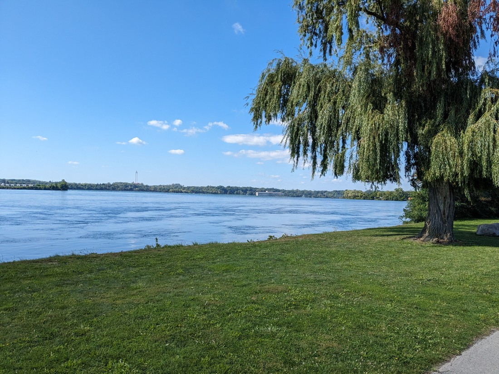
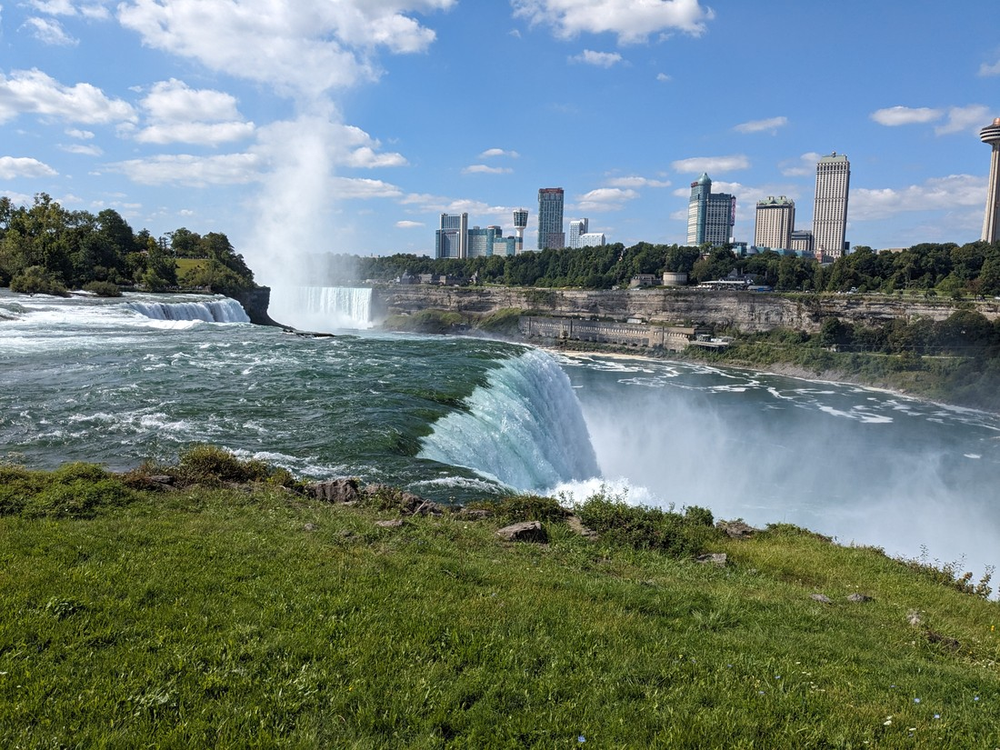
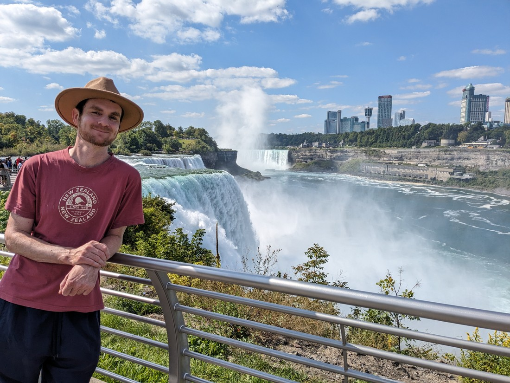
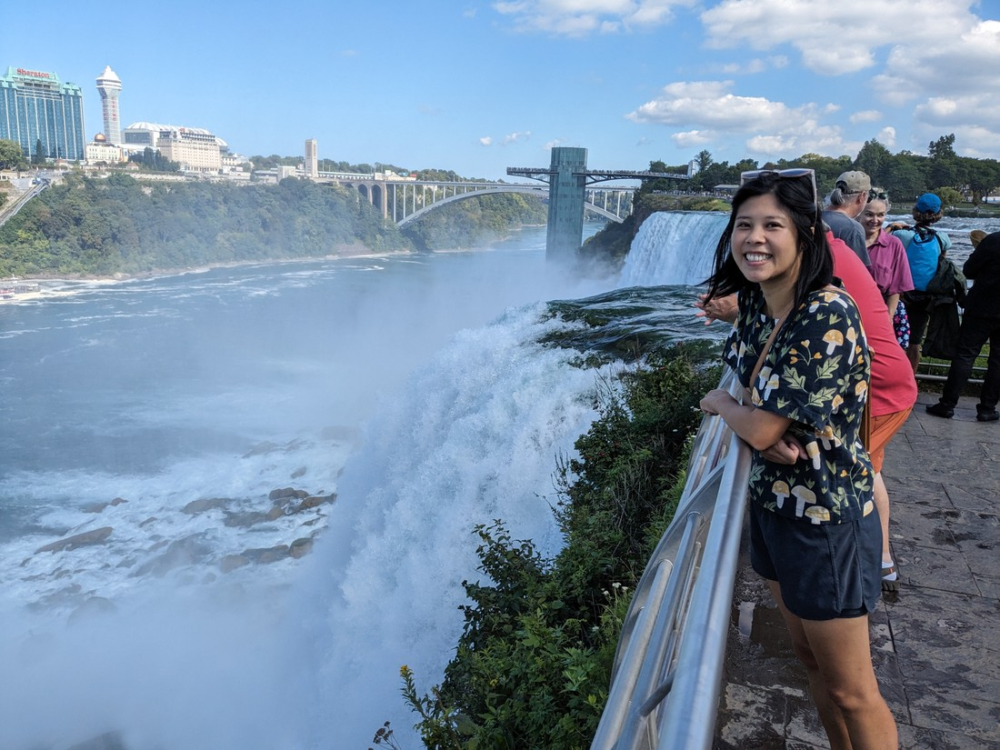
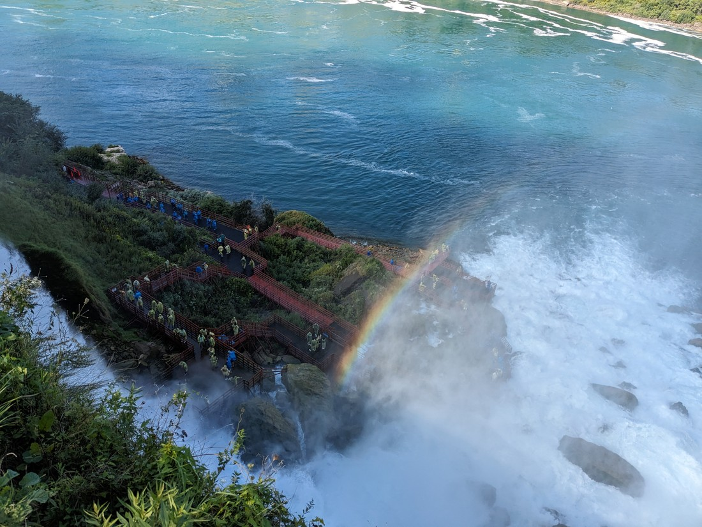
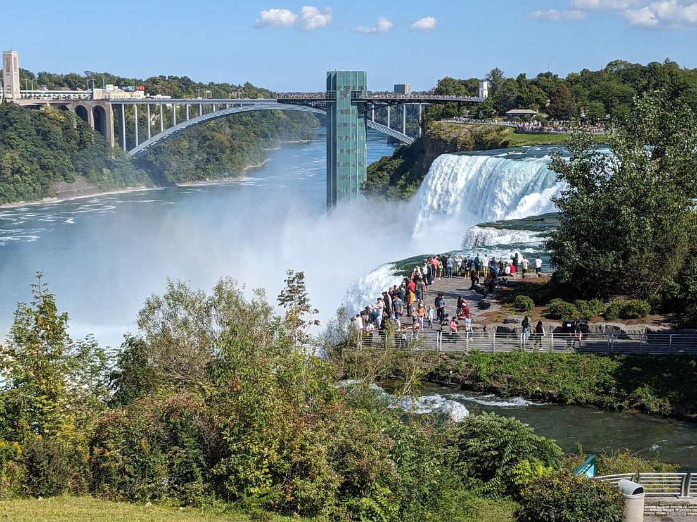
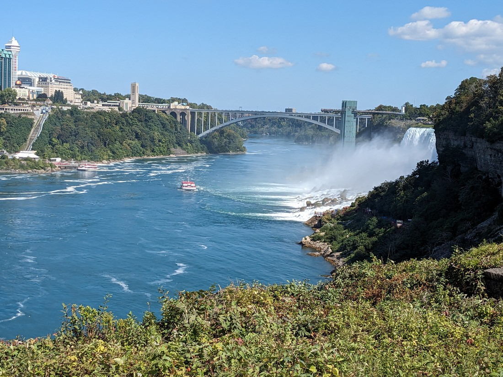
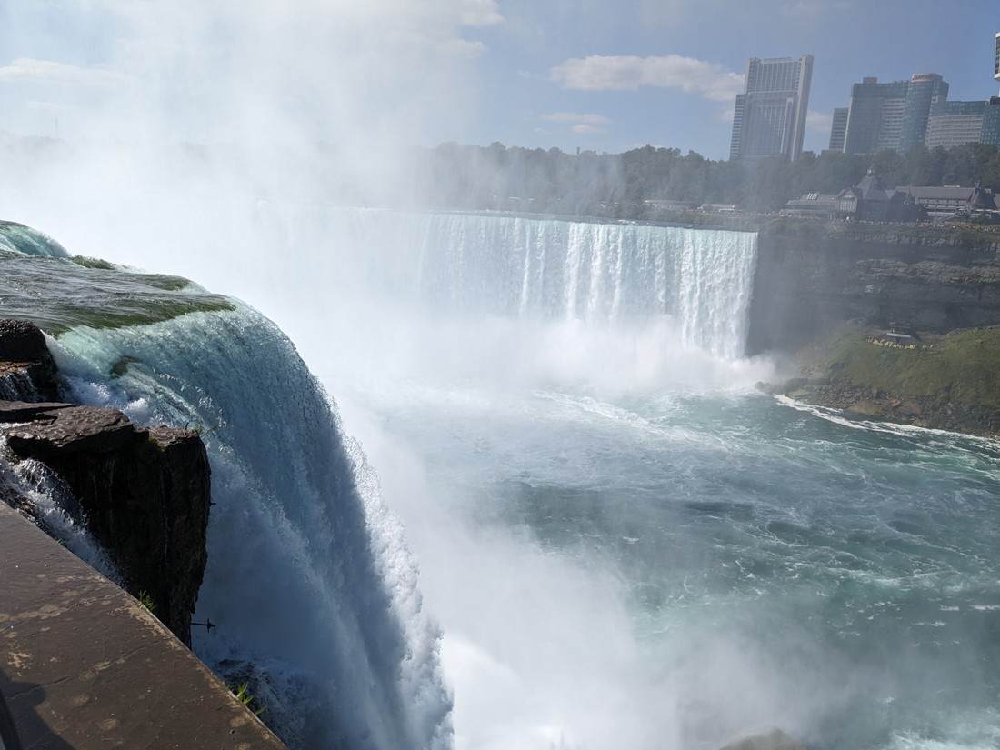
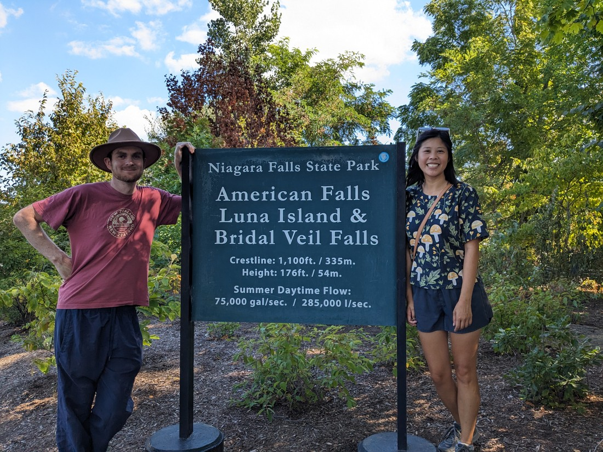

Okay, so we've decided that we're heading back to New Zealand (probably). But what's the best way to do that? We could fly out right now, except there is one limiting factor - our car which needs to be sold.

My first instinct was that we should drive back to Vancouver along the Trans-Canada Highway. We'd been stationery for about a month now and it would be nice to have one last road-trip.

But do we want to have some more fun before we leave? This will be our last time in North America for probably quite a while. Why should we rush leaving? Perhaps we should have one last holiday.

A long time ago I loosely promised Betty that we could stop-over on Hawaii on the way back to New Zealand. That honestly sounds like a great place to go as it will be a nice change from where we have right now. But let's do a quick think to ensure this is what we want. Are there any other places that we haven't seen?

- Quebec? Well we've already been to Quebec City and Montreal on a previous trip and while there are a lot of parks in this province, the potential language barrier means we're not rushing to go here right now

- Nova Scotia? The big issue here is that it is in the opposite direction to New Zealand. While we're sure it is a nice place to visit, the parks seem like they'd mostly be forest parks - which are often not the most interesting.

- Yukon? It's not really on the way - we'd have to drive all the way to British Columbia first. While I know visiting the arctic circle would be memorable, there honestly isn't a lot to see or do along the way.

But we're not limited to Canada after all. What about USA?

- Shall we go back to the magical land of Utah to visit the canyon parks again? Well we really have seen most of them already and recently.

- Los Angeles? This is tempting. It's the land of Hollywood after all. There's also a lot of California that we haven't seen as well as some parts we might want to revisit.

- Texas? Nah.

But maybe we don't even have to limit ourselves to North America.

- Europe? It's definitely somewhere we want to go, but it's also on the opposite side of the planet to New Zealand.

- Japan? Betty has been before but that would also be somewhere amazing to see.

- Mexico? Also nah.

So we have some choices. How are we going to decide?

Ultimately we decided to rule out Europe and Japan. We definitely want to visit these places but such trips probably ought to have more than 1-2 weeks of planning. Better to visit another time when we're more prepared. So it'll likely be back through Canada or USA? And if you re-read my arguments to the rest then there's really just one option that stands out.

We're going to California!

Do we fly or drive? Is that even a choice? We have a car and love road-trips - let's drive there.

We decided to cross back into USA at Niagara Falls mainly because it was the closest border. Last time we drove into USA the border guards seemed suspicious of us since we didn't have jobs. They might be more suspicious this time so we wanted to get to the border as early as possible in case we need turned back and have to go elsewhere.

Now there are actually two or three places to cross the border near Niagara Falls. The Peace Bridge is the main crossing as it is on the highway, but there is also the Rainbow Bridge which has a view of the falls. When we set out this morning we hadn't planned on taking the Rainbow Bridge as it would add 20 minutes or so to our already long journey today. But on route we decided that we may as well take the scenic way.

Half way there we realised we didn't know where my passport was. We hadn't used it in over a month and it wasn't where it was supposed to be. Fortunately it turned up after rummaging through my suitcase on the side of the road.

Also, the border crossing was not a smooth entry. Perhaps only Canadians and US citizens get waved on through while the rest of us have to go inside and have our fingerprints taken. Upon entering the building we arrived in a lobby with seating, most of which was already full. How long was this going to take? Someone else complained that they had been waiting for two hours. Fortunately it wasn't too long - perhaps 30 minutes.

It would have been nice to walk the Rainbow Bridge but since there was no way to walk it without it technically being a border crossing, we opted not to - lest we run into more difficulties with our passports.

So now it was time to drive on. We'd glimpsed the falls one last time and ahead of us was the open road of New York state.

> "Wait what was that?"

The road out of the city took us along the waterway above the falls. It sure looked scenic.

...perhaps we could stop and have a look at the falls again? This time from the other side.

Like our decision to leave Canada, it too felt like the right decision. After all it was a really nice day and so long as we didn't have any car troubles there wouldn't be any further delays in getting to our first accommodation. Why not take our time and stop for a nice walk in a park by a river?

Unfortunately it did require a fair bit of walking. By the time we made the decision to stop we'd already driven a fair bit. But again - it's a nice day so we're not complaining. Also the parking here was free. However I did insist that we walk fast since we couldn't spend all day here.

In a previous blog post I talked about why the Canada side was the much more popular place for tourists. Perhaps this photo of the view of the American Falls from the American side exemplifies why that is:

> Only side-on views

It's certainly still a nice place to be, watching the gallons (not litres, since we're now back in USA) of water flow over the fall, but you really can't see as much.

The American side also has a state park on the island in the middle of the river, so you bet we're going to check that out too.

> Here's the American Falls again, but from the island in the middle

I think last time I mentioned that there were two falls that make up Niagara Falls, but there's actually three. There's a small island splitting the American Falls into two - one very large falls and one smaller one named Bridal Veil Falls. And of course it's named that. There must be a rule somewhere we each state and province has to name at least one of its waterfalls after that wedding garment.

Anyway, there was a walkway and platforms at the base of the falls allowing tourists to get up close to the falls. We stood at the top staring down at them as they... got wet.

Sometimes the spray from a waterfall gets to the point where it feels like you're standing under the waterfall itself. Well, one of the platforms down there went a step further. People seemed to be being pushed back by the force of the water. I guess that's fun?

In the previous and next pictures you can also see the Rainbow Bridge that we took to get here. With a name like that naturally the bridge is only painted a single colour? In these pictures you can also see all the various views that we could get of the American Falls from this side of the river. Again, it's a nice place to be but you can see so much more from the other side - or from the boats.

> I see why the boat rides are a popular option on this side

But the American Falls aren't as iconic as Horseshoe Falls. What kind of view are we going to get of that one?

This was the only view we could get. It also seemed like the wind was going the opposite direction today - which meant again the spray was being directed into our faces. Such our luck.

We stuck around a bit but ultimately we did have to move on. Our schedule had us driving 5.5 hours today but that was excluding the detour over the Rainbow Bridge, our delay at the border, and our stop to sightsee. We were definitely far behind schedule, but this stop was 100% worth it.

> Also hooray for metric units!

We ended the day in our first motel in a month, with our first microwave meals in the same amount of time. Don't laugh but those meals are part of the reason we're currently here in USA. Canada and USA are very similar, but there are notable differences in the food that is available. USA in particular has a significantly larger array of microwaveable meals. We've been in Canada for quite a while now so the small changes in culture is actually quite appreciated.

We hadn't really had a proper day of sightseeing since... well, the last time we were at Niagara Falls. We'd spent the last month worrying about where we were going to work and live. Today, under the clear blue sky, we were able to escape those memories and experience the fun of being loose at somewhere new.

Although since it has been a while and I encouraged us to walk quickly all day, it meant our legs were rather unhappy the next day.
