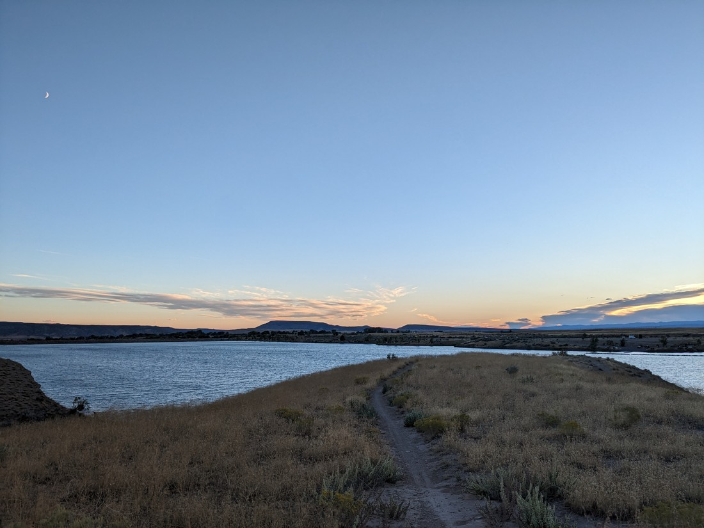

"Go west, young man"

In the mid nineteenth century the west was largely unexplored. Most settlers still resided east of the Mississippi. Americans generally viewed the west of the continent to be a barren wasteland suitable only for Indians. However someone at some point (the origin is uncertain) came up with the phrase above, encouraging Americans to travel westward to seek their fortunes and explore what was still largely unexplored.

Then in the 1970s The Village People took inspiration from that phrase and released a song called "Go West".

And that song has been stuck in our head for days.

---

So where are we? Well, let's start here:

New York

This is where our journey home started. Not the city, but the state. After leaving Niagara Falls we had no more time for niceties that day - we just had to drive. For the first time we opted to take toll roads in order to travel most time-efficiently. Also, we didn't yet have our USA phone SIM card set up so we couldn't get creative with our route.

Pennsylvania

The same afternoon after crossing the border we left New York and entered Pennsylvania. Again, no time for anything but grabbing lunch. Also more toll roads, though these were not fully automatic - we had to stop at a manned-booth to pay.

Ohio

It wasn't that late when we pulled into a Motel 6 parking lot. But it felt late. This won't be like our road-trip in May/June - the sun sets at a normal hour, so no early evening hiking. We also needed to make more reservations. We hadn't wanted to book too much accommodation in advance just in case we got turned around at the border.

I guess I should explain why we were a bit worried about travelling into USA. In Canada we had to exchange our New Zealand drivers licenses for Canadian equivalents. However due to a miscommunication our licenses got lost in the post. In Kelowna we had to go back into the licensing agency to have new licences issued - but those effectively got lost too. We still had our "temporary" paper licenses which were valid for a surprisingly long time, but were these really valid to drive in the States? We weren't sure but we decided to take the risk anyway. All we needed to do was get through without getting into any situations where we might need to show our licenses. So no breaking road rules - we're sticking to the speed limit all the way.

Indiana

The next day we crossed into Indiana. Here we'd be driving past Indiana Dunes National Park, which is one of the lowest-rated national parks in the country. It appears to be an interesting piece of nature, dunes overlooking one of the great lakes, but it is also surrounded by factories and other industrial areas. I guess it's national park status is rather important to stop it being swallowed by the neighbouring cities. Will it be worth visiting? Well, there was only one way to find out.

Except it rained. Since neither of us had a great interest to walk in a sandy park in the rain we just skipped this one. We don't really have anything else to do but it still felt not worth going.

Illinois

It was still raining when we arrived in Illinois. Our GPS took us on an unusual route through the southern Chicago area. At one point we needed to go down an underpass but it was flooded and guarded by police. We also passed no fewer than three accidents likely caused by the heavy weather.

The rain was a bit worrisome because we were also camping the night in Illinois. Fortunately the weather had improved by the evening. Unfortunately our campsite was rather near a loud family who all seemed like they hated each other. So it wasn't a great night but it did save us a bit of money.

Iowa

Corn. That is basically all there is to say about Iowa.

We stayed in an airport motel near Omaha. This was also a rare occasion where I felt a bit unsafe in the city we'd chosen. It wasn't due to anything specific - just a vibe the local area was giving off.

> Though the hotel did have a nice window box

Nebraska

741 kilometres. Today was the longest day of driving we would have for our whole trip. Our GPS predicted that it should only take 6 hours, 20 minutes - but that meant we'd be averaging a speed of 117 kilometres per hour for the day. Can our little car handle such a demand on its engine? We changed the oil a couple of months ago but otherwise we've done little to keep it happy.

> I kept myself happy, though the medium of hotdogs

It was a nice drive across Iowa and Nebraska. Gone were the toll roads and backroads of the eastern states. From our last campsite there had just been one road, usually two lanes, and little variation in sights to see. And yet these were some great days of driving. All thanks to Taskmaster podcasts and Wheel of Time audiobooks.

Colorado

Entering Colorado we found a change of landscape. Almost instantly upon crossing the border from Nebraska the terrain turned to unfarmed desert. The road climbed a full kilometre in elevation from Omaha. From the road we could see in all directions at basically all the time. We watched as the road curved nicely around an isolated thunderstorm. After days of driving we had finally returned to the west.

From Denver the road climbs further. A lot further. "Seriously worried about whether our can handle this" further. Honestly, who builds a highway this steep? On the way up we saw a sign for "Lookout Mountain" - which sure sounded like a place we should stop.

It was weirdly hard to find. Of course the fact that we didn't know what we were trying to find made it harder than usual. We ended up finding a state park and apparently was the gravesite of Buffalo Bill. I won't explain who that is because I don't really know myself. Fortunately there was a bit of a view, back over towards Denver, so the name of the mountain wasn't a total lie.

For the rest of the day we travelled west through Colorado. Again we had changes in the landscape. At one point the road was curving through a canyon where the east-going lanes had to be built underneath the west-going lanes. There were almost no audiobooks or podcasts today because they would have got in the way of the enjoyment of staring out the window.

Now you've probably noticed there hasn't been a lot of photos in this blog post so far. I do wish we had taken more, especially in Colorado, but we were mostly focused on driving long distances day after day. We were headed to Los Angeles and we had chosen not to waste too much time on the journey there.

In western Colorado we camped one more time on a road with the unusual name of "Eleven and Eight Tenths" Road.

> There was also "O and a half" road - which was between "O" road and "P" road.

While I relaxed in our tent after a long stint driving, Betty went out to pay for our entry. Five minutes went by and she hadn't returned. Another 10 minutes went by - still no Betty.

"Well, I better go see where she has got to," I thought to myself.

I walked the short distance to the park entrance. Not only was Betty not in sight, no one else was either. I saw the desert fields nearby, golden in the setting sun and predicted that she probably saw the same beauty that I was seeing now and decided to go for a walk.

I don't know what it is about this landscape that makes it so scenic. There's just something about the blue (sky) and yellow (fields) that seem so pleasing. Of course its only pleasing when the temperature is pleasant.

Anyway, I was supposed to be looking for someone. Perhaps she didn't go walking, and just came back a different way. I might have just missed her. She's now could be back and the tent wondering where I am. So I walked back. No Betty. I walked back to the park entrance. Still no Betty. Where has she got to?

For the next little while I ran and then drove round the park and campground looking for Betty. I knew she was probably fine, but her unexplained disappearance couldn't help making me a bit concerned - especially once the sun had completely set. I hoped that at least she was having more fun than I was.

After returning to our tent site yet again to check for Betty she finally turned up. It turns out I was right all along. She had seen the fields near the park entrance and gone walking - just as I predicted. And luckily she took pictures:

> Ooooh, clouds

> Sunset needs some more red

> Someone's a happy girly

I've been struggling to come up with a way to sum up our experiences over the last few days. Is there some symbolism of our westward bearing? Are we travelling toward or away from our problems? Is our eagerness at being on the road because of the destination or simply because we're journeying again?

Overall I guess our travels these last few days don't need any particular meanings. It was just a fun series of mini adventures full of driving, microwaveable meals, and more driving. We're having fun simply because it's fun to be carefree travellers again. One last adventure before home.
