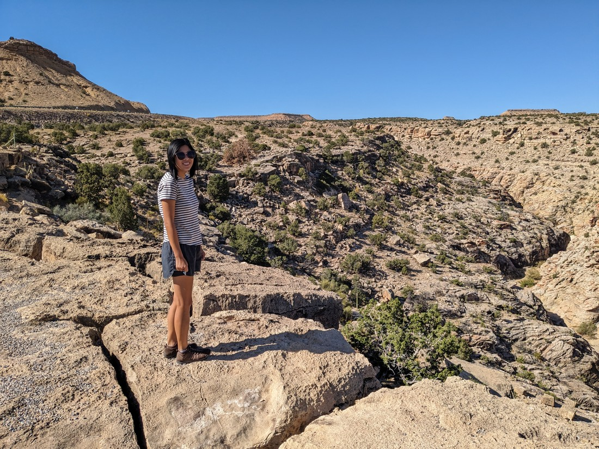
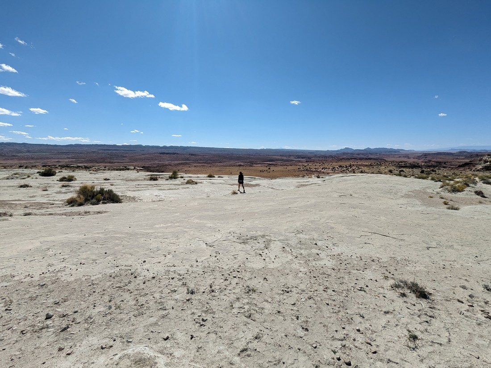

The last blog I wrote covered five days of travelling across eight US states. Well, this blog is only going to cover half a day of travelling across a single state. Why? Well, this is why:

> We're back baby!

Today we had about five hours of driving to do. This was slightly shorter than some of our recent days, but it was still 500 kilometres we had to travel. We also had a park that we wanted to visit at the end of those five hours so we didn't want to waste too much time.

But within the first half hour we'd made two stops.

Okay, so the first was to take a photo by the Utah state sign - which was just a short stop. The second was to eat breakfast since we didn't take the time to eat back in the campground. We found a rest stop with a bit of a trail to a hill overlooking the surrounding area.

I really don't know why but there is definitely something awe-inspiring about the scenery here. It's just so wide and open.

After scoffing down a muffin we were on the road again, though not for long. We'd forgotten to fill our petrol tank before we left Colorado. We were now travelling through unpopulated desert. Unpopulated desert doesn't tend to have many petrol stations. Very soon the petrol warning light had come on and it was predicting we had only 70 kilometres left in the tank. Then a minute later it was 61 kilometres. What? At this rate our tank will be empty within 10 minutes.

The issue is that speed limits here in Utah are quite high - 80 miles per hour / almost 130 kilometres per hour. At those speeds the car chews through petrol very quickly. Also, Utah is higher above sea level (the slogan on their license plates is "Life Elevated") so we've been driving uphill - using even more fuel.

Fortunately we made it to a gas station, although prices were a bit more pricey out here. Also the gas station hot chocolates we bought were unusually poor.

Again, we continued on. But again, not for long.

We're driving along and we spotted a sign for a rest stop / scenic viewpoint overlooking some interesting red rock hills. We hadn't been travelling long since breakfast but we couldn't help but make another stop.

This would become the story of our morning drive. We drive along but then spot another rest stop with an overlook over something and we'd say to each other, "Why not?"

After the third stop we agreed that it would become compulsory to stop at each view point.

> Thank you Bluey for bringing us here - you get lots of breaks today

There ended up being a lot of scenic rest stops along the highway. Which meant a lot of pictures.

> You might be wondering about the glasses. Well they were the cheapest I could find after my old ones broke. Plus it was also a charity thing and I grew to like the yellow.

And a lot of posing for pictures.

And a bit of mocking Betty for how she chose to pose.

> In her defence I don't think she was posing - I just took the picture at a weird time. But that didn't mean I wasn't doing to do this.

I don't know if these scenic rest stops just started happening or if we've been passing them all week and only now have we started stopping at them. I guess even if they had these in other states there wouldn't have been much to look at. Most states don't have views like this at the top of just some random hill that the highway decides to pass over:

> Though there is a definite lack of corn here

I don't really have much else to say - but here's a few more random pictures

> Betty and a whole lot of space

> Luke climbing a tree for no reason

> A road

So we had a lot of fun - and we didn't even do anything than drive. It was really nice that our route brought us back to this part of the country. We're likely not going to be on this continent for a while so one last trip through the south west was definitely appreciated.
