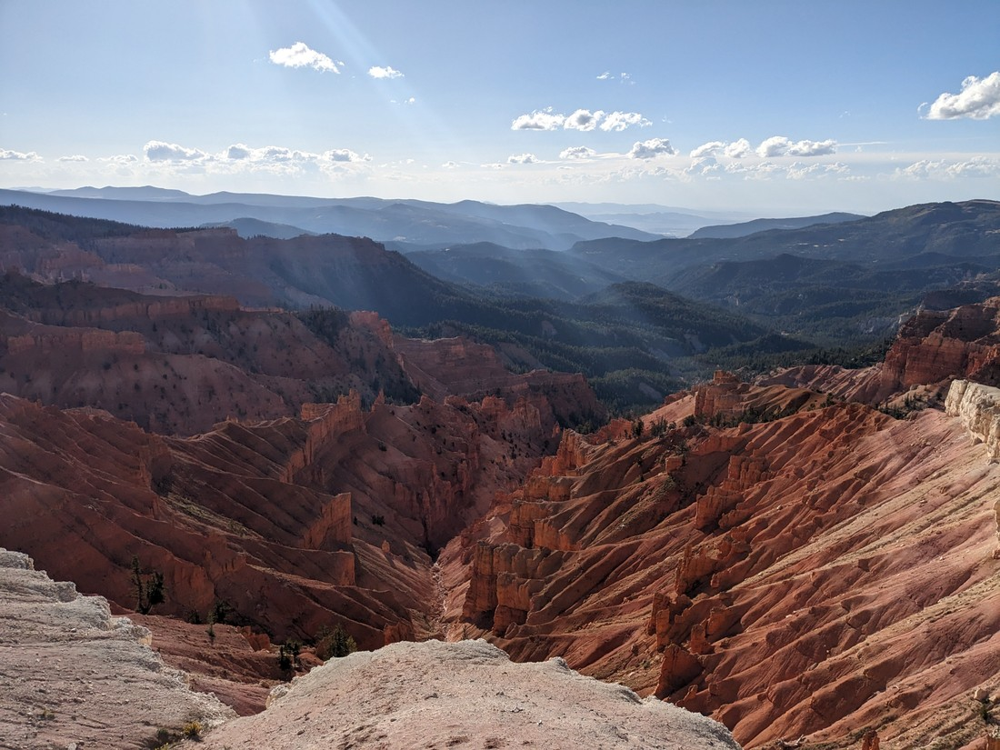

The date was May 8th, 2023. We had been travelling for just five days and already our travel plans had to change. The road to Cedar Breaks National Monument was still closed due to snow and so we had to go elsewhere. However now it is late September - the snow ought to have melted by now, right?

After five hours of driving, plus lunch and a whole bunch of scenic viewpoint stops, we were driving up to Cedar Breaks National Monument.

> USA: the land of park entrance signs

As we often do, our first stop in the park was the visitor's centre. However upon arriving we found that it was closed for the season.

Huh? Hadn't the "season" not started until mid-June? Now it was already closed. That's a very, very short season for a park. What gives?

Well, the answer is that this park is located at over 10,000 feet in elevation, which is over 3,000 metres above sea level. At this altitude things get a bit... cold. Summer arrived late and then finished early. Thanks to the sun it was warm while we were in the car but once outside there was a noticeable chill.

I took one look at a nearby sign and told Betty, "Don't worry about your jacket - the walk to the viewpoints will only take a couple of minutes."

> Do you see my mistake?

No, it wasn't "minutes" - nor was it "metres". The units on this sign were "miles". Okay, so this probably won't be a two minute walk.

So we packed our backpacks properly, put on our warm clothing and set off.

The first view wasn't actually that far along.

> Probably less than 2 minutes from the trailhead

Within a few minutes we'd come out of the trees and were greeted with a panorama view of the park.

> And what a panorama it was

The landscape of Cedar Breaks would usually seem quite unique. When I first saw the pictures I thought to myself, "That looks a lot like Bryce Canyon." It's not a coincidence. Bryce Canyon National Park isn't far from here - it's actually where we went instead back in May when this park was closed. But just because it is a bit familiar, that doesn't mean Cedar Breaks wasn't an amazing sight for us to see.

> I'm holding my hat because the people taking the photo just lost one of their hats to the wind. Fortunately I have a big head which usually keeps my hat in place.

I really don't know why Bryce Canyon gets the "national park" status but Cedar Breaks is only a "monument". The definition of a "park" was that it had to be a large area worth preserving. Is this not a large area?

Anyway, wasn't this a walk? The sign said there was a place called "Spectra Point" - shall we go see what that is all about?

Spectra Point was exactly what we were expecting - a point on the canyon rim sticking out slightly more than everything else. It wasn't bad, but it gave views of the same scenery we'd been looking at for the last mile.

> They might be the same views but we're still going to stop for photos

But we weren't complaining. We were out in the fresh afternoon air (and boy was it "fresh") enjoying the hoodoos, spires, and whatever other rock formations we were looking down upon. So we continued walking.

> Fortunately there's a lot more rim to walk along

Rampart Overlook was the same as Spectra Point - nice, but had the same view as the rest of the trail.

What now? We'd walked 2 miles which means we had to walk the same distance to get back. It would also be uphill on the way back. That sounds manageable, but remember that number from earlier - 10,000 feet. Hiking isn't as easy up here.

However there was one last point of interest which wasn't on the original sign called Bartizan Arch. I didn't know anything about it except that it was an arch, and the only reason I knew that was because it had the word "arch" in the name. It was half a mile away. Or maybe it was three quarters of a mile. Or was it more? The signs we'd seen weren't consistent. Do we go?

Well, we haven't been doing much walking at all for the last couple of months. I'm not sure when was the last time we did a proper hike in a park - we're definitely going to feel a bit wobbly in the legs tomorrow. However we were certainly still enjoying being here so we barely even stopped at Rampart Overlook before continuing on.

On the way we argued about what the definition of an "arch" was. We had learned the answer in Natural Bridges National Monument - how had one of us (Betty) forgotten already?

The arch turned out to be more visually interesting than we had expected.

> Also there were two of them

The trail led to the overlook above the arch - which is a stupid place to be, since we can no longer see the arch. Or perhaps maybe the official trail doesn't actually go to the top, but it unofficially does now because of all the hikers before us. There was a surprising lack of signs here. Were it not for the visible arches then we wouldn't necessarily know that this was the end of the trail. There were also no signs saying, "Do not walk on the arch".

...which we did not do - but I did get as close as I wanted.

I don't think these arches are as fragile as they look, after all they're made of solid stone and have survived centuries of weathering. But that doesn't mean I was about to stand on it.

It was now getting late in the day.

To get here we had driven for quite a long time, as well as making a lot of stops. Then we walked for a while making even more stops. It was now after 5pm. It was cold when we began this walk at 3pm. Fortunately we were often sheltered by the wind. And at least we were walking uphill - which kept us warmer than we otherwise would have been.

One positive thing about being here so late is that the hoodoo shadows were getting longer, making for even more pretty pictures. So there were some more stops on the way back.

On the drive back out we decided we'd better make some stops at some of the viewpoints we passed on the way in. The North View Overlook was far too windy and we were back in our car in no time at all. Sunset point was nicer.

I don't know if this is the best place to be at sunset. It looks like we've now passed peak Cedar Breaks scenic-ness. I guess it is the best place to view the sunset, facing west. Right now it was a bit glare-y, and we're not sticking around until sunset hour.

> Too cold!

Now let me tell you something about our car - the brakes have never been great. When we did the test drive I noticed that they were the opposite of touchy, requiring a fair bit of pressure. I don't know cars and kind of just assumed this was what Nissan Versas were like. However after driving many thousands of kilometres I couldn't help wondering whether the brakes needed attention.

Well the road back down was rather steep in parts. Roads usually have warning signs for gradients of six percent. Well this road had a grade of thirteen percent in parts. As we were driving down our car started making noises. Then those noises started changing pitch and became louder. The noises definitely didn't sound healthy.

Putting the brake pedal all the way down I brought the car to a complete stop, but as it did the car lurched weirdly. It was as if one of wheels was an oval shape. "Do we have a flat tire?" Betty asked. I didn't answer because I knew she was correct.

I pulled off the road, put the hazard lights, then got out to see how bad it was. The tires were... fine? The one we had suspected was flat was definitely still inflated. So what's going on? I put my hand near the wheel and felt heat radiating off it. I don't know much about physics but I know friction creates heat - but is this a normal amount of heat?

Well what are we going to do now? We're halfway down a hill with dodgy breaks. I guess we'll just give them a rest for a while. After that while had elapsed we decided to continue on. The brakes still seemed okay but we kept the car speed to a minimum just in case.

We made it down okay. I guess we should get the brakes looked at? It feels a bit hard to justify when we know we're going to be selling the car soon. Anyway, it'll be a decision for a later time.

Again, the decision to go road-tripping through USA seems to be proving to have been the right decision. It's so nice to be exploring again.
