Over the last six days we have travelled roughly 3,500 kilometres. A lot of things could have gone wrong when travelling such a distance. So we built had a day of "wiggle room" into our itinerary- just in case. And when we realised that this part of Utah was on our route, why not have our "wiggle room" day in the place we enjoyed the most in our spring/summer travels? In fact, why not add a second "wiggle room" day to our itinerary? You know, just in case things go really pear-shaped.

Well things did not go pear-shaped. They remained normal-shaped. Which is...? Circle-shaped? Apple-shaped? Anyway, that's not important. What's important is that we now have up to three days in this area to do as we want. And as it happens there were also three park areas that we couldn't visit back in May due to weather-related issues. We managed to fit Cedar Breaks in yesterday afternoon. Next on the list is a hike (of sorts) called The Narrows, found in Zion National Park.

However there's a few steps we have to take to get there.

Step 1: Get up early.

This was surprisingly easy, probably because we were in bed earlier than usual - likely thanks to yesterday's hike as well as the changing time zones.

Step 2: Pick up lunch

This walk was going to be an all-day affair so we needed to pick up our lunch before entering the park. So we made a quick stop to Subway.

Step 3: Drive to Springdale

This wasn't the hardest step - the town was a little more than an hour away.

Step 4: Pay for parking

The town of Springdale enjoys being on the doorsteps of Zion National Park and so you don't get anything for free here. Parking is expensive here, unless you park at the north end of the city, then its even more expensive. I think it cost us about $50 NZD for a day of parking. But we really wanted to do this walk so we decided not to think too much about it and just paid the machine.

Step 5: Catch the bus to the park entrance

Fortunately the premium parking spot meant we could just walk there instead

Step 6: Queue to catch the bus into the park

Naturally this involved a lot of standing around.

Step 7: Catch the park bus to the end of the line

Naturally this involved a lot of sitting around. Even though we had got up early it was now nearly noon by the time we exited the bus. And this isn't even the last step.

Step 8: Hike to get to the start of the hike

There was a mile-long trail to get to the start of The Narrows hike.

While it takes a bit of effort to get into Zion National Park, upon entering it immediately feels worth it.

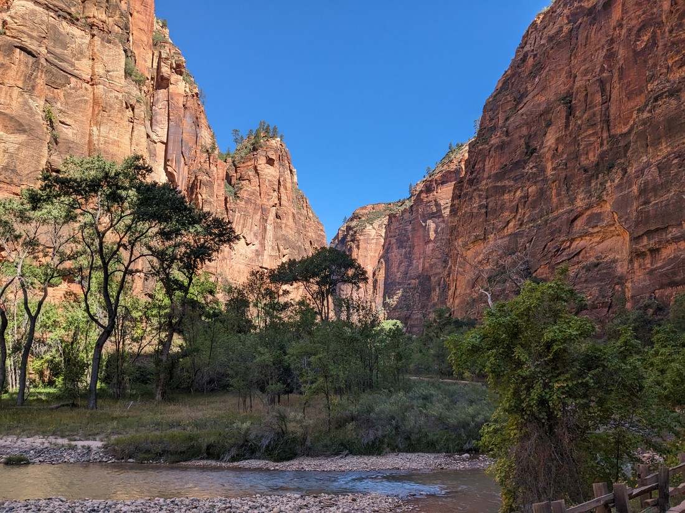

> Those red rock walls are iconic

Even if you just caught the bus in and out, you'd get to see quite a lot of stunningly-coloured rock. Speaking of the bus - it contains information as well as warnings not to feed the squirrels human food because it makes them fat. Well, as we walked along we found some of those squirrels:

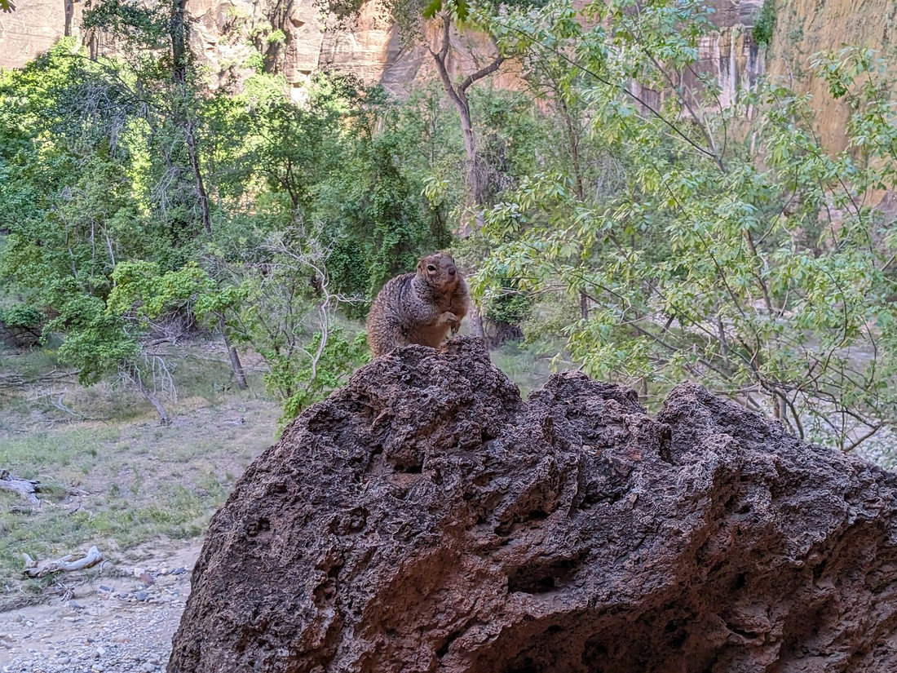

> It looks identical to the warning posters

Anyway, we're here to hike so let's get to it. Here is the start to the Narrows walk:

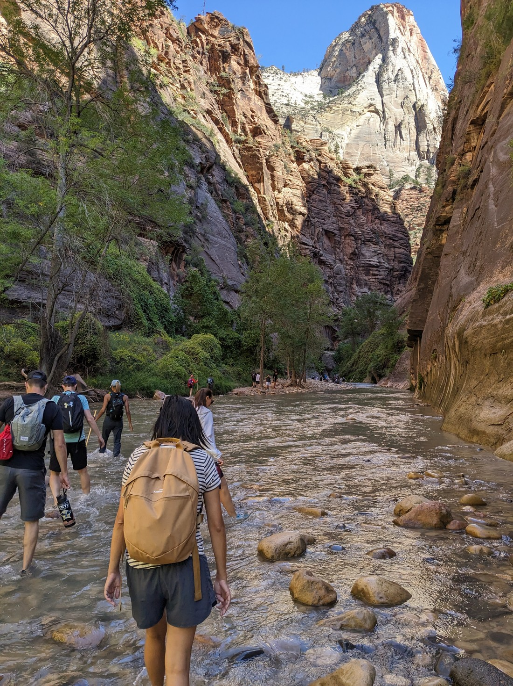

> It's wet

The trail goes through a slot canyon - which is a thin, deep canyon carved by running water. Unfortunately the stream still flows through this canyon and often the canyon is just the same width as the canyon. There's no trail here. For much of the hike we'll be walking in the stream.

Fortunately there were some parts of the canyon which were not underwater. Usually everyone would cross from side to side to minimise the amount of time getting wet. However this lasted only so long. After three crossings, one after another, we came to a particularly thin part of the canyon. While before the water was only thigh-high - this went a lot deeper.

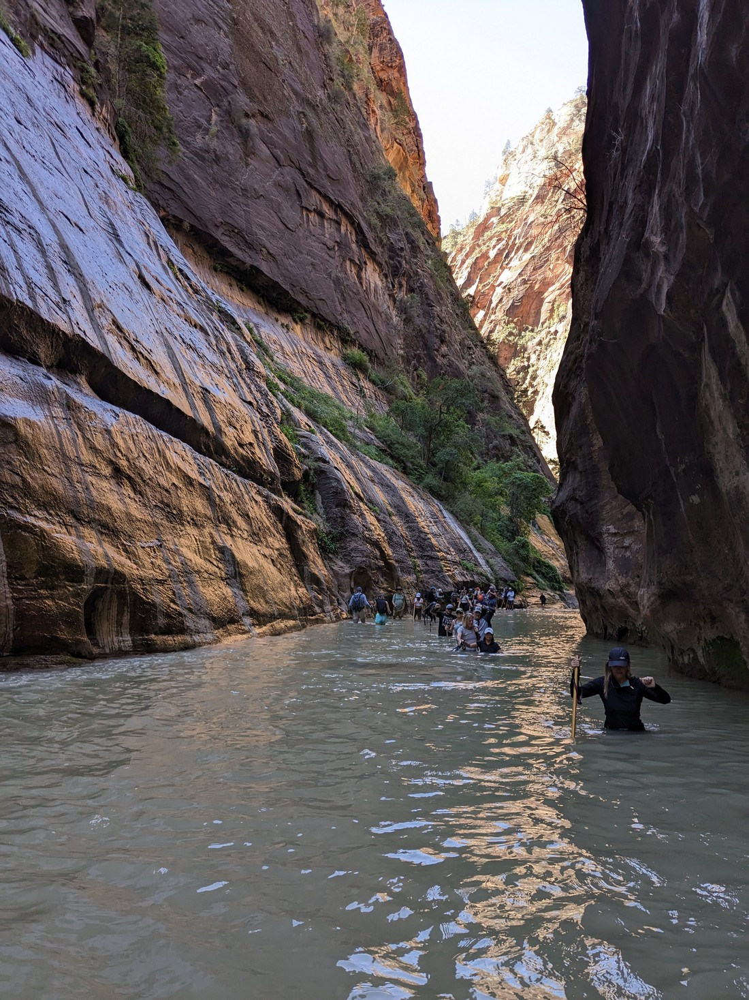

We carried our backpacks above our heads to ensure they were kept out of the water. In order to get into the park I had needed to show ID so mine was carrying my passport (though in a zip-lock bag). Also we had a footlong sub - we definitely don't want that to get soaked.

Here is Betty indicating how high the water came up to:

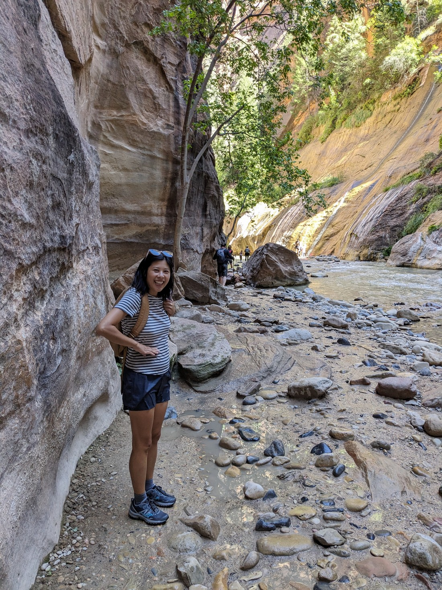

> As you can see the water was about 0.6 Bettys deep

It should have been obvious but hiking through water is a lot different to hiking through not-water. Our feet were always going to be getting soaked - there was no way around that. Sure, you could hire some rubber boots but unless they reached our chest they were not going to keep our feet dry. I think they were more to help keep our feet warm. Even this late in the season the water is still originally from snow-melt, and this deep in the canyon it doesn't get warmed by the sun much - so it can be quite cold. Fortunately neither of us had an issue with the water temperature.

> I was intending to erase shirtless-man-who-wouldn't-stop-standing-by-the-waterfall out of the photo, but I appear to have forgot

Another issue was trying to walk without falling over. The stream bed is full of rocks - none of which are flat. The water also isn't very transparent so we couldn't see what we were stepping on or how solid our footing was. Many people had hired sticks to help them balance themselves as they walked through water. Well, Betty and I had a better idea:

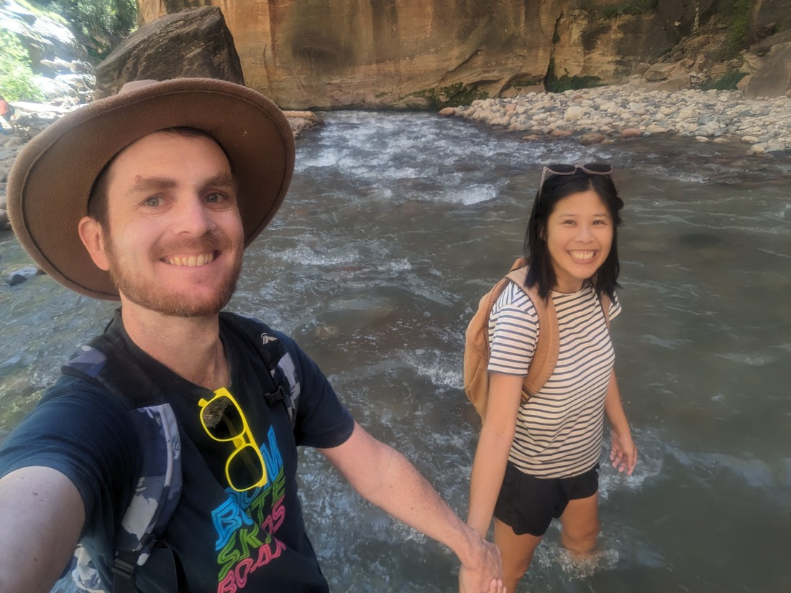

> Sometimes we do this even when we're not hiking through water

We were each others' sticks. It worked exceptionally well. I don't know why more people weren't doing this. I guess there's a risk that if we both wobbled in the same direction a the same time then we might both end up in the water but that didn't happen. We could also move quite fast because we weren't needing to ensure our sticks were secure before leaning on them.

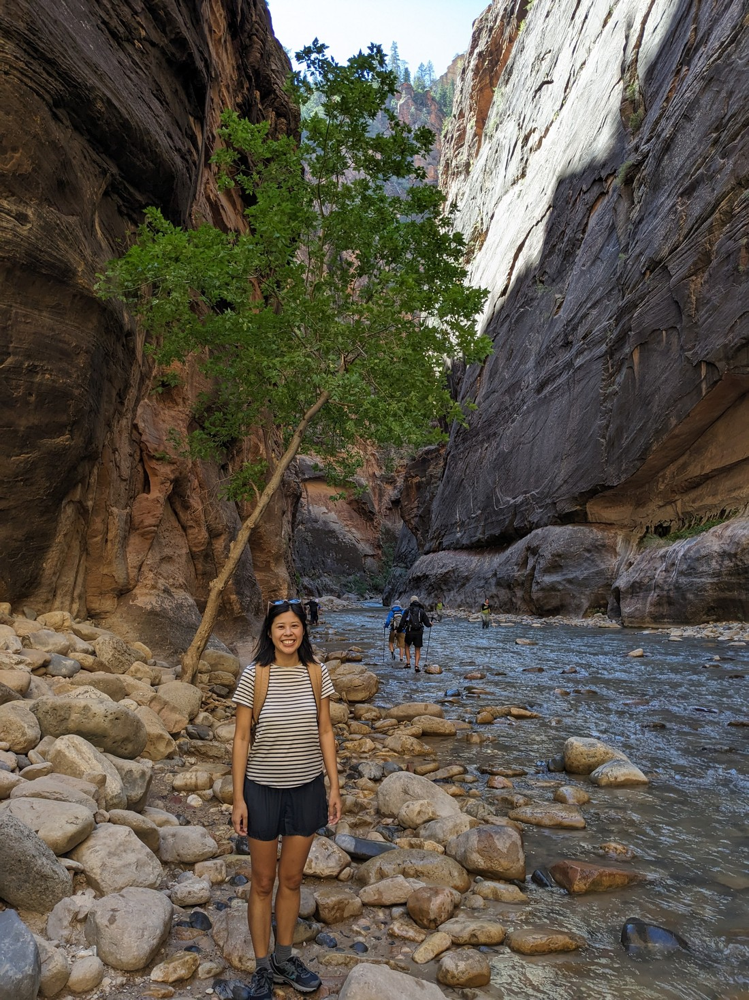

> Look at those suckers in the background with their sticks

So why are we here? Why are all of us here? You may notice that there are a lot of other hikers in the pictures. This is a popular hike after all. Well, it's popular for the same reason the non-Narrows part of Zion is popular - the beauty of the canyon itself.

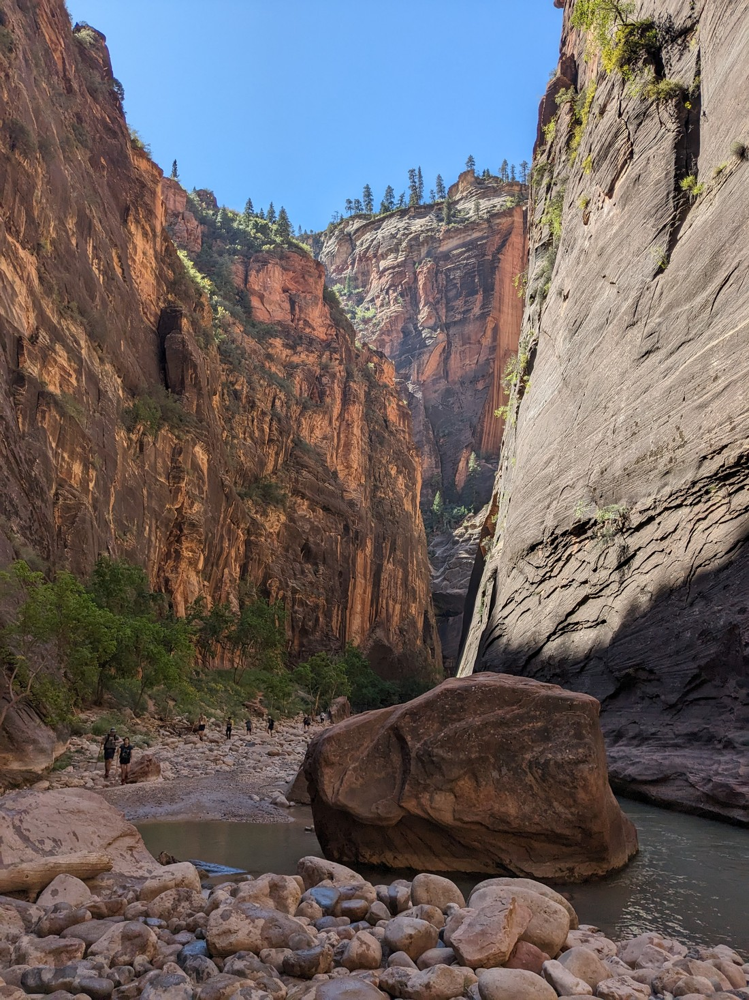

It's just a shame we had to spend so much time staring down, lest we stand on a rock incorrectly and end up sideways in the water.

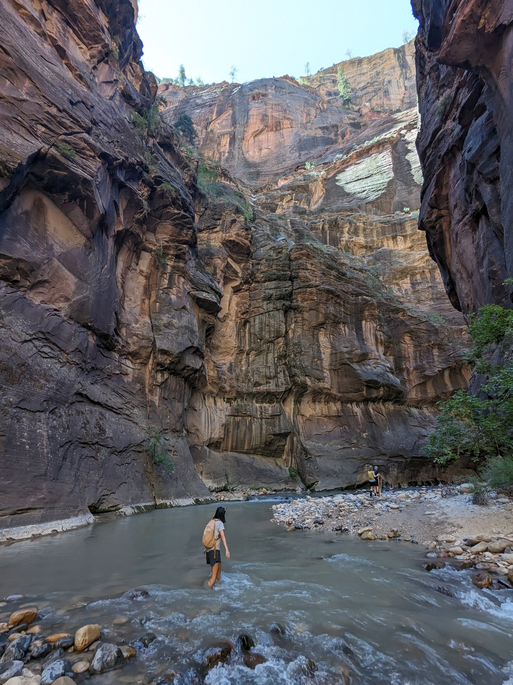

> The current in some parts wasn't helping

As you can see from the photos we were in the water quite a lot. This was certainly an excellent time of the year to come. Once the initial cold shock passed we never thought about the water temperature ever again.

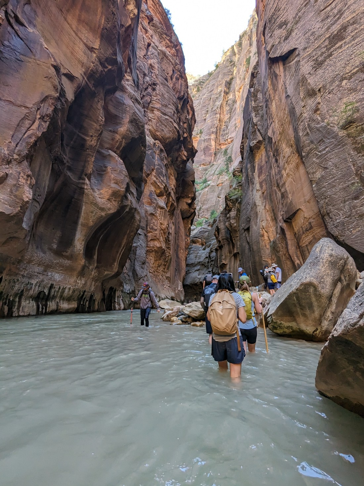

> Traffic jam

So where are we going? Well there is an end point where the canyon ends - something like 20 kilometres away. Needless to say we're not going that far. I guess this hike is relatively flat, but that's quite the distance to hike when the trail is either rocks or knee-deep water.

We knew there was a junction coming up at some point, but we had no idea how long it was going to take to get there. There aren't any signs down here, nor are there landmarks. However after about 1 hour and 45 minutes (part of which was us devouring a shared sandwich) we made it to the junction.

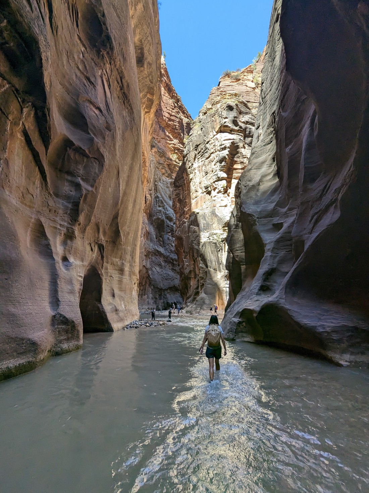

Now what? As you can see the walls are quite thin and high here. There was a single patch of sunlight and a group was crowding to stand in the sun's warmth. Well, there seems to be no reason to just stop here. So we picked one of the two branches and kept walking.

But after ten minutes of further walking our motivation was starting to be questioned. Sure it's nice down here but it's been this nice for the last two hours but the walls are pretty indistinguishable from each other. We're going to get more of them on the way back anyway. Two more hours of walking is probably enough, right?

So we walked to the next corner to ensure there wasn't anything amazing around it we would have missed by a few metres - then we turned back.

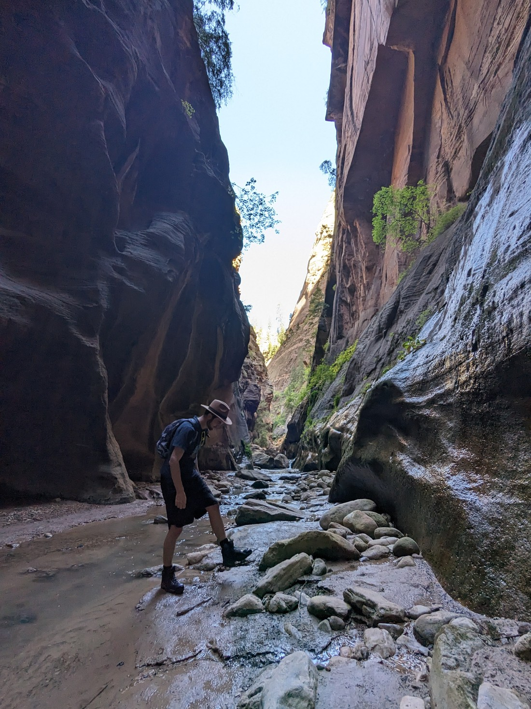

Like the time of the year, we probably are hiking at the perfect time of the day. The sun is relatively overhead and so it shines down into the canyon a reasonable amount - especially when the canyon curves the right way. Often we'd stop to take a photo of ourselves with a particularly colourful section only to realise that we can't avoid standing in the shadow.

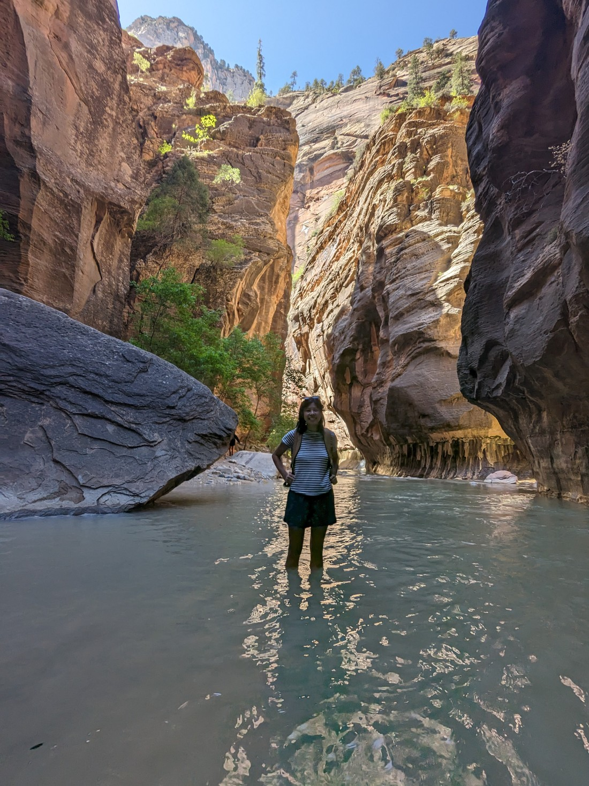

> If only Betty was about 20 metres taller

Today I took a lot of photos. This was because I was never sure how well these photos would come out. And I was right. Too much sky and the canyon was too dark. Not enough sky and the little sky we got might be too bright. This is also exacerbated by the canyon height, width, and angle.

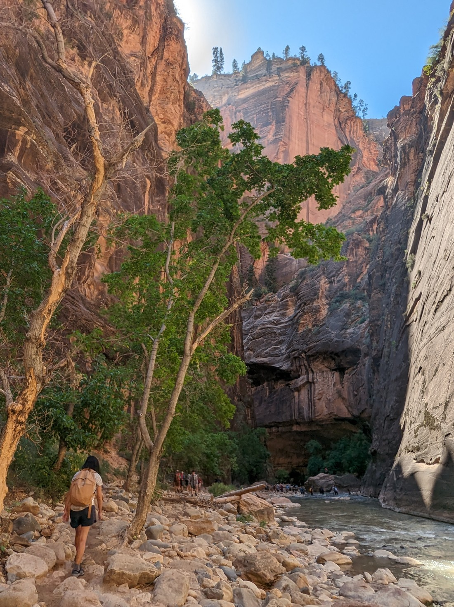

Unfortunately lots of the photos turned out quite nicely and so it was hard to select a few for this blog post.

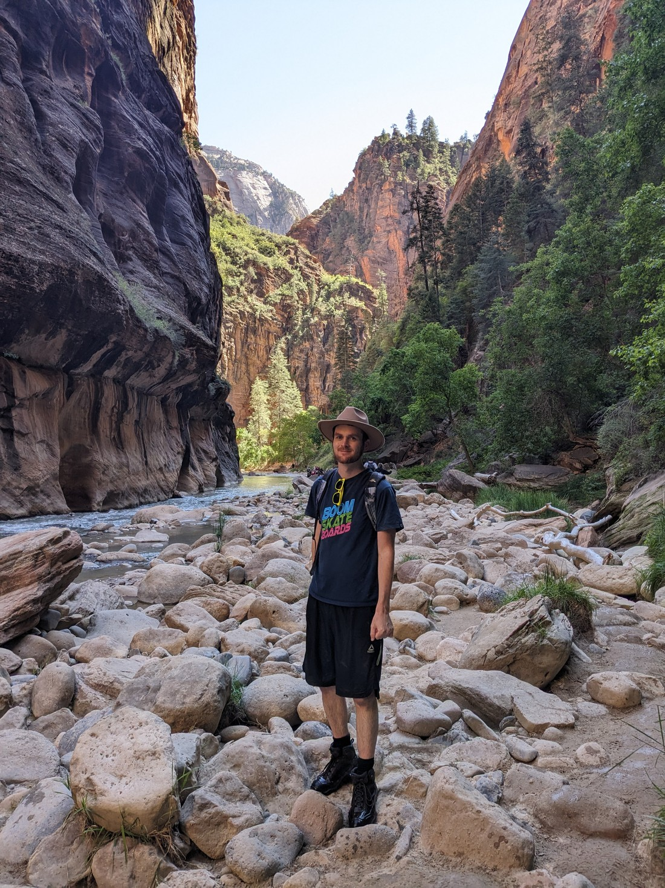

> This was despite me taking up much of the image

We were a lot less careful on the way back. On the way up we had taken our time. Waiting patiently in a queue of other hikers to cross the stream in the most ideal places. Even after we walked through the waist deep water we still took it carefully. And perhaps that was a good thing. Who knows how many times we would have fallen over if we had rushed from the outset.

Well on the way back we were less careful. We walked very fast, overtaking other groups by entering waters no one else dared enter.

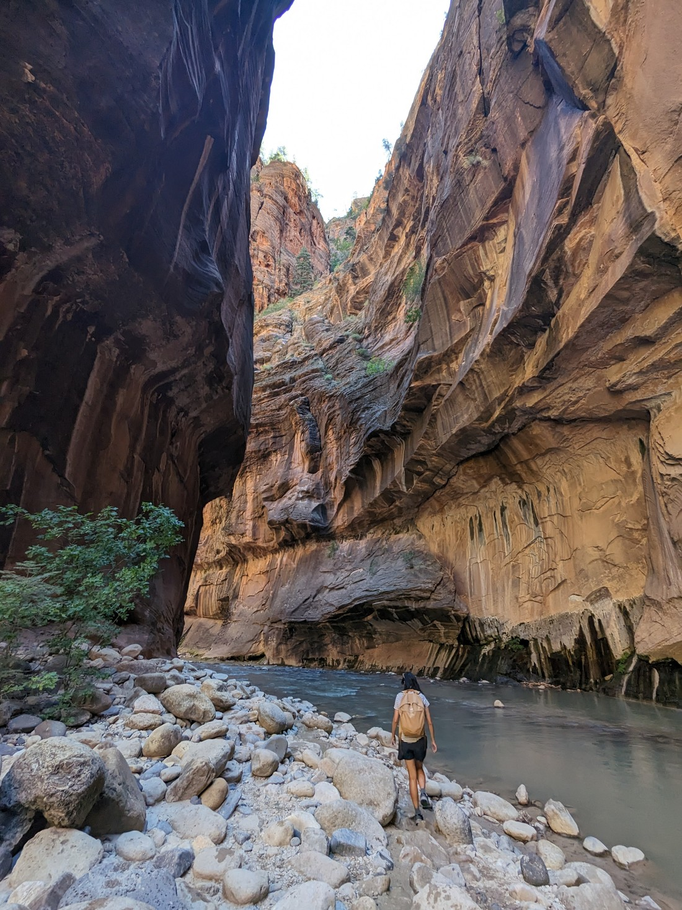

> Although most of the photos I have are of us on rocks. I can't accidentally drop the phone into water here. ...just onto the rock-hard rocks.

Something we had noticed that deep water doesn't necessarily mean danger. While walking through water there is an increased risk of falling over - to a point. Once the water gets deep enough the water actually helps with stability. You can't move fast in water, but that also means that you can't fall over fast. Also, we were now walking downstream so the current was nicely helping us along.

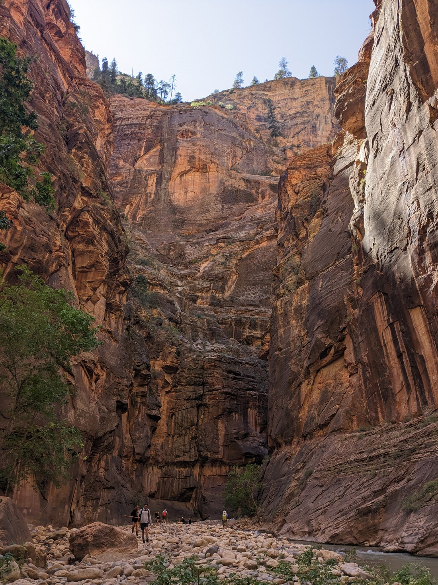

Looking at the timestamps on these photos it looks like we made the return trip in about 1 hour 40 minutes. That's slower than I expected. It seemed like we were racing back downstream. Perhaps we were tired. Pulling your legs through water feels like quite the workout. I suspect our leg muscles might be complaining tomorrow. But looking at the bright side - we never fell over on the hard rocks or the wet water.

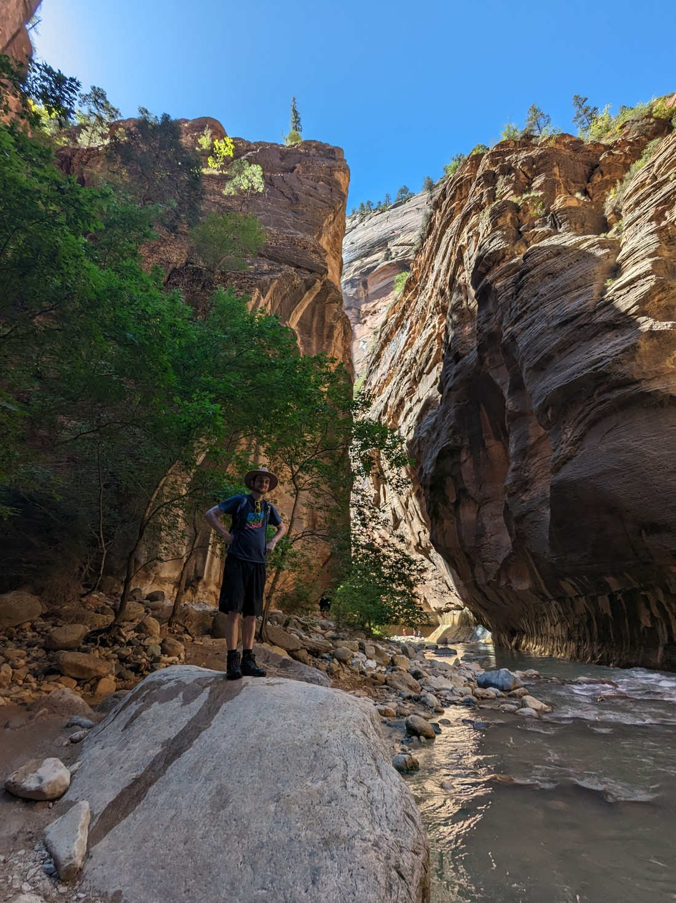

> That was despite some risky manoeuvres to clamber up onto some rocks for photos

When we had to re-enter the deep part near the start I was surprised to find that there were still a lot of people just starting the walk. I suppose that's fine, but the buses don't actually run that late. I hope these people aren't going very far.

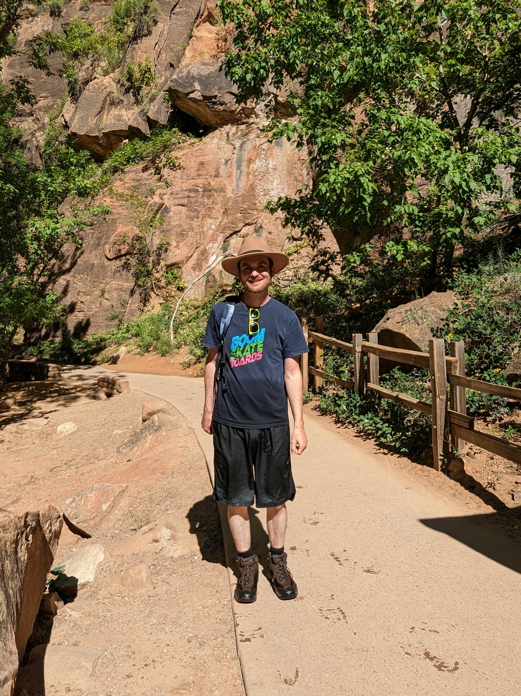

> I am also surprised they're not turned off by how wet we are - is there a certain level of wetness where they won't let you on the bus?

Speaking of buses again, unfortunately our adventure for the day is not done. Remember those steps that I listed at the start? Well, we now need to basically do them all again but in the opposite order. Starting with queueing.

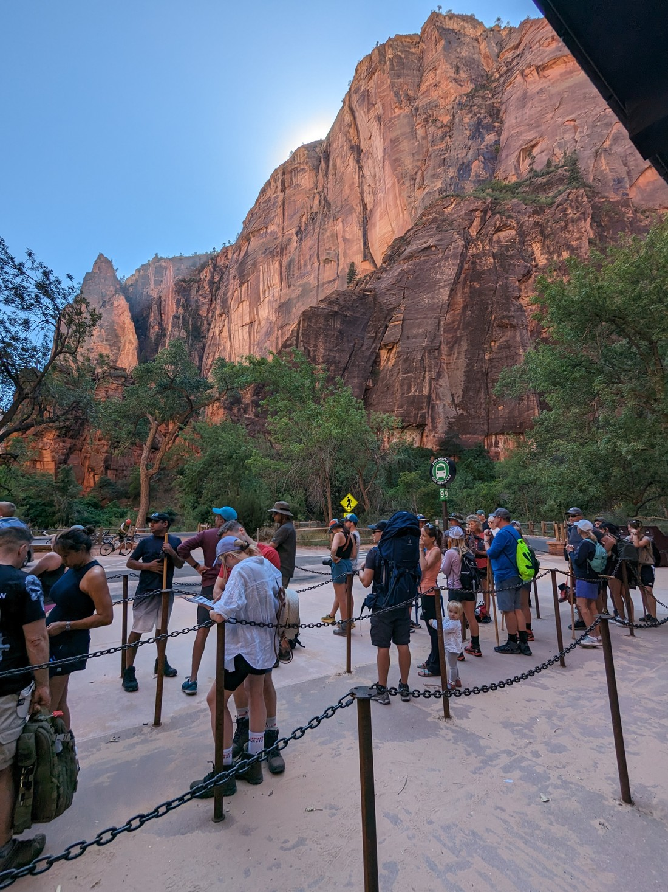

Zions bus system ordinarily seems quite good, but it seemed to fall apart at this moment. Everyone seemed to be finishing their Narrows walk right now. The queue for the bus went from being half-full, to full, then snaking down the trail out of sight.

Once we were crammed in the bus with as many other people that we could fit, the bus was still obliged to stop everywhere on the way back - which was usually pointless since no one else could get on. It was a long wait for us and we had it best since we caught one at the start/end, which mean the buses were always empty where we got on.

But eventually we made it to the somewhat nearby town of Kanab. At our accommodation I almost lost my passport. We handed it over to the reception person, but then they were called away for a couple of minutes and their second-in-command took over.

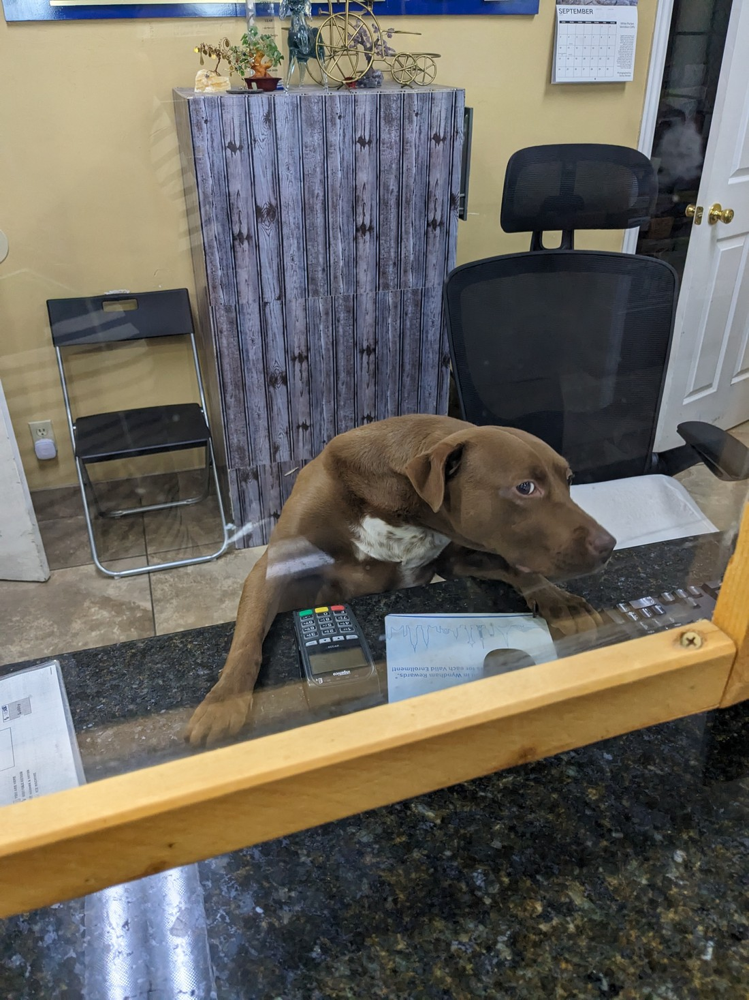

> "Your room will cost 75 belly rubs"

I don't know how I feel about the Narrows walk. Looking back at the photos it seems like a pretty epic walk. It is a nice tale, even if unfortunately we never embarrassingly fell over. We did get to spend a fair bit of time marvelling up at the glowing red rockfaces. I bet it's the people. Sharing a trail (or in this case a stream) with hundreds of other people just doesn't give the same feeling of being amongst nature.

However we were still glad we did it. That's one more ,thing to cross off our Utah bucket list. Just one more to go.
