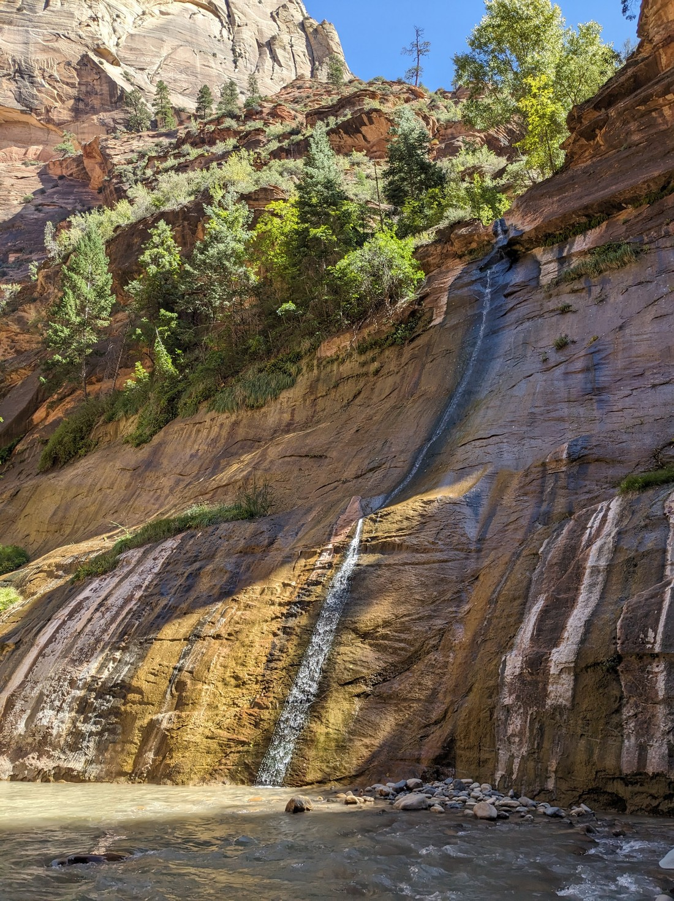

Over the last six days we have travelled roughly 3,500 kilometres. A lot of things can go wrong over that distance. Just in case something went wrong we built a day of "wiggle room" into the itinerary. And when we realised that this part of Utah was on our route, why not have our "wiggle room" day in the place we enjoyed the most in our spring/summer travels? In fact, why not add a second "wiggle room" day to our itinerary? You know, just in case things go pear-shaped.

Well things did not go pear-shaped. They remained normal-shaped. What shape is that? Circle-shaped? Apple-shaped? Anyway, that's not important. What's important is that we now have up to three days in this area to do as we want. And as it happens, there were also three park areas that we couldn't visit back in May due to weather-related issues. We managed to fit Cedar Breaks in yesterday afternoon. Next on the list is a hike (of sorts) called The Narrows, found in Zion National Park.

However there's a few steps we have to take to get there.

Step 1: Get up early.

This was surprisingly easy, probably because we were in bed earlier than usual - likely thanks to yesterday's hike as well as the changing timezones.

Step 2: Pick up lunch

This walk was going to be an all-day affair so we needed to pick up our lunch before entering the park. So we made a quick stop to Subway.

Step 3: Drive to Springdale

This wasn't the hardest step - the town was a little more than an hour away.

Step 4: Pay for parking

The town of Springdale enjoys being on the doorsteps of Zion National Park and so you don't get anything for free here. Parking is expensive here, unless you park at the end of the city nearest the city, then its even more expensive. I think it cost us about $50 NZD for a day of parking. But we really wanted to do this so we paid the machine.

Step 5: Catch the bus to the park entrance

The premium parking meant we could just walk there instead

Step 6: Queue to catch the bus into the park

Naturally this involved a lot of standing around.

Step 7: Catch the park bus to the end of the line

Naturally this involved a lot of sitting around. Even though we had got up early it was now nearly noon by the time we exited the bus. And this isn't even the last step.

Step 8: Hike to get to the start of the hike

There was a mile-long trail to get to the start of The Narrows hike.

While it takes a bit of effort to get into Zion National Park, it does feel worth it upon seeing all the vertical red walls.

Even if you just caught the bus in and out, you'd get to see quite a lot of stunningly-coloured rock. Speaking of the bus - it contains information as well as warnings not to feed the squirrels human food because it makes them fat. Well, as we walked along we found some of those squirrels:

// The red walls are so beautiful

// Maybe a good thing we didn't start early because the sun is now mostly overhead

// Lots of people with poles and hired shortest

// Fat squirrels

// Crossed the river three times - fourth time was very deep. Had to hold our bags out of the water - after all my passport was in my bag since we needed that to gain entry

// Held hands to cross the water. Often couldn't see what we were walking on and the river bed was very uneven. Holding hands seemed easier than the poles.

// Lots of people

// Very high walls

// Can go as far as you want. We made it to the junction, then went a bit down each path before turning back

// A lot less careful on the way back. Just walked fast down the river, not caring to stay to the busy shallows

// Didn't fall over

// Getting back out of the park took a while. Some long queues for the buses, which also took a while

// Drove to Kanab. Frozen meals for dinner
