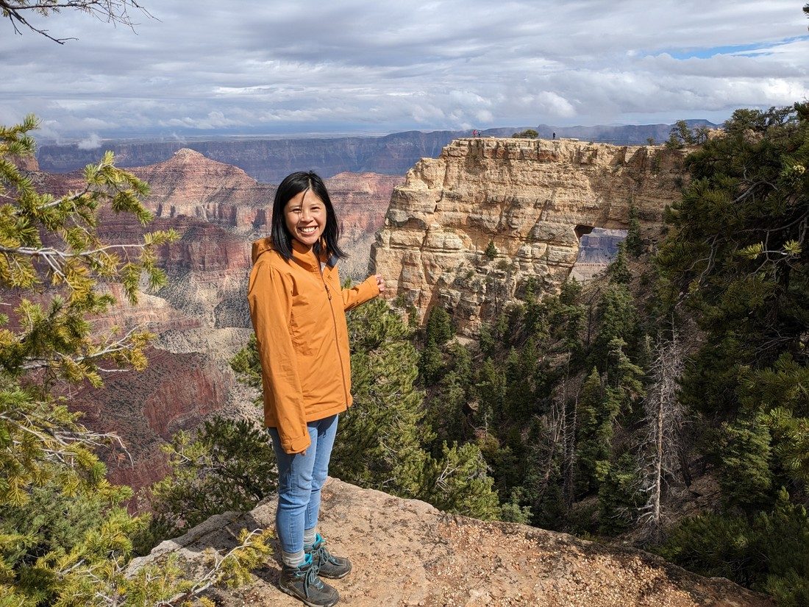

// Weather said it was going to rain. Google forecast thought it was going to rain in the morning and then again in the late afternoon. So we didn't leave very early in order to try miss the morning rain

// Had identified a couple of sights to see on the drive to North Rim, but it started raining so skipped them. Will probably grab them on the way back

// Free parks day, but hopefully not too busy because of how remote North Rim is. We already had a pass of course but a shame for everyone else that the weather was poor today.

// Arrived in North Rim and it was still raining. Lots of cloud about. We got a glimpse of the canyon and it was nothing but white.

// Well, may as well take a look. Walking from the car we got a glimpse

// At the Bright Angel Point it seemed like the cloud was mostly on one side

// Lots of photos. What is it about grand canyon that makes us want to take lots of photos

// Started raining after we were finishing a forest loop. Went to the gift store and couldn't agree on whether to buy a jigsaw puzzle

// Legs in no shape to walk into the canyon so only thing left to do is the scenic drive.

// Didn't take too long to get to the first stop which was the highest part of the park. Luke got sent out by himself while Betty stayed dry and warm. Obviously couldn't see anything due to the clouds

// Figured we could drive the rest. Arrived at the end. It was still raining and still in the clouds. Decided to eat our lunch

// Luke was sent out once again. He got to the window viewpoint and couldn't see anything. The trail went on further. He figured he'd go back and get Betty anyway.

// Upon arriving at the point the clouds were parting and we could see the canyon again

// Lots more photos.

// Went back to window Point. Sky was actually turning blue.

// Eventually decided to drive back along the viewpoints we had missed

// First one was similar. But we got more clouds before we got more viewpoints

// Rain was even worse on the way out so the stops that we missed on the way in remained missed.

// Saw some deer
