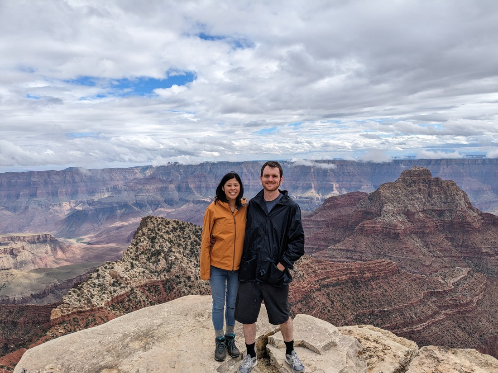

Grand Canyon North Rim was the third place we had intended to visit in May but couldn't due to some stubbornly persistent snow. Unfortunately the weather wasn't expected to be very good today either. Yesterday in Zion there had been clear blue skies all today. Today it would rain. When would it rain? Not sure. Sometime in the morning perhaps?

We departed Kanab, intending to arrive around noon - hopefully when the rain would have passed. Well not long after we left our accommodation we hit the rain, which just got wetter and wetter as we drove.

We drove straight past the entrance sign. "Too wet, we'll get it on the way back," we told ourselves. We also basically drove straight past the entrance booth. Today is actually NAMEGOESHERE day, which means all the parks are free to enter. At least North Rim is really far from any major cities so hopefully it won't be swarmed with people trying to take advantage of the free entry.

We arrived at the carpark by the visitor centre and it was still raining. Okay, what now? The answer was obvious - we should use the restrooms. After all, the drive had not been a short one. During the five minutes it took for us to do our business the weather did seem to start clearing up. We had set out to hopefully arrive right after the rain finished. Perhaps we timed it almost exactly right.

We grabbed our rain jackets anyway and set off to walk to the most popular viewpoint in the park. Near the carpark was a shelter where a park ranger offered to take our picture overlooking the canyon. Here's what we could see:

> On the bright side, it's not entirely covered in cloud

I guess even if we managed to arrive just as the rain finished, that doesn't mean the clouds magically disappear. Remember how I said there was still snow here in May? Well that's because North Rim is quite elevated - a full XXX metres higher above sea level than the South Rim. I guess it's not surprising that we're standing amongst the clouds.

We walked on anyway and lo and behold, we could actually see stuff!

This was exciting. We came round a corner and there was a mostly cloud-free section of the canyon in front of us. "Quick," I said. "Take my photo before it disappears."

Obviously I needn't have been so hasty. The clouds seemed to be clearing. However, I do get excited when I see tiny clouds lower than the mountains. I think it makes it look extra scenic.

As we continued walking towards the point we noticed that we were walking along a ridge. To our right was the mostly unclouded view, but to our left was still the solid mass of white.

// Weather said it was going to rain. Google forecast thought it was going to rain in the morning and then again in the late afternoon. So we didn't leave very early in order to try miss the morning rain

// Had identified a couple of sights to see on the drive to North Rim, but it started raining so skipped them. Will probably grab them on the way back

// Free parks day, but hopefully not too busy because of how remote North Rim is. We already had a pass of course but a shame for everyone else that the weather was poor today.

// Arrived in North Rim and it was still raining. Lots of cloud about. We got a glimpse of the canyon and it was nothing but white.

// Well, may as well take a look. Walking from the car we got a glimpse

// At the Bright Angel Point it seemed like the cloud was mostly on one side

// Lots of photos. What is it about grand canyon that makes us want to take lots of photos

// Started raining after we were finishing a forest loop. Went to the gift store and couldn't agree on whether to buy a jigsaw puzzle

// Legs in no shape to walk into the canyon so only thing left to do is the scenic drive.

// Didn't take too long to get to the first stop which was the highest part of the park. Luke got sent out by himself while Betty stayed dry and warm. Obviously couldn't see anything due to the clouds

// Figured we could drive the rest. Arrived at the end. It was still raining and still in the clouds. Decided to eat our lunch

// Luke was sent out once again. He got to the window viewpoint and couldn't see anything. The trail went on further. He figured he'd go back and get Betty anyway.

// Upon arriving at the point the clouds were parting and we could see the canyon again

// Lots more photos.

// Went back to window Point. Sky was actually turning blue.

// Eventually decided to drive back along the viewpoints we had missed

// First one was similar. But we got more clouds before we got more viewpoints

// Rain was even worse on the way out so the stops that we missed on the way in remained missed.

// Saw some deer
