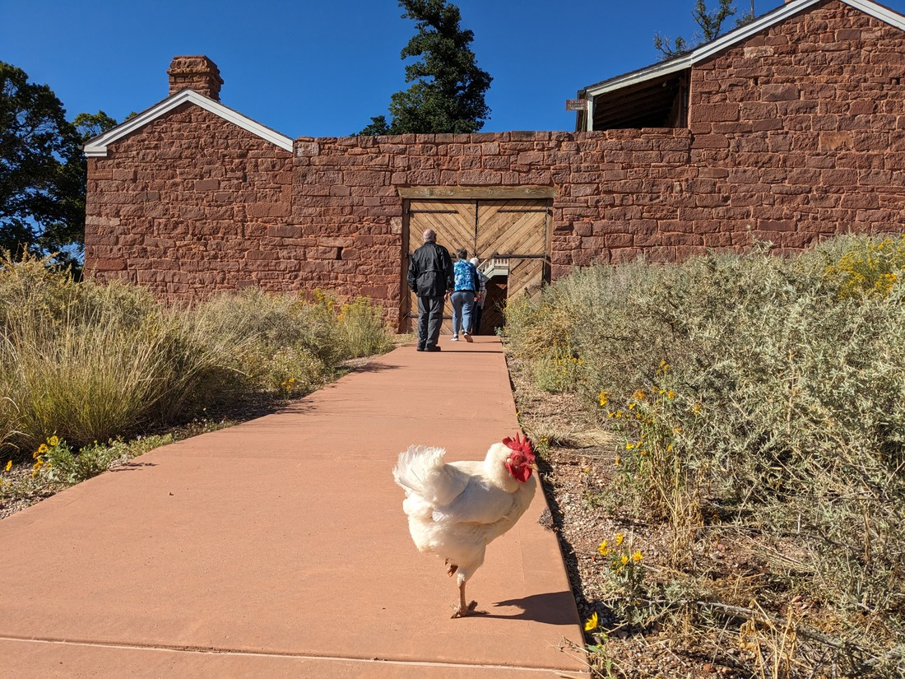

Good news! We have a whole day and less than three hours of distance to travel. That means we can faff about today. That's it. That's all the intro you're getting for this blog post.

Our first stop was to be Pipe Springs National Monument. We had seen it advertised on a jigsaw puzzle we didn't end up buying yesterday. We also know we can get in free with our national parks card. Other than that we didn't know anything about it. But we figured, why not? Let's go in blind.

The time was 8:45am. Google Maps said it would take 40 minutes to drive there, but also warned it wasn't going to open until 8:30am. It turns out the road we were taking crossed south into Arizona briefly, which is in a different time zone right now, and the place was on that stretch of road. It also means the title of this blog post is already wrong but it's still better than "Miscellaneous adventures mostly in Utah but some in Arizona."

Pipe Springs National Monument is a historic place devoted to teaching the history of settlers, Mormons, and Native Americans who used to live in this area. The main attraction here was Winsor Castle:

> A lot more orange than "Windsor" Castle. Also more chickens.

The fortified square structure was built by Mormons as a fortress due to potential trouble with the natives. This trouble never occurred and for most of its history it operated as a stopping point for travellers. Basically a nineteenth century B&B.

The park is actually located on land which is now an Indian Reservation. It was certainly a bit weird to learning about predominantly Mormon history here.

There was a short walk nearby and despite being in the desert, it wasn't hot yet. So off we went.

There was a museum here as well, but it was super dark. We had a brief look around but we really didn't want to be in there when we could be out here.

Pipe Springs was just stop one for today. Today we were just planning to drive around and do a bunch of small activities in this area. However before we could continue driving, we were unfortunately sucked into the gift shop. The jigsaw puzzle from yesterday was also here and this time I was convincing enough that we should buy it. Now we just have to figure out how to get it back to New Zealand.

Our next attraction was Sand Caves. We'd driven this road a couple of times and seen the caves up in the hills near the road. Now we're back to check them out. This required a short walk and then a bit of a scramble up a part of the cliff. The trail was very hard to follow but fortunately there were a lot of other people about - so we just walked toward where everyone else was.

It seems a bit uninspired to just call these caves "Sand Caves". They were strangely rounded, tunnelling into the brightly coloured rock that Utah is certainly known for. However the floor the caves were very sandy so I guess it can keep its name for now.

It also had a bunch of windows out of the cliff face.

You can certainly see why this place got our attention when we drove past it a couple of days ago.

On the way back out we had to scramble back down the rock we climbed up. This turned out to be a bit of a problem. The rockface was rather smooth and everyone's shoes were now covered in a layer of sand. Ours still had enough grip, but a few other people had lost all confidence in their shoes.

Next stop was lunch. The less I say about this the better.

After lunch we stopped by a place called Best Friends Animal Society. We didn't know what to expect - its website was not clear at all. We when walked into the gift shop / reception area and we still weren't sure. However it sounded like this place has had a lot of tourists come through over the years. What have we come here for?

The girl at the counter asked if we wanted to join a tour. We were like, "sure." She then made us provide our contact details. Afterwards I couldn't help but comment, "So you haven't mentioned a price yet." It turns out it was free. It was an hour long tour that wouldn't involve spending any time actually in any of the facilities. That just raised more questions. How big is this place?

We had to wait around for half an hour, but fortunately there were kittens!

Unfortunately those kittens were very sleepy. I usually think of kittens as being constant balls of energy, but not these ones. They must have been tired from all the playing they did earlier.

We were not the only people on the tour, but in many ways we were. The only other couple had brought their dog along so they had to follow in their own car, listening to the driver's commentary through the radio. So this tour just felt like a personal guided tour. They couldn't ask questions but we could.

We were really kicking ourselves when we found out there was a $5 vegan lunch buffet open to the public. We should have come here for lunch rather than Subway for the third day in a row.

At the end of the trip the driver announced that we'd be receiving a gift bag to take home. So not only did we not have to pay for this guided tour, we were actually given a small assortment of merch. Naturally we felt obligated to make a donation. But at least it was an obligation because we had seen the good work

// Next stop was the Sand caves. Bit of a walk through a desert, then up a cliff. Lots of people struggling with slippery sandy shoes. Bit of a shame to see lots of names carved into the stone.

// Taken around the ranch and explained the various buildings and what they do. Something like 200 employees, 1600 animals. Horses, cats, rabbits, dogs, goats, pigs. Animals that either have behavioural issues of health issues. Lots of buildings for specific purposes - eg animals with certain contagious conditions. Also an extremely large cemetery, which brought things down to earth a bit. Apparently it was open to the public, and lots of graves showed signs of care. We were the only two people in the bus. There was another couple with a dog following in their own vehicle listening to the commentary on the radio. But they couldn't ask questions - we could.

// Along with the free tour, we also received a gift bag. It was also a shame we didn't know that they did $5 vegan buffet lunches. Since they were nice and a non-profit we figured we best give them a donation.

// Thought the Belly of the Dragon was at the end of the trail not the start. Difficult to get into, but lots of older people about so should be possible. Walked along the wash after, not knowing how far to go. Found a wall which we took as a good place to stop.

// Stopped at a gift shop, although all we bought was Snickers ice cream bars. Asked for advice on how to get back west. Decided on a road that ran past Coral Pink Sand Dunes State Park. We didn't come here because money and sand. But we did get a look at the dunes on the drive by.

// Arriving into Las Vegas at dusk. Got to see the lights from the highway

// 100th blog post
