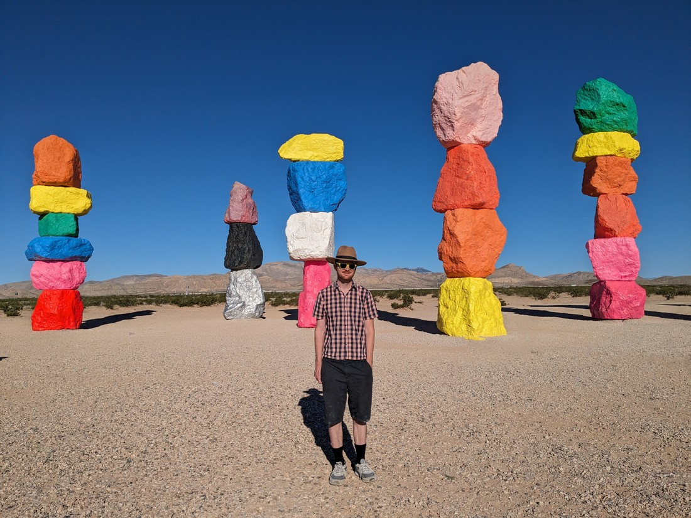

Today will end our journey across the continent. Nine days ago we set off from New York state. We drove for six days, then got distracted by canyons and hoodoos for two. Today we will arrive in Los Angeles. Just five hours more to go.

The road between Los Angeles and Las Vegas is very well travelled. I expect tourists from both cities make a pilgrimage along this road. As a result there's a few sights to see and a number of different blogs about them. I picked out a number of mildly interesting things and we set off.

We stopped to eat our breakfast muffins at a place called Seven Magic Mountains.

This was an art installation that (like most art) doesn't really resemble what it's supposed to look like. Has the artist ever seen mountains before? Mountains are not just five rocks stacked on top of each other.

Jokes aside, it was quite neat. There was a surprisingly large number of people here at this early hour - especially since it was a bit of a detour off the highway.

Our next stop was a gas station. Sure, we did need to fill up - but there was another reason to stop here. This place is apparently the "world's largest Chevron". And what to do you get at such a place? Well, to start there was almost 100 pumps. We deliberately drove all the way along to use the highest numbered pump. Because why not?

Inside was another sight to see. There was an extra large array of convenience store products. There was perhaps triple the number of soda flavours than usual, as well as three different types of ice to put in those drinks. Annoyingly they did not have triple the number of hotdog flavours. In fact, the hotdog selection was smaller than usual so I walked out disappointed.

We did take a walk around the rest of the store looking at the merchandise, candy containers taller than me, and a car used in a classic James Bond film. There was also slot machines - after all we're still in Nevada.

> Thanks for the "welcome" sign but we're actually leaving...

Next on the agenda was a brief stop at a power plant called the Ivanpah Solar Electric Generating System. That sounds boring and it kind of was. This was not a tourist attraction but it was something a bit unique.

The plant generated solar power but not in the usual way. Rather than having panels, it had mirrors which reflected the sunlight up onto a tower. This meant it actually worked like a regular power plant - heating up water to turn it into steam to spin a generator rather than whatever magic solar panels usually do. The towers themselves glowed with all the reflected light. It was just a bit of a shame there was nowhere to stand and appreciate it from.

I don't know if there are many of these plants around. Likely the problem is that to keep the mirrors aligned they have to be repeatedly rotated throughout the day as the sun crosses the sky. They're basically using power to generate power. I guess it works out here in the American desert where the weather is hot and sunny but likely it would not work in most parts of the world.

We skipped the next stop we had planned - which was the world's largest thermometer. Part of the reason was that it was basically just a brightly lit billboard rather than a proper thermometer. However the main reason was that Betty was asleep.

The next stop was EddieWorld - which was described as "The Disneyland of Gas Stations". However it really didn't compare to the Chevron we saw earlier (that had four times as many pumps). We left disappointed.

Next was Elmer's Bottle Tree Ranch. "What is a bottle tree?" you might ask. Well, here is what can only be described as a "bottle tree forest":

I can probably summarise this by saying that Elmer was a crazy person. I don't mean that in a bad way, but I'm not sure I mean it in a good way either. For whatever reason he decided to build these bottle trees on his property. He was clearly a lover of scrap metal and in addition to the trees, the property contained a wide variety of other items such as road signs, license plates, even whole vehicles.

Unfortunately Elmer passed away in 2019 so no further bottle trees will likely be planted. Fortunately he has achieved what few people in life achieve. He leaves behind a legacy - something he will be remembered for. It certainly helps that his life work can't easily be cleared away.

We ended up skipping the next stop. It was a place called Mormon Rocks - which were some scenic rocks in the desert. Sounds like our type of thing, right? Well we weren't feeling it. In fact, we have been driving through desert all day - but it's not the scenic desert we had driven through on previous days. Maybe we are all desert-ed out.

Also it was hot.

Our final stop was 1398 N E Street, San Bernardino. Apparently this was the location of the very first restaurant that the McDonald brothers set up - all the way back in 1940.

Now it is a McDonalds museum. While it does have some information on the history of the franchise, it is mostly a museum for memorabilia including packaging, advertising material, and even artefacts from old restaurants. But perhaps the biggest chunk of that memorabilia appeared to be happy meal toys.

The shelves were arranged by both country and decade. Walking through the aisles was like walking through time. We would walk through and aisle and find a group of toys that we remember advertised on TV. Another collection might have just one particular toy which seemed familiar. I guess neither Betty nor I had a lot of attachment to these toys but it was still nice to spot something which sparked a memory in the back of our brain.

Interestingly the museum is not operated by the McDonalds corporation. The building is owned by a rival fast food franchise - although one that I hadn't heard of and have since forgotten. As a result it seemed like much of the products in the museum had been donated by fans. It meant that it didn't feel like a complete collection or history. At times it did just feel like a jumble of stuff. However the entrance was free so we can't really complain.

Glancing at the map it seemed like we had arrived in the Greater Los Angeles area, but there was still a good 121 kilometres to travel to get to our accommodation. Also, on the drive I began to have serious worries that one of my indicator lights wasn't working. Three times I seemed to have people cut me off. After arriving at our destination I got out and checked and nope, the lights are working fine. I guess this is just how they drive here in Los Angeles.

We ended our day with a walk down to Chipotle (because we didn't want to drive again today). Boy these meals are huge. Sure, it's not cheap but there's easily two meals in each bowl.

We've now made it. We started out on the west coast back in April. We're now back, albeit 2,000 kilometres south of where we started. I would say "time now for us to have some fun" but it's clear we're already way ahead of schedule in that regard. However it does mean this trip is going to come to an end soon.

Well, in that case we'd better go all out to ensure we're maximising our fun-per-day.
