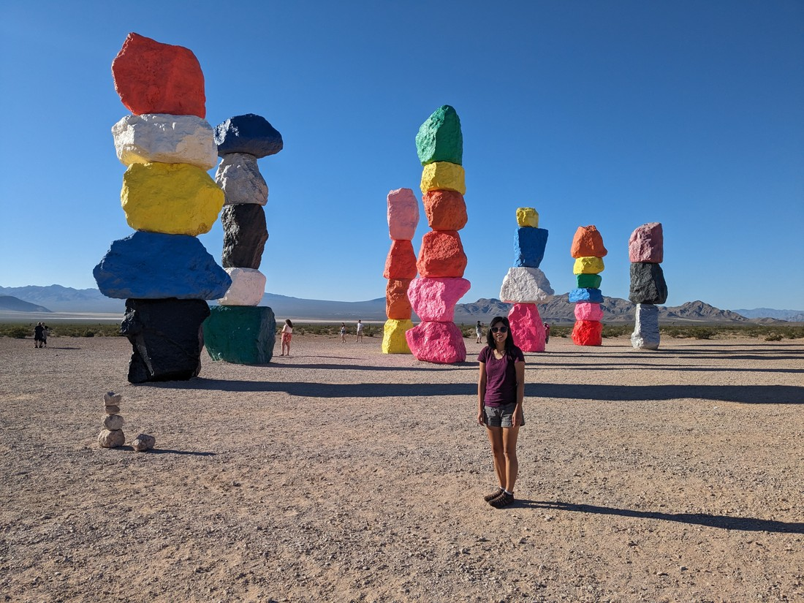

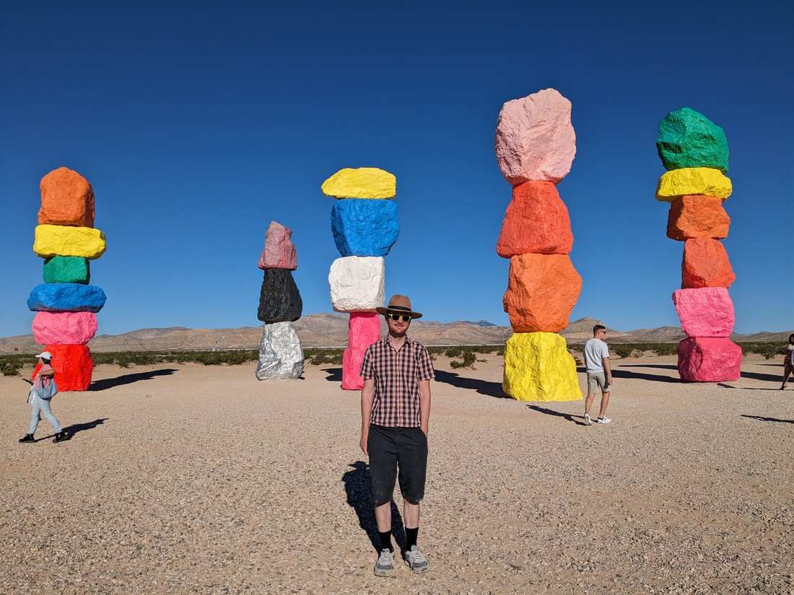

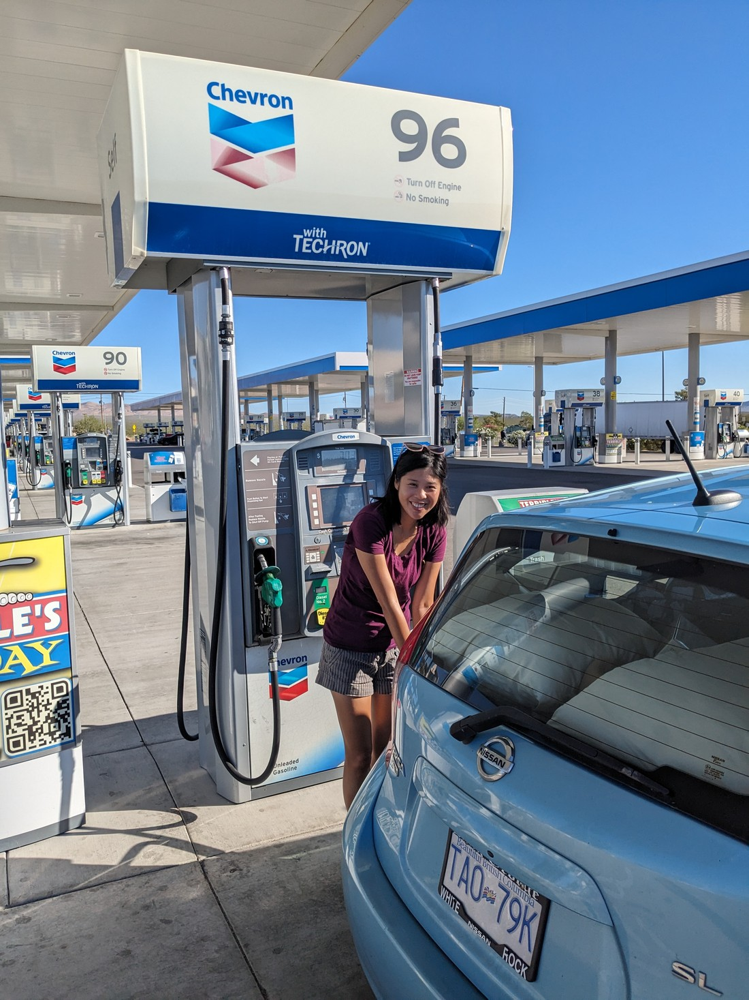

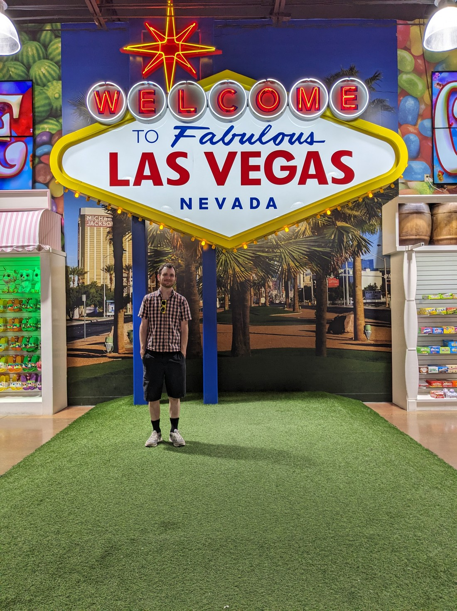

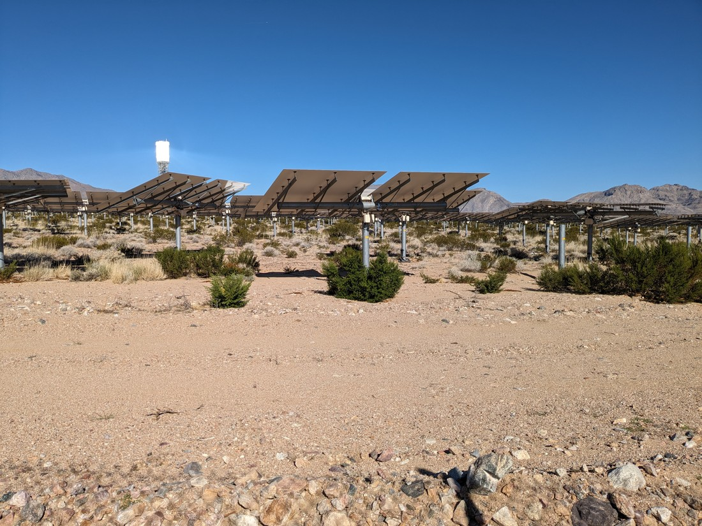

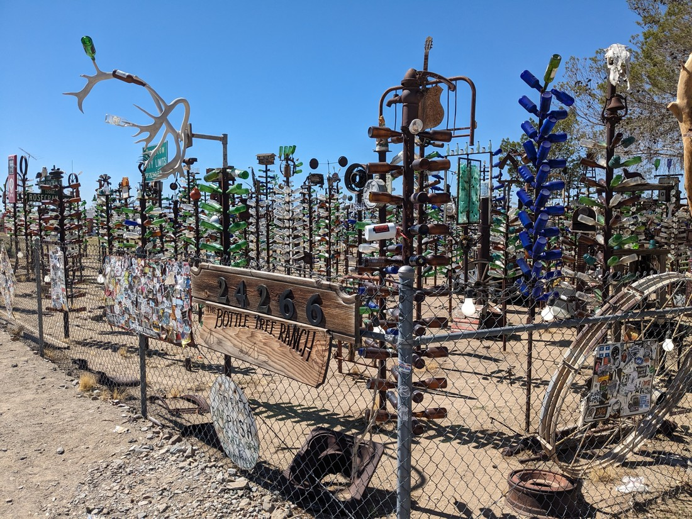

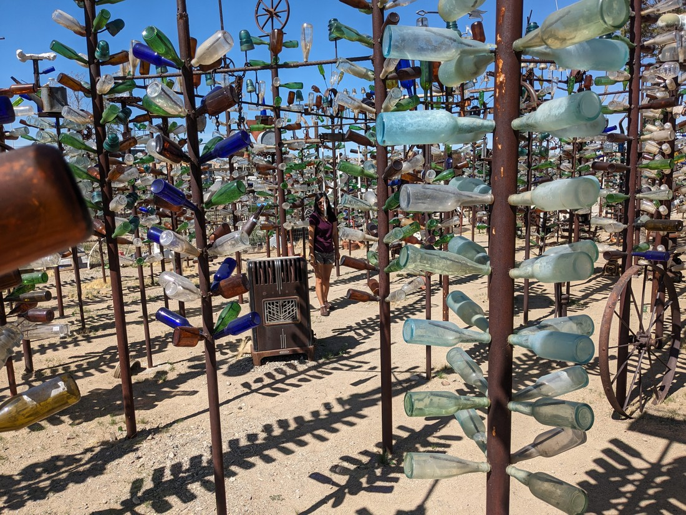

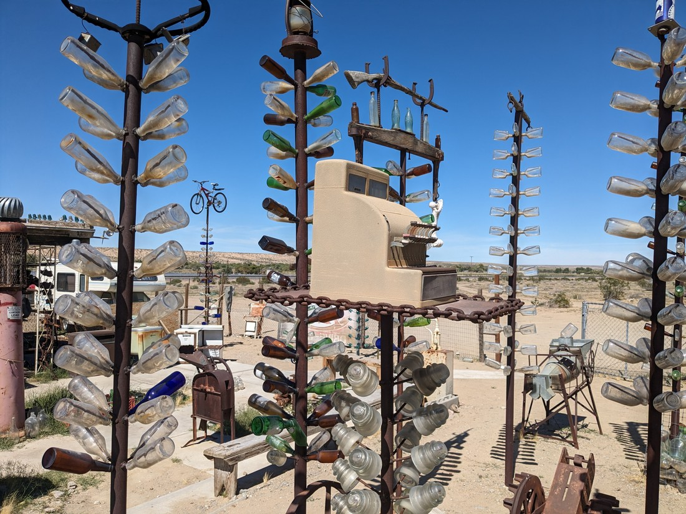

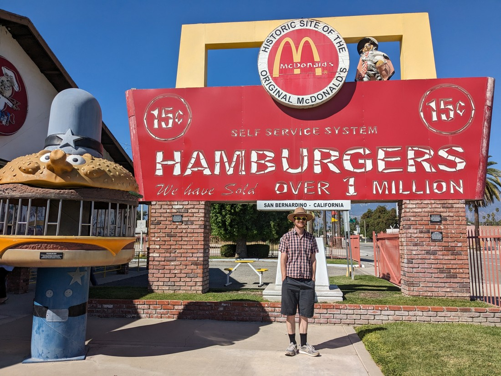

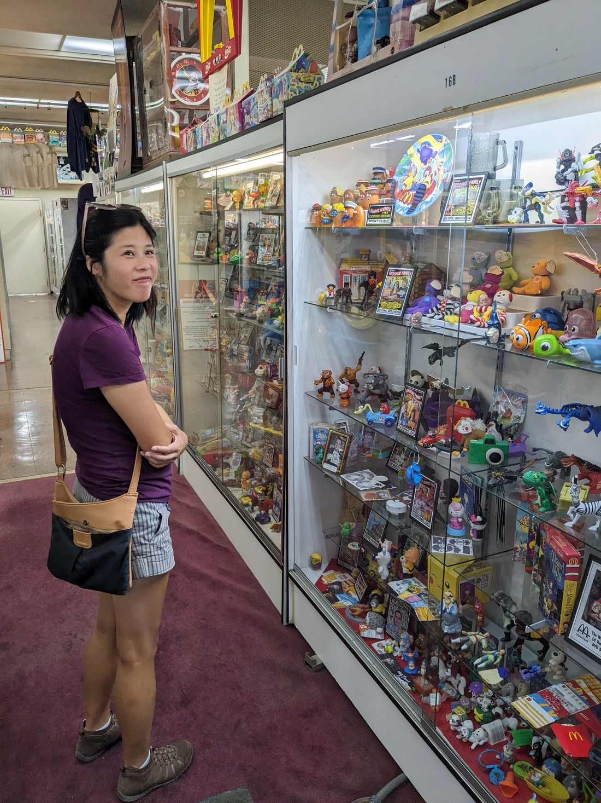

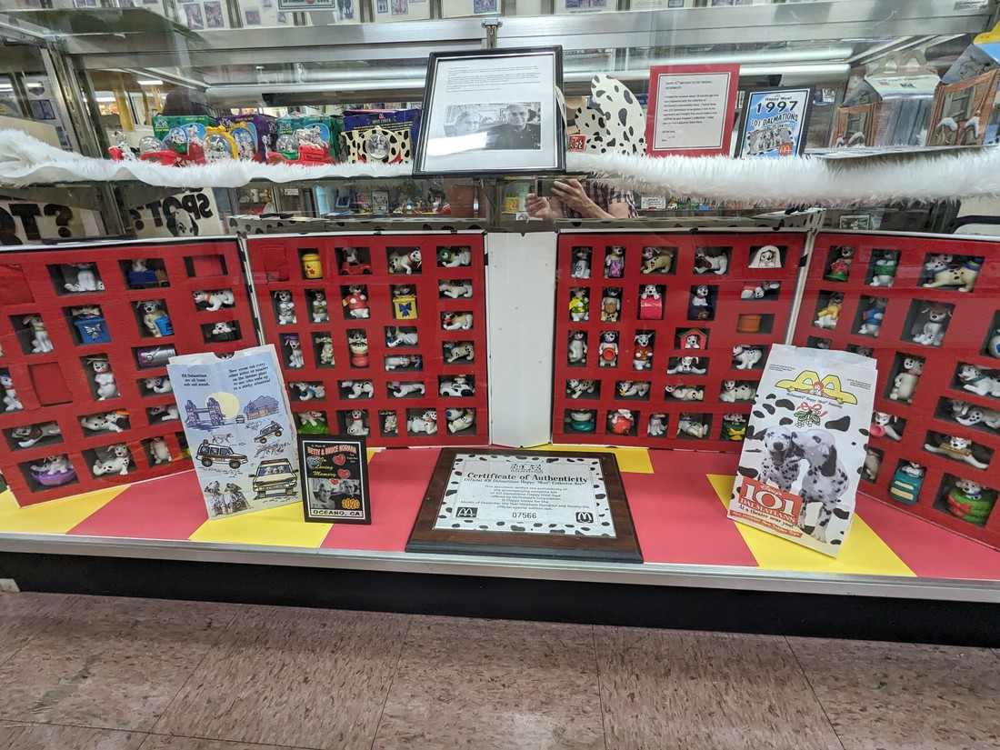

// Early start

// Seven Magic Mountains was nice. Had a muffin breakfast there

// World's Largest Chevron (gas station). Quite impressive. 96 pumps (so we used number 96 even though it was far away from the store). Inside was impressive too, although we didn't buy anything. Gas is getting quite expensive too. Used to be $3+, now it is $5+.

// Next stop was Ivanpah Solar Electric Generating System, which was an interesting solar plant. Barely stopped though as not really a tourist attraction, just something I thought interesting

// Betty slept through the next attraction which was the World's Tallest Thermometer. It was basically just a tall thin billboard - not much to see.

// Stopped at EddieWorld, which is California's largest gas station (but only 20 something pumps). Wasn't as great or grand as the earlier Chevron so we didn't buy anything

// Next was Elmer's Bottle Tree Ranch. It was an interesting art piece, with very striking trees and lots of other random pieces. I understand Elmer has passed away - hopefully whoever has inherited this likes that Elmer's legacy will live on.

// California desert isn't as scenic as Utah desert

// McDonald's stop because its hot and there were many billboards saying frozen cokes are cheap. Not super happy that the advertising influenced my decisions but was happy with my frozen beverage.

// Last stop was the site of the original McDonald's restaurant. It is now a free museum, containing some history and a lot of merchandise and Happy Meal toys. Interesting it is owned by the owner of a rival food chain and has no affiliation with McDonalds

// On three occasions I had some closer-than-desired calls when changing lanes. I began to wonder if my indicator was broken. Nope, that's just how they drive in California apparently

// I also underestimated how big the Greater Los Angeles area is. From our last stop to our accommodation was 121km. At least there was a freeway running almost straight there.

// Chipotle dinner - so big
