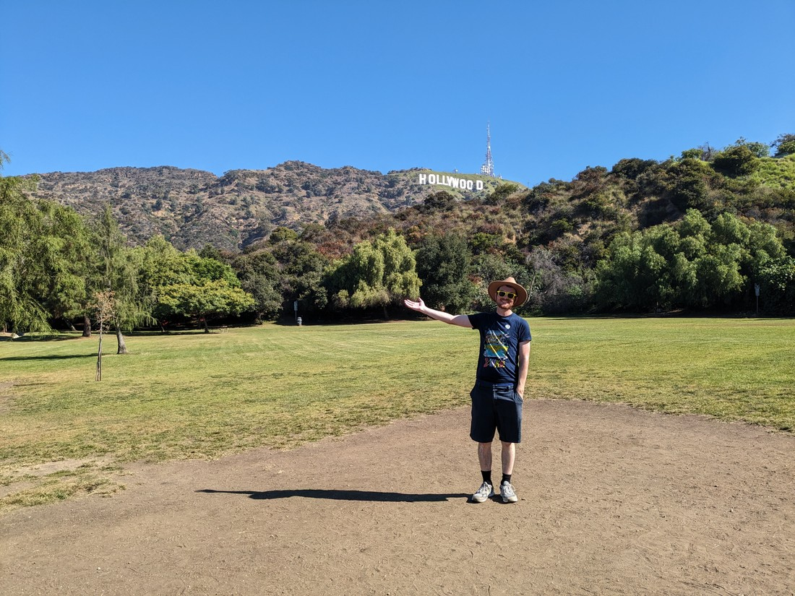

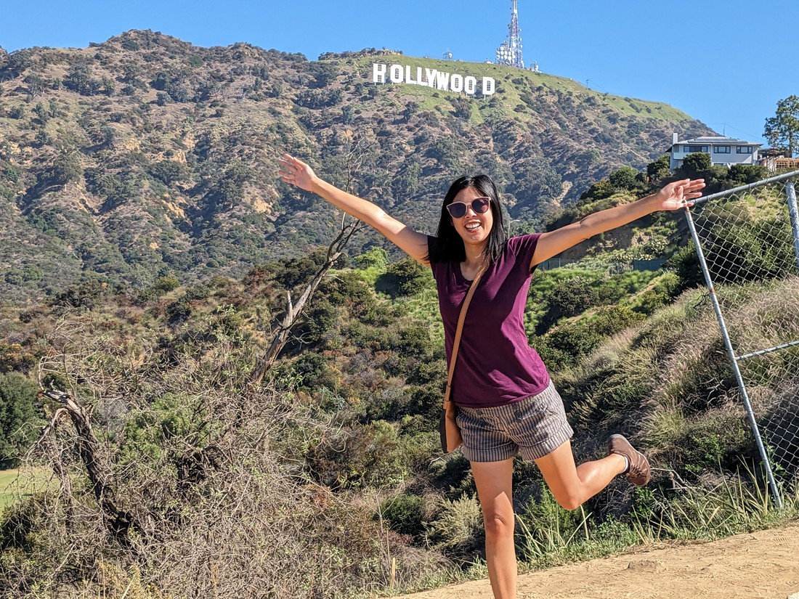

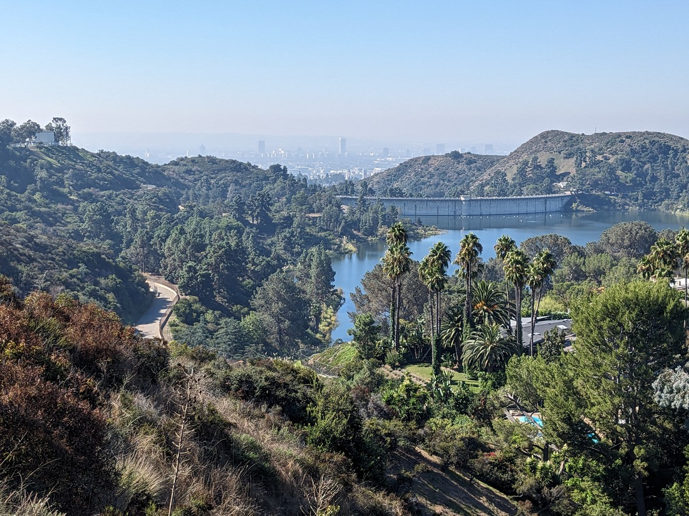

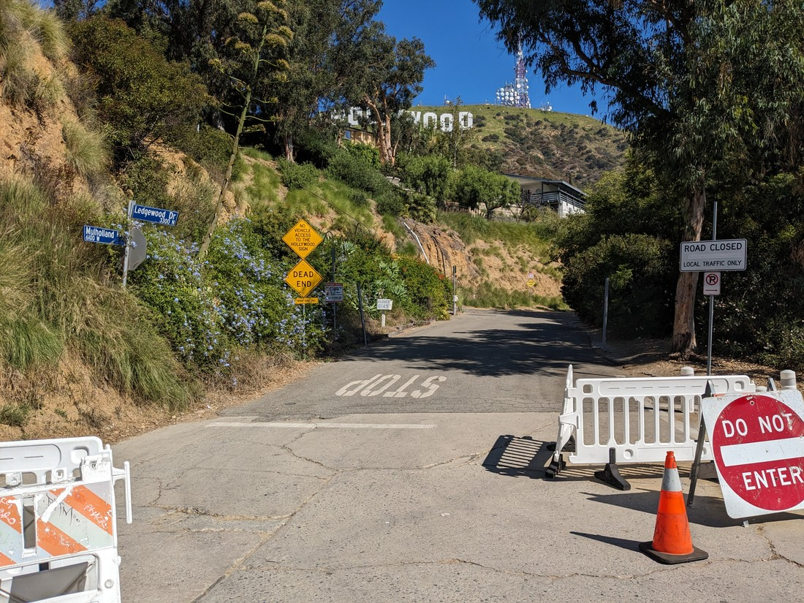

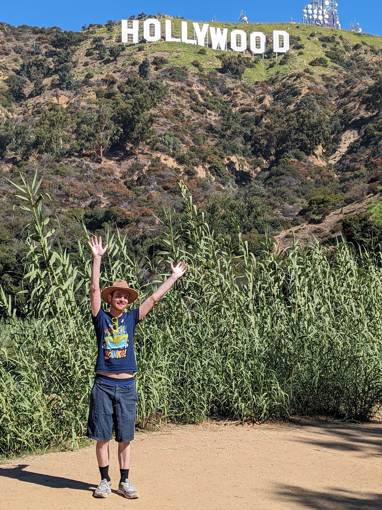

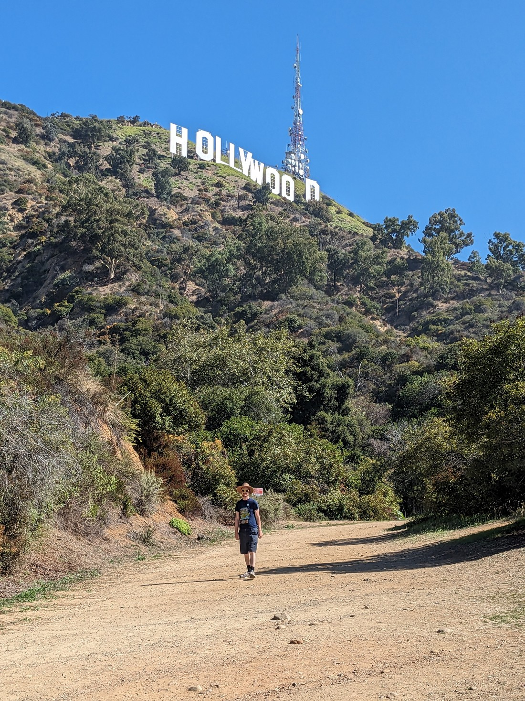

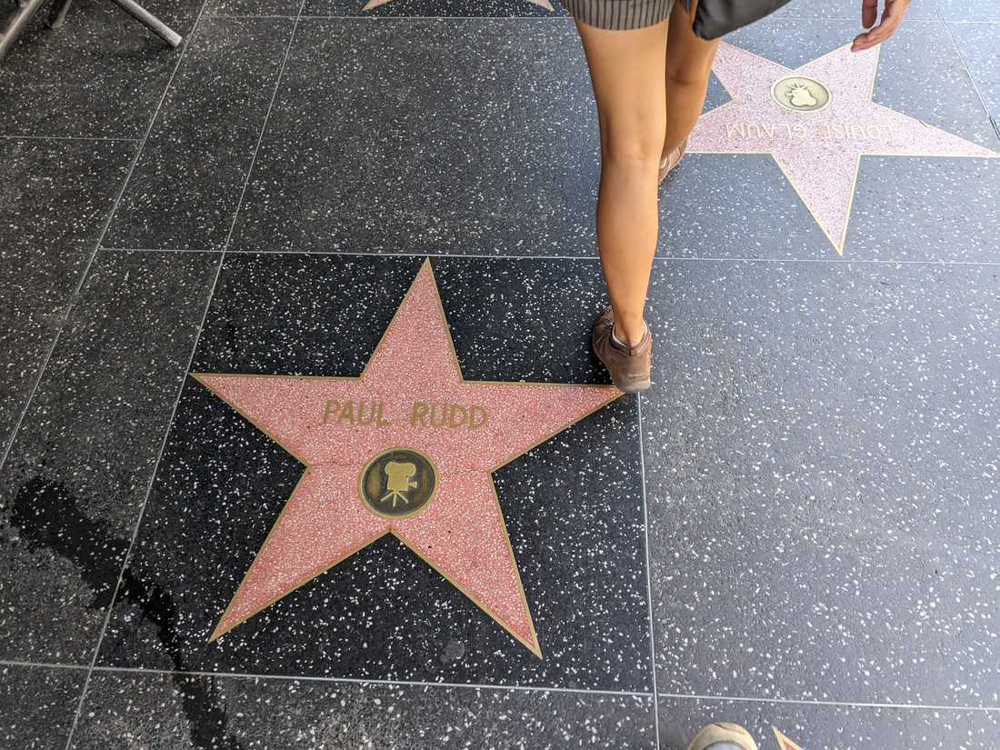

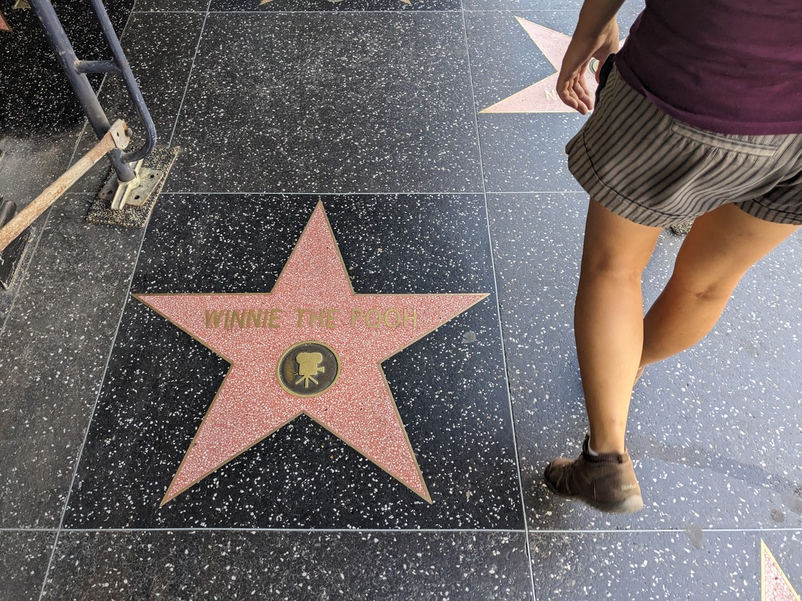

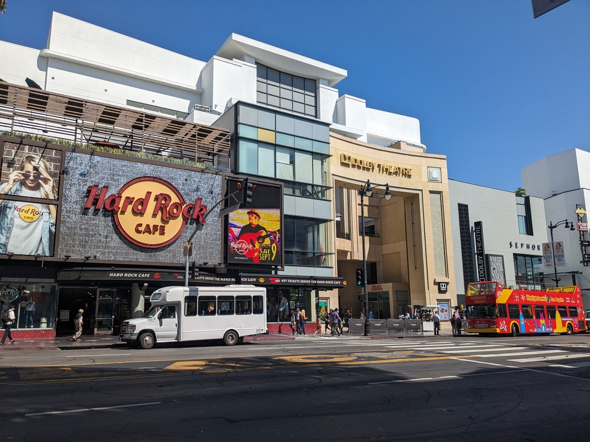

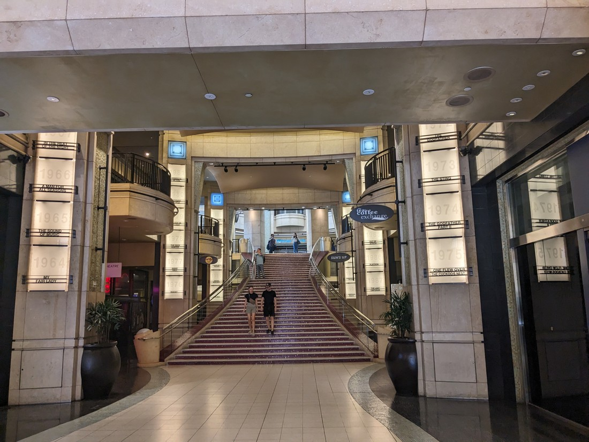

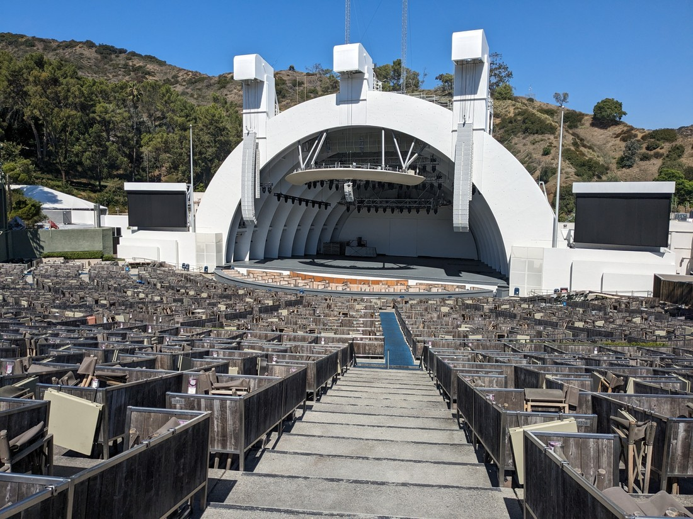

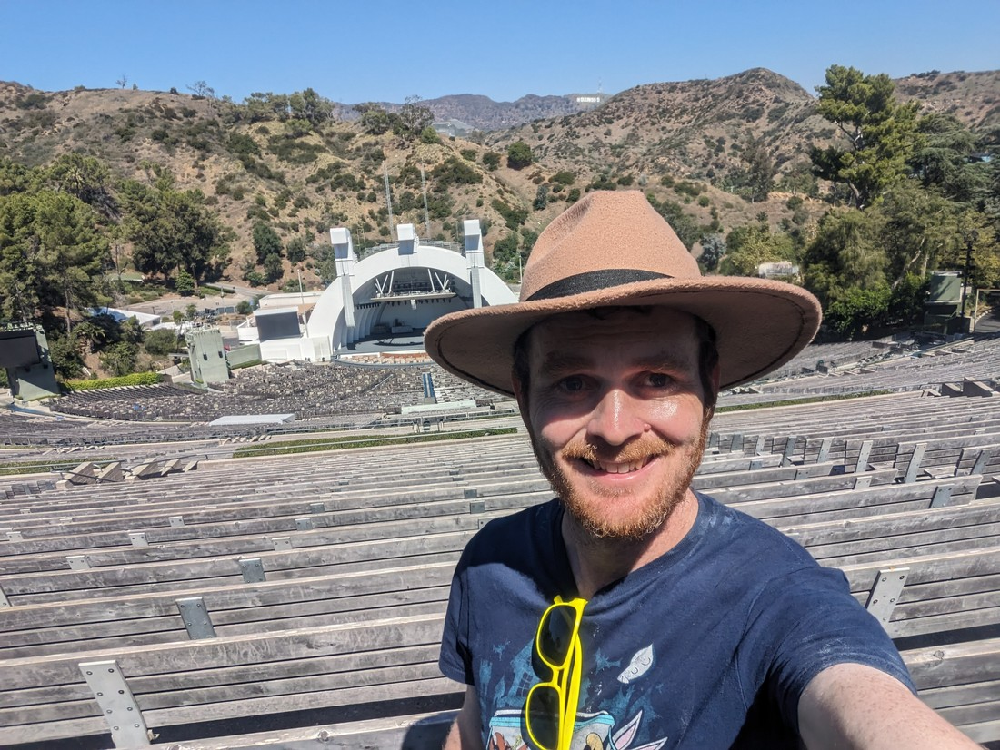

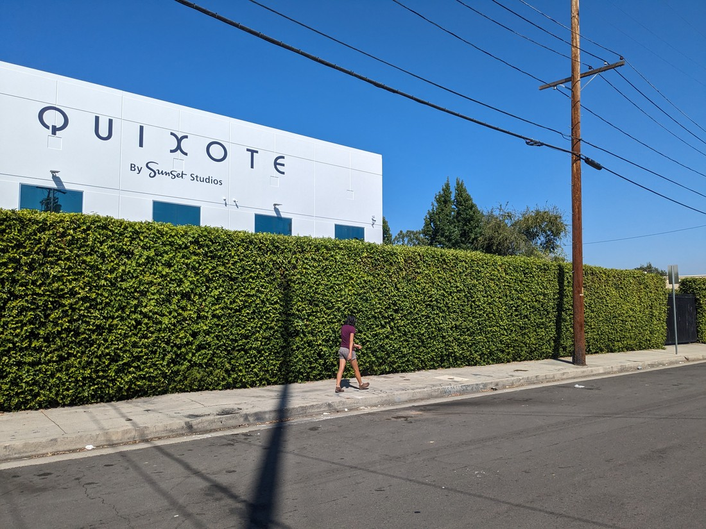

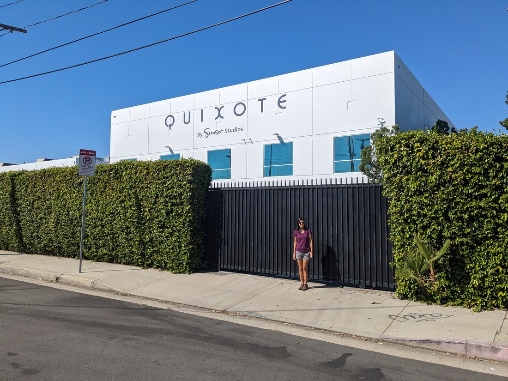

// An extra 15 minutes of driving due to traffic, but we were in no rush.

// Stopped at park for Hollywood sign. A bit far away. Since it was such a short stop and a small park we decided to walk up the hill. A better view of the sign but not a good view of Los Angeles - too much air polution

// Decided to walk down the street to be a bit closer. A fence had been erected to block view of the sign. Got to a street that was "closed". A blog says this is just to stop cars but we decided we didn't want to cause trouble. Google Maps showed a walking path but we couldn't spot it. Found that a van was blocking the path entrance and making it look like just another house. Best view on this path.

// Very thin and windy road on the way down.

// $15 USD parking

// Walked several blocks to find Hollywood Boulevard. Walked along the Walk of Fame. Lots of people we don't know down here. A bit of a sketchy neighbourhood. Many homeless people and a surprisingly large number of lingerie shops (four).

// Street was a lot busier around the Dolby Theatre and Chinese Theatre. Looked around a huge souvineer shop. Saw the hand prints in front of the Chinese Theatre. Saw the best picture winners at the Dolby Theatre.

// Decided to walk to Hollywood Bowl. Hot and uphill. No one else there though, which was nice - except for a lady telling us we couldn't approach the strange

// Bought some slurpees for the walk back

// Then visited where The Office was filmed

// Walmart and back to accommodation. No near misses while driving today.
