Universal Studios was at the top of our to-do list in Los Angeles but at one point we were debating whether we even wanted to go. Theme parks do cost a lot of money and they are filled with... \*shudder\* people. But we drove 4,300 or so kilometres across the country. What was the point if we're not going to do things in Los Angeles that we could only do in Los Angeles?

Once upon a time, teenage Betty had a great time here. Let's go re-live those memories.

The park didn't open until 10am today which seemed a bit late. I think it’s because today was a weekday during the off-season. But on the bright side that means we don't have to get up early. We arrived about half an hour before opening to find the carpark building surprisingly full. Oh dear – there’s going to be a line at the entrance, isn’t there?

Ten minutes to before the official opening and we found ourselves inside the park gathered with everyone else who had arrived early. It was quite the mass of people, but nothing too crazy. Fortunately we didn't have to wait at all in the crowd as the barrier was taken down almost immediately. We all flooded forward. Let's go!

Our destination was the Studio Tour. This tour is what makes Universal Studios unique. The theme park is built alongside their working film studios and one of the park “rides” is to get on a cart to join a guided tour around some of the film sets. Taking a whole hour, it was by far the longest attraction so we figured we’d do it first.

Except we took a wrong turn while rushing along with the crowds. We turned right into the Wizarding World of Harry Potter section as it looked like this was a short cut. It was not.

However we continued walking with the crowd into an unknown ride. Whatever this was, it wasn’t on our list of things to do today but we’re here and there’s no line so we figured we may as well give it a try.

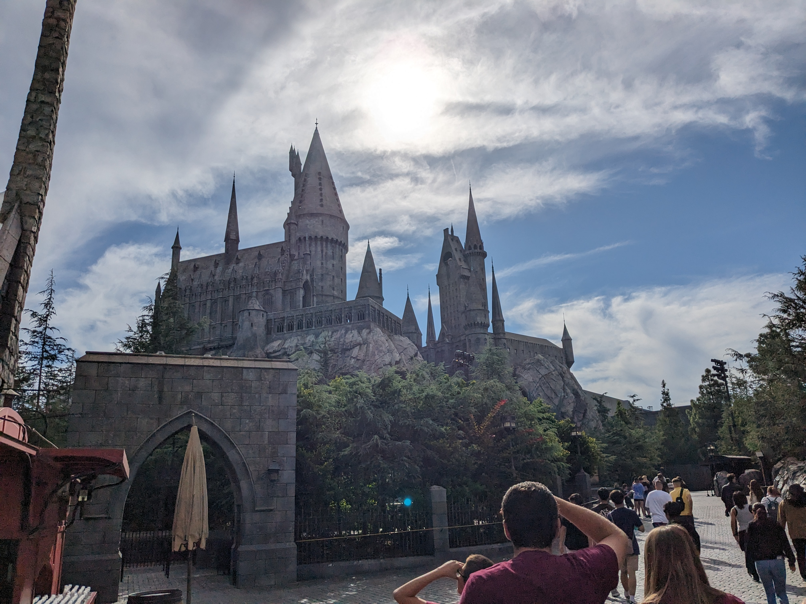

> It sure looks fancy on the outside

After stowing our backpack in a locker and walking several minutes through the hallways of Hogwarts we came to the ride. It looked like a bench sized seat with harnesses for four people. We were strapped in and then we just had to wait to see what happened. It turns out the seat was on a mechanical arm and very quickly we were picked up and flown about, avoiding different animatronic obstacles.

Then a couple of times on the ride we’re put in front of a projection screen taking up our field of view. In addition to the shaking and movement of the bench, this would simulate flying. We must have still been moving (because otherwise the next bench would have caught up) but it was impossible to tell. Our eyes told us we were outside flying. The switching from real obstacles to these screens was also amazingly seamless. I guess this is the magic that modern theme park rides can achieve nowadays.

However it didn’t take long for all the shaking and movement, coupled with the field-of-view screens, to provide complete sensory confusion. Textbook motion sickness. Fortunately the ride designers seem to have planned for this too. Above each seat was a nozzle spraying cool air directly onto our heads. I was so grateful for this.

Later we would discuss our favourite rides of the day and we both would agree that “Harry Potter and the Forbidden Journey” was the highlight. It was state-of-the-art, exciting, told a story, and worked incredibly well. I imagine it also helped that we walked in with no expectations.

Outside the ride was a rollercoaster with an empty line so we figured we may as well do that one now, despite my unsettled stomach. Later the lines might be quite long so it would be better to do as much as we can now.

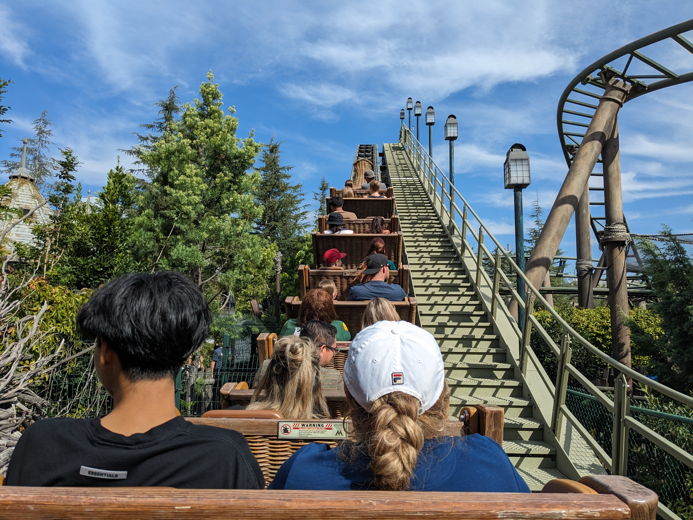

> Sneaky photo while the ride is still moving slow!

On the drive to the park Betty and I had discussed where the best place to sit on a rollercoaster is. Betty didn’t like the sound of sitting at the front but I pointed out that those seats get the slowest ride. When the train goes down a hill, the front carriage is slowed because it has to pull the back ones along. However I didn’t know if this would actually have a noticeable effect.

So where did we happen to end up sitting? As far from the front as we could get.

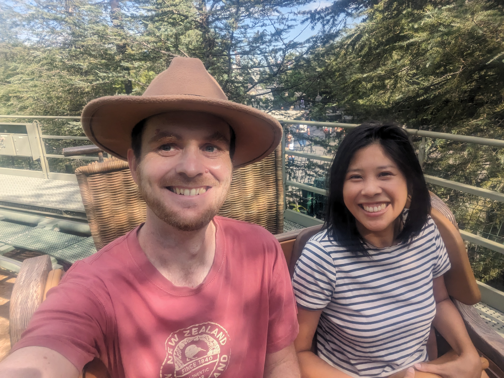

> Uh oh

I can confirm there \*is\* a noticeable effect. It felt like we were being pulled down every drop and around every corner. And there were a lot of corners. Despite the wind rushing past, the ride definitely didn’t help settle my stomach. At least the experience wasn’t very long.

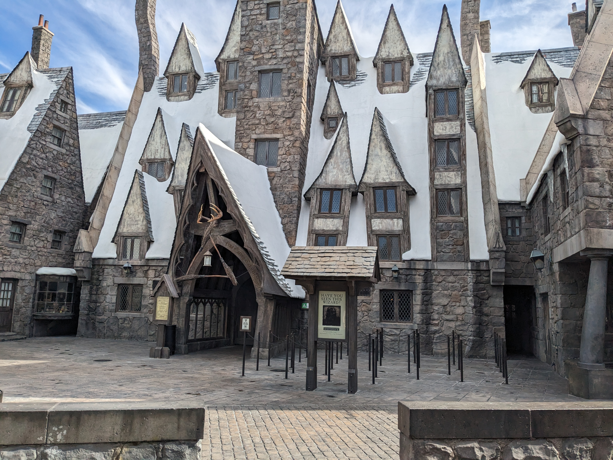

There was only one more attraction in Harry Potter land. We figured we may as well get this section 100% done and so we lined up for Ollivanders. I’d heard of this experience before but honestly it wasn’t that special. The proprietor would take us inside, pick someone and have them point wands at things. That was it. It just seemed like a way to get patrons to buy the commemorative wands that they were selling. I felt sorry for the poor parents of the kids that got chosen.

I still wasn’t feeling back to normal so we figured now would be the best time to go do the studio tour. Of course it was hard not to get a little distracted along the way.

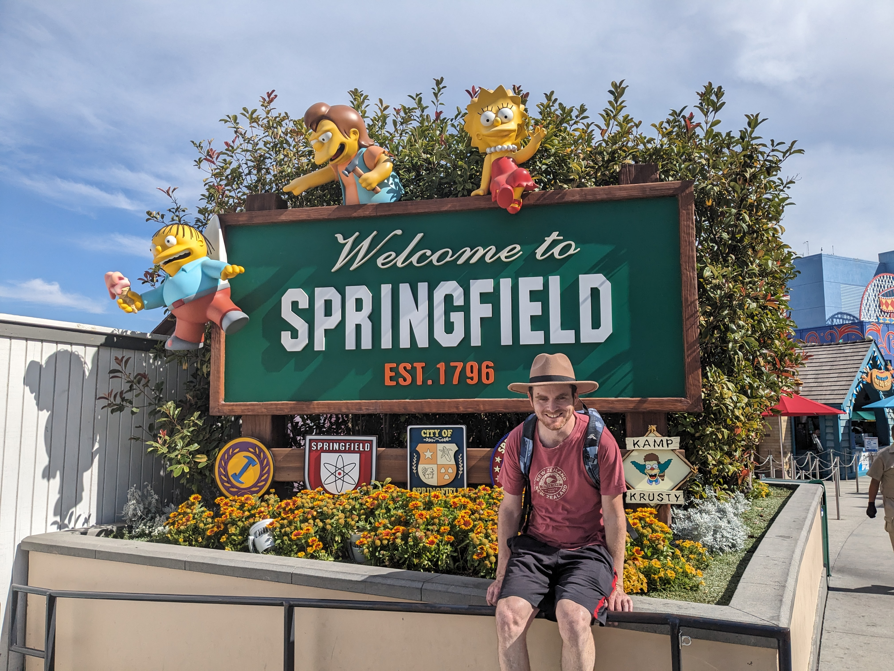

We had left the Harry Potter section and were now in the Simpsons section. With the vibrant colours usually only found in animation, this was a fun place to walk through and marvel at.

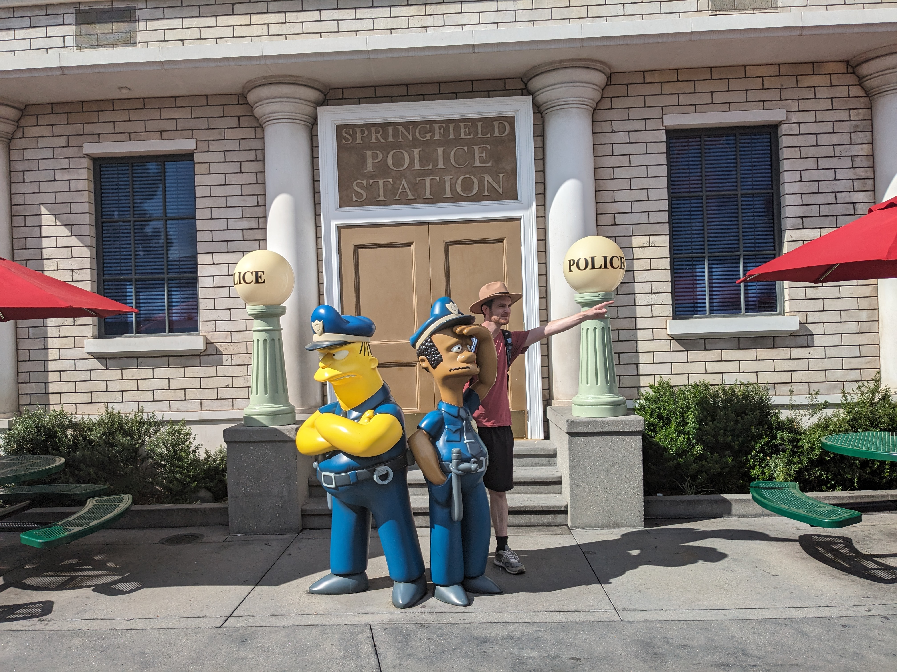

We arrived at the studio tour and found no line, probably because the carriages could take a huge number of people.

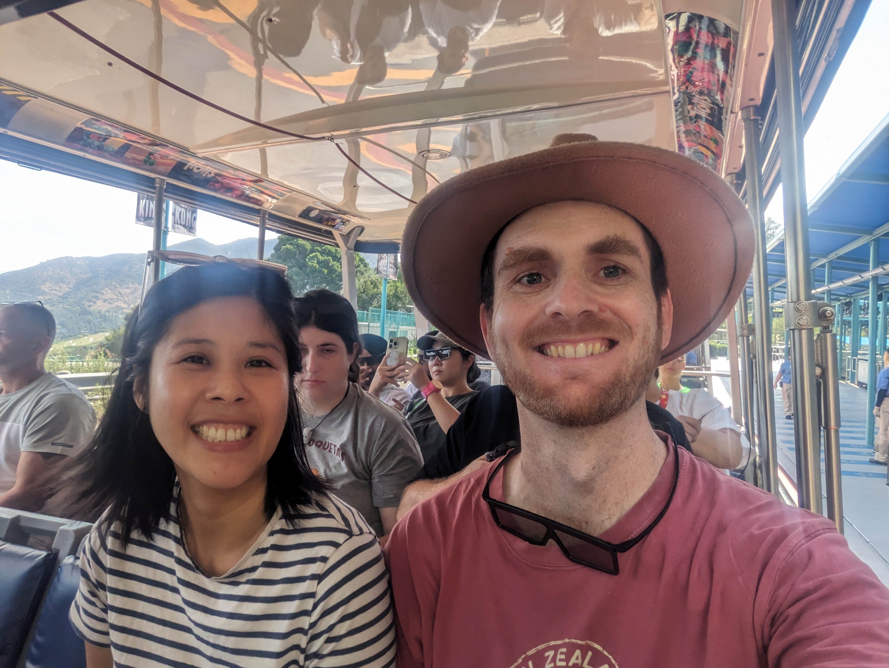

> Another selfie!

The tour started with the train taking us down a hill. The road wasn't that bumpy but somehow the train of carts seem to roll and jostle. Uh oh - this wasn't supposed to be a thrill ride. This was supposed to be a break from motion sickness.

Down the hill we arrived at the first filming location. It was an outdoor set with a bunch of fake building facades.

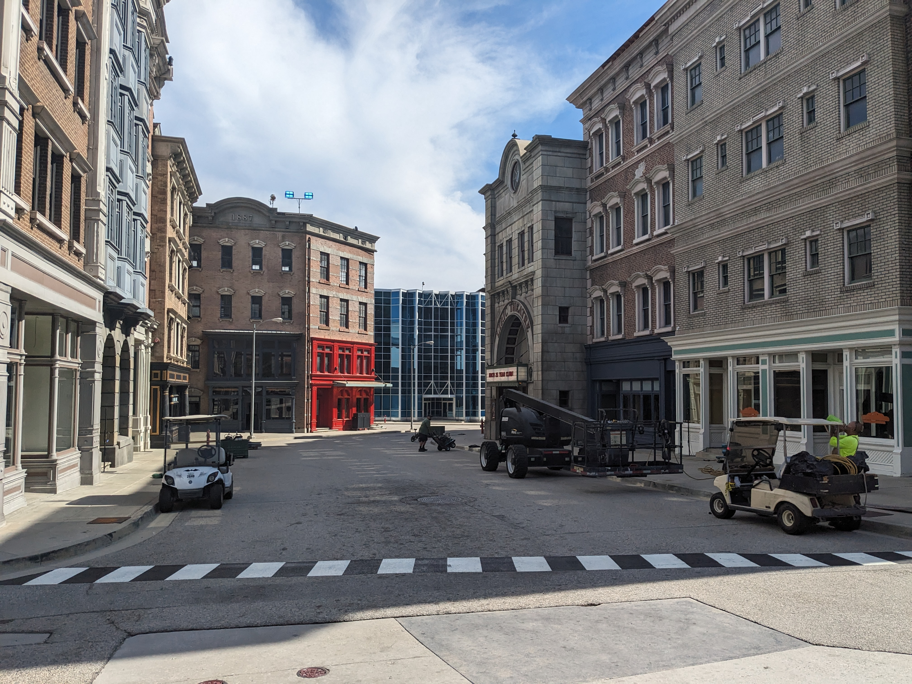

I think the look they are going for with the buildings is "generic American city". Could be New York. Could be Chicago. Regardless, a production company can film here rather than flying their crew all the way to the east coast and having to pay the city to close down a street. However because it is non-descript, it didn't necessarily feel like we were seeing where notable movies were filmed.

Of course nothing was filming at the moment due to the Actors and Writers unions both being on strike. There was one area of the tour where we had to be quiet due to filming, but it was only for a commercial.

However after generic American city lot there was generic European city lot - which was recently done up to as heaven for the tv series The Good Place. Now this is actually something we know. Betty and I watched all four seasons of the TV series and they spend a lot of time walking around the city so the buildings are quite recognisable for us.

Even though the TV series had finished, the buildings still had the references to The Good Place.

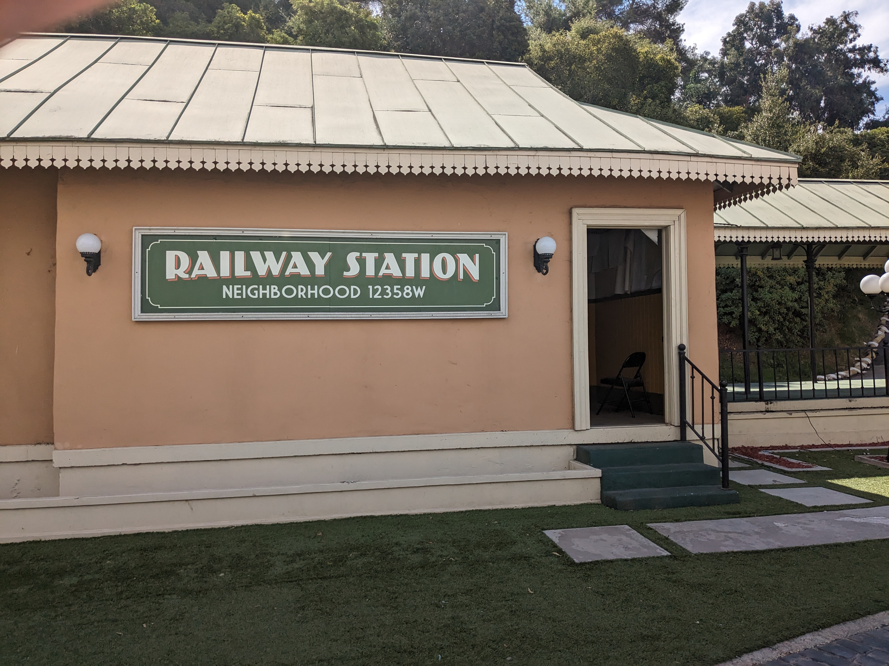

I guess these buildings will remain as they are unless there's a reason to paint over them for another film or tv series. Or if it's just used for the tour, it will remain until the TV show has been mostly forgotten.

Then we came around a corner to a mysterious and long and dark tunnel.

> Uh oh again

Inside the dark cavern the cart seemed to be put onto some sort of rails. Of course we couldn't see what was happening because it was so dark. We were then instructed to put on our 3D glasses which we had been given when we originally boarded.

The tunnel turned out to contain a full 360 degree screen and we were treated to an experience of watching King Kong fight dinosaurs. In addition, the cart was shaken back and forth as the digital dinosaurs smacked into it. It was really impressive - being able to look in any direction. Like the Harry Potter ride, it certainly seemed a step up over the motion rides of our childhoods.

However...

How did this happen...?

All I wanted was a nice guided tour around movie sets but instead we've ended up on yet another ride that simulates what it is like to be seasick. To make matters worse, once King Kong had scared all the dinosaurs away and we could drive on, the guide let us know that we should hold onto our 3D glasses because we'll need them again later. That's not good.

The next lot of film-related attractions were a line of movie cars. Most were notable. However it didn't seem like an exhibit - more like a carpark. Some of the vehicles had definitely seen better days and probably have not appreciated being left outside amongst the elements.

Of course perhaps my head and stomach were still caught up with recovering from the King Kong experience. Apparently Betty noted that I came out of that looking rather pale. I was glad to have my hat which I could employ as a makeshift fan. However when I tried to take a swig of water, I fumbled with Betty's phone and watched helplessly as it dropped onto the floor of the carriage, then onto the step, and then down onto the road!

Fortunately we had been told that there was a cord we could pull for emergencies or if someone dropped something out of the carriage. I apologised and it was embarrassing, but that not the emotion that I cared the most about right now. At least I didn't need to apologise for puking on his train.

The next section was a set from War of the Worlds.

I imagine this looked great in the movie but it kind of just looked like junk. I guess when watching a movie we suspend our disbelief but in person we are all to aware that this is fake. This was the same for the city sets. I am surprised that they look so good on the big screen because in person they just seem to be missing something.

There was also the set from the 2022 movie Nope which had been left up and incorporated into the tour. I also guess that this would be more exciting if we were more familiar with the films.

There was also a Jaws attraction, which was a pond with some animatronics and other effects.

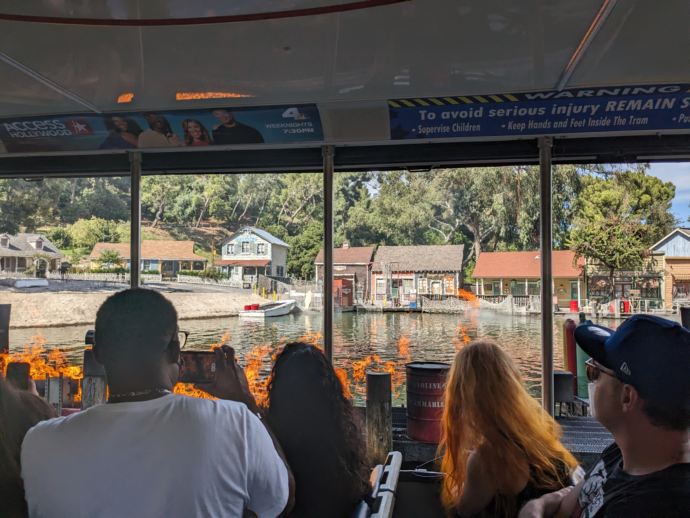

> Fire!

This attraction and another that simulated a flood sequence that seemed to be older than the others. Of course, you probably could have guessed that since the Jaws movie is almost 50 years old. Betty told me about other attractions she saw last time and it was a shame there wasn't more of these with real effects. Sure, they're not that informative but they are certainly still enjoyable to see. Perhaps digital-only attractions (like the King Kong one) are easier for the theme parks to make and maintain. I imagine they're a lot safer and less can go wrong.

Speaking of digital-only attractions and things going wrong, it was now time for another tunnel. This one's theme was from the Fast and Furious movies. I don't know what exactly happened because I spent the whole thing with my eyes closed, fanning myself with my hat, ignoring the shaking of the carriage. Fortunately this worked fine and I came out no whiter than when I went in. Betty later told me that it wasn't that good anyway.

Overall I don't know how to feel about the studio tour. We did see some sets and props that we knew from movies or tv shows that we enjoyed. However it was a shame we couldn't stop and enjoy anything. Then of course it was a shame that Universal Studios felt like they had to make the tour more exciting with the 3D experiences. We certainly got a lot of entertainment out of it though.

Afterward we also had a good laugh at my expense. I was still suffering but even I could see the funny side of it. Who gets motion sick any more? I felt old and young at the same time. After taking the escalator back up to the rest of the park we also found something that made me feel a whole lot better.

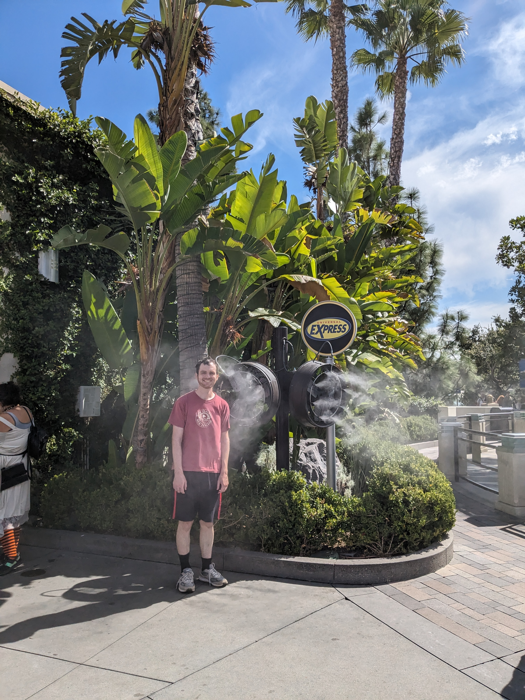

> Here's a happy Luke

Scattered around the park were these fans that also blew out a layer of mist. I imagine these are mostly here to combat heat stroke, as it probably gets quite hot in Los Angeles in the summer. However they were very useful at helping the colour return to my cheeks. Though it did make me a tad damp.

It's time for a break. Luke and Betty need a rest after a very eventful couple of hours. But also I think I'll leave it here for this blog entry. I've written over 2,000 words and it has only covered two hours of fun. Stay tuned for more, when I get round to writing it.
