With Luke still recovering from wanting to puke up his breakfast, we decided that our next stop would be to see one of the shows. But we were still a bit early. For now we figured we'd check out the rest of the park.

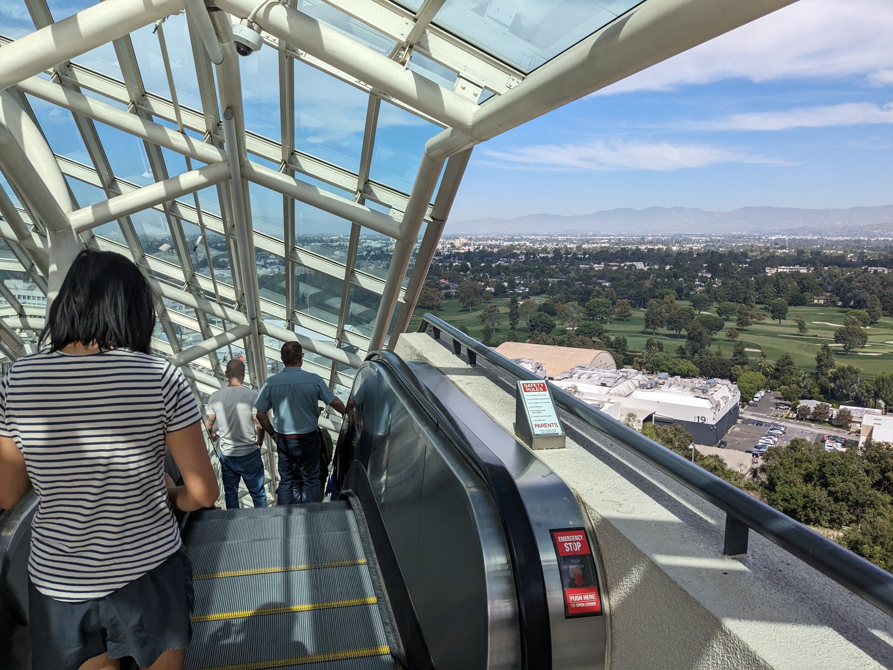

Universal Studios seems to be built on the side of a hill, with a separate "top lot" and "bottom lot". There were handy escalators to take us between levels. However what is an escalator other than just a really slow ride? Luke's stomach thought so. If only it wasn't so hot.

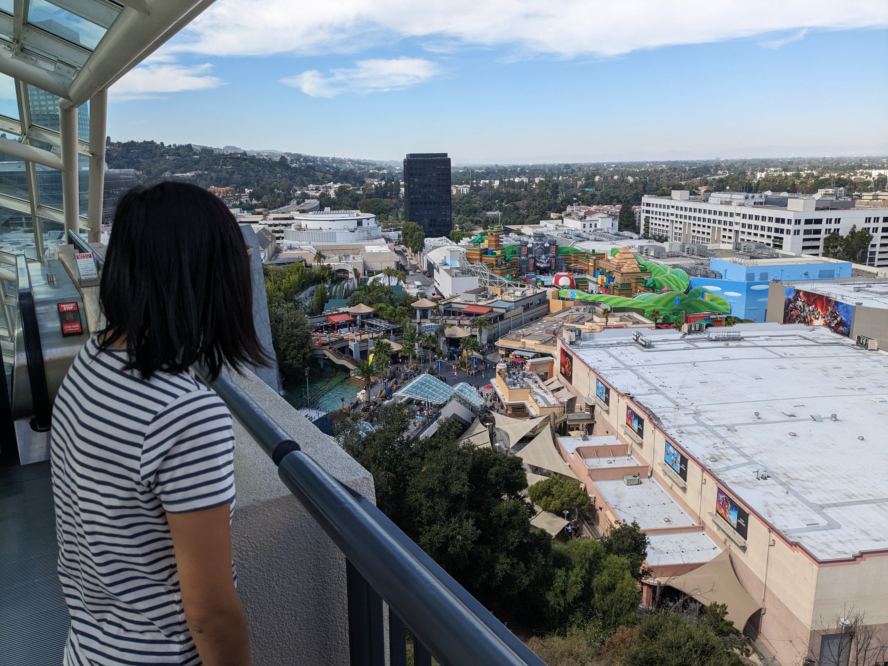

> A better view than yesterday

At the bottom was a new section of the park themed after the new Super Mario Bros movie / video games.

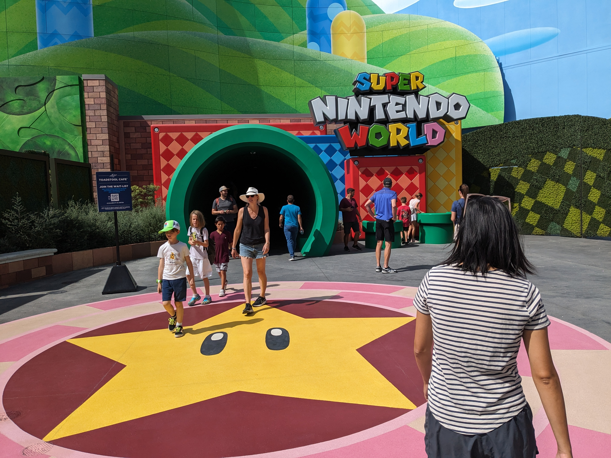

Like the Simpsons area of the park, it was enjoyable just to walk around seeing all the bright colours of the video game in real life.

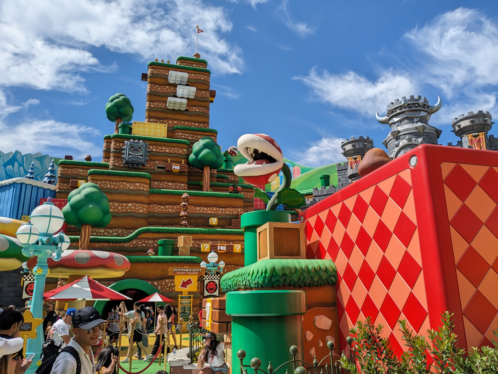

> Just like a video game

There was a ride here - in fact it was the newest ride in the park. The ride description mentions "augmented reality" so I imagine you can interact with the ride. So fancy. However naturally it was very popular. Throughout the park there were billboards with wait times listed for all the rides. More often than not "Bowser's Challenge" had the longest wait - usually around an hour. In addition, it sounded like motion sickness might be a factor, so we never did this one.

We made our way back up to the top lot and to the entrance of the Waterworld show.

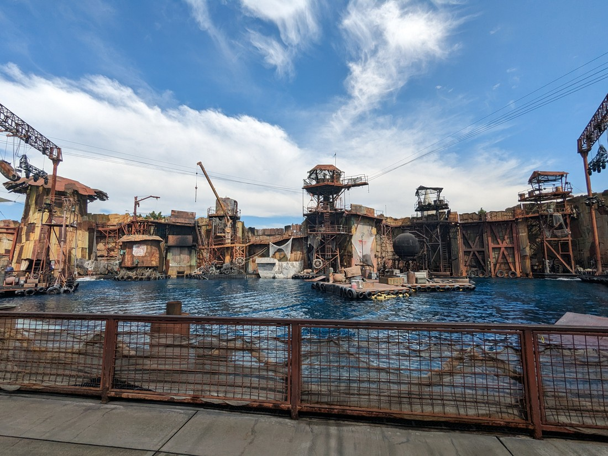

> Not as many colourful colours here

Here's some background. Waterworld is a 1995 film set in the future where the oceans have risen to cover all of the continents. The film sold a small fortune in tickets but unfortunately it cost a large fortune to actually make the film. It isn't remembered as a good film, however it's mostly just remembered as being a flop.

And yet Universal Studios has a Waterworld show?

After we sat down we found that certain seating had been designated as being "splash zones". People who sat there must be prepared to get wet. Fortunately we hadn't sat in one of those areas.

Three cast members stood at the front of the seating areas. It was essentially their job to entertain the crowds before the show started. They did this in a variety of ways but in particular they tried to get each section to compete against the others - usually by cheering. If their section ever did something wrong, then the cast members would toss or squirt water at the people in the splash zones. So it's not like the people in these zones might get incidentally wet - the performers were going to ensure it.

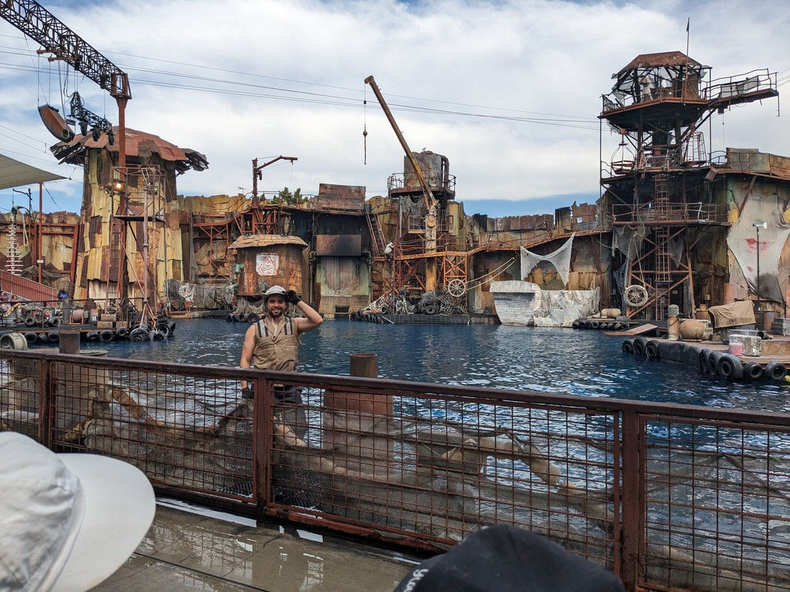

They also had a lot of tricks to justify wetting the audience. The most memorable instance was when a cast member encouraged a kid from the audience to squirt another cast member with a large water pistol. In retaliation the kid got squirted back - quite a lot. Cue first cast member telling the other that he should "pick on someone his own size." He then encourage the boy's father to squirt the guy back. However this time the water pistol was empty. Of course upon realising this, the father was now helpless but to receive the same soaking that his son had.

I guess we can be thankful that this is Los Angeles. A little wet is probably a good thing in this heat. Of course we now live in an era where people constantly carry round tiny computers. I guess cell phones must be water resistant enough.

The arena was made up of metal structures around a large pool of water. The show started with some story from the leading lady, arriving by boat. Then the complex was swiftly attacked by the villains of the story. Two leapt in on a jet ski and skis - and the guy on the skis promptly fell in the water.

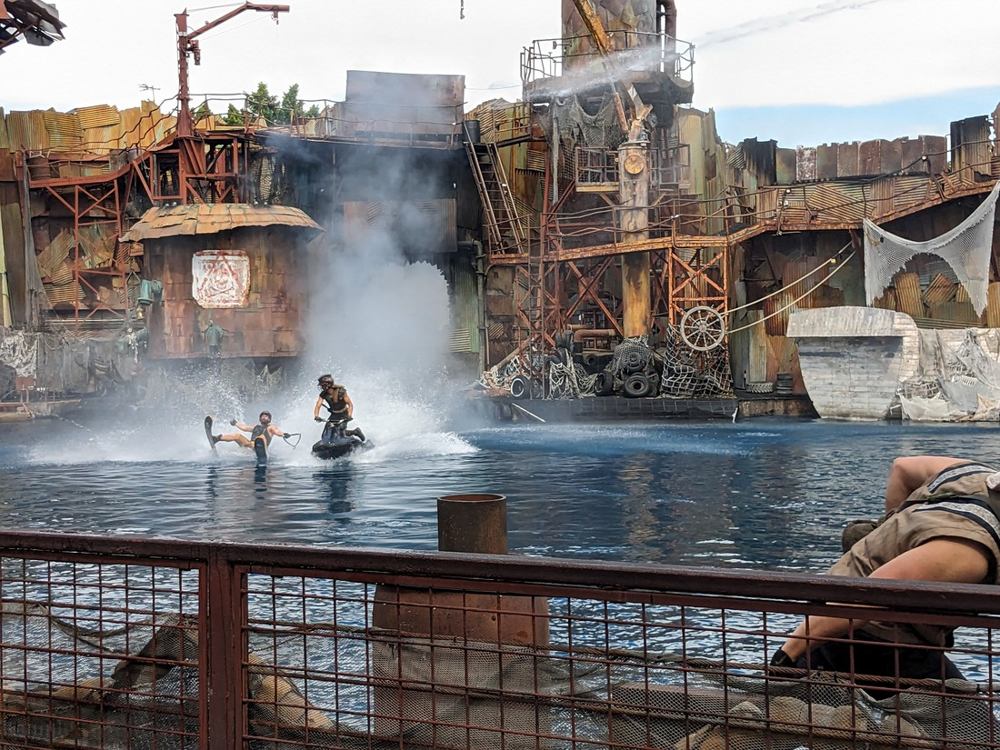

> Oops

However that was the only mistake we spotted. The show continued with a variety of stunts including more jet skis...

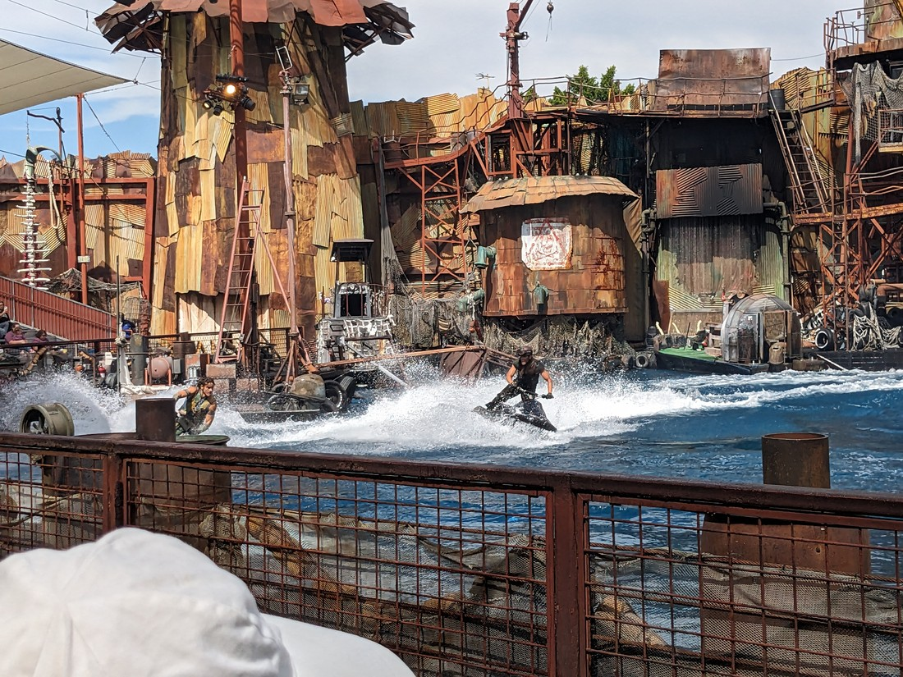

> Which would inevitably result in the splash zones getting splashed

There were also stuntmen and women jumping or falling (mostly when they were "shot") off towers into the pool. There were a couple of zip lines.

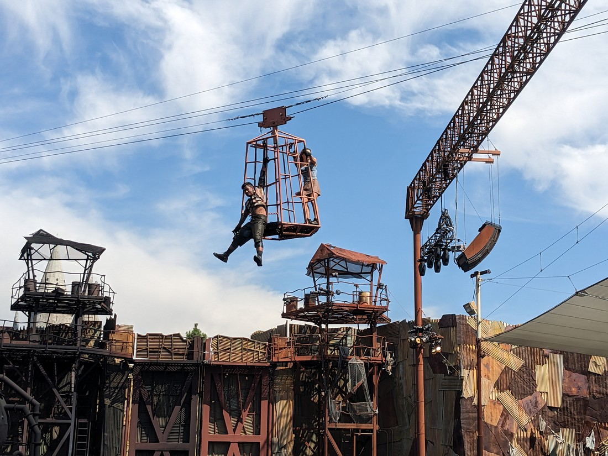

There was simulated gunshots and rocket fire, as well as explosions.

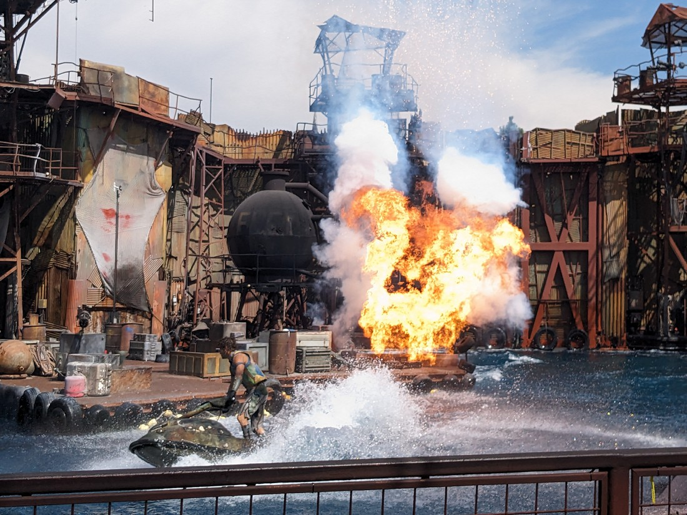

The biggest moment was when a plane "flew" into the arena after being "hit" by a stray rocket.

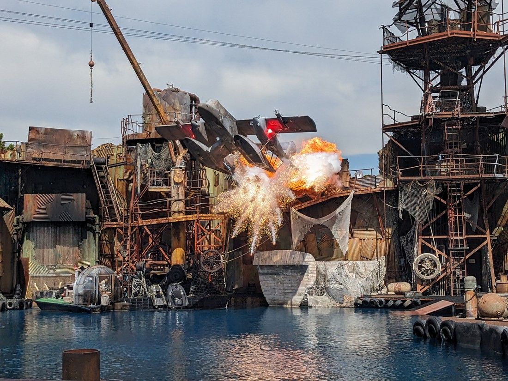

Amazingly it came to a clearly choreographed stop by the audience. It was amazing. We might have applauded, except then it "exploded", sending water everywhere.

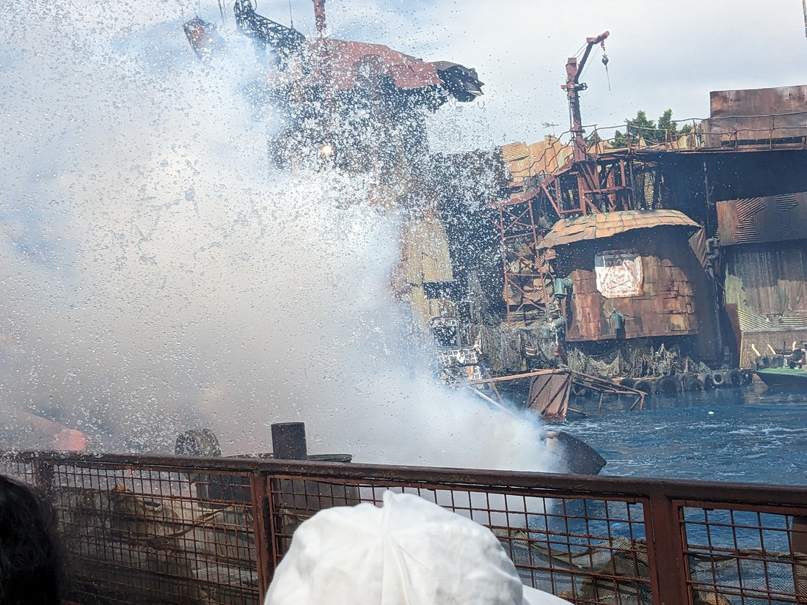

> This actually wet us even though we weren't in the splash zone

However this wasn't the climax of the show. That would be a fist fight on the highest tower, leading to one stuntman dangling perilously while the other got set on fire and then taking a fiery leap into the pool.

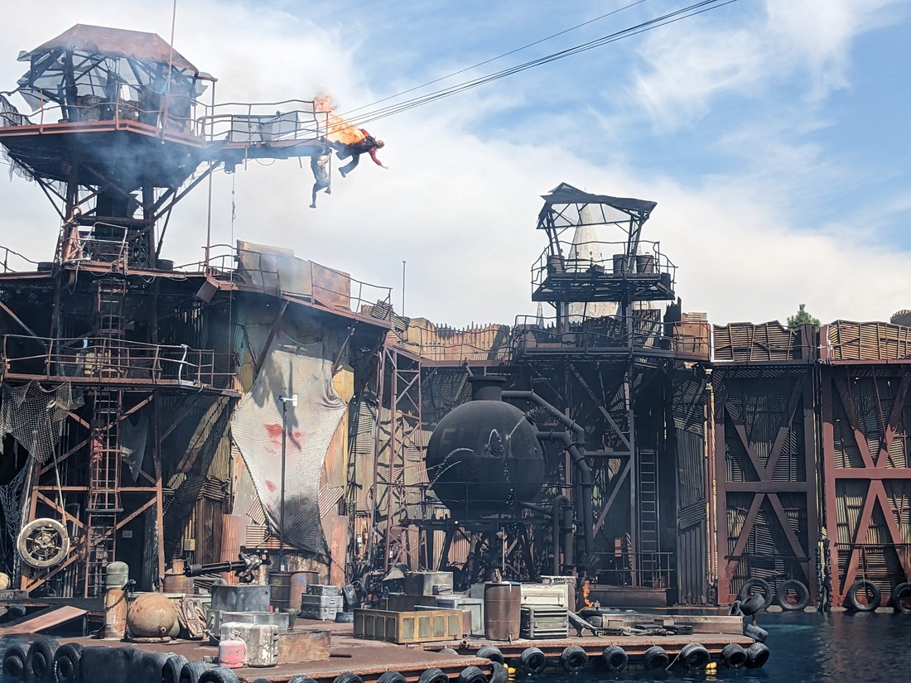

It was about 20 minutes long and it was packed full of entertainment.

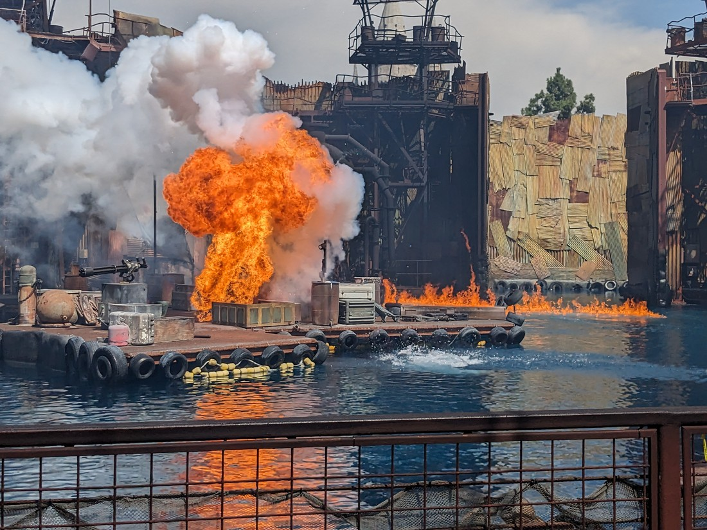

I now see why this show has survived long after the film its based on has been forgotten. It's an excellent show. And not only because it was an excuse for us to sit down for half an hour! I was sceptical of having a water themed show, but this unique setting is what makes this show one of a kind. The action and effects are still as amazing now as they were when the show launched in the late nineties.

Obviously we enjoyed the show - so much so that I've wasted basically a whole blog post talking about it. So we're going to have to take another break here and I'll continue with our afternoon fun in another blog entry.
