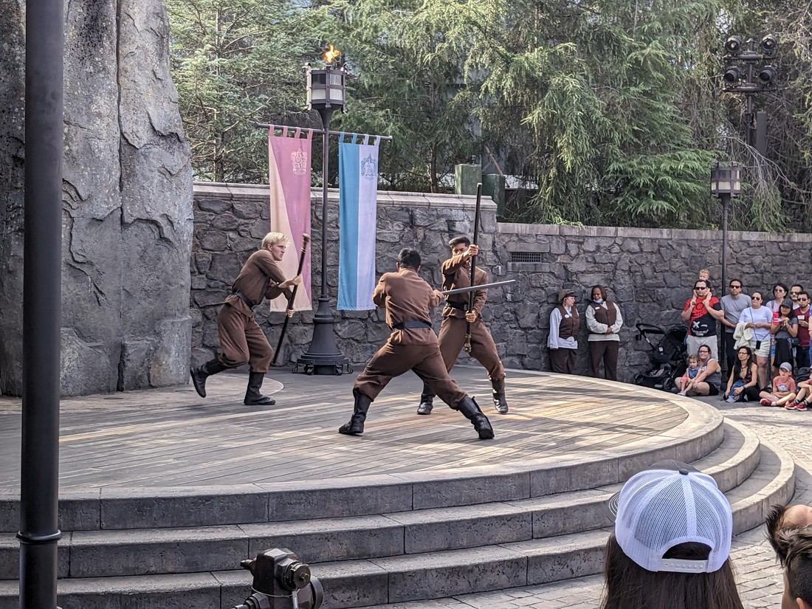
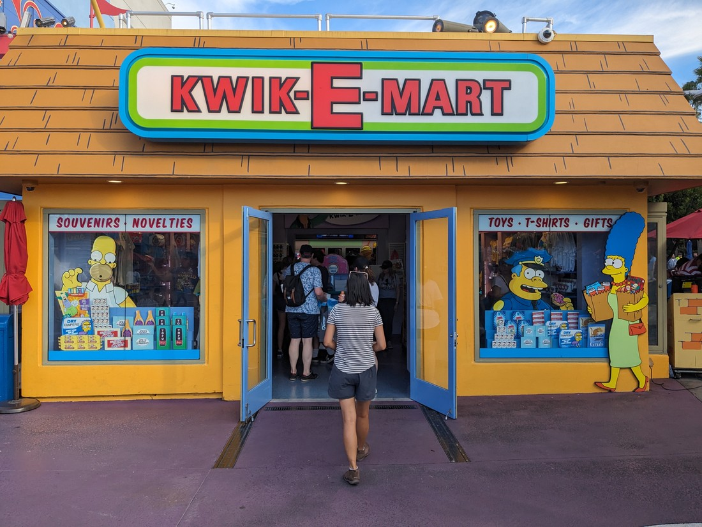

Just before we finish I thought I would note how much it cost to be here. Tickets were $109 USD, which works out to be about $185 NZD each. Parking was an additional $50 NZD. Fortunately we were either too busy or queasy to be hungry so the only other purchase was the $13.50 Butterbeer.

Total cost - $433.50. Or $216.75 each. Or $433.50 per Butterbeer.

That's a lot of money - particularly for a couple of people with no jobs. We didn't really think about the money - we just decided to do it. The first time I actually sat down and added everything up. Writing this blog post several months later has been the first time I actually sat down and tallied them all up.

Was it worth it?

...

...

...yes?

I don't know why but even now knowing how much we spent I will still look back at today with fond memories. I think the fact that I had NUMBERGOESHERE photos over three blog posts to share indicates that we packed quite a lot of fun into only a few hours. Sure it's still a lot of money, but what is the price for regaining feelings of youthful excitement in our mid-thirties? Something like this is a treat we can have on rare occasions - and because it's rare, that just helps make moments like these more special.

// It's expensive but decided to go to Universal Studios. Betty had a good time there as a teen and Luke likes movies. Annoying that parking was $50 NZD in addition to the ticket prices but it would likely be better than trying to find a shuttle or public transportation. Also annoying that a child is only 11 and under - and their ticket price is mere dollars cheaper. Poor parents.

// Luke had recovered pretty well after sitting down for the better part of half an hour. However despite being past lunch time he wasn't going to be eating anything today. Perhaps he should have had less of a breakfast.

// Next was the Jurassic World ride, which was a water ride. So not a whole lot of jostling around, but still some when the boat went on tracks. There were also some amazing special effects. Right before the boat dropped down the big final drop there were a couple of dinosaurs which neither of us could tell whether they were animatronic or we were looking at a screen. They just looked real.

// This was also another situation where guests were guaranteed that you would get wet. The drop at the end was fine but throughout dinosaurs and other things were finding any excuse to splash or spray water onto the boat. Luke didn't mind this of course - nice and cooling. Perhaps that's why so many people here are okay with it - Los Angeles is hot.

// We got some Butterbeer and explored the Harry Potter world area. The Butterbeer was delicious and nice and cooling. It was a full $16 NZD but it was worth it. While drinking it we also spotted people waving wands around. Turns out there are markers in the ground where if you wave certain wands (some are just replicas) in certain ways at those certain places then an action will happen. There seemed to be quite a lot of these places about. That's a nice touch - adding some interactivity to the scenery. Still, buying a wand likely wasn't cheap.

// By this point the park had filled up. Wait times for rides were posted in various places, and on the companion app that had the park map. Wait times would usually vary between 15 and 75 minutes. Fortunately we'd been lucky so far with our queues.

// Next ride was the Mummy. It was an indoor coaster. It went really fast almost from the start and smooth enough. But when we stopped it was another matter. Poor Luke. Still, he laughed at himself a lot. A grown man getting motion sick all the time. Seems he can't be a kid any more.

// We also went on the Despicable Me ride - which was another motion simulator in front of a curved screen. Luke didn't even try to watch it. The five (estimate) year old girl next to him seemed to be having a great time.

// Checked the list of other rides. They all were motion simulators of sorts.

// Saw a harry potter themed "show" of sorts. It was basically four ladies doing ballet stuff while three men did fight stunts. Then men definitely had the better part. One day they ought to gender flip the parts so the ladies can get a chance to do the cool acrobatics and the men can do the girly dancing.

// Visited some gift shops

// Watched the Waterworld show again. There were some slight differences. This time the ski jumper didn't fall. Also it turns out the villain was supposed to hit the golf ball into the audience (he failed terribly the time earlier). It is always interesting how the jokes change based on what happens.

// Walked around some more. More perusing gift shops.

// There seems to be late night events at the park during Halloween season. There were masses of people waiting for this when we left.

// Panda Express on the way home. Luke did get a bit dizzy again driving down the spiral ramp out of the car park.

// A good day. A shame the studio tour wasn't better. Luke's stomach would definitely have enjoyed more behind-the-scenes and movie trivia but I guess they wanted to make it more of an experience. I imagine they're cheaper and simpler to make, and probably less dangerous than conventional rides - which is why there is so many of them.
