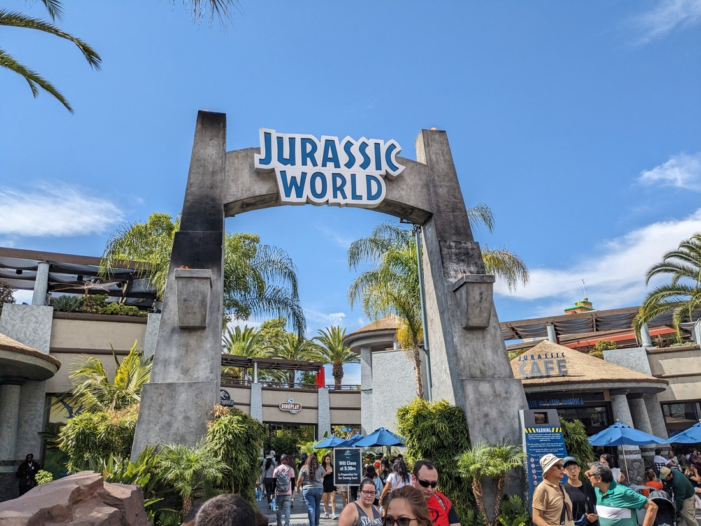
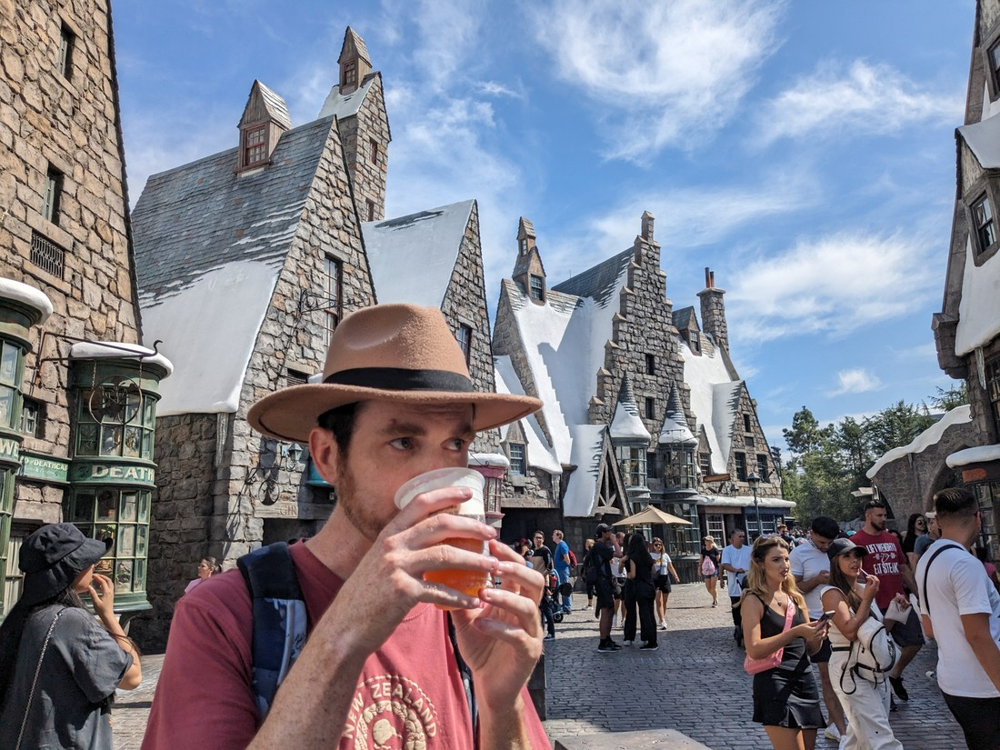
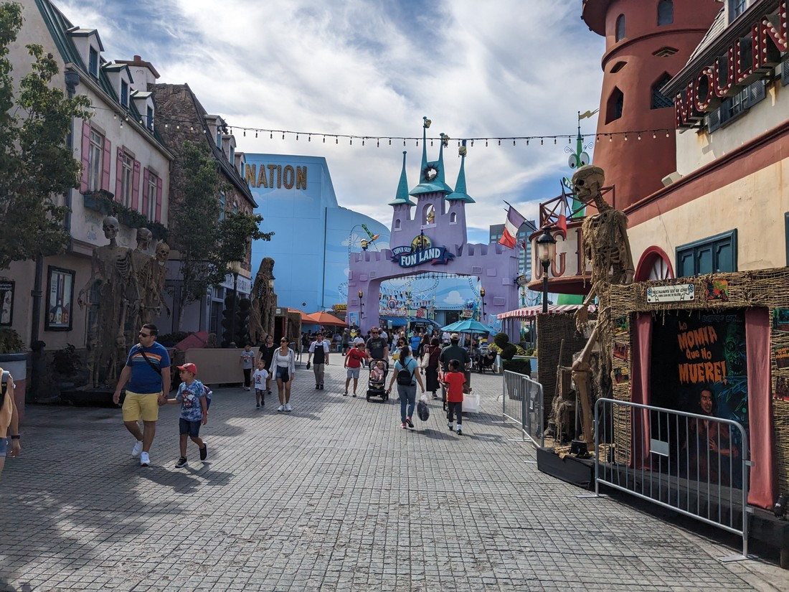
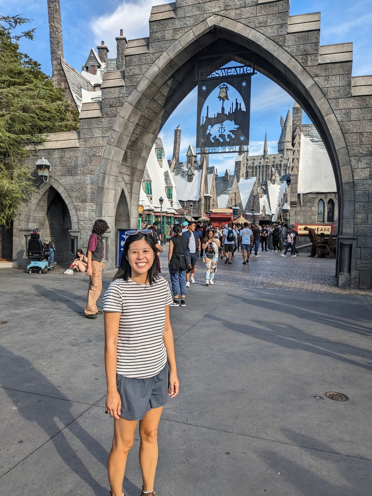

Just before we finish I thought I would note how much it cost to be here. Tickets were $109 USD, which works out to be about $185 NZD each. Parking was an additional $50 NZD. Fortunately we were either too busy or queasy to be hungry so the only other purchase was the $13.50 Butterbeer.

Total cost - $433.50. Or $216.75 each. Or $433.50 per Butterbeer.

That's a lot of money - particularly for a couple of people with no jobs. We didn't really think about the money - we just decided to do it. The first time I actually sat down and added everything up. Writing this blog post several months later has been the first time I actually sat down and tallied them all up.

Was it worth it?

...

...

...yes?

I don't know why but even now knowing how much we spent I will still look back at today with fond memories. I think the fact that I had NUMBERGOESHERE photos over three blog posts to share indicates that we packed quite a lot of fun into only a few hours. Sure it's still a lot of money, but what is the price for regaining feelings of youthful excitement in our mid-thirties? Something like this is a treat we can have on rare occasions - and because it's rare, that just helps make moments like these more special.
