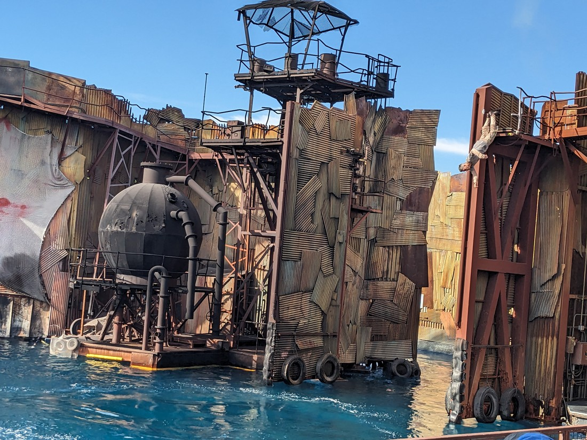
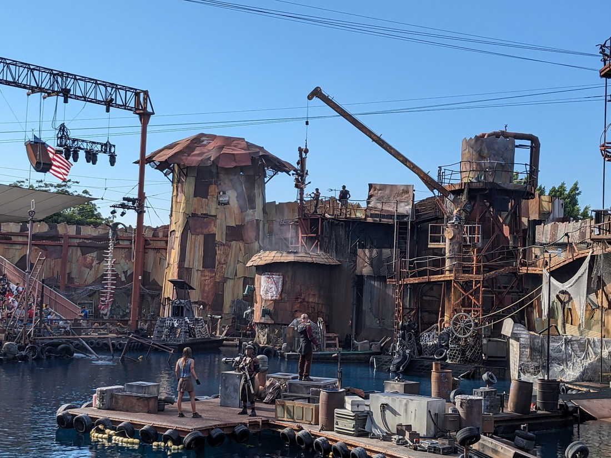
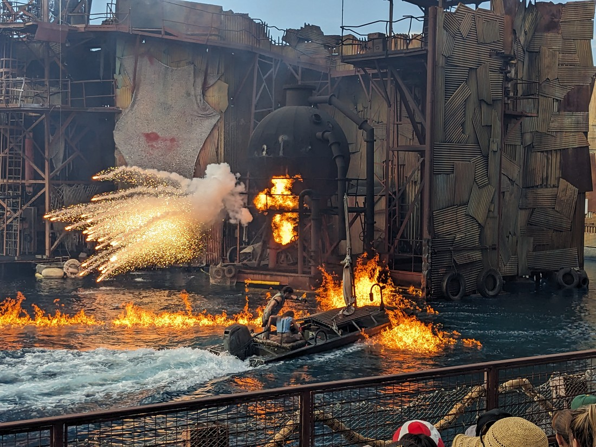
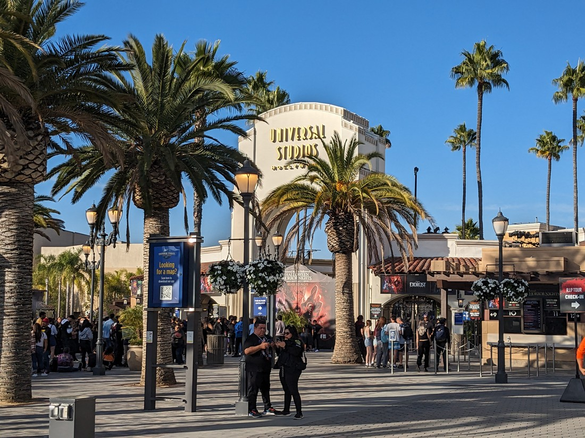

I felt better after watching the Waterworld show. Finally an attraction that doesn't shake my body about, except through laughter. It was now lunch time but we were in no mood for lunch. In fact, I was planning to skip eating altogether until we left the park. What you don't eat, you can't puke up later.

The next ride on our to-do list was the Jurassic World ride. This was a log-flume type ride, with a dozen or so people packed into each boat.

I put my phone away (or rather, I put Betty's phone away) during this ride because apparently there was a risk of getting wet. Like the Waterworld show, we weren't just going to get incidentally splashed. However some of the times were definitely not so incidental.

There's not too much to say about most of the ride. We just drifted along looking at various dinosaur related animatronics and screens. However right at the end there was a dark section with a dinosaur that I have no idea if it was real or not. It might have been animatronic but it moved so realistically that I doubted myself. Was it even real? Maybe it was just a screen. I later watched it again on YouTube - I still don't know. Anyway, it was nice to actually get that feeling of "is this real?" for once.

Then came the really deep drop and the big splash at the end. That's always a good ending to a water ride.

Afterwards we decided to wander back to the Harry Potter section of the park. Here we sought out the Butterbeer seller. There were two of them and both had lines - seems like there's always a queue now. The Butterbeer was some sort of caramel or butterscotch beverage with cream on top. I thought it was delicious. Betty thought it was extra delicious.

While we stood around savouring our cold beverage we engaged in some people watching. Here in the Harry Potter area there were no shortage of people in costume. There were a lot more again with the souvenir wands. And several of them had formed a line near to us and were taking turns waving their wands a large gate nearby. But nothing was happening. That was until a little girl in a princess gown tried it and the design on the door starting moving.

It turns out there are plaques in the ground all over this part of the park. Each has a way to face and a wand movement. The wands they sell must have some sort of motion tracking. When combined with sensors near the plaques that when they detect the wand movement, something happens. I have to respect the cleverness of it. It makes the park much more interactive and encourages people to buy the expensive wands.

Even the shops themselves were a sight to see. We wandered into each shop just to look at the decorations. One shop was a post office filled with owls and parcels. Another held Quidditch gear, complete with levitating broomsticks. The sweet shop was filled with... well, sweets.

But it was now time for another ride. Next on our list was a rollercoaster based on The Mummy movie. Unlike the earlier one, this coaster was indoors. It accelerated really fast and had a lot of tight corners, avoiding the Egyptian monsters in the dark. I had a good time with it mostly because it was over relatively quickly - ending just as I started to get queasy.

A little bit more of walking around and we were ready to go on another ride. Except now we had basically exhausted all the rides where you move about. All that was left seemed to be rides where you sit in front of a screen and it simulates movement. We picked out one of the kids ones anyway - one based on the Despicable Me films.

It had an entertaining intro but the meat of the ride was a 3D movie in a moving seat. Fortunately unlike the Studio Tour attractions, this one didn't have a full 360 degree view. Rather than suffer the motion mayhem I instead decided to sit calmly, intently studying the emergency exit sign. It must have been a good ride though because the girl half my height next to me (not Betty) was having a blast.

But there were other things other than rides. There were a number of people in costumes you could line up to meet. There was also another show. This was called the Triwizard Spirit Rally.

It started with dancers from the "girl school" doing a ribbon routine. Then it switched to the "boy school" representatives who performed stunt fight choreography. I usually don't complain too much about things like this but I think the female cast were a bit let down here. Perhaps routines that aren't just gender stereotypes might be better?

> This wasn't bad but Waterworld was basically the only good show

Deciding that we didn't need to do any more rides we wandered round some of the gift shops...

> For The Simpsons they sold cake sized donuts - not bad for 10 USD, if we had been hungry

> A shame there wasn't How to Train Your Dragon attractions

...before returning to the definite highlight of the park.

> It's on three times a day - of course we went back

This time we were seated in a different place (though still out of the splash zone). We were sitting near a guy who was having a great time cheering for everything the villain did - basically the opposite of when you're supposed to cheer.

Also this time the water-skier at the start stuck the landing. The skier and driver then managing to give each other a high-five as if to say, "We got it this time." Then the skier went over a jump that I had noticed wasn't used in the earlier show. I guess they only get to do the jump if they don't waste time fishing the skier out of the water.

We sat around after the show had finished. I wanted to see how they reset everything. Especially the plane that came over the wall. Unfortunately security didn't want us there and we were asked to leave - though we did get a good look at them winching the toppled tower back up into position.

> I am seriously tempted to go watch the movie now

I mentioned previously that the park hours seem a bit short. It turns out the park has a Halloween themed evenings all this month. There are a bunch of spooky attractions that can only be accessed if you buy an evening ticket. I don't think they do it often but clearly it was popular because as we left we passed a very large mass of people waiting.

Overall I don't think I minded that perhaps the opening hours were reduced. I don't think there was anything else I felt like I needed to do. Except for one last loop around the park.

And that's basically all I have to say about Universal Studios. I see myself as an adult now - one who is long since tired of theme parks. But that inner child is still there - despite my love of boring spreadsheets and train board games. It's nice to be able to release that inner child again, even if the body can't keep up.

It was also nice to experience a park with many things we grew up with. Harry Potter, The Simpsons, Scooby Doo, Shrek. I've been to MovieWorld before as a youth, but somehow I didn't care about what they had there as much. Maybe it's because MovieWorld is just an inferior Australian knockoff.

Just before we finish I thought I would note how much it cost to be here. Tickets were $109 USD, which works out to be about $185 NZD each. Parking was an additional $50 NZD. Fortunately we were either too busy or queasy to be hungry so the only other purchase was the $13.50 Butterbeer.

Total cost - $433.50. Or $216.75 each. Or $433.50 per Butterbeer.

That's a lot of money - particularly for a couple of people with no jobs. We didn't really think about the money - we just decided to do it. Writing this blog post several months later has been the first time I actually sat down and tallied them all up.

Was it worth it?

...

...

...yes?

I don't know why but even now knowing how much we spent I will still look back at today with fond memories. I think the fact that I had 47 photos over three blog posts to share indicates that we packed quite a lot of fun into only a few hours. Sure it's still a lot of money, but what is the price for regaining feelings of youthful excitement in our mid-thirties? Something like this is a treat we can have on rare occasions - and because it's rare, that just helps make moments like these more special.

Also - one last story. I got dizzy again driving down the spiral ramp to get out of the parking garage. I might blame the rides but the problem is clearly me.
