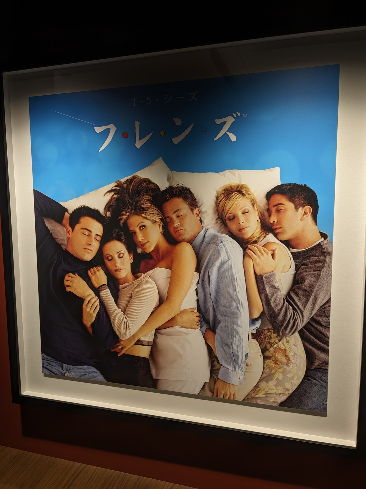
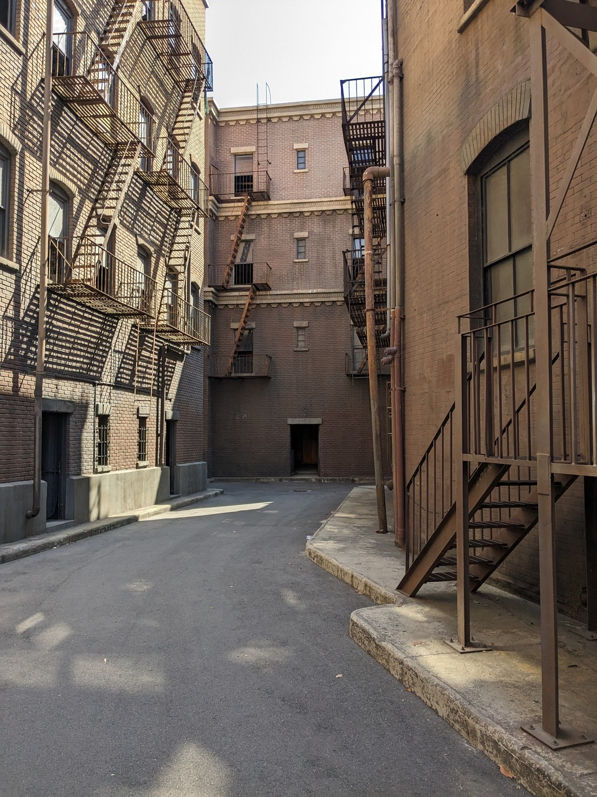

// Decided to visit Griffith Observatory. Parked in the free parking at the Greek Theatre and then walked up.

// This ought to be a great view out over Los Angeles but it was very smoggy

// Observatory wasn't open. It wouldn't open until 12pm.

// We decided to take the long way back so we could go past a Bird Sanctuary that we spotted on the way up. It ended up being an even longer way back as we missed a turnoff

// Bird Sanctuary wasn't much to look at. So to kill a bit more time we drove around to the old zoo.

// Old zoo was nothing more than a bit of walking around

// Killed enough time to go to the Warner Bros Studio Tour. Reputed to be the best of the studio tours.

// Parked on the street rather than pay the $15 USD for parking. Just had to hope we had read the parking signs correctly and wouldn't get a ticket

// Tour started with an intro movie, which weirdly had an ad before it - a short trailer for a tv show.

// Once on the cart we were taken into the "jungle" area of the lot, which is basically just an area with bushes and trees. It really looked unimpressive, but then I suppose it would come in handy for non-city scenes. Apparently one scene from Jurassic Park was filmed there (because their main location had bad weather) as well as something from Aquaman and some George Clooney thing.

// The tour guide asked for our favourite movies so they could point out relevant places. Betty yelled out "Lord of the Rings" which the tour guide mentioned was filmed in England, and maybe some in New Zealand.

// Next area was a New York style street of fake buildings. It was similar to what we had seen at Universal Studios, but bigger. Also, we got to walk around which was nice. Saw where the Spiderman upside-down kiss took place, as well as some bits from Friends.

// We were taken into one of the sound stages for Bob Hearts Abishola. It used to be the sound stage for Big Bang Theory but now it's a different show by the producer of Two and a Half Men. Apparently its fifth season has just been announced, but neither Betty or I had heard of it. Most of the tour group seemed to be the same.

// Tour guide also seemed to believe the canned laughter is real

// The sound stage was interesting. While the sets were mostly covered in sheets to protect them from dust (nothing was filming due to the actors striking), it was interesting to see how it looks from behind the scenes. The ceilings are missing with lots of lights and black panels dangling down from the sound stage ceiling. A pity we couldn't take any photos.

// Then we were shown round another outdoor lot - perhaps a more European township. Lots more Gilmore Girls locations, which many of the group knew (including Betty)

// And that was about it for the guided tour. It was about an hour and cost $70 USD each. However we were dropped off at a building where we could do a self guided tour of various things. First there was a Friends themed cafe and gift shop.

// The exhibits included many props and costumes from filming as well as exhibits of how certain aspects of movies get made (such as costumes, animation, dubbing etc). There was also a photo opportunity for Friends and Big Bang Theory.

// Then we had to get back on a cart only to be dropped off at another Friends photo open

// Then we were back at the main building where there were even more exhibits and photo ops

// Gift shop

// So the tour was only said to be 1 hour, but we spent almost four hours there.

// After eating we decided to go back to Griffith Observatory. Annoyingly due to traffic issues, having to park outside the park, and dusk coming early we missed the sunset and had to walk up in the dark. Amazingly the observatory was still open, although some exhibits didn't show anything because they relied on sunlight.

// Had to drive back in the dark. Fortunately it was mostly freeway driving and while there was still lots of traffic, there were no longer jams.
