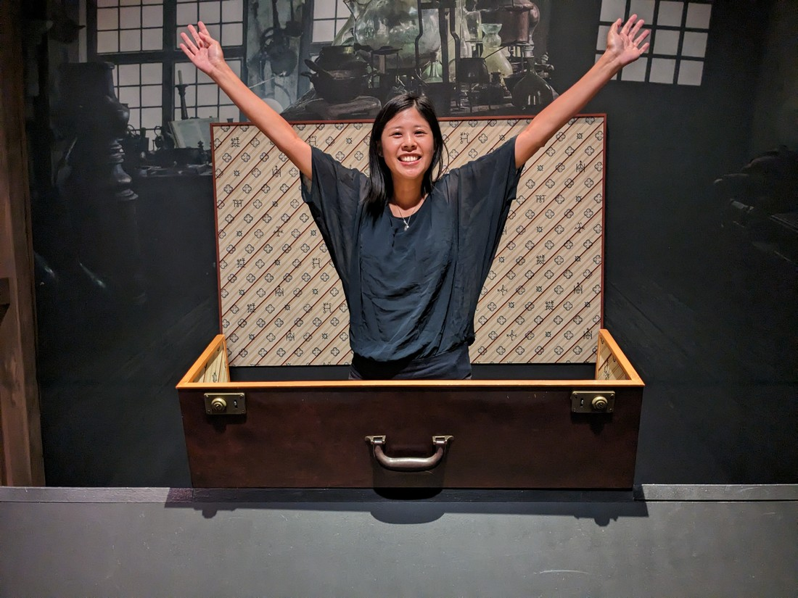

So where were we? It's the middle of the afternoon and we have just finished the guided Warner Brothers studio tour. We were now dropped off a soundstage where they had an interactive self guided tour around... well, we'll see.

The first part was essentially a cafe / gift shop and it had a particular theme.

It was a place to eat, sit, and buy gifts, however there was also a lot of "stuff" around.

I don't think these were props. There was a signed script on the wall in a protective case but otherwise the furniture and other items were scattered around. Part photo opportunities, part chances for fans to remember moments from the show.

However this soundstage wasn't just a friends fan site. The description was something like "Script to Screen" and it was a series of rooms with information about scripts, costumes, special effects, music and sound effects.

Then sprinkled amongst this movie museum of sorts was some "experiences" First up was apparently the original Central Perk set from Friends.

They were rather strict at what you could do (or rather, what you could not do). They also wanted to take your photo with their fancy camera - which is almost expected of course. Fortunately they were more than happy for you to take photos with your own camera. In fact, they actually expected it.

And it wasn't just Friends.

I don't particularly like Big Bang Theory (in fact, sometimes I'm not even sure I like Friends) but I can't deny its popularity. Even I recognise these sets.

I don't know how popular the Warner Bros tour is but it was nice that this section of the tour felt relatively quiet. Occasionally there would be a queue, but usually only a single person or couple long. And it was so nice that we could go along at our own pace.

In a section about special effects there was a scene straight out of Lord of the Rings. Many scenes were famously filmed using perspective trickery to fake the height differences between the characters. This layout showed how it was done - although I did have to ask a visitor very nicely to take the photo in a very specific way to make the effect work.

There was also some batpods and broomsticks in front of greenscreens which would allow people to re-enact footage from some of the films. We weren't interested in that but we did at least enquire about the fancy photos I mentioned earlier. We were in no rush after all - may as well view them and get a price check. Except we were called away for a presentation about sound composition in the movie Gravity (which did win many Oscars in this area).

The timestamps on the photos say we took about 80 minutes to go around everything. Much of the post-production related exhibits were quite interactive allowing us to dub over some movie scenes or to engage in some motion capture. Overall it was a fun experience.

From the sound stage we were taken back to the open city set where there was one more photo opportunity.

I think the fountain was the real one from the Friends intro but couch certainly wasn't. Notably it wasn't really a couch at all - it was rock hard. I imagine that's because it sits out in the elements all the time. Who would want to sit on a couch that's been rained on a lot?

From here we were now taken back to the starting building, where we'd entered.

And yet, the tour still wasn't over.

Here were some more props and photo opportunities for the various super hero movies Warner Brothers has produced over the decades.

Then there was Harry Potter stuff

Now Harry Potter was filmed exclusively in Great Britain. Warner Brothers has another studio tour in London so most of the props and all of the actual sets were there. However there did seem to be a few originals lying about in cabinets.

I think the sorting hat was an authentic one because we couldn't touch it. Of course there would have been many props made so this would have just been one of many.

It was on a lever and an attendant would lower it down, leaving it just above our head before stepping out of the photo. That is, unless one of us decided to snap the photo early.

I was a bit jealous of the Paramount Studio tour because apparently tour patrons of that tour would get to hold an actual Oscar. Well, to my surprise we weren't let down here.

> It was for Birds Anonymous, the 1957 animated Tweety and Sylvester short

Warner Brothers wasn't the only studio tour in town. There were at least three others. We weren't ruling out doing other tours but it turns out their was no need. Warner Brothers has a surprisingly large number of mega-popular films and TV shows that it can draw on for its tour.

> Although - hey, isn't the Lego Movie an animated film? How are there props?

// Gift shop

// So the tour was only said to be 1 hour, but we spent almost four hours there.

// After eating we decided to go back to Griffith Observatory. Annoyingly due to traffic issues, having to park outside the park, and dusk coming early we missed the sunset and had to walk up in the dark. Amazingly the observatory was still open, although some exhibits didn't show anything because they relied on sunlight.

// Had to drive back in the dark. Fortunately it was mostly freeway driving and while there was still lots of traffic, there were no longer jams.
