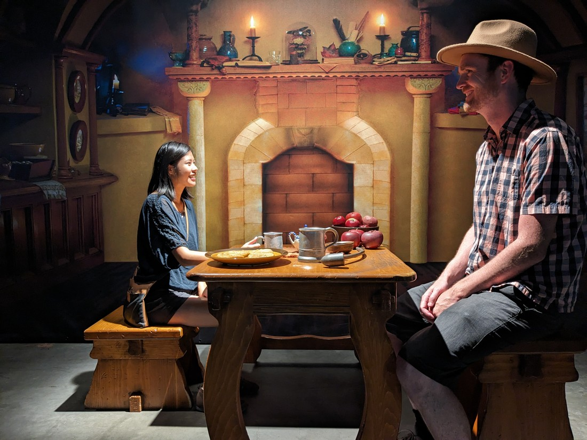
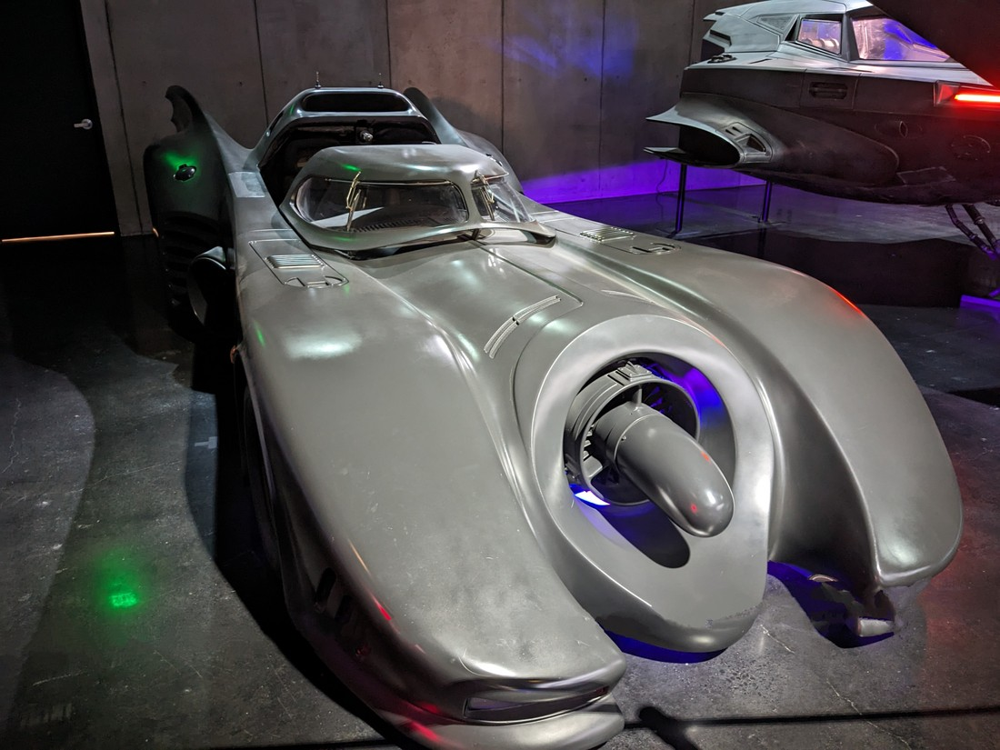

So where were we? It's the middle of the afternoon and we have just finished the guided Warner Brothers studio tour. We were now dropped off a soundstage where they had an interactive self guided tour around... well, we'll see.

The first part was essentially a cafe / gift shop and it had a particular theme.

> I don't know about this - the staff in the TV show were lousy

It was a place to eat, sit, and buy gifts, however there was also a lot of "stuff" around.

I don't think these were props. There was a signed script on the wall in a protective case but otherwise the furniture and other items were scattered around. Part photo opportunities, part chances for fans to remember moments from the show.

However this soundstage wasn't just a friends fan site. The description was something like "Script to Screen" and it was a series of rooms with information about scripts, costumes, special effects, music and sound effects.

Then sprinkled amongst this movie museum of sorts was some "experiences" First up was apparently the original Central Perk set from Friends.

They were rather strict at what you could do (or rather, what you could not do). They also wanted to take your photo with their fancy camera - which is almost expected of course. Fortunately they were more than happy for you to take photos with your own camera. In fact, they actually expected it.

And it wasn't just Friends.

I don't particularly like Big Bang Theory (in fact, sometimes I'm not even sure I like Friends) but I can't deny its popularity. Even I recognise these sets.

> No one ever sat on the left of the couch

I don't know how popular the Warner Bros tour is but it was nice that this section of the tour felt relatively quiet. Occasionally there would be a queue, but usually only a single person or couple long. And it was so nice that we could go along at our own pace.

In a section about special effects there was a scene straight out of Lord of the Rings. Many scenes were famously filmed using perspective trickery to fake the height differences between the characters. This layout showed how it was done - although I did have to ask a visitor very nicely to take the photo in a very specific way to make the effect work.

> We didn't quite get our eyelines right

There was also some batpods and broomsticks in front of greenscreens which would allow people to re-enact footage from some of the films. We weren't interested in that but we did at least enquire about the fancy photos I mentioned earlier. We were in no rush after all - may as well view them and get a price check. Except we were called away for a presentation about sound composition in the movie Gravity (which did win many Oscars in this area).

The timestamps on the photos say we took about 80 minutes to go around everything. Much of the post-production related exhibits were quite interactive allowing us to dub over some movie scenes or to engage in some motion capture. Overall it was a fun experience.

From the sound stage we were taken back to the open city set where there was one more photo opportunity.

> \*clap clap clap clap\*

I think the fountain (which we couldn't approach or enter) was the real one from the Friends intro but couch certainly wasn't. Notably it wasn't really a couch at all - it was rock hard. I imagine that's because it sits out in the elements all the time. Who would want to sit on a couch that's been rained on a lot?

From here we were now taken back to the starting building, where we'd entered.

And yet, the tour still wasn't over.

> There's more!

Here were some more props and photo opportunities for the various super hero movies Warner Brothers has produced over the decades.

> This ought to be a photo of Betty but Luke did not take a very good photo, so now Luke has to be Wonder Woman

> Still the best Batmobile

> DC hero costumes before they got all dark and moody

Then there was Harry Potter section:

> We're going to Hogwarts!

Now Harry Potter was filmed exclusively in Great Britain. Warner Brothers has another studio tour in London and most of the props and all of the actual sets were there. So what were these? Well just more photo opportunities - but as you can tell from the photos we were quite enjoying them.

> As much as one can enjoy sitting under some stairs

But there did seem to be a few original items lying about in cabinets.

> At least we've been assuming anything under glass is original - these could just be knockoffs

I think the sorting hat was an authentic one because we couldn't touch it. Of course there would have been many props made so this would have just been one of many.

> "Hufflepuff!"

It was on a lever and an attendant would lower it down, leaving it just above our head before stepping out of the photo. That is, unless one of us decided to snap the photo early.

> Betty enjoys laughing at this photo

Once we had decided to come here I was a bit sad that we weren't doing the Paramount Studio tour instead. Mostly because apparently their tour patrons get to hold an actual Oscar. Well to my surprise we weren't let down here:

> "So many people to thank"

This particular trophy was for a short film Birds Anonymous staring Sylvester Cat and Tweety Bird. Also it was heavy.

So Warner Brothers wasn't the only studio tour in town. There were at least three others that did tours like this. We weren't ruling out doing other tours but it turns out their was no need. Warner Brothers has a surprisingly large number of mega-popular films and TV shows that it can draw on for its tour.

> Although - hey! Isn't the Lego Movie an animated film? How are there props?

I think in total we spent about four hours here - which is pretty good considering it usually advertises itself as an hour-long tour + extras.

> This is a good one

In fact, we possibly spent too long here. Once again I have to write that today's fun isn't over yet. We decided to return to the Griffith Observatory (fighting traffic to get there) to watch the sunset.

But we were too late. By the time we found a place to park outside (because any cars parked inside after dusk get tickets by the waiting officers) and walked up it was long past sunset.

> And unfortunately it was quite a big walk to get back up

The view was maybe marginally better at night. There's still certainly a lot of smog around but the lights of the city are very clear under starlight.

And speaking of stars - the Observatory was still open!

> Also free entry!

We went all round but we were rushing a bit. It wasn't going to stay open forever and we would like to get to bed at some point, but while we were here we figured we may as well make the most of it. There were a nice range of astronomical related exhibits. Funnily, there were a number of exhibits that didn't seem to be working, until we realised it was because they relied on daylight.

Then we had the fun job of walking back down the long, steep hill in almost pitch black darkness. But we had phone flashlights and I had even come prepared with a head torch - although we used them less than you'd have thought. Then as we were walking through suburbs we spotted a very strange "dog". After seeing us it trotted off in a coyote-like trot. Didn't expect to find them here.

And all that's left to say about today is that the freeway traffic on the way home was only "bad" - not "jammed".

So that was another very full day in Los Angeles. We've seen so much in the last 48 hours that it has taken 7,700 words over five blog posts. We've spent so a lot of money but we've also seen so much too. We've seen sets and props from some of the biggest movies and tv shows in history - and we even held an actual Academy Award. Warner Brothers has really made us feel like we are in the town of cinema even if the closest we got to live filming were some dusty sets of a TV show we'd never heard of.
