For our fourth day in Los Angeles we did... nothing. The only thing left on our "must see" list was Venice Beach and even though it was the only thing planned for the entire day, we never got round to visiting it. We essentially used the day as a day to plan the last part of our journey.

It was on this day that we heard something in the news that was a bit worrying. The US government was two days away from a shutdown. Apparently the US government needs to pass several bills a year, otherwise the government ceases to have authorisation to spend money and they have to shut down. Now we don't really care too much about the US government (we prefer to avoid talking politics with locals) however a shutdown would impact us in one very particular way:

National parks are government funded. If the government shuts down then all national parks and monuments have to close.

That would certainly suck because for the next four days we were going to be staying outside of three national parks. We would also drive by three more on the way out of the country. Shutdowns usually last weeks so if it was going to happen then it means we might only have one last day to visit these parks.

The weather was not looking good for today but we felt like we had no choice.

Of course, the weather was sunny when we set off from Los Angeles! It might be rainy elsewhere in the state but that doesn't mean Los Angeles won't have blue skies and a high of 30. When we reached Sequoia National Park things were quite different.

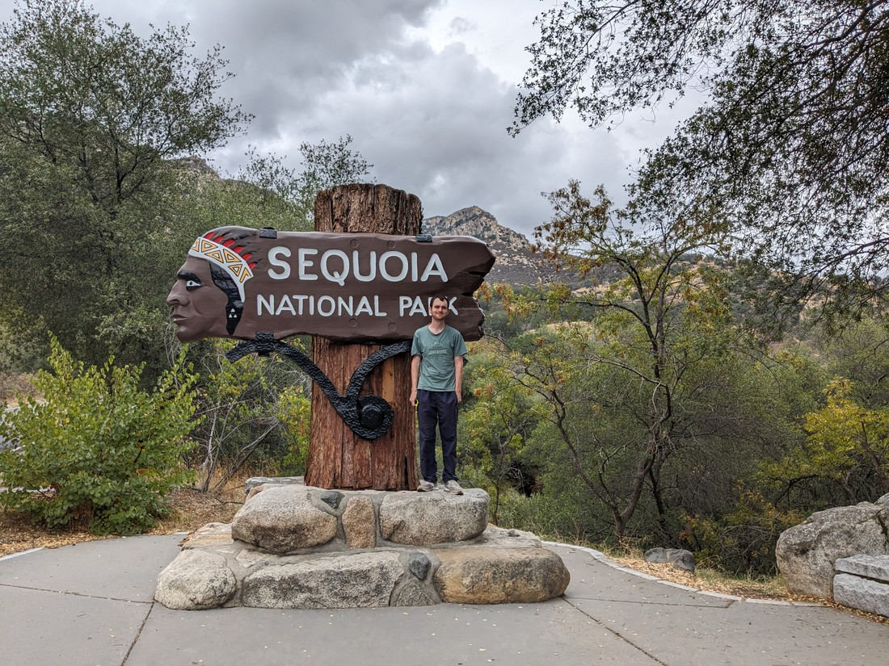

> Those are a lot of clouds up there

From the visitor's centre there was a single road going through the park. This road zigzagged up the side of the hills. I imagine on a fine day this would be quite the scenic drive but on this day the road quickly entered the clouds. And then boy did it become wet.

At the top of the hills were the famously large trees that the park is named after. We were now more than 2,000 metres above sea level. We've been a lot higher before but not in weather like this. But we came all this way so we may as well do one walk.

The one we picked out was to a tree called General Sherman. If the tree has a name (and a title!) then it must be worth seeing right? Well this tree is apparently the largest tree in the world (by volume) so if we were going to see just one tree today then it probably ought to be this one.

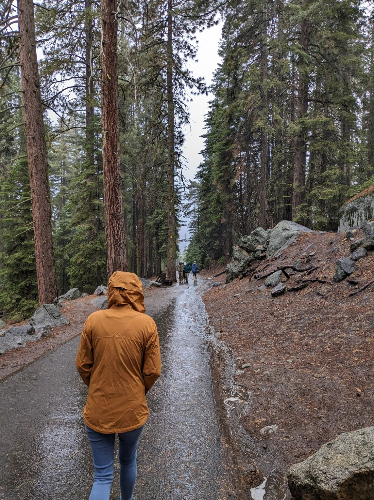

It was rainy and it was cold. But the walk was only a few hundred metres long so we ought to be able to do this.

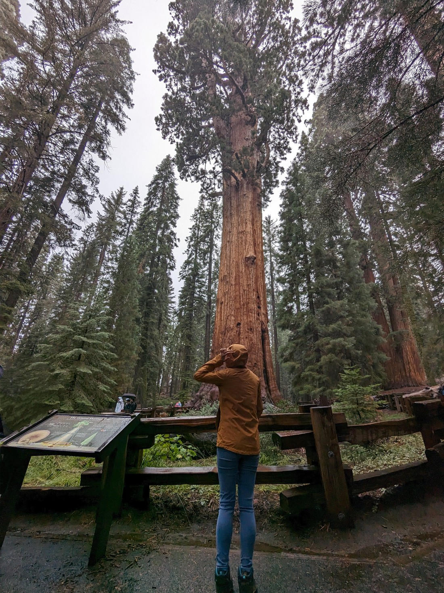

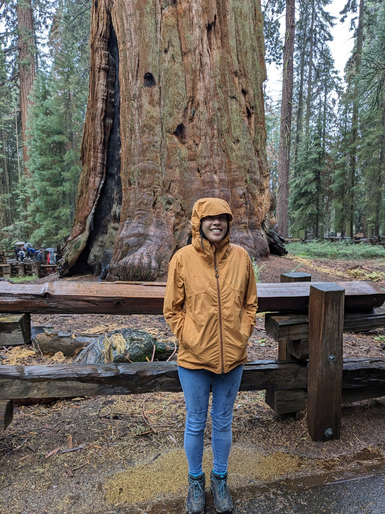

As we got back to the car I went to fish the keys from my pocket and found them to be quite wet. Uh oh - its probably not a good idea to mix water and cheap battery operated fobs. Well, the button to open the car didn't work but at least we could resort to using the physical key to open the doors.

But what were we going to do about starting the car? Our Nissan didn't have a key ignition. How are you supposed to drive it if the key has no battery? I had heard somewhere that having the key really close to the switch is the answer. It didn't make sense but that's all I had to go on at the moment. Eventually the car did start. I don't know if what I had heard was correct or if the fob just started working again. Either way, we could now drive out of the freezing altitude and back to regularly warm California.

We later learned that while we were in Sequoia, the government had temporarily averted a shutdown. The parks would remain open for now. The shutdown may have only been delayed and may instead occur in November - but we didn't care. We'll be long gone by then.

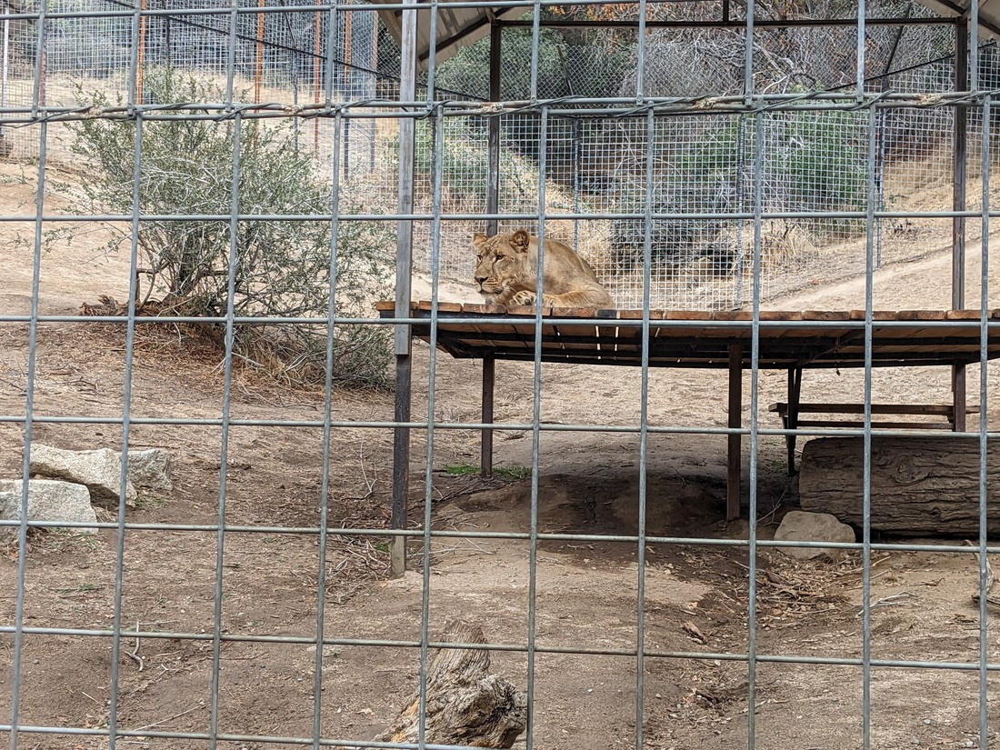

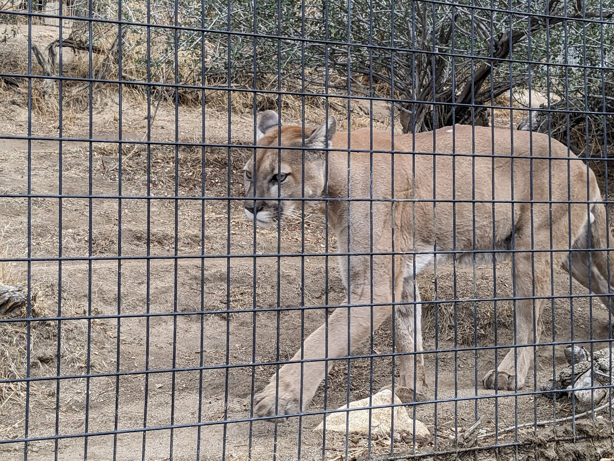

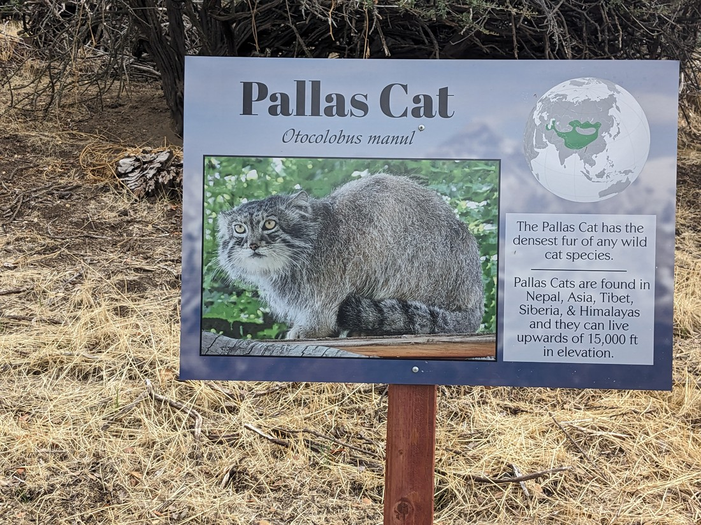

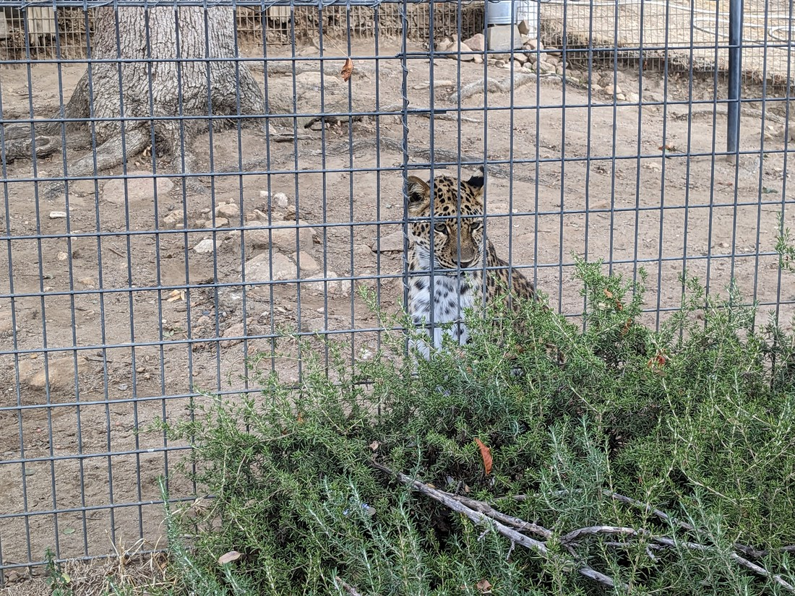

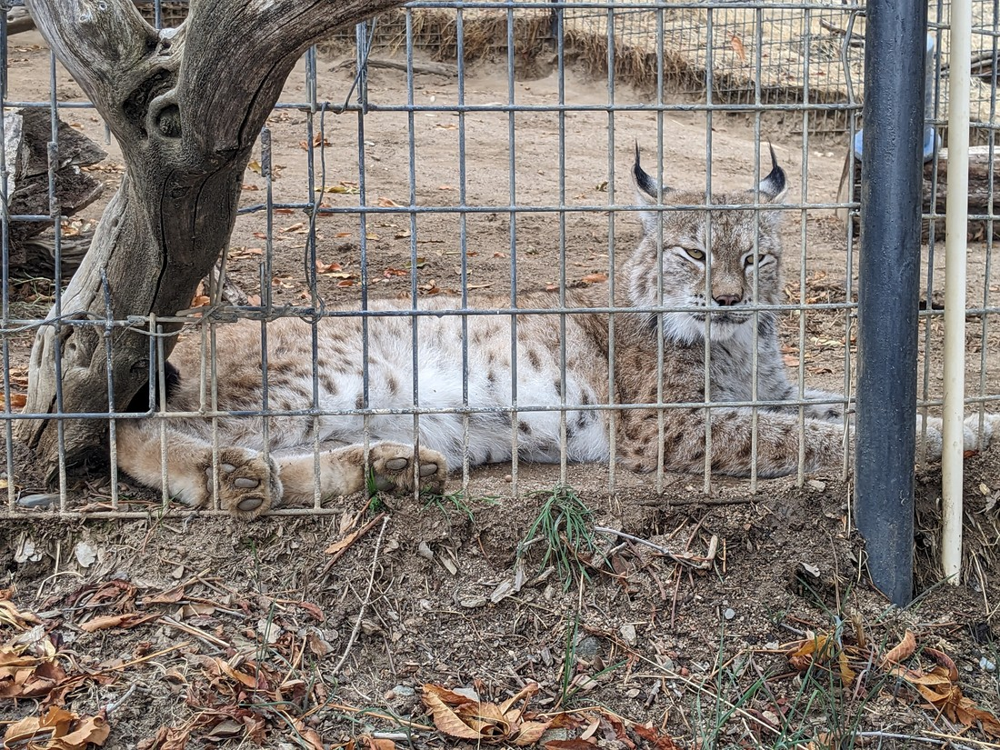

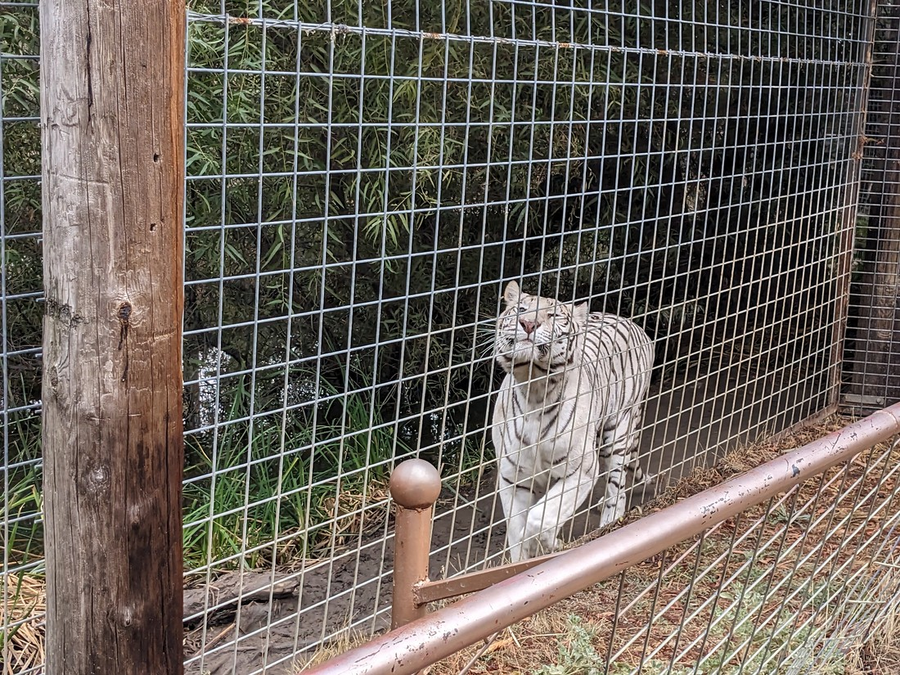

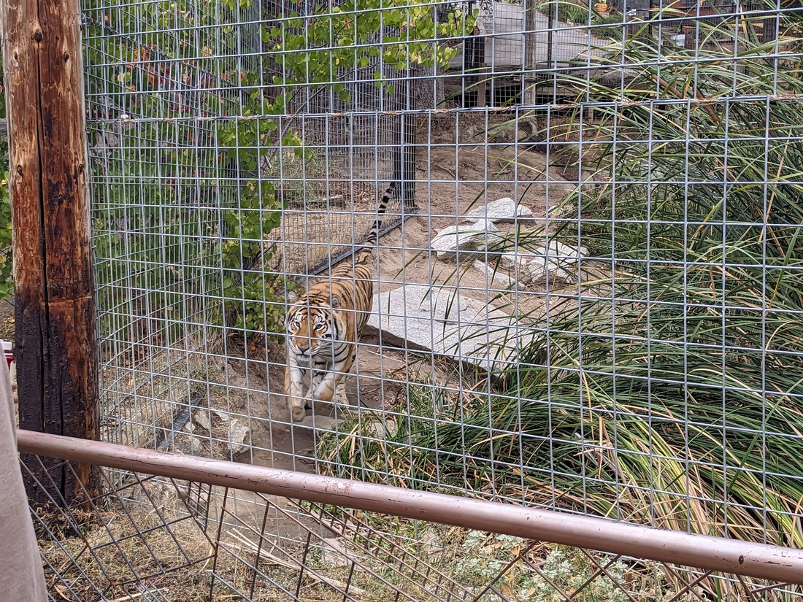

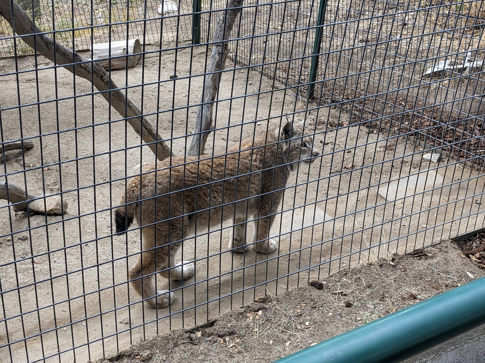

// 30th drove to Sequoia National Park. We found out yesterday that the US government is on the verge of a shutdown, which happens when they cannot agree on a particular budget. The effect is that non-essential services get shut down, which includes all national parks. In the past government shutdowns have lasted weeks. We were planning to visit several national parks in the next fortnight so this would be really unfortunate.

// Since it was cold (due to the altitude) and rainy we decided just to pick one walk, which was a short one to General Sherman, the world's largest tree

// Afterwards the rain hadn't abated so we decided we'd seen enough

// Found out at the end of the day that shutdown has been averted to at least November - we should no longer be in USA by then.

// The next day we drove back to see a Cat Haven

// We were a bit disappointed that the park wasn't self guided - we had to stick with a guided tour.

// Lots of cats pacing around. It was a cooler day, which was nice
