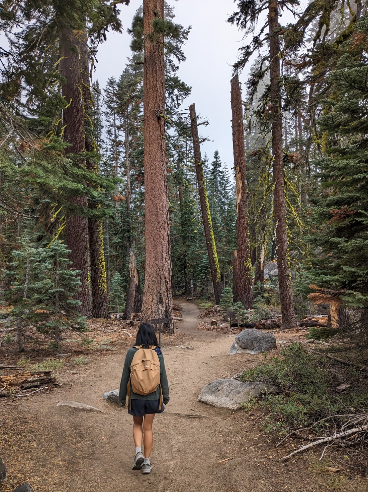
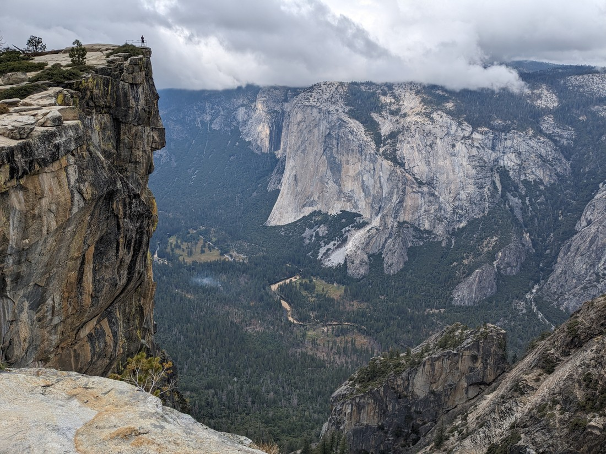
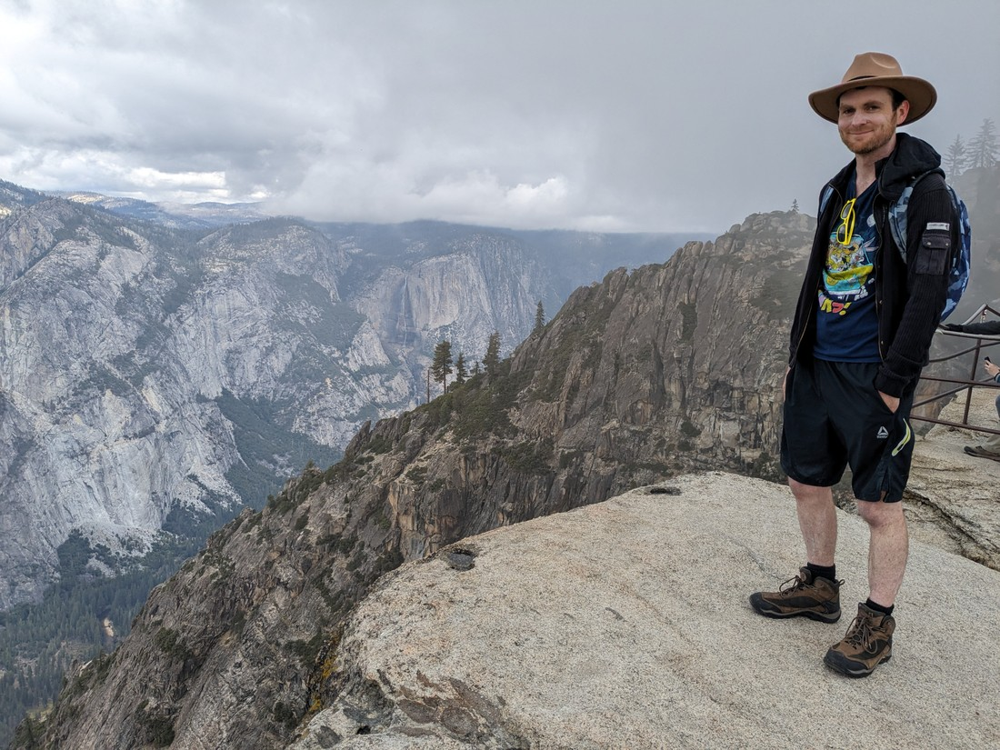
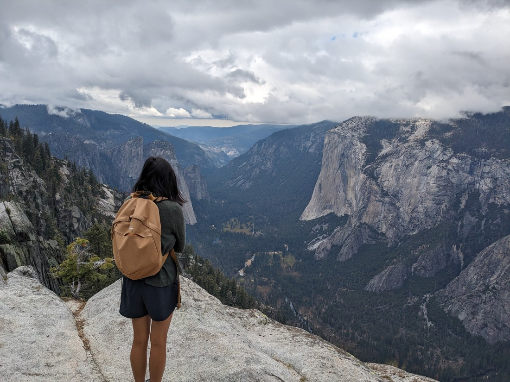
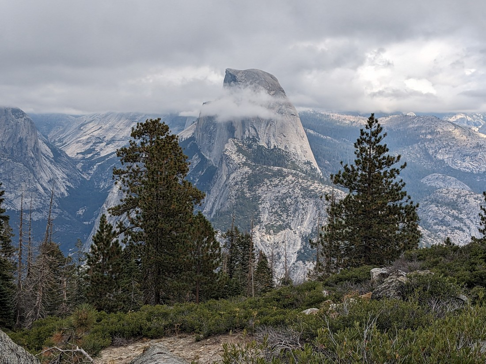
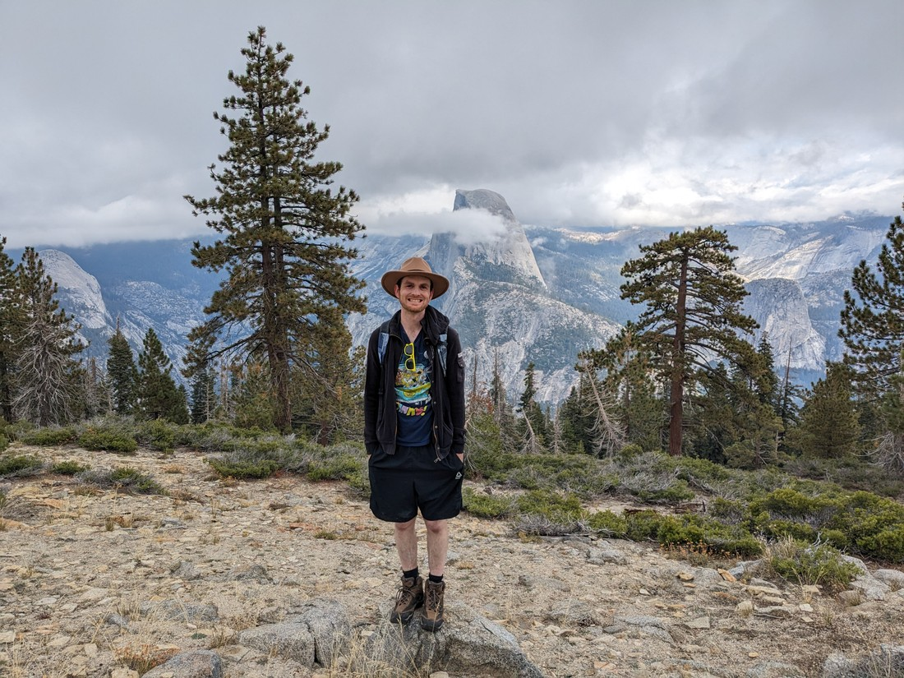
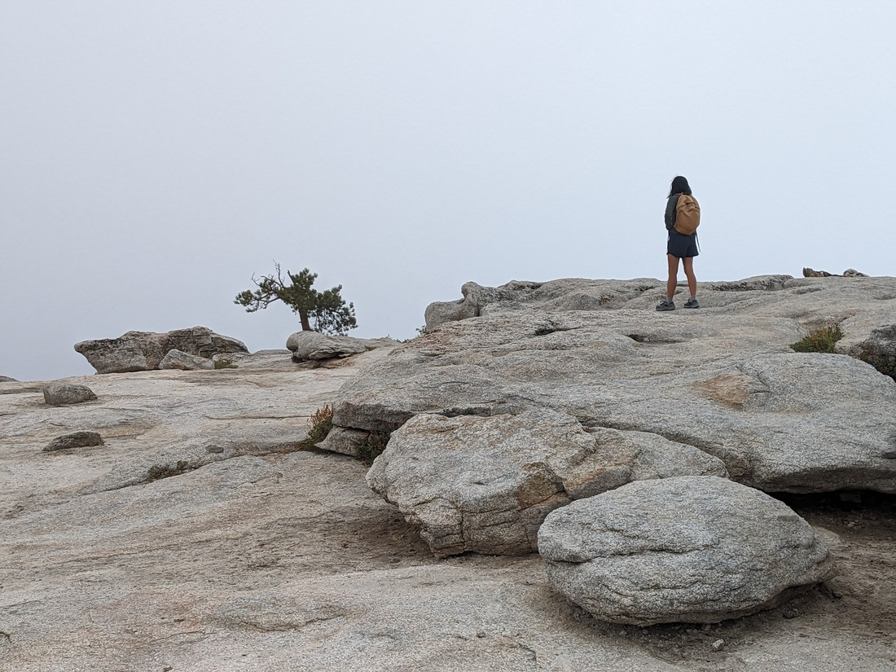
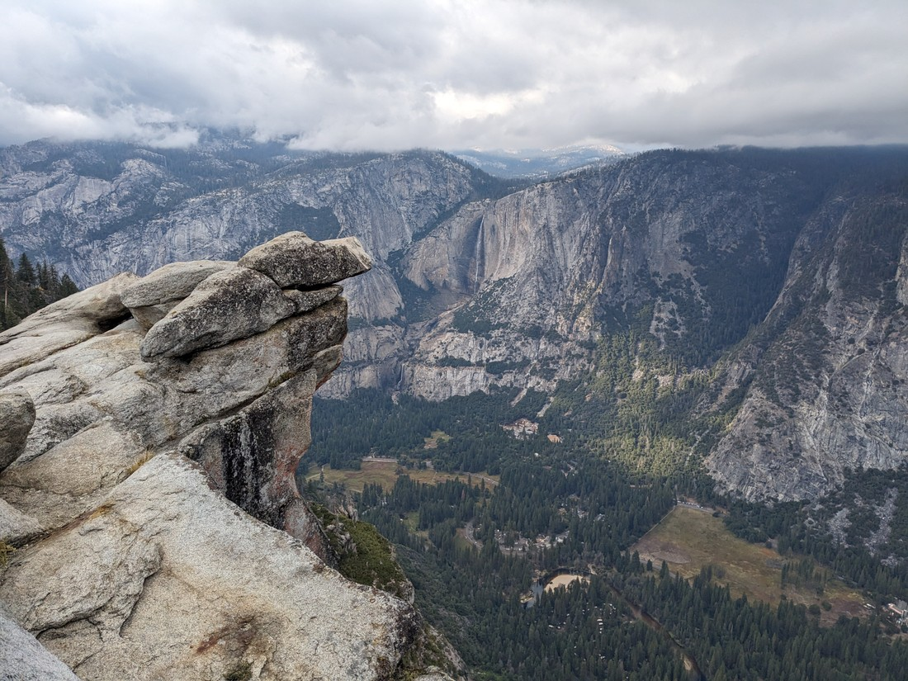
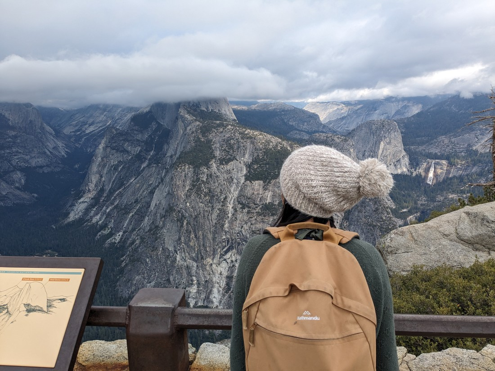

In 2019 Yosemite National Park was our first experience in a US national park. Back then we were only able to spend 24 hours in the park but it still left a lasting impression on us. Sometimes we like to rank the parks we’ve been to - such as on long road trips. I always want to put Yosemite near the top. But does it deserve such a spot? Or do we only remember it favourably because at that point in time we hadn’t seen any others?

Unfortunately on our road trip earlier this year we couldn’t justify driving to California to revisit Yosemite. That made me sad. So I am very happy that this return journey gives us the opportunity to revisit what might be the best national park in the whole continent. We have up to four days (three nights) to explore all the areas of the park we didn’t get to last time.

Except we got off to a slow start.

As I’ve mentioned already the weather was a bit sketchy yesterday so we didn’t rush to the park, preferring to spend time with a bunch of cats. Then we got off to a late start this morning too because I actually had an interview. Yep, those are still going on. There still might be a chance we stay in North America. Well, not much of a chance. I don't think I came off very knowledgeable in this interview and a few days later I would get the rejection. But it was still good practice for me. Oh well, at least we don't have a hard decision to make. We'll still be returning to New Zealand.

Despite having accommodation near the park it took us two hours of driving to get to our planned hike. So much for staying near. My original plan was to camp inside Yosemite Valley but there were complexities. My original plan for this leg of the journey had a lot of camping - this will be our last chance on this continent after all. I had even reserved some sites. Last night we were supposed to stay in Sequoia. Then in the week preceding we watched the forecasted temperatures... well you saw the weather in the last blog post.

And speaking of weather, it hasn't completely improved.

I got out of the car at the trailhead carpark (or to be more accurate, half a kilometre down the road from the trailhead because it was busy) and began my usual ritual of applying sunscreen. I usually hike in t-shirt and shorts but after setting off I decided today would be different. I darted back to the car and put on my jersey which I would wear for the whole hike. Today was cold.

We decided to go back to Sentinel Dome today, which was the highlight of Yosemite for us back in 2019. Well Sentinel dome isn't in the valley - it's almost a kilometre in elevation higher. Once again we were reminded that while autumn seems like the perfect time of the year to visit USA, it's very cold at higher elevation.

But while we got used to the cold (or I did at least), there was another reason why the elevation was a concern. The clouds felt very low. They came and went but at times it felt like we were walking through them. This walk is known for it's amazing views of the park so this cloud cover could be a problem.

Our first stop was Taft Point, which is on the rim of the valley. While we had clouds up here, the valley was cloud-free.

Taft Point isn't really a point. There's some safety railings in one particular spot - but it's not like that spot has a better view than any other.

> Just need to stay away from the edge

But this was not a point to point walk - this was a loop. So we continued on, getting occasional views of the valley.

> Blue skies would have been nicer but we'll take what we get

After perhaps an hour we came round the corner and were treated with a view of Yosemite's second-most famous rock face - Half Dome.

> Higher than the clouds

I'd call this lucky. It feels like the clouds are only slightly above the treetops. Sometimes lower. Given that it was fortunate that we got any view of Half Dome.

> Someone is happy. And a bit cold.

From here we climbed further to Sentinel Dome itself. However we had strayed off the main path to try get a good view of Half Dome. We weren't sure what we were walking on - likely some sort of service road. But we knew which way we needed to go so we made a bit of a beeline. At least at this altitude the forest is rather sparse.

"Dome" is a fair name as its a rounded rock peak sticking up out of the forest. We enjoyed it so much last time we were here because from the top we could see everything. The dome isn't that high but it is high enough to get a panorama.

Well today is different. Here we up atop Sentinel Dome.

> We knew this would happen but we figured we may as well climb up anyway

As we walked round the loop I had been keeping an eye on Sentinel Dome. It was always amongst the clouds. I had hoped that it would clear by the time we got there but no such luck. Well, no point sticking around staring into the white - we may as well finish the hike.

Five minutes later we were staring back up at unclouded Sentinel Dome. Oh well, it's not like the clouds have vanished completely. We still have our 2019 memories of beautiful blue skies.

But we're not done yet. The trailhead was towards the end of this road and at the very end was Glacier Point.

Here we could see down into Yosemite Valley. This was also the best view of Half Dome. Except...

> Where'd Half Dome go?

We arrived back to our accommodation at sunset. This didn't feel right. We'd gone out and done a relatively short walk, and yet somehow it had taken all day. In some ways that makes me even more annoyed about the interview this morning. It wasted some excellent walking time.

Okay maybe not the best walking time - weather wasn't ideal. But that's part of the reason why we came back to Sentinel Dome. The weather is going to improve further tomorrow and so we saved some longer adventures for tomorrow.

Looking forward to tomorrow.
